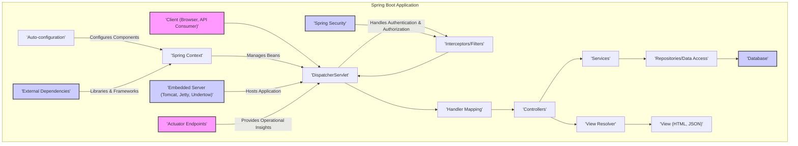
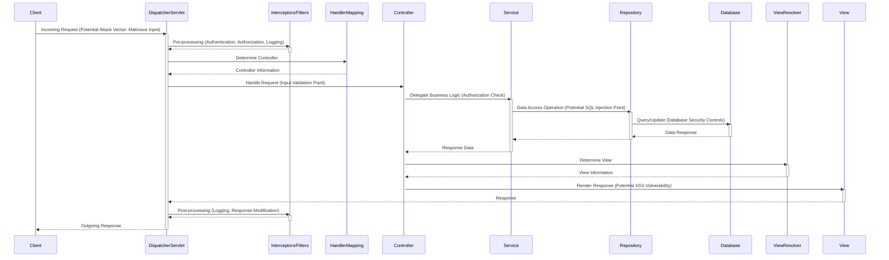

# Project Design Document: Spring Boot Framework (Improved)

**1. Introduction**

This document provides an enhanced architectural overview of the Spring Boot framework, focusing on aspects relevant to security threat modeling. It details the framework's core components, their interactions, and potential security implications. This document will serve as a refined foundation for subsequent threat modeling activities, facilitating a more granular and comprehensive assessment of potential security vulnerabilities.

**2. Goals**

*   Provide a more detailed and nuanced articulation of the Spring Boot architecture.
*   Elaborate on the responsibilities of core components, emphasizing security-relevant functionalities.
*   Offer a more precise description of the data flow within a Spring Boot application, highlighting potential interception points.
*   Deepen the discussion of key security considerations, providing specific examples and potential vulnerabilities.
*   Maintain a clear and well-structured document suitable for threat modeling exercises.

**3. High-Level Architecture**

Spring Boot simplifies the development of stand-alone, production-ready Spring applications. Its opinionated approach streamlines configuration and reduces boilerplate code. The architecture can be visualized as interacting layers, emphasizing the flow of requests and data:

**4. Key Components and Responsibilities (Enhanced)**

*   **'Client (Browser, API Consumer)':**  The initiator of requests. This could be a web browser, a mobile application, a script, or another service. From a security perspective, the client's trustworthiness and the security of the communication channel are critical.
*   **'DispatcherServlet':** The central request handler. It receives all incoming HTTP requests and dispatches them. Potential vulnerabilities here include denial-of-service attacks targeting the servlet or exploits related to its request processing logic.
*   **'Interceptors/Filters':** Components that intercept requests and responses. They can perform tasks like logging, authentication, authorization, input validation, and modifying request/response headers. Security vulnerabilities can arise from improperly implemented authentication/authorization checks or bypasses in filters.
*   **'Handler Mapping':** Determines which controller method should handle a specific request based on the request path, HTTP method, and other criteria. Misconfigurations in handler mappings could lead to unintended access to resources.
*   **'Controllers':** Handle specific business logic related to incoming requests. They receive data from the request, interact with services, and prepare responses. Vulnerabilities in controllers can include injection flaws (if input is not properly sanitized), business logic errors, and access control issues.
*   **'Services':** Encapsulate the core business logic of the application. They are typically stateless and reusable. Security concerns here involve ensuring proper authorization before executing business logic and preventing data manipulation vulnerabilities.
*   **'Repositories/Data Access':** Responsible for interacting with data sources. This layer abstracts the underlying database technology. SQL injection vulnerabilities are a primary concern if input is not properly sanitized before database queries. Authorization checks should also be enforced at this layer to prevent unauthorized data access.
*   **'Database':** The persistent storage for the application's data. Security measures at this level include access control, encryption at rest, and regular security patching.
*   **'View Resolver':** Maps logical view names to actual view technologies (e.g., Thymeleaf templates, JSON serializers). Template injection vulnerabilities can occur if user-controlled data is directly embedded into templates without proper escaping.
*   **'View (HTML, JSON)':** The presentation layer rendered and sent to the client. Cross-site scripting (XSS) vulnerabilities can arise if data displayed in the view is not properly encoded.
*   **'Auto-configuration':** Automatically configures Spring components based on classpath dependencies and application settings. While convenient, misconfigurations due to auto-configuration can introduce security risks if default settings are insecure.
*   **'Spring Context':** The core of the Spring framework, managing the lifecycle and dependencies of application components (beans). Security vulnerabilities can arise from insecure bean configurations or improperly managed dependencies.
*   **'Embedded Server (Tomcat, Jetty, Undertow)':** Hosts the Spring Boot application. Vulnerabilities in the embedded server itself (if not patched) can be exploited. Configuration of the server (e.g., TLS settings) is also crucial for security.
*   **'Actuator Endpoints':** Provide built-in endpoints for monitoring and managing the application. These endpoints can expose sensitive information if not properly secured, making them attractive targets for attackers.
*   **'External Dependencies':** Libraries and frameworks used by the application. Vulnerabilities in these dependencies can be exploited. Regularly scanning and updating dependencies is crucial.
*   **'Spring Security':** A powerful and highly customizable framework for handling authentication and authorization. Misconfiguration or improper implementation of Spring Security is a common source of security vulnerabilities.

**5. Data Flow (Detailed)**

A more detailed view of a typical request flow, highlighting potential security checkpoints:

**6. Security Considerations (Expanded)**

This section provides a more detailed exploration of security concerns within a Spring Boot application:

*   **Authentication and Authorization:**
    *   **Vulnerabilities:**  Bypassing authentication, weak password policies, insecure storage of credentials, privilege escalation, missing authorization checks.
    *   **Mitigations:**  Strong password policies, multi-factor authentication, secure credential storage (hashing and salting), role-based access control (RBAC), principle of least privilege, thorough testing of authorization rules.
*   **Input Validation:**
    *   **Vulnerabilities:**  SQL injection, cross-site scripting (XSS), command injection, path traversal, XML External Entity (XXE) injection.
    *   **Mitigations:**  Server-side input validation, using parameterized queries or ORM frameworks to prevent SQL injection, output encoding to prevent XSS, avoiding direct execution of user-supplied commands, sanitizing file paths, disabling external entities in XML processing.
*   **Data Protection:**
    *   **Vulnerabilities:**  Man-in-the-middle attacks (if not using HTTPS), exposure of sensitive data in logs or error messages, insecure storage of sensitive data.
    *   **Mitigations:**  Enforce HTTPS, encrypt sensitive data at rest and in transit, avoid logging sensitive information, implement secure key management practices.
*   **Dependency Management:**
    *   **Vulnerabilities:**  Exploiting known vulnerabilities in third-party libraries.
    *   **Mitigations:**  Regularly update dependencies, use dependency scanning tools (e.g., OWASP Dependency-Check), subscribe to security advisories for used libraries.
*   **Logging and Auditing:**
    *   **Vulnerabilities:**  Insufficient logging, logging sensitive information, tampered logs.
    *   **Mitigations:**  Log significant security events, avoid logging sensitive data directly, secure log storage and access, implement audit trails for critical actions.
*   **Error Handling:**
    *   **Vulnerabilities:**  Information leakage through detailed error messages.
    *   **Mitigations:**  Return generic error messages to the client, log detailed error information securely, implement custom error pages.
*   **Actuator Endpoints Security:**
    *   **Vulnerabilities:**  Exposure of sensitive application information, potential for unauthorized modification of application state.
    *   **Mitigations:**  Secure actuator endpoints using Spring Security, restrict access based on roles or IP addresses, consider disabling sensitive endpoints in production.
*   **Session Management:**
    *   **Vulnerabilities:**  Session fixation, session hijacking, insecure session cookies.
    *   **Mitigations:**  Use secure session cookies (HTTPOnly, Secure flags), implement session timeouts, regenerate session IDs after login, consider using a distributed session store.
*   **Cross-Site Request Forgery (CSRF) Protection:**
    *   **Vulnerabilities:**  Unauthorized actions performed on behalf of an authenticated user.
    *   **Mitigations:**  Enable CSRF protection provided by Spring Security, use synchronizer tokens.
*   **Cross-Origin Resource Sharing (CORS):**
    *   **Vulnerabilities:**  Allowing unintended access from other origins, potentially exposing sensitive data or functionality.
    *   **Mitigations:**  Configure CORS carefully, specifying allowed origins, methods, and headers.

**7. Future Considerations**

*   Adoption of more granular authorization models (e.g., attribute-based access control - ABAC).
*   Integration with cloud-native security services (e.g., secrets management, identity providers).
*   Leveraging security headers for enhanced browser security.
*   Increased focus on DevSecOps practices and automated security testing.

**8. Technology Stack**

*   **Programming Language:** Java, Kotlin, Groovy
*   **Framework:** Spring Framework, Spring Boot
*   **Build Tools:** Maven, Gradle
*   **Embedded Servers:** Tomcat, Jetty, Undertow
*   **Security Framework:** Spring Security
*   **Data Access:** Spring Data JPA, Spring Data MongoDB, JDBC
*   **Testing:** JUnit, Mockito, Spring Test, Security testing libraries (e.g., OWASP ZAP integration)

This improved document provides a more detailed and security-focused architectural overview of the Spring Boot framework. It offers a richer understanding of the system's components, data flow, and potential security vulnerabilities, making it a more effective resource for threat modeling activities.
