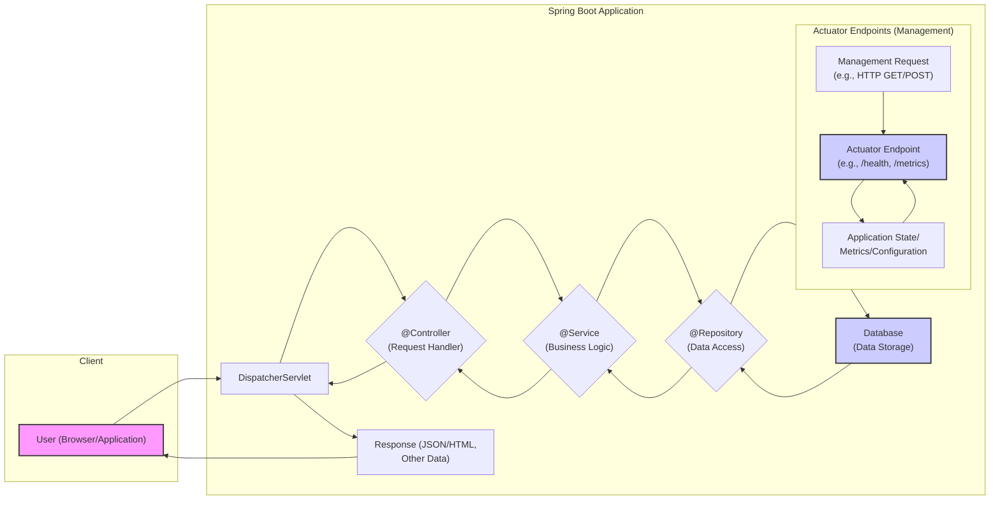

# Project Design Document: Spring Boot Framework

**Version:** 1.1
**Date:** October 26, 2023
**Author:** AI Software Architect

## 1. Introduction

This document provides a detailed architectural design overview of the Spring Boot framework, intended to facilitate thorough threat modeling and security analysis. It outlines the key components, their interactions, and the flow of data within the framework. This document is based on the publicly available information and source code of the Spring Boot project found at [https://github.com/spring-projects/spring-boot](https://github.com/spring-projects/spring-boot). This document aims to provide a comprehensive understanding of the system's architecture from a security perspective.

## 2. Goals and Objectives

The primary goals of Spring Boot are to:

*   Simplify the development of stand-alone, production-grade Spring-based applications with minimal configuration.
*   Provide opinionated defaults and conventions to accelerate development and reduce boilerplate code.
*   Offer embedded servers, security features, metrics, and health checks out-of-the-box.
*   Minimize the need for verbose XML configuration by leveraging Java-based configuration and annotations.

This design document specifically focuses on elucidating the architecture to enable the identification of potential security vulnerabilities, attack surfaces, and areas requiring further security scrutiny.

## 3. Architectural Overview

Spring Boot builds upon the robust foundation of the core Spring Framework, introducing layers of abstraction and convenience. Its architecture emphasizes convention over configuration, providing sensible defaults while allowing for customization. The framework's modular design allows developers to include only the necessary components for their specific application needs.

## 4. Key Components

The following are the major components and concepts within the Spring Boot framework, described with a focus on their security implications:

*   **Spring Boot Starter Dependencies:**
    *   Purpose:  Aggregated dependency declarations that simplify project setup by including all necessary libraries for specific functionalities (e.g., web development, data access).
    *   Examples: `spring-boot-starter-web` (for building web applications), `spring-boot-starter-data-jpa` (for JPA-based data access), `spring-boot-starter-security` (for security features).
    *   Security Implication:  Incorrectly managed or outdated starter dependencies can introduce vulnerabilities through transitive dependencies. Regularly updating starters is crucial for patching security flaws in underlying libraries.
*   **Auto-configuration:**
    *   Purpose:  Automatically configures Spring applications based on classpath dependencies and existing beans. Reduces manual configuration.
    *   Mechanism:  Uses `@EnableAutoConfiguration` annotation and `spring.factories` files to identify and apply configuration classes.
    *   Security Implication:  While convenient, auto-configuration might enable features or expose endpoints unintentionally if not carefully reviewed. Understanding which configurations are being applied is important for security hardening.
*   **Embedded Application Servers:**
    *   Purpose: Packages applications as executable JARs with embedded servlet containers (Tomcat, Jetty, Undertow). Simplifies deployment.
    *   Examples: Tomcat is the default.
    *   Security Implication: The security of the embedded server is critical. Keeping the embedded server version up-to-date is essential for patching vulnerabilities. Configuration of the embedded server (e.g., HTTPS settings) directly impacts application security.
*   **Spring Boot Actuator:**
    *   Purpose: Provides built-in endpoints for monitoring and managing applications in production.
    *   Examples of Endpoints: `/health`, `/metrics`, `/info`, `/loggers`, `/trace`, `/env`, `/beans`.
    *   Security Implication: Actuator endpoints can expose sensitive information about the application's state, configuration, and environment. **Crucially, these endpoints must be secured** using Spring Security or other authentication/authorization mechanisms to prevent unauthorized access.
*   **Spring Boot CLI (Command Line Interface):**
    *   Purpose: A tool for rapid prototyping of Spring Boot applications using Groovy.
    *   Security Implication: Primarily a development tool. Security considerations are less critical in the context of the CLI itself, but generated applications should adhere to security best practices.
*   **Spring Boot DevTools:**
    *   Purpose: Enhances the development experience with features like automatic restarts and live reload.
    *   Security Implication:  DevTools should be disabled in production environments as they can expose sensitive information or provide unintended access.
*   **Spring Framework Core:**
    *   Purpose: The foundational framework providing core functionalities like dependency injection, AOP, and transaction management.
    *   Security Implication:  Security vulnerabilities in the core Spring Framework can impact Spring Boot applications. Staying updated with Spring Framework releases is important.
*   **Spring Data:**
    *   Purpose: Simplifies data access across various data stores.
    *   Security Implication:  Helps prevent common data access vulnerabilities like SQL injection when used correctly with parameterized queries or ORM features. However, improper use can still introduce vulnerabilities.
*   **Spring Security:**
    *   Purpose: A powerful and customizable framework for authentication and authorization.
    *   Security Implication:  Provides essential security features like authentication, authorization, protection against common web attacks (CSRF, XSS), and more. Proper configuration and implementation of Spring Security are paramount for application security.

## 5. Data Flow

The data flow within a typical Spring Boot web application involves several key components interacting to process requests and return responses. Understanding this flow is crucial for identifying potential points of vulnerability.

**Detailed Explanation of Data Flow:**

*   **User Interaction (A):** A user interacts with the application through a web browser or another application, initiating a request.
*   **DispatcherServlet (B):** The `DispatcherServlet` acts as the front controller, receiving all incoming HTTP requests. It's responsible for routing requests to the appropriate handlers.
*   **Controller Layer (C):** `@Controller` annotated classes handle specific requests based on defined mappings (e.g., `@GetMapping`, `@PostMapping`). They orchestrate the processing of the request.
*   **Service Layer (D):** `@Service` annotated classes encapsulate the application's business logic. Controllers typically delegate complex operations to service layer components.
*   **Repository Layer (E):** `@Repository` annotated interfaces handle data access operations, interacting with the underlying data store. Spring Data simplifies the implementation of these layers.
*   **Database (F):** The database stores the application's persistent data. Interactions are typically managed through the repository layer.
*   **Response Generation (G):** The controller prepares a response, which can be in various formats like JSON, HTML, or XML, and sends it back to the client through the `DispatcherServlet`.
*   **Actuator Endpoint Interaction (H, I, J):**  Separately, management requests can be sent to Actuator endpoints. These requests bypass the typical controller flow and are handled directly by specific Actuator endpoint implementations. These endpoints retrieve and expose information about the application's internal state, metrics, and configuration.

## 6. External Interfaces and Interactions

Spring Boot applications frequently interact with external systems and services, creating potential integration points for security vulnerabilities:

*   **Web Browsers/Clients:** Interact with web applications via HTTP(S) requests and responses. Security considerations include protecting against XSS and ensuring secure communication (HTTPS).
*   **Databases (e.g., MySQL, PostgreSQL, MongoDB):** Applications connect to databases to store and retrieve data. Secure database credentials, connection pooling, and protection against SQL/NoSQL injection are crucial.
*   **Message Queues (e.g., RabbitMQ, Kafka):** Used for asynchronous communication between services. Secure authentication and authorization for message brokers are necessary.
*   **External APIs (RESTful, SOAP):** Applications may consume or expose APIs. Secure API keys, OAuth 2.0, and input validation are important for secure API interactions.
*   **Cloud Providers (AWS, Azure, GCP):** When deployed in the cloud, applications interact with various cloud services. Secure IAM roles, network configurations, and service-specific security measures are essential.
*   **Operating System:** The embedded server interacts with the OS for networking and resource management. OS-level security hardening is important.
*   **Java Virtual Machine (JVM):** Spring Boot applications run within the JVM. Keeping the JVM updated with security patches is critical.

## 7. Security Considerations (Detailed)

Spring Boot offers several built-in security features and encourages best practices:

*   **Spring Security Integration:** Provides comprehensive authentication (verifying user identity) and authorization (granting access to resources) mechanisms. Supports various authentication methods (e.g., form-based login, OAuth 2.0, SAML).
*   **HTTPS Support:**  Strongly encourages the use of HTTPS for encrypting communication between clients and the server. Configuration of SSL/TLS certificates is essential.
*   **CSRF Protection:** Spring Security provides built-in protection against Cross-Site Request Forgery attacks by synchronizer token pattern.
*   **CORS Configuration:** Allows fine-grained control over Cross-Origin Resource Sharing policies, preventing unauthorized access from different domains.
*   **Dependency Management:** Spring Boot's starter dependencies help manage dependencies, but it's crucial to regularly audit and update dependencies to address known vulnerabilities. Tools like the OWASP Dependency-Check can be used.
*   **Actuator Security:**  **Critical:** Actuator endpoints should be secured. Spring Security can be used to restrict access based on roles or IP addresses. Consider disabling or exposing sensitive endpoints only over secure channels or to authorized users.
*   **Input Validation:** Developers are responsible for implementing robust input validation to prevent injection attacks (SQL, command, LDAP, etc.). Use parameterized queries or ORM features to avoid SQL injection.
*   **Secure Defaults:** Spring Boot provides sensible security defaults, but developers must review and configure them appropriately for their specific application requirements.
*   **Content Security Policy (CSP):**  Consider implementing CSP headers to mitigate XSS attacks.
*   **Security Headers:** Utilize security headers like `Strict-Transport-Security`, `X-Content-Type-Options`, and `X-Frame-Options` to enhance security.
*   **Rate Limiting:** Implement rate limiting to protect against brute-force attacks and denial-of-service attempts.
*   **Error Handling:** Avoid exposing sensitive information in error messages.

## 8. Deployment Considerations

The chosen deployment method can impact the security posture of a Spring Boot application:

*   **Executable JAR:**  Simplifies deployment but requires careful consideration of the underlying operating system and JVM security.
*   **WAR File:** Deployment to traditional application servers requires securing the application server itself.
*   **Docker Containers:** Containerization provides isolation but requires securing the Docker environment and base images. Regularly scan container images for vulnerabilities.
*   **Cloud Platforms:** Leverage cloud-specific security features like firewalls, network segmentation, and managed security services. Configure appropriate IAM roles and permissions.

## 9. Threat Modeling Focus Areas

Based on the architecture and components, key threat areas to focus on during threat modeling include:

*   **Authentication and Authorization Vulnerabilities:** Weak or improperly implemented authentication and authorization mechanisms.
*   **Injection Flaws:** SQL injection, command injection, LDAP injection, etc., due to insufficient input validation.
*   **Cross-Site Scripting (XSS):**  Vulnerabilities allowing attackers to inject malicious scripts into web pages.
*   **Cross-Site Request Forgery (CSRF):** Exploiting trust between a user and a website.
*   **Insecure Actuator Endpoints:** Unauthorized access to sensitive management and monitoring endpoints.
*   **Dependency Vulnerabilities:** Exploiting known vulnerabilities in third-party libraries.
*   **Denial of Service (DoS) Attacks:**  Overwhelming the application with requests or exploiting resource exhaustion vulnerabilities.
*   **Security Misconfigurations:**  Incorrectly configured security settings in Spring Security, the embedded server, or cloud environment.
*   **Exposure of Sensitive Data:**  Accidental or intentional leakage of sensitive information through logs, error messages, or unsecured endpoints.
*   **Insecure API Interactions:** Vulnerabilities in how the application interacts with external APIs.

This detailed design document provides a solid foundation for conducting a comprehensive threat modeling exercise, enabling a deeper understanding of potential security risks and informing the implementation of appropriate security controls.