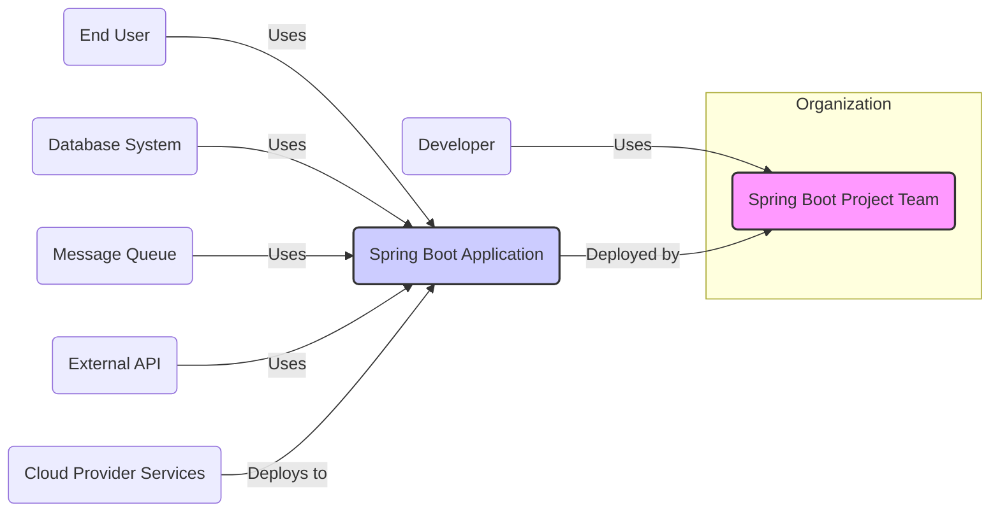
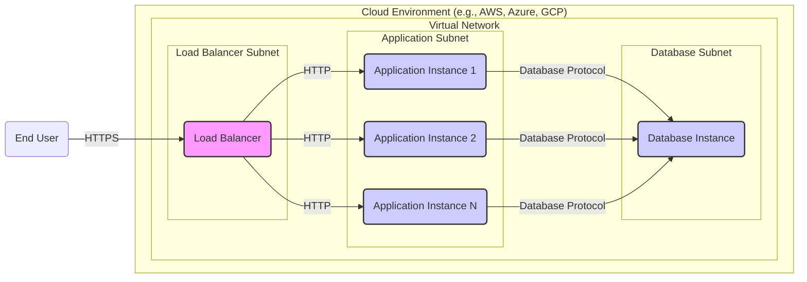

# BUSINESS POSTURE

- Business Priorities and Goals
 - Goal: Spring Boot aims to simplify and accelerate the development of Java-based enterprise applications and microservices. It prioritizes developer productivity, ease of use, and convention over configuration. It enables rapid application prototyping and deployment, making it suitable for agile development environments.
 - Priority: Speed of development and time to market for applications.
 - Priority: Operational efficiency and ease of deployment.
 - Priority: Scalability and resilience of applications.
 - Priority: Developer experience and community support.

- Business Risks
 - Business Risk: Security vulnerabilities in applications built with Spring Boot due to developer errors or misconfigurations.
 - Business Risk: Dependency management issues leading to vulnerable libraries being included in applications.
 - Business Risk: Operational risks associated with deploying and managing applications in various environments.
 - Business Risk: Performance bottlenecks in applications due to inefficient coding or configuration.
 - Business Risk: Lack of skilled developers proficient in Spring Boot and its ecosystem.
 - Business Risk: Compatibility issues with other systems and technologies.
 - Business Risk: Vendor lock-in to the Spring ecosystem.

# SECURITY POSTURE

- Existing Security Controls
 - security control: Dependency Management: Spring Boot uses Maven or Gradle for dependency management, allowing for control over included libraries. Described in: pom.xml and build.gradle files in the repository.
 - security control: Spring Security: Spring Boot integrates with Spring Security, a comprehensive and customizable security framework for authentication and authorization. Described in: Spring Security documentation and examples within the Spring Boot project.
 - security control: Secure Defaults: Spring Boot provides sensible default configurations that promote security, such as disabling certain features by default if they are not explicitly enabled. Described in: Spring Boot documentation and source code.
 - security control: HTTPS Configuration: Spring Boot simplifies the configuration of HTTPS for web applications. Described in: Spring Boot documentation and examples.
 - security control: Actuator Endpoints Security: Spring Boot Actuator endpoints, which provide operational information, can be secured using Spring Security. Described in: Spring Boot Actuator documentation.
 - security control: Input Validation: Spring Boot supports standard Java validation annotations for input validation. Described in: Spring Boot documentation and Java Bean Validation (JSR-380) specification.
 - security control: CSRF Protection: Spring Security provides default CSRF protection for web applications. Described in: Spring Security documentation.
 - security control: CORS Configuration: Spring Boot allows configuration of Cross-Origin Resource Sharing (CORS) policies. Described in: Spring Boot documentation.

- Accepted Risks
 - accepted risk: Reliance on developers to correctly implement security features provided by Spring Boot and Spring Security.
 - accepted risk: Potential for vulnerabilities in third-party dependencies despite dependency management controls.
 - accepted risk: Misconfiguration of security settings leading to vulnerabilities.
 - accepted risk: Vulnerabilities in the underlying Java Virtual Machine (JVM) or operating system.
 - accepted risk: Social engineering and phishing attacks targeting developers or operators.
 - accepted risk: Insider threats from malicious or negligent employees.

- Recommended Security Controls
 - recommended security control: Static Application Security Testing (SAST) tools integrated into the build pipeline to identify potential vulnerabilities in the code.
 - recommended security control: Software Composition Analysis (SCA) tools to scan dependencies for known vulnerabilities.
 - recommended security control: Dynamic Application Security Testing (DAST) tools to test running applications for vulnerabilities.
 - recommended security control: Penetration testing by security experts to identify weaknesses in the application and infrastructure.
 - recommended security control: Security training for developers on secure coding practices and Spring Security best practices.
 - recommended security control: Regular security audits of the application and infrastructure.
 - recommended security control: Security incident response plan to handle security breaches effectively.
 - recommended security control: Implement a Web Application Firewall (WAF) to protect against common web attacks.
 - recommended security control: Runtime Application Self-Protection (RASP) to detect and prevent attacks in runtime.

- Security Requirements
 - Authentication: Applications should implement robust authentication mechanisms to verify user identities. Spring Security provides various authentication methods, including username/password, OAuth 2.0, and SAML.
 - Authorization: Applications should enforce fine-grained authorization to control access to resources and functionalities based on user roles and permissions. Spring Security provides role-based and permission-based authorization.
 - Input Validation: All user inputs should be validated to prevent injection attacks (e.g., SQL injection, cross-site scripting). Spring Boot supports Java Bean Validation and custom validation logic.
 - Cryptography: Sensitive data at rest and in transit should be encrypted using strong cryptographic algorithms. Spring Security provides support for secure password hashing and HTTPS configuration. Applications may need to implement further encryption for sensitive data storage.
 - Session Management: Secure session management practices should be implemented to protect user sessions from hijacking and other attacks. Spring Security provides secure session management features.
 - Error Handling and Logging: Applications should handle errors gracefully and log security-related events for auditing and incident response. Spring Boot provides logging frameworks and error handling mechanisms.
 - Security Headers: Applications should configure security headers (e.g., Content Security Policy, X-Frame-Options, Strict-Transport-Security) to protect against various browser-based attacks. Spring Boot allows configuration of these headers.
 - Rate Limiting and Throttling: Implement rate limiting and throttling to protect against brute-force attacks and denial-of-service attacks. This can be implemented using Spring Security or external components.

# DESIGN

- C4 CONTEXT



- C4 CONTEXT Elements
 - - Name: Spring Boot Project Team
   - Type: Team
   - Description: The team responsible for developing and maintaining the Spring Boot framework.
   - Responsibilities: Developing, maintaining, and releasing the Spring Boot framework. Providing documentation and support. Addressing security vulnerabilities in the framework.
   - Security controls: security control: Secure development lifecycle for framework development. security control: Code reviews. security control: Security testing of the framework. security control: Vulnerability management process.
 - - Name: Developer
   - Type: Person
   - Description: Software developers who use Spring Boot to build applications.
   - Responsibilities: Developing, testing, and deploying applications using Spring Boot. Implementing security controls in their applications.
   - Security controls: security control: Secure coding training. security control: Use of SAST and SCA tools. security control: Following secure development practices.
 - - Name: Spring Boot Application
   - Type: Software System
   - Description: Applications built using the Spring Boot framework. This is the system being designed and analyzed.
   - Responsibilities: Providing business functionality to end users. Managing data. Integrating with other systems. Enforcing security policies.
   - Security controls: security control: Authentication. security control: Authorization. security control: Input validation. security control: Cryptography. security control: Security logging and monitoring.
 - - Name: End User
   - Type: Person
   - Description: Users who interact with the Spring Boot application to access its functionalities.
   - Responsibilities: Authenticating to the application. Using the application's features.
   - Security controls: security control: Strong password management. security control: Multi-factor authentication (if enabled by application).
 - - Name: Database System
   - Type: External System
   - Description: Databases used by the Spring Boot application to store and retrieve data. Examples: MySQL, PostgreSQL, MongoDB.
   - Responsibilities: Storing application data securely and reliably. Providing data access to the application.
   - Security controls: security control: Access control lists. security control: Encryption at rest. security control: Encryption in transit. security control: Database auditing.
 - - Name: Message Queue
   - Type: External System
   - Description: Message queues used for asynchronous communication and decoupling components. Examples: RabbitMQ, Kafka.
   - Responsibilities: Reliable message delivery. Message persistence.
   - Security controls: security control: Access control lists. security control: Encryption in transit. security control: Message queue authentication and authorization.
 - - Name: External API
   - Type: External System
   - Description: External APIs that the Spring Boot application integrates with. Examples: Payment gateways, social media APIs.
   - Responsibilities: Providing external services and data.
   - Security controls: security control: API authentication and authorization. security control: Secure API communication (HTTPS). security control: Input validation of API responses.
 - - Name: Cloud Provider Services
   - Type: External System
   - Description: Cloud services used to deploy and run the Spring Boot application. Examples: AWS, Azure, GCP.
   - Responsibilities: Providing infrastructure for application deployment. Managing cloud resources.
   - Security controls: security control: Cloud provider security controls (IAM, VPC, Security Groups). security control: Encryption of data in cloud storage. security control: Cloud monitoring and logging.

- C4 CONTAINER

```mermaid
flowchart LR
    subgraph "Spring Boot Application"
        A("Web Server" <br> Tomcat, Jetty, Undertow)
        B("Spring Framework Container")
        C("Application Code" <br> Controllers, Services, Repositories)
        D("Spring Security")
        E("Data Access Layer" <br> JPA, JDBC)
        F("Actuator Endpoints")
    end
    G("Database System") -- JDBC/JPA --> E
    H("Message Queue") -- Messaging Libraries --> C
    I("External API") -- REST Clients --> C
    A -- Handles Requests --> B
    B -- Manages Components --> C & D & E & F
    C -- Uses --> D & E & F
    D -- Enforces Security --> C & A & F
    F -- Provides Info --> Monitoring System

    style A fill:#f9f,stroke:#333,stroke-width:2px
    style B fill:#f9f,stroke:#333,stroke-width:2px
    style C fill:#ccf,stroke:#333,stroke-width:2px
    style D fill:#f9f,stroke:#333,stroke-width:2px
    style E fill:#f9f,stroke:#333,stroke-width:2px
    style F fill:#f9f,stroke:#333,stroke-width:2px
```

- C4 CONTAINER Elements
 - - Name: Web Server (Tomcat, Jetty, Undertow)
   - Type: Container
   - Description: Embedded web server that handles HTTP requests and responses. Spring Boot supports Tomcat, Jetty, and Undertow.
   - Responsibilities: Accepting incoming HTTP requests. Serving static content. Forwarding requests to the Spring Framework Container.
   - Security controls: security control: HTTPS configuration. security control: Security headers configuration. security control: Protection against common web attacks (handled by underlying server and potentially WAF).
 - - Name: Spring Framework Container
   - Type: Container
   - Description: The core Spring Framework container that manages application components (beans) and their lifecycle.
   - Responsibilities: Dependency injection. Aspect-oriented programming. Transaction management. Managing application context.
   - Security controls: security control: Secure configuration management. security control: Management of security-related beans (e.g., Spring Security components).
 - - Name: Application Code (Controllers, Services, Repositories)
   - Type: Container
   - Description: The custom application code written by developers, including controllers, services, repositories, and other business logic components.
   - Responsibilities: Implementing business logic. Handling user requests. Interacting with data storage and external systems.
   - Security controls: security control: Input validation. security control: Authorization checks. security control: Secure coding practices. security control: Proper error handling and logging.
 - - Name: Spring Security
   - Type: Container
   - Description: Spring Security framework integrated into the application to handle authentication, authorization, and other security concerns.
   - Responsibilities: Authentication of users. Authorization of requests. Protection against common security vulnerabilities (CSRF, session fixation, etc.).
   - Security controls: security control: Authentication mechanisms. security control: Authorization rules. security control: CSRF protection. security control: Session management. security control: Security headers.
 - - Name: Data Access Layer (JPA, JDBC)
   - Type: Container
   - Description: Components responsible for interacting with the database system. Spring Boot supports JPA and JDBC for data access.
   - Responsibilities: Data persistence and retrieval. Mapping objects to database records. Handling database transactions.
   - Security controls: security control: Secure database connection configuration. security control: Parameterized queries to prevent SQL injection. security control: Data access authorization (handled by application code and potentially database ACLs).
 - - Name: Actuator Endpoints
   - Type: Container
   - Description: Spring Boot Actuator endpoints that provide operational information about the application, such as health, metrics, and logs.
   - Responsibilities: Monitoring application health and performance. Providing operational insights.
   - Security controls: security control: Authentication and authorization for actuator endpoints. security control: Secure exposure of sensitive information (e.g., masking sensitive data in logs and metrics).

- DEPLOYMENT



- DEPLOYMENT Elements
 - - Name: Load Balancer
   - Type: Infrastructure
   - Description: Distributes incoming traffic across multiple application instances for scalability and high availability. Can be a cloud provider's managed load balancer (e.g., AWS ELB, Azure Load Balancer, GCP Load Balancer).
   - Responsibilities: Load balancing. SSL termination. Health checks for application instances.
   - Security controls: security control: SSL/TLS encryption. security control: DDoS protection (provided by cloud provider). security control: Web Application Firewall (WAF) integration.
 - - Name: Application Instance 1, 2, N
   - Type: Infrastructure (Virtual Machine or Container)
   - Description: Instances of the Spring Boot application running in a virtual machine or container. Multiple instances are deployed for scalability and redundancy.
   - Responsibilities: Running the Spring Boot application. Processing user requests.
   - Security controls: security control: Operating system hardening. security control: Application security configurations. security control: Security monitoring and logging. security control: Container security (if deployed in containers).
 - - Name: Database Instance
   - Type: Infrastructure (Managed Database Service or VM)
   - Description: Database instance used by the application. Can be a managed database service (e.g., AWS RDS, Azure SQL Database, GCP Cloud SQL) or a database running on a virtual machine.
   - Responsibilities: Storing and managing application data. Providing data access to application instances.
   - Security controls: security control: Database access control lists. security control: Encryption at rest. security control: Encryption in transit. security control: Database auditing. security control: Database hardening.
 - - Name: Virtual Network
   - Type: Infrastructure (Cloud Networking)
   - Description: Isolated network in the cloud environment to host the application components. Provides network segmentation and security.
   - Responsibilities: Network isolation. Network traffic control.
   - Security controls: security control: Network segmentation (subnets). security control: Security groups or network ACLs. security control: Network monitoring.
 - - Name: Load Balancer Subnet
   - Type: Infrastructure (Network Subnet)
   - Description: Subnet within the virtual network where the load balancer is deployed. Typically a public subnet to receive internet traffic.
   - Responsibilities: Hosting the load balancer.
   - Security controls: security control: Network security groups to control inbound and outbound traffic.
 - - Name: Application Subnet
   - Type: Infrastructure (Network Subnet)
   - Description: Subnet within the virtual network where application instances are deployed. Typically a private subnet, not directly accessible from the internet.
   - Responsibilities: Hosting application instances.
   - Security controls: security control: Network security groups to restrict inbound traffic to load balancer and outbound traffic to database and other necessary services.
 - - Name: Database Subnet
   - Type: Infrastructure (Network Subnet)
   - Description: Subnet within the virtual network where the database instance is deployed. Typically a private subnet, accessible only from application instances.
   - Responsibilities: Hosting the database instance.
   - Security controls: security control: Network security groups to restrict inbound traffic to application instances and outbound traffic as needed.

- BUILD

```mermaid
flowchart LR
    A("Developer") -- Code Changes --> B("Version Control System (e.g., GitHub)")
    B -- Trigger --> C("CI/CD Pipeline (e.g., GitHub Actions, Jenkins)")
    subgraph "CI/CD Pipeline"
        D("Source Code Checkout")
        E("Dependency Resolution & Management")
        F("Build & Compile")
        G("Unit & Integration Tests")
        H("SAST & SCA Scanners")
        I("Container Image Build (if applicable)")
        J("Artifact Repository (e.g., Maven Central, Docker Registry)")
    end
    C --> D --> E --> F --> G --> H --> I --> J

    style A fill:#ccf,stroke:#333,stroke-width:2px
    style B fill:#f9f,stroke:#333,stroke-width:2px
    style C fill:#f9f,stroke:#333,stroke-width:2px
    style D fill:#f9f,stroke:#333,stroke-width:2px
    style E fill:#f9f,stroke:#333,stroke-width:2px
    style F fill:#f9f,stroke:#333,stroke-width:2px
    style G fill:#f9f,stroke:#333,stroke-width:2px
    style H fill:#f9f,stroke:#333,stroke-width:2px
    style I fill:#f9f,stroke:#333,stroke-width:2px
    style J fill:#f9f,stroke:#333,stroke-width:2px
```



- BUILD Elements
 - - Name: Developer
   - Type: Person
   - Description: Software developer writing and committing code changes.
   - Responsibilities: Writing secure code. Performing local testing. Committing code changes to the version control system.
   - Security controls: security control: Secure coding practices. security control: Local SAST and SCA scanning (optional). security control: Code review before commit (optional).
 - - Name: Version Control System (e.g., GitHub)
   - Type: Tool
   - Description: System for managing source code versions and collaboration.
   - Responsibilities: Storing source code. Managing branches and commits. Triggering CI/CD pipeline.
   - Security controls: security control: Access control to repository. security control: Branch protection rules. security control: Audit logging of code changes.
 - - Name: CI/CD Pipeline (e.g., GitHub Actions, Jenkins)
   - Type: Tool
   - Description: Automated pipeline for building, testing, and deploying the application.
   - Responsibilities: Automating build process. Running tests. Performing security scans. Building artifacts. Publishing artifacts.
   - Security controls: security control: Secure pipeline configuration. security control: Access control to pipeline configuration and execution. security control: Secrets management for pipeline credentials.
 - - Name: Source Code Checkout
   - Type: Pipeline Stage
   - Description: Stage in the CI/CD pipeline that retrieves the source code from the version control system.
   - Responsibilities: Fetching the latest code changes.
   - Security controls: security control: Secure connection to version control system. security control: Verification of code integrity (e.g., using commit hashes).
 - - Name: Dependency Resolution & Management
   - Type: Pipeline Stage
   - Description: Stage that resolves and manages project dependencies using build tools like Maven or Gradle.
   - Responsibilities: Downloading dependencies. Verifying dependency integrity.
   - Security controls: security control: Dependency vulnerability scanning (SCA). security control: Use of dependency lock files to ensure consistent builds. security control: Private repository for internal dependencies (optional).
 - - Name: Build & Compile
   - Type: Pipeline Stage
   - Description: Stage that compiles the source code into executable artifacts (e.g., JAR or WAR files).
   - Responsibilities: Compiling code. Packaging application.
   - Security controls: security control: Secure build environment. security control: Compilation with security flags (if applicable).
 - - Name: Unit & Integration Tests
   - Type: Pipeline Stage
   - Description: Stage that runs automated unit and integration tests to verify code functionality.
   - Responsibilities: Running tests. Reporting test results.
   - Security controls: security control: Secure test environment. security control: Security-focused tests (e.g., testing security controls).
 - - Name: SAST & SCA Scanners
   - Type: Pipeline Stage
   - Description: Stage that runs Static Application Security Testing (SAST) and Software Composition Analysis (SCA) tools to identify vulnerabilities in code and dependencies.
   - Responsibilities: Scanning code for vulnerabilities. Scanning dependencies for vulnerabilities. Reporting vulnerability findings.
   - Security controls: security control: Regularly updated vulnerability databases for scanners. security control: Configuration of scanners to detect relevant vulnerabilities.
 - - Name: Container Image Build (if applicable)
   - Type: Pipeline Stage
   - Description: Stage that builds a container image (e.g., Docker image) for the application if containerized deployment is used.
   - Responsibilities: Building container image. Optimizing image size and security.
   - Security controls: security control: Base image security scanning. security control: Minimizing image layers. security control: Non-root user in container.
 - - Name: Artifact Repository (e.g., Maven Central, Docker Registry)
   - Type: Tool
   - Description: Repository for storing and managing build artifacts (e.g., JAR files, container images).
   - Responsibilities: Storing build artifacts. Providing access to artifacts for deployment.
   - Security controls: security control: Access control to artifact repository. security control: Vulnerability scanning of stored artifacts. security control: Artifact signing and verification.

# RISK ASSESSMENT

- Critical Business Processes
 - Critical Business Process: Application functionality provided to end users (e.g., e-commerce transactions, content delivery, data processing). Disruption or compromise of these processes can directly impact business operations and revenue.
 - Critical Business Process: Data storage and processing. Loss, corruption, or unauthorized access to sensitive data can lead to financial loss, reputational damage, and legal liabilities.
 - Critical Business Process: Authentication and authorization. Failure of these processes can lead to unauthorized access to sensitive data and functionalities.
 - Critical Business Process: System availability and performance. Downtime or performance degradation can impact user experience and business operations.

- Data Sensitivity
 - Data Sensitivity: User credentials (usernames, passwords, API keys) - Highly Sensitive. Compromise can lead to unauthorized access and account takeover.
 - Data Sensitivity: Personally Identifiable Information (PII) (names, addresses, emails, phone numbers) - Sensitive. Requires protection to comply with privacy regulations (e.g., GDPR, CCPA).
 - Data Sensitivity: Financial data (credit card numbers, bank account details, transaction history) - Highly Sensitive. Requires strict protection to comply with PCI DSS and prevent financial fraud.
 - Data Sensitivity: Business confidential data (trade secrets, internal documents, strategic plans) - Sensitive. Requires protection to maintain competitive advantage and prevent intellectual property theft.
 - Data Sensitivity: Application logs and audit trails - Moderately Sensitive. Contain operational and security information useful for monitoring and incident response, but less sensitive than user or financial data.

# QUESTIONS & ASSUMPTIONS

- Questions
 - Question: What type of applications are being built with Spring Boot? (Web applications, microservices, batch jobs, etc.) This will influence the specific security requirements and design considerations.
 - Question: What is the target deployment environment? (Cloud, on-premise, hybrid) Deployment environment impacts infrastructure security controls and deployment architecture.
 - Question: What are the specific compliance requirements? (PCI DSS, HIPAA, GDPR, etc.) Compliance requirements will dictate specific security controls and data protection measures.
 - Question: What is the organization's risk appetite? Risk appetite influences the level of security investment and the acceptance of certain risks.
 - Question: Are there any existing security policies or standards that need to be followed? Existing policies and standards should be integrated into the design.

- Assumptions
 - Assumption: Applications built with Spring Boot handle sensitive data, requiring robust security controls.
 - Assumption: Applications are deployed in a cloud environment, leveraging cloud provider security services.
 - Assumption: Developers are expected to follow secure coding practices and utilize Spring Security features.
 - Assumption: Automated CI/CD pipeline is used for building and deploying applications, allowing for integration of security checks in the build process.
 - Assumption: Security is a high priority for the organization, and resources will be allocated for implementing necessary security controls.