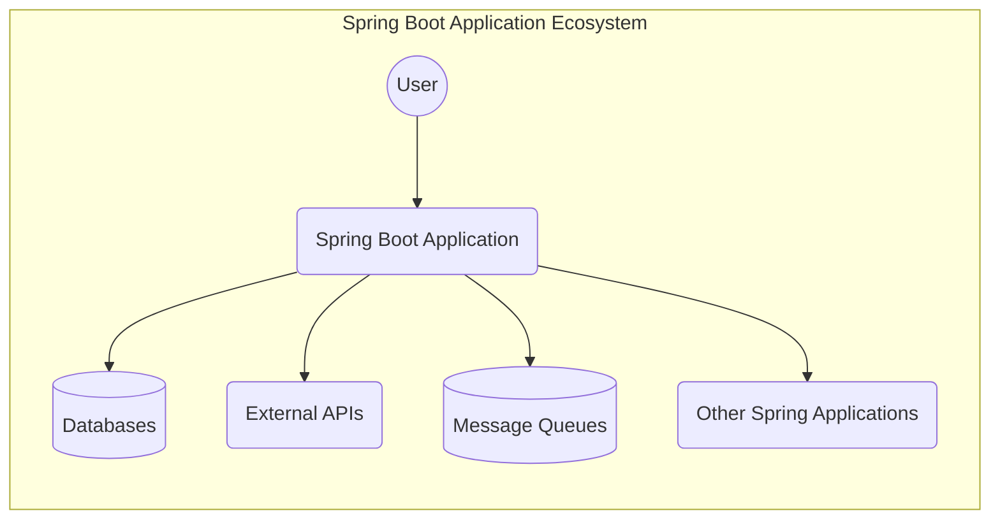
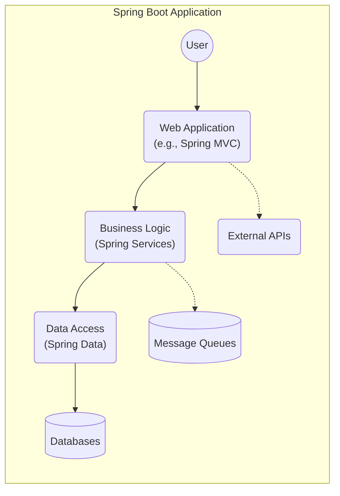
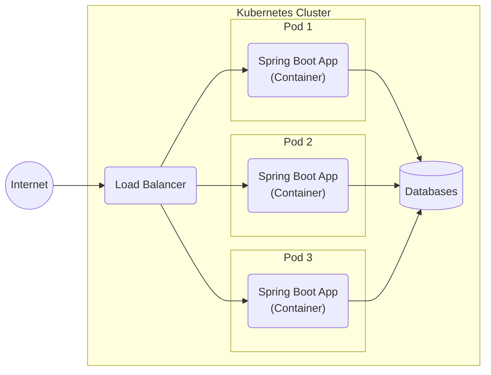
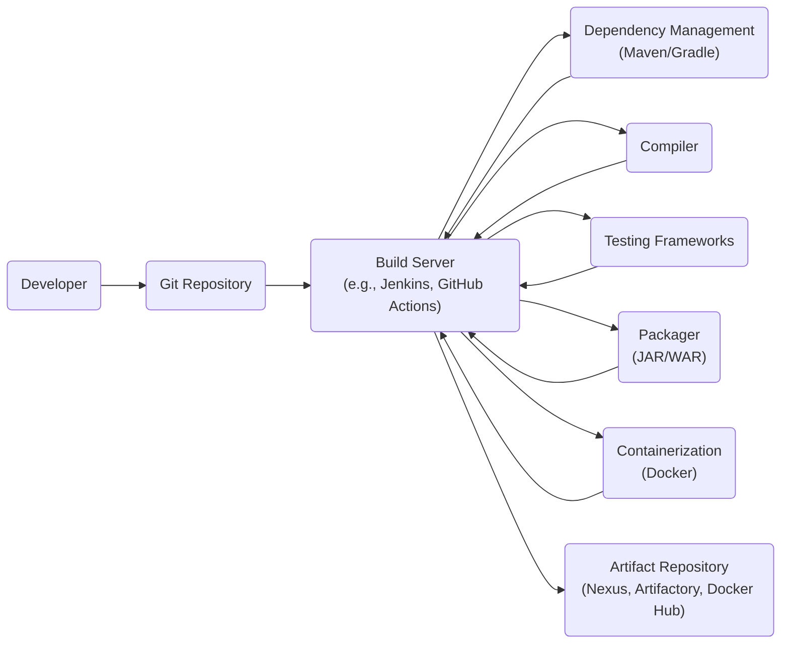

Okay, let's create a design document for the Spring Boot project, keeping in mind its purpose and potential security considerations.

# BUSINESS POSTURE

Spring Boot is a framework designed to simplify the development of production-ready Spring-based applications.  It favors convention over configuration, aiming to get developers up and running quickly.  Given its widespread use, the business posture focuses on several key areas:

*   Priorities:
    *   Ease of Use:  Reduce the complexity of developing and deploying Spring applications.
    *   Rapid Development: Enable developers to build and iterate quickly.
    *   Production Readiness: Provide features for monitoring, health checks, and externalized configuration.
    *   Extensibility: Allow developers to easily integrate with other Spring projects and third-party libraries.
    *   Community Support: Maintain a strong and active community to provide support and drive adoption.
    *   Broad Adoption: Become the standard way to build Spring applications.

*   Goals:
    *   Minimize boilerplate code.
    *   Simplify dependency management.
    *   Provide auto-configuration for common application functionalities.
    *   Offer embedded server support (Tomcat, Jetty, Undertow).
    *   Enable easy creation of standalone applications.

*   Business Risks:
    *   Security Vulnerabilities:  Vulnerabilities in Spring Boot or its dependencies could expose applications built with it to significant risks. This is the most critical risk.
    *   Dependency Conflicts:  Incorrect or conflicting dependencies can lead to runtime errors and instability.
    *   Configuration Errors:  Misconfiguration of Spring Boot features can lead to unexpected behavior or security vulnerabilities.
    *   Performance Bottlenecks:  Inefficient use of Spring Boot features or poor application design can lead to performance issues.
    *   Lack of Standardization: While convention over configuration is a goal, inconsistent use across teams can lead to maintainability problems.
    *   Breaking Changes: New releases of Spring Boot could introduce breaking changes that require significant effort to address in existing applications.

# SECURITY POSTURE

Spring Boot itself doesn't implement security directly, but it heavily relies on and integrates with Spring Security. It provides auto-configuration to simplify Spring Security setup.

*   Existing Security Controls:
    *   security control: Spring Security Integration: Spring Boot provides seamless integration with Spring Security, a powerful and customizable authentication and access-control framework. (Described in Spring Boot documentation and Spring Security documentation).
    *   security control: Auto-Configuration: Spring Boot auto-configures many security features, such as setting up a default user with a generated password if Spring Security is on the classpath. (Described in Spring Boot documentation).
    *   security control: Actuator Security: Spring Boot Actuator endpoints (e.g., /health, /metrics) are secured by default when Spring Security is present. (Described in Spring Boot documentation).
    *   security control: Dependency Management: Spring Boot's dependency management helps ensure that compatible versions of libraries, including security-related ones, are used. (Described in Spring Boot documentation).
    *   security control: Secure by Default (to an extent): Spring Boot encourages secure practices, such as using HTTPS and providing sensible defaults. (Described in Spring Boot documentation).
    *   security control: CSRF Protection: When using Spring Security with Spring MVC, CSRF protection is enabled by default. (Described in Spring Security documentation).
    *   security control: HTTP Security Headers: Spring Security, often used with Spring Boot, adds several security-related HTTP headers by default (e.g., X-Content-Type-Options, X-XSS-Protection, Cache-Control, Strict-Transport-Security (HSTS) if HTTPS is enabled). (Described in Spring Security documentation).

*   Accepted Risks:
    *   accepted risk: Default User Password: While a default user with a generated password is created for convenience, relying on this in production without changing it is an accepted risk *if and only if* explicitly documented and mitigated elsewhere.  This is generally discouraged.
    *   accepted risk: Developer Misconfiguration: Spring Boot's ease of use can lead to developers overlooking security configurations, assuming defaults are sufficient. This is an accepted risk that must be mitigated through training, code reviews, and security testing.
    *   accepted risk: Third-Party Library Vulnerabilities: While Spring Boot manages dependencies, vulnerabilities in those dependencies are an accepted risk that must be addressed through continuous monitoring and patching.
    *   accepted risk: Lack of Fine-Grained Authorization: While Spring Security provides robust authorization mechanisms, developers might not implement them correctly or at all, leading to overly permissive access. This is an accepted risk mitigated by secure development practices.

*   Recommended Security Controls:
    *   security control: Regular Security Audits: Conduct regular security audits of Spring Boot applications and their dependencies.
    *   security control: Vulnerability Scanning: Implement automated vulnerability scanning of dependencies and application code.
    *   security control: Penetration Testing: Perform regular penetration testing to identify and address vulnerabilities.
    *   security control: Security Training: Provide developers with comprehensive security training on Spring Security and secure coding practices.
    *   security control: Secrets Management: Integrate with a secrets management solution (e.g., HashiCorp Vault, AWS Secrets Manager, Azure Key Vault) to securely store and manage sensitive information.
    *   security control: Input Validation: Enforce strict input validation on all user-supplied data.
    *   security control: Output Encoding: Encode all output to prevent cross-site scripting (XSS) vulnerabilities.

*   Security Requirements:

    *   Authentication:
        *   Applications built with Spring Boot must authenticate users securely.
        *   Support for multiple authentication mechanisms (e.g., username/password, OAuth 2.0, OpenID Connect) should be considered.
        *   Multi-factor authentication (MFA) should be implemented where appropriate.
        *   Secure password storage using strong hashing algorithms (e.g., bcrypt, Argon2) is required.

    *   Authorization:
        *   Applications must implement appropriate authorization controls to restrict access to resources based on user roles and permissions.
        *   The principle of least privilege should be followed.
        *   Role-based access control (RBAC) or attribute-based access control (ABAC) should be used.

    *   Input Validation:
        *   All user-supplied input must be validated against a strict whitelist of allowed characters and formats.
        *   Input validation should be performed on both the client-side and server-side.
        *   Validation rules should be centralized and reusable.

    *   Cryptography:
        *   Sensitive data must be encrypted both in transit and at rest.
        *   Strong cryptographic algorithms and key lengths must be used.
        *   Key management must be secure and follow best practices.
        *   HTTPS must be used for all communication.

# DESIGN

## C4 CONTEXT

*   Elements Description:

    *   Element:
        *   Name: User
        *   Type: Person
        *   Description: Represents a user interacting with the Spring Boot application.
        *   Responsibilities: Accessing the application, providing input, receiving output.
        *   Security controls: Authentication, Authorization.

    *   Element:
        *   Name: Spring Boot Application
        *   Type: Software System
        *   Description: The application built using the Spring Boot framework.
        *   Responsibilities: Handling user requests, processing data, interacting with other systems.
        *   Security controls: Input validation, output encoding, authentication, authorization, session management, error handling, logging.

    *   Element:
        *   Name: Databases
        *   Type: Software System
        *   Description: Represents various databases used by the application (e.g., relational, NoSQL).
        *   Responsibilities: Storing and retrieving data.
        *   Security controls: Access control, encryption at rest, encryption in transit, auditing.

    *   Element:
        *   Name: External APIs
        *   Type: Software System
        *   Description: Represents external APIs consumed by the application (e.g., payment gateways, social media APIs).
        *   Responsibilities: Providing specific functionalities.
        *   Security controls: API keys, OAuth 2.0, TLS/SSL.

    *   Element:
        *   Name: Message Queues
        *   Type: Software System
        *   Description: Represents message queues used for asynchronous communication (e.g., RabbitMQ, Kafka).
        *   Responsibilities: Facilitating asynchronous communication between services.
        *   Security controls: Authentication, authorization, encryption in transit.

    *   Element:
        *   Name: Other Spring Applications
        *   Type: Software System
        *   Description: Represents other Spring applications that interact with the main application.
        *   Responsibilities: Providing specific functionalities or services.
        *   Security controls: Authentication, authorization, secure communication protocols (e.g., HTTPS).

## C4 CONTAINER

*   Elements Description:

    *   Element:
        *   Name: Web Application
        *   Type: Container (e.g., Spring MVC)
        *   Description: Handles user requests and interacts with the business logic.
        *   Responsibilities: Request routing, input validation, view rendering.
        *   Security controls: Authentication, authorization, input validation, output encoding, CSRF protection.

    *   Element:
        *   Name: Business Logic
        *   Type: Container (Spring Services)
        *   Description: Contains the core application logic.
        *   Responsibilities: Processing data, enforcing business rules.
        *   Security controls: Authorization, input validation, data validation.

    *   Element:
        *   Name: Data Access
        *   Type: Container (Spring Data)
        *   Description: Interacts with the database.
        *   Responsibilities: Data persistence, data retrieval.
        *   Security controls: Parameterized queries, ORM security features.

    *   Element:
        *   Name: Databases
        *   Type: Container (Database)
        *   Description: Represents the database used by the application.
        *   Responsibilities: Storing and retrieving data.
        *   Security controls: Access control, encryption at rest, encryption in transit, auditing.

    *   Element:
        *   Name: External APIs
        *   Type: External System
        *   Description: Represents external APIs consumed by the application.
        *   Responsibilities: Providing specific functionalities.
        *   Security controls: API keys, OAuth 2.0, TLS/SSL.

    *   Element:
        *   Name: Message Queues
        *   Type: External System
        *   Description: Represents message queues used for asynchronous communication.
        *   Responsibilities: Facilitating asynchronous communication between services.
        *   Security controls: Authentication, authorization, encryption in transit.

## DEPLOYMENT

Spring Boot applications can be deployed in various ways:

1.  **Embedded Server:** The most common approach is to package the application as an executable JAR file with an embedded server (Tomcat, Jetty, or Undertow). This JAR can then be deployed to any environment with a Java Runtime Environment (JRE).
2.  **Traditional WAR Deployment:** Spring Boot applications can also be packaged as WAR files and deployed to a traditional application server (e.g., Tomcat, JBoss).
3.  **Cloud Platforms:** Spring Boot applications are well-suited for deployment to cloud platforms like AWS, Azure, Google Cloud, and Heroku. These platforms often provide specific tools and services for deploying and managing Spring Boot applications.
4.  **Containers (Docker):** Spring Boot applications can be easily containerized using Docker, making them portable and scalable.
5.  **Kubernetes:** For complex deployments, Kubernetes can be used to orchestrate and manage multiple instances of Spring Boot applications running in Docker containers.

We'll describe the **Embedded Server with Docker and Kubernetes** deployment in detail:

*   Elements Description:

    *   Element:
        *   Name: Internet
        *   Type: External
        *   Description: Represents the public internet.
        *   Responsibilities: Routing traffic to the load balancer.
        *   Security controls: Firewall, DDoS protection.

    *   Element:
        *   Name: Load Balancer
        *   Type: Infrastructure Node
        *   Description: Distributes incoming traffic across multiple instances of the Spring Boot application.
        *   Responsibilities: Load balancing, health checks.
        *   Security controls: TLS/SSL termination, access control lists.

    *   Element:
        *   Name: Pod 1, Pod 2, Pod 3
        *   Type: Kubernetes Pod
        *   Description: Represents a Kubernetes Pod running an instance of the Spring Boot application.
        *   Responsibilities: Running the application container.
        *   Security controls: Kubernetes network policies, resource limits.

    *   Element:
        *   Name: Spring Boot App (Container)
        *   Type: Container
        *   Description: The Spring Boot application running inside a Docker container.
        *   Responsibilities: Handling user requests, processing data.
        *   Security controls: All application-level security controls (authentication, authorization, input validation, etc.).

    *   Element:
        *   Name: Databases
        *   Type: External System (Managed Database Service)
        *   Description: Represents the database used by the application.
        *   Responsibilities: Storing and retrieving data.
        *   Security controls: Access control, encryption at rest, encryption in transit, auditing, firewall rules.

## BUILD

The build process for a Spring Boot application typically involves the following steps:

1.  **Code Checkout:** The developer checks out the code from a version control system (e.g., Git).
2.  **Dependency Resolution:** Dependencies are resolved and downloaded using a build tool like Maven or Gradle.
3.  **Compilation:** The Java code is compiled into bytecode.
4.  **Testing:** Unit tests, integration tests, and other types of tests are executed.
5.  **Packaging:** The application is packaged as a JAR or WAR file.
6.  **Containerization (Optional):** If using Docker, a Docker image is built.
7.  **Artifact Storage:** The built artifact (JAR/WAR or Docker image) is stored in a repository (e.g., Nexus, Artifactory, Docker Hub).

*   Security Controls in the Build Process:

    *   security control: Dependency Scanning: Tools like OWASP Dependency-Check or Snyk can be integrated into the build process to scan for known vulnerabilities in dependencies.
    *   security control: Static Application Security Testing (SAST): SAST tools (e.g., SonarQube, Fortify, Checkmarx) can be used to analyze the source code for security vulnerabilities.
    *   security control: Code Signing: JAR files can be digitally signed to ensure their integrity and authenticity.
    *   security control: Build Automation: Using a CI/CD pipeline (e.g., Jenkins, GitHub Actions) ensures that security checks are consistently applied.
    *   security control: Least Privilege: Build servers and agents should run with the least privileges necessary.
    *   security control: Secret Management: Sensitive information used during the build process (e.g., API keys, passwords) should be stored securely using a secrets management solution.
    *   security control: Supply Chain Security: Implement measures to secure the software supply chain, such as using trusted repositories and verifying the integrity of downloaded artifacts.

# RISK ASSESSMENT

*   Critical Business Processes:
    *   Application Availability: Ensuring the Spring Boot application is available and responsive to user requests.
    *   Data Integrity: Maintaining the accuracy and consistency of data stored and processed by the application.
    *   User Authentication and Authorization: Securely managing user identities and access to application resources.
    *   Compliance: Meeting relevant regulatory and compliance requirements (e.g., GDPR, HIPAA, PCI DSS).

*   Data Sensitivity:
    *   Personally Identifiable Information (PII): Names, addresses, email addresses, phone numbers, etc. (High Sensitivity)
    *   Financial Data: Credit card numbers, bank account details, transaction history. (High Sensitivity)
    *   Authentication Credentials: Usernames, passwords, API keys, tokens. (High Sensitivity)
    *   Session Data: User session identifiers. (Medium Sensitivity)
    *   Application Configuration Data: Database connection strings, API endpoints. (Medium Sensitivity)
    *   Business Data: Data specific to the application's functionality (e.g., product catalogs, customer orders). (Variable Sensitivity - depends on the specific data)
    *   Logs and Monitoring Data: Application logs, performance metrics. (Low to Medium Sensitivity)

# QUESTIONS & ASSUMPTIONS

*   Questions:
    *   What specific compliance requirements (if any) apply to applications built with Spring Boot in this context?
    *   What is the expected scale and load of the applications?
    *   What are the existing security policies and procedures within the organization?
    *   What is the level of security expertise among the development team?
    *   Are there any specific threat models or attack vectors that are of particular concern?
    *   What is the budget allocated for security tools and resources?
    *   What level of logging and monitoring is required?
    *   What are the specific external APIs and services that Spring Boot applications will interact with?
    *   What is the preferred deployment environment (cloud, on-premise, hybrid)?
    *   What is the process for managing and rotating secrets?

*   Assumptions:
    *   BUSINESS POSTURE: The organization prioritizes security and is willing to invest in necessary resources.
    *   BUSINESS POSTURE: Developers are familiar with basic secure coding practices.
    *   SECURITY POSTURE: Spring Security will be used for authentication and authorization.
    *   SECURITY POSTURE: HTTPS will be used for all communication.
    *   SECURITY POSTURE: A secrets management solution will be used.
    *   DESIGN: The application will be deployed using a containerized approach (Docker and Kubernetes).
    *   DESIGN: A CI/CD pipeline will be used for building and deploying the application.
    *   DESIGN: Basic monitoring and logging will be implemented.
    *   DESIGN: The application will interact with a relational database.