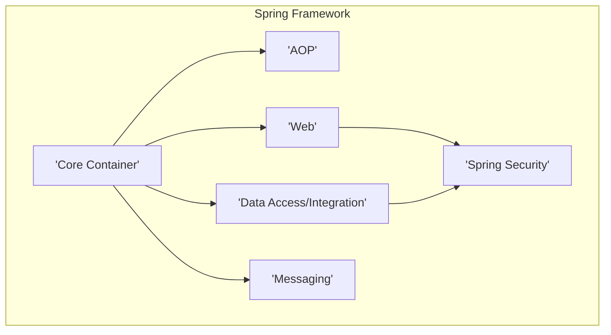
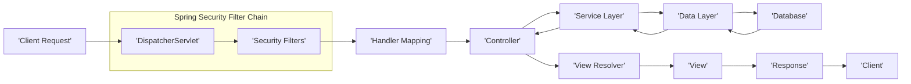

# Project Design Document: Spring Framework for Threat Modeling

**Version:** 1.1
**Date:** October 26, 2023
**Author:** AI Software Architect

## 1. Introduction

This document provides an enhanced architectural overview and detailed key component descriptions of the Spring Framework, specifically tailored for threat modeling activities. It aims to provide a comprehensive understanding of the framework's structure and functionalities from a security perspective.

## 2. Goals and Objectives

The primary goal of this document is to furnish a clear, detailed, and security-focused description of the Spring Framework's architecture and key components to facilitate effective threat modeling. The objectives are to:

* Clearly identify the major components and their interactions, emphasizing security boundaries and data flow.
* Provide detailed descriptions of key components, highlighting potential security vulnerabilities and attack surfaces.
* Illustrate typical data flow within a Spring application, focusing on the movement of sensitive data.
* Explicitly highlight key security-related features, potential weaknesses, and common misconfigurations.
* Serve as a robust foundation for identifying potential vulnerabilities, attack vectors, and security risks.

## 3. Target Audience

This document is intended for:

* Security engineers and architects leading and participating in threat modeling exercises.
* Developers seeking a deep understanding of the Spring Framework's architecture with a focus on security implications.
* Security auditors assessing the security posture of Spring-based applications.
* Operations teams responsible for deploying, configuring, and securing Spring applications.

## 4. Scope

This document focuses on the core modules and concepts of the Spring Framework that are most relevant to security considerations. This includes:

* Core Container (Beans, Context, Core): Focusing on dependency injection and lifecycle management.
* Aspect-Oriented Programming (AOP): Examining its impact on security concerns like logging and authorization.
* Data Access/Integration (JDBC, ORM, Transactions):  Highlighting potential vulnerabilities related to data handling.
* Web (MVC, REST):  Detailing the request processing pipeline and potential web-related attacks.
* Messaging:  Considering security aspects of message handling and communication.
* Security (Spring Security): Providing a deeper dive into its architecture and key features.

This document will not cover every individual module or feature within the vast Spring ecosystem but will concentrate on those with significant security relevance.

## 5. Architectural Overview

The Spring Framework employs a modular, layered architecture. The core provides fundamental functionalities, upon which other modules are built. This layered approach helps in isolating concerns but also introduces potential interaction points that need security consideration.

* **Core Container:** Manages application components and their dependencies, a critical area for understanding potential injection vulnerabilities.
* **AOP:** Enables cross-cutting concerns, which can be used for security enforcement but also misused or bypassed if not configured correctly.
* **Data Access/Integration:** Handles interactions with data stores, a prime target for injection attacks and data breaches.
* **Web:** Processes incoming requests and generates responses, a major attack surface for web applications.
* **Messaging:** Facilitates asynchronous communication, requiring careful consideration of message integrity and confidentiality.
* **Spring Security:** The framework's dedicated security module, responsible for authentication and authorization. Its configuration and usage are crucial for application security.

## 6. Key Components

This section provides detailed descriptions of key components within the Spring Framework, emphasizing their security implications.

### 6.1. Core Container

* **BeanFactory:** The foundational IoC container. Improperly configured bean scopes or dependencies can lead to security vulnerabilities. For example, singleton beans with mutable state might introduce concurrency issues.
* **ApplicationContext:** An advanced IoC container. Understanding the lifecycle of beans managed by the `ApplicationContext` is important for identifying potential vulnerabilities during initialization or destruction phases.
* **Beans:** The fundamental building blocks of a Spring application. Vulnerabilities can arise from insecure bean implementations or misconfigurations of their dependencies. Serialization of beans also presents potential risks.

### 6.2. Aspect-Oriented Programming (AOP)

* **Aspects:** Modules implementing cross-cutting concerns. Malicious aspects could intercept sensitive operations or modify application behavior without proper authorization.
* **Advice:** The actions taken by an aspect. Incorrectly implemented advice could introduce vulnerabilities, such as logging sensitive data or bypassing security checks.
* **Pointcuts:** Define where advice is applied. Overly broad or poorly defined pointcuts could unintentionally apply security measures to unintended areas or miss critical points.

### 6.3. Data Access/Integration

* **DataSource:** Represents a connection to a database. Misconfigured data sources with overly permissive access credentials are a common vulnerability. Connection pooling needs to be managed securely.
* **JdbcTemplate:** Simplifies JDBC operations but doesn't inherently prevent SQL injection. Developers must use parameterized queries to mitigate this risk.
* **EntityManagerFactory:** Used for JPA interactions. Similar to `JdbcTemplate`, it's crucial to use parameterized queries (JPQL or Criteria API) to prevent JPA injection vulnerabilities.
* **TransactionManager:** Manages transactional operations. Improperly configured transaction boundaries or lack of transactional integrity can lead to data inconsistencies and potential security breaches.

### 6.4. Web

* **DispatcherServlet:** The central request handler. Understanding its processing pipeline is crucial for identifying where security filters and interceptors should be applied.
* **Controllers:** Handle specific requests. Vulnerabilities in controllers can include insecure input handling, lack of proper authorization checks, and exposure of sensitive data in responses.
* **ViewResolvers:** Map logical view names to actual views. Security considerations include preventing server-side template injection vulnerabilities.
* **REST Controllers:** Handle RESTful API requests. Security concerns include proper authentication and authorization for API endpoints, input validation, and protection against common API vulnerabilities.

### 6.5. Messaging

* **Message Channels:** Communication channels. Security considerations include ensuring message integrity and confidentiality, especially for sensitive data transmitted through channels.
* **Message Handlers:** Process messages. Vulnerabilities can arise from insecure message processing, such as deserialization vulnerabilities or improper handling of message content.

### 6.6. Spring Security

* **Authentication:** Verifying user identity. Understanding different authentication mechanisms (form-based, OAuth 2.0, etc.) and their potential weaknesses is crucial. Weak password policies or insecure storage of credentials are common issues.
* **Authorization:** Controlling access to resources. Properly configuring access control rules and ensuring they are enforced correctly is vital. Role-based access control (RBAC) and attribute-based access control (ABAC) are key concepts.
* **SecurityContextHolder:** Stores the current security context. Ensuring the integrity and proper management of the `SecurityContextHolder` is important to prevent unauthorized access.
* **FilterChainProxy:** The central component for applying security filters. Understanding the order and configuration of the filter chain is essential for effective security enforcement. Misconfigured filters can lead to bypasses.
* **AuthenticationManager:** Handles the authentication process. Understanding the different `AuthenticationProvider` implementations and their security implications is important.
* **AccessDecisionManager:** Determines if access should be granted. Understanding the different decision voters and their logic is crucial for ensuring proper authorization.

## 7. Data Flow

A typical web request flow in a Spring MVC application, highlighting potential security checkpoints, looks like this:

1. **Client Request:** A user initiates a request, potentially containing malicious input.
2. **DispatcherServlet:** Receives the request. This is the entry point where security filters are applied.
3. **Security Filters:** Spring Security's filter chain intercepts the request to perform authentication, authorization, and other security checks. Misconfigured or missing filters can create vulnerabilities.
4. **Handler Mapping:** Determines the appropriate controller.
5. **Controller:** Processes the request. Input validation and proper handling of user data are crucial here to prevent injection attacks.
6. **Service Layer:** Contains business logic. Security considerations include ensuring business logic enforces security rules and doesn't leak sensitive information.
7. **Data Layer:** Interacts with the database. This is a critical point for preventing SQL injection and ensuring data integrity.
8. **Database:** Stores and retrieves data. Database security measures are essential to protect sensitive information.
9. **View Resolver:** Selects the view for rendering the response.
10. **View:** Renders the response. Care must be taken to prevent cross-site scripting (XSS) vulnerabilities by properly encoding output.
11. **Response:** Sent back to the client. Ensure sensitive data is not inadvertently included in the response.
12. **Client:** Receives the response.

## 8. Security Considerations

The Spring Framework offers numerous security features, but developers must be aware of potential pitfalls and best practices:

* **Dependency Injection:** While beneficial, insecurely managed dependencies or the injection of malicious beans can introduce vulnerabilities. Regularly scan dependencies for known vulnerabilities.
* **Spring Security:** Requires careful configuration. Default settings might not be sufficient for all applications. Thoroughly understand and customize the filter chain, authentication mechanisms, and authorization rules.
* **Web Vulnerabilities:** Spring MVC provides tools to mitigate common web vulnerabilities, but developers must utilize them correctly. Implement proper input validation, output encoding, and CSRF protection.
* **Secure Defaults:** While Spring Security provides reasonable defaults, they should be reviewed and hardened based on specific application requirements and threat models.
* **Externalized Configuration:** While helpful for managing secrets, ensure the configuration sources themselves are secure and access is controlled.
* **Auditing:** Implement comprehensive auditing to track security-related events and detect potential breaches.
* **Input Validation:** Implement robust server-side input validation to prevent injection attacks and other input-related vulnerabilities. Client-side validation is not sufficient.
* **Dependency Management:**  Maintain an inventory of third-party dependencies and regularly update them to patch known vulnerabilities. Use tools to automate vulnerability scanning.
* **Error Handling:** Avoid exposing sensitive information in error messages. Implement generic error handling and logging mechanisms.
* **Session Management:** Securely configure session management to prevent session fixation and other session-related attacks. Use HTTPOnly and Secure flags for cookies.
* **CORS (Cross-Origin Resource Sharing):** Properly configure CORS to prevent unauthorized access from different origins.

## 9. Deployment Model

The deployment model significantly impacts the security considerations for Spring applications:

* **Standalone JAR (Embedded Server):** Requires careful consideration of the embedded server's security configuration and exposure.
* **Traditional WAR (Application Server):** Relies on the application server's security features, but proper configuration within the Spring application is still crucial.
* **Cloud Platforms:** Leveraging cloud security services and following cloud security best practices is essential. Consider identity and access management (IAM), network security groups, and data encryption.

## 10. Technology Stack

The underlying technologies also have security implications:

* **Java:** Ensure the JVM is up-to-date with the latest security patches. Be aware of Java serialization vulnerabilities.
* **JVM (Java Virtual Machine):** Configure JVM security settings appropriately.
* **Build Tools (Maven, Gradle):** Secure the build process and dependency resolution to prevent malicious dependencies from being introduced.
* **Testing Frameworks:** Include security testing in the development lifecycle.
* **Database:** Implement robust database security measures, including access control, encryption, and regular patching.

## 11. Assumptions and Constraints

* This document assumes a foundational understanding of Java, web application security principles, and the Spring Framework.
* The focus remains on the core Spring Framework and Spring Security. Specific integrations or less common modules are not exhaustively covered.
* The security considerations are intended to be comprehensive but require further in-depth analysis and tailored threat modeling for specific applications.

This enhanced document provides a more detailed and security-focused understanding of the Spring Framework's architecture, serving as a stronger foundation for effective threat modeling. It highlights potential vulnerabilities and areas requiring careful attention during the design, development, and deployment of Spring-based applications.
