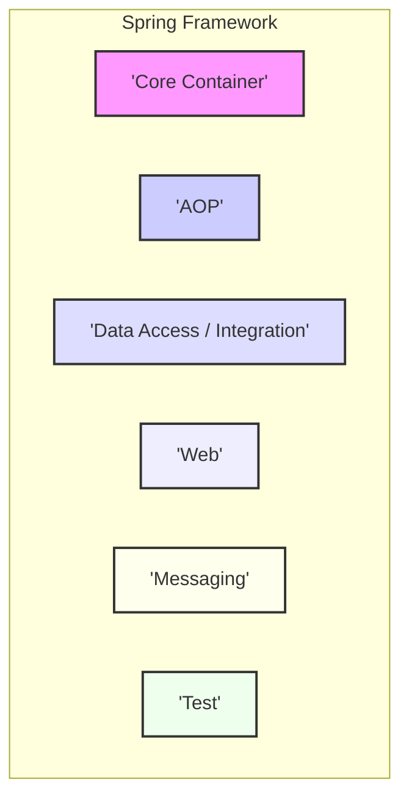

# Project Design Document: Spring Framework (Improved)

**Version:** 1.1
**Date:** October 26, 2023
**Author:** AI Software Architect

## 1. Introduction

This document provides an enhanced architectural overview of the Spring Framework project, focusing on aspects relevant to security threat modeling. It builds upon the previous version by providing more detailed descriptions of key components, data flows, and external interactions, specifically highlighting potential security implications. This document serves as a foundation for identifying and mitigating potential threats within applications built using the Spring Framework.

## 2. Goals and Objectives

The primary goal remains to provide a clear and comprehensive description of the Spring Framework's architecture to facilitate effective threat modeling. Improved objectives include:

*   Providing more granular detail on key components and their security-relevant functionalities.
*   Clearly mapping data flow with a focus on security checkpoints and transformations.
*   Expanding on external dependencies and integration points, detailing associated security risks.
*   Offering a stronger foundation for identifying potential attack surfaces, vulnerabilities, and associated risks.

## 3. High-Level Architecture

The Spring Framework's modular architecture allows developers to select and integrate specific modules as needed. The core principles of Dependency Injection (DI) and Aspect-Oriented Programming (AOP) are fundamental to its design and have security implications.



### Key Architectural Layers:

*   **Core Container:**  Manages the lifecycle of application components (beans) through Dependency Injection and Inversion of Control. Security vulnerabilities can arise from misconfigured bean dependencies or insecure bean instantiation.
*   **AOP (Aspect-Oriented Programming):** Enables the modularization of cross-cutting concerns like logging and security. While powerful, improperly implemented security aspects can introduce vulnerabilities or create bypass opportunities.
*   **Data Access / Integration:** Provides abstractions for database interaction, transaction management, and integration with external systems. This layer is critical for data security and is susceptible to injection attacks and data breaches if not properly secured.
*   **Web:**  Offers frameworks for building web applications and RESTful APIs. This layer is a primary attack surface, vulnerable to a wide range of web-based attacks.
*   **Messaging:** Supports message-based architectures, facilitating asynchronous communication. Security concerns include message integrity, confidentiality, and access control.
*   **Test:** Provides tools for testing Spring applications. While not directly a runtime component, secure testing practices are crucial for identifying vulnerabilities early in the development lifecycle.

## 4. Key Components and Subsystems

This section provides more detailed insights into key components and their relevance to security.

*   **`org.springframework.beans` (Beans Module):**
    *   Manages bean definitions, instantiation, and dependencies.
    *   Security Implications:  Vulnerable if bean scopes are inappropriately configured (e.g., allowing access to sensitive state), or if dependencies point to malicious or compromised components. Deserialization vulnerabilities can also be a concern if bean creation involves deserializing external data.

*   **`org.springframework.context` (Context Module):**
    *   Provides the application context, offering services like resource loading and event handling.
    *   Security Implications:  If resources are loaded from untrusted sources, it could lead to code injection or information disclosure. Event listeners could be exploited if they handle sensitive data without proper authorization.

*   **`org.springframework.aop` (AOP Module):**
    *   Enables the implementation of cross-cutting concerns through aspects (advice, pointcuts, etc.).
    *   Security Implications:  Aspects can be used to enforce security policies (e.g., authorization checks). However, poorly written aspects can introduce vulnerabilities or bypass existing security measures. Aspect precedence and interaction need careful consideration.

*   **`org.springframework.jdbc` (JDBC Module):**
    *   Provides abstractions for database access using JDBC.
    *   Security Implications:  Directly interacting with databases makes it susceptible to SQL injection vulnerabilities if input is not properly sanitized and parameterized queries are not used consistently.

*   **`org.springframework.orm` (ORM Module):**
    *   Integrates with ORM frameworks like Hibernate and JPA.
    *   Security Implications:  Vulnerable to ORM injection attacks (similar to SQL injection but targeting the ORM layer). Entity relationships and data access permissions need careful configuration to prevent unauthorized data access. Lazy loading issues can also expose more data than intended.

*   **`org.springframework.transaction` (Transactions Module):**
    *   Manages transactions to ensure data consistency.
    *   Security Implications:  Improper transaction management can lead to data corruption or inconsistencies that could be exploited. Lack of atomicity in operations involving security-sensitive data can lead to race conditions and vulnerabilities.

*   **`org.springframework.web.servlet` (Spring MVC):**
    *   A request-driven web framework.
    *   Security Implications:  A major attack surface. Vulnerable to:
        *   Cross-Site Scripting (XSS) through unescaped output.
        *   Cross-Site Request Forgery (CSRF) if not properly protected.
        *   Injection vulnerabilities (e.g., command injection through path variables).
        *   Insecure handling of file uploads.
        *   Authentication and authorization bypasses if not correctly implemented.
        *   Parameter tampering.

*   **`org.springframework.web.reactive` (Spring WebFlux):**
    *   A reactive, non-blocking web framework.
    *   Security Implications: Shares many of the same vulnerabilities as Spring MVC, but also introduces new considerations related to reactive programming, such as backpressure and handling asynchronous operations securely.

*   **`org.springframework.security` (Spring Security):**
    *   Provides authentication and authorization mechanisms.
    *   Security Implications: While designed for security, misconfiguration is a common source of vulnerabilities. Incorrectly configured authentication providers, authorization rules, or remember-me functionality can lead to unauthorized access. Vulnerabilities in Spring Security itself, though rare, can also occur.

*   **`org.springframework.boot` (Spring Boot):**
    *   Simplifies application setup and configuration.
    *   Security Implications:  Auto-configuration can introduce default settings that are not secure for production environments. Dependencies brought in by Spring Boot starters need to be monitored for vulnerabilities. Exposed actuators can reveal sensitive information if not properly secured.

## 5. Data Flow

This enhanced data flow diagram highlights security-relevant steps and components.

```mermaid
sequenceDiagram
    participant "Client"
    participant "'DispatcherServlet'"
    participant "'HandlerInterceptor'"
    participant "'HandlerMapping'"
    participant "'Controller'"
    participant "'Service Layer (Authorization)'"
    participant "'Service Layer (Business Logic)'"
    participant "'Repository (Data Sanitization)'"
    participant "'Database'"
    participant "'ViewResolver'"
    participant "'View (Output Encoding)'"

    Client->>DispatcherServlet: HTTP Request
    activate DispatcherServlet
    DispatcherServlet->>HandlerInterceptor: Pre-Handle (e.g., Authentication)
    activate HandlerInterceptor
    HandlerInterceptor-->>DispatcherServlet: Proceed/Reject
    deactivate HandlerInterceptor
    alt Request Accepted
        DispatcherServlet->>HandlerMapping: Determine Handler
        activate HandlerMapping
        HandlerMapping-->>DispatcherServlet: Handler (Controller)
        deactivate HandlerMapping
        DispatcherServlet->>Controller: Invoke Handler Method
        activate Controller
        Controller->>Service Layer (Authorization): Perform Authorization Check
        activate "Service Layer (Authorization)"
        "Service Layer (Authorization)"-->>Controller: Authorization Result
        deactivate "Service Layer (Authorization)"
        alt Authorized
            Controller->>Service Layer (Business Logic): Delegate Business Logic
            activate "Service Layer (Business Logic)"
            "Service Layer (Business Logic)"->>Repository (Data Sanitization): Access Data
            activate "Repository (Data Sanitization)"
            Repository (Data Sanitization)->>Database: Query/Update Data (Parameterized)
            activate Database
            Database-->>Repository (Data Sanitization): Data Response
            deactivate Database
            Repository (Data Sanitization)-->>"Service Layer (Business Logic)": Sanitized Data
            deactivate "Repository (Data Sanitization)"
            "Service Layer (Business Logic)"-->>Controller: Response Data
            deactivate "Service Layer (Business Logic)"
            Controller-->>DispatcherServlet: Model and View
        else Not Authorized
            Controller-->>DispatcherServlet: Error Response (e.g., 403)
        end
        deactivate Controller
        DispatcherServlet->>ViewResolver: Resolve View
        activate ViewResolver
        ViewResolver-->>DispatcherServlet: View
        deactivate ViewResolver
        DispatcherServlet->>View (Output Encoding): Render View (with Encoding)
        activate "View (Output Encoding)"
        "View (Output Encoding)"-->>Client: HTTP Response
        deactivate "View (Output Encoding)"
    else Request Rejected
        DispatcherServlet-->>Client: Error Response (e.g., 401)
    end
    deactivate DispatcherServlet
```

**Description of Data Flow with Security Focus:**

1. The client sends an HTTP request.
2. The `DispatcherServlet` receives the request.
3. `HandlerInterceptor`s can perform pre-processing, such as authentication checks.
4. `HandlerMapping` determines the appropriate handler.
5. The `Controller` method is invoked.
6. The `Controller` often delegates to the service layer. **Crucially, authorization checks should occur in the service layer before executing business logic.**
7. The service layer interacts with the repository. **Data sanitization should occur at the repository level before interacting with the database to prevent injection attacks.** Parameterized queries are essential.
8. The repository interacts with the database.
9. Data is passed back through the layers.
10. The `Controller` prepares the model and view.
11. The `View` renders the response. **Output encoding is critical in the view layer to prevent XSS attacks.**

## 6. External Interactions

This section expands on external interactions and their security implications.

*   **Databases (e.g., PostgreSQL, MySQL, MongoDB):**
    *   Security Considerations:  Authentication and authorization to the database, secure connection strings (avoiding hardcoded credentials), using parameterized queries, implementing least privilege principles for database users, encrypting data at rest and in transit.

*   **Message Brokers (e.g., RabbitMQ, Kafka):**
    *   Security Considerations:  Authentication and authorization for message producers and consumers, secure communication channels (TLS), message encryption, access control lists (ACLs) for topics/queues.

*   **REST APIs (External Services):**
    *   Security Considerations:  Secure communication (HTTPS), authentication mechanisms (e.g., API keys, OAuth 2.0), authorization to access specific resources, input validation of data received from external APIs, protection against man-in-the-middle attacks.

*   **SOAP Web Services (Legacy Systems):**
    *   Security Considerations:  WS-Security (e.g., WS-SecurityPolicy, WS-Addressing), secure transport (HTTPS), input validation of SOAP messages.

*   **Identity Providers (e.g., Okta, Auth0, Keycloak):**
    *   Security Considerations:  Secure configuration of OAuth 2.0 or OpenID Connect flows, secure storage and handling of tokens, validation of tokens, protection against token theft and replay attacks, proper handling of redirect URIs.

*   **File Systems (Local or Networked):**
    *   Security Considerations:  Access control to file paths, input validation of file paths to prevent path traversal attacks, secure handling of file uploads (size limits, content type validation, storing files outside the web root), virus scanning of uploaded files.

*   **Cloud Services (e.g., AWS, Azure, GCP):**
    *   Security Considerations:  Proper Identity and Access Management (IAM) configuration, secure API keys and credentials management, secure storage of sensitive data (e.g., using KMS), network security configurations (firewalls, security groups), adherence to cloud provider security best practices.

## 7. Security Considerations (Detailed)

This section provides a more detailed look at security considerations.

*   **Authentication and Authorization:**
    *   Use Spring Security's comprehensive features for authentication (verifying user identity) and authorization (granting access to resources).
    *   Implement robust authentication mechanisms (e.g., multi-factor authentication).
    *   Follow the principle of least privilege for authorization rules.
    *   Regularly review and update authorization configurations.

*   **Input Validation:**
    *   Validate all user inputs at the earliest possible point (e.g., in controllers).
    *   Use appropriate validation techniques (e.g., whitelisting, regular expressions).
    *   Sanitize input to remove potentially harmful characters.
    *   Prevent injection attacks (SQL, command, LDAP, etc.).

*   **Output Encoding:**
    *   Encode output data based on the context (HTML, JavaScript, URL, etc.) to prevent XSS attacks.
    *   Use Spring's built-in mechanisms for output encoding.

*   **Cross-Site Request Forgery (CSRF) Protection:**
    *   Enable CSRF protection in Spring Security for state-changing requests.
    *   Ensure proper handling of CSRF tokens in views and requests.

*   **Session Management:**
    *   Configure secure session management (e.g., HTTPOnly and Secure flags for cookies).
    *   Set appropriate session timeout values.
    *   Protect against session fixation attacks.
    *   Consider using stateless authentication (e.g., JWT) for APIs.

*   **Dependency Management:**
    *   Regularly scan dependencies for known vulnerabilities using tools like OWASP Dependency-Check.
    *   Keep dependencies up-to-date with security patches.
    *   Be mindful of transitive dependencies.

*   **Error Handling and Logging:**
    *   Implement secure error handling to avoid leaking sensitive information in error messages.
    *   Log security-relevant events (authentication attempts, authorization failures, etc.).
    *   Securely store and manage log files.

*   **Secure Configuration:**
    *   Avoid hardcoding sensitive information (e.g., passwords, API keys). Use environment variables or secure configuration management.
    *   Disable unnecessary features and endpoints.
    *   Set appropriate security headers (e.g., Content-Security-Policy, Strict-Transport-Security).

*   **Transport Layer Security (TLS/SSL):**
    *   Enforce HTTPS for all communication, especially for sensitive data.
    *   Use strong TLS configurations and up-to-date certificates.

## 8. Technologies Used

*   **Java (version X or higher):** The primary programming language.
*   **Spring Framework (version Y or higher):** The core framework.
*   **Potentially other technologies:**  Specific databases (e.g., PostgreSQL, MySQL), message brokers (e.g., RabbitMQ, Kafka), web servers (e.g., Tomcat, Jetty), build tools (e.g., Maven, Gradle), and testing frameworks (e.g., JUnit, Mockito).

## 9. Deployment Considerations

The deployment environment significantly impacts the security posture of a Spring application.

*   **Standalone JAR files (with embedded server):** Requires careful consideration of the embedded server's security configuration. Exposing the application directly to the internet requires robust security measures.
*   **WAR files (deployed to application servers):**  The security of the application server (e.g., Tomcat, WildFly) is crucial. Ensure the application server is properly configured and patched.
*   **Containers (Docker, Kubernetes):**  Container security is paramount. This includes secure base images, vulnerability scanning of images, proper container orchestration security configurations (e.g., network policies, resource limits), and secure secrets management.
*   **Cloud Platforms (AWS, Azure, GCP):**  Leverage cloud provider security services (e.g., firewalls, WAFs, security monitoring). Properly configure IAM roles and permissions. Understand the shared responsibility model for security in the cloud.

## 10. Assumptions and Constraints

*   This document assumes a general understanding of software security principles.
*   The security of applications built with Spring depends heavily on secure development practices and proper configuration.
*   The data flow diagram is a simplified representation and may vary based on specific application logic.
*   The specific versions of Spring Framework and other technologies used can impact security considerations.

## 11. Out of Scope

This design document does not cover:

*   Security vulnerabilities specific to particular versions of the Spring Framework (refer to security advisories).
*   Detailed code-level security reviews of applications built with Spring.
*   Infrastructure security beyond the immediate deployment environment.
*   Physical security of the servers hosting the application.
*   Social engineering attacks targeting users of the application.

This improved design document provides a more comprehensive foundation for threat modeling the Spring Framework. By understanding the architecture, components, data flows, and external interactions with a security-focused lens, potential threats can be more effectively identified and mitigated.
