# Project Design Document: Spring Framework for Threat Modeling

**Version:** 1.1
**Date:** October 26, 2023
**Author:** AI Software Architect

## 1. Introduction

This document provides a detailed architectural overview of the Spring Framework, specifically tailored for threat modeling activities. It outlines the key components, their interactions, and data flow within the framework, highlighting areas relevant to security analysis. This document serves as a crucial input for identifying potential threats and vulnerabilities in applications built using the Spring Framework.

## 2. Goals

* Provide a comprehensive and security-focused architectural overview of the Spring Framework.
* Clearly identify key components and their roles in the context of security.
* Illustrate the typical data flow within a Spring-based application, emphasizing security checkpoints.
* Highlight potential attack surfaces and areas of interest for security analysis and threat modeling.
* Serve as a definitive reference for security engineers and developers involved in securing applications built with the Spring Framework.

## 3. Target Audience

* Security Engineers performing threat modeling and security assessments.
* Software Architects designing secure applications with the Spring Framework.
* Developers building and maintaining Spring-based applications with a focus on security.

## 4. Scope

This document focuses on the core modules and fundamental concepts of the Spring Framework that are most relevant for security considerations. While it provides a broad understanding, it will emphasize aspects directly impacting the security posture of applications built upon it. Specific, less commonly used modules might not be covered in detail.

## 5. High-Level Architecture

The Spring Framework's modular design centers around a core container managing application components. Understanding these modules and their interactions is crucial for identifying potential threat vectors.

```mermaid
graph LR
    subgraph "Spring Framework"
        direction LR
        A["'Core Container'"] --> B("'AOP'");
        A --> C("'Data Access/Integration'");
        A --> D("'Web'");
        A --> E("'Messaging'");
        subgraph "Core Container Sub-components"
            F["'Beans'"]
            G["'Context'"]
            H["'Core'"]
            I["'SpEL'"]
            A --> F
            A --> G
            A --> H
            A --> I
        end
        B --> J("'Aspects'");
        C --> K("'JDBC'");
        C --> L("'ORM'");
        C --> M("'JMS'");
        C --> N("'Transactions'");
        D --> O("'Spring MVC'");
        D --> P("'WebFlux'");
        E --> Q("'Spring Integration'");
        E --> R("'Spring AMQP'");
        subgraph "Web Sub-components"
            S["'DispatcherServlet'"]
            T["'Handler Mapping'"]
            U["'View Resolver'"]
            O --> S
            O --> T
            O --> U
            P --> S  % WebFlux also uses DispatcherServlet concepts
        end
        subgraph "Security Focus"
            style O fill:#ccf,stroke:#333,stroke-width:2px
            style P fill:#ccf,stroke:#333,stroke-width:2px
            style B fill:#ccf,stroke:#333,stroke-width:2px
        end
    end
```

**Key Architectural Layers:**

* **Core Container:**
    * Provides the foundation with Dependency Injection (DI) and Inversion of Control (IoC).
    * Manages bean lifecycle, configuration, and dependencies.
    * Sub-components like `Beans`, `Context`, `Core`, and `SpEL` (Spring Expression Language) are fundamental. Security vulnerabilities here could have widespread impact.
* **AOP (Aspect-Oriented Programming):**
    * Enables modularization of cross-cutting concerns like logging, security enforcement, and transaction management.
    * Aspects can intercept method calls, potentially enforcing security policies or logging security-related events. Misconfigured aspects could bypass security checks.
* **Data Access/Integration:**
    * Offers abstractions for database interactions (JDBC, ORM), messaging (JMS), and transaction management.
    * Vulnerabilities in data access layers (e.g., SQL injection) are common. Proper configuration and secure coding practices are crucial here.
* **Web:**
    * Provides frameworks for building web applications (Spring MVC for traditional, WebFlux for reactive).
    * This layer handles user input and output, making it a primary target for attacks like XSS and CSRF. Components like `DispatcherServlet`, `Handler Mapping`, and `View Resolver` are key entry points.
* **Messaging:**
    * Supports message-based architectures for asynchronous communication.
    * Security considerations include message integrity, confidentiality, and access control to message queues.

## 6. Key Components and Their Responsibilities (with Security Focus)

This section details core components and their security implications.

* **`BeanFactory` / `ApplicationContext`:**
    * The central IoC container responsible for managing beans.
    * **Security Focus:**  Misconfigured bean definitions or insecure instantiation patterns could lead to vulnerabilities. For example, injecting untrusted data into bean properties.
* **Beans:**
    * The fundamental building blocks of a Spring application.
    * **Security Focus:**  Beans handling sensitive data or performing privileged operations require careful security consideration. Dependencies of beans should also be vetted for vulnerabilities.
* **Aspects:**
    * Implement cross-cutting concerns.
    * **Security Focus:** Aspects can be used for security enforcement (e.g., authorization checks). However, poorly written or misconfigured aspects could introduce vulnerabilities or bypass existing security measures.
* **Controllers (Spring MVC / WebFlux):**
    * Handle incoming web requests.
    * **Security Focus:**  Primary entry points for user input. Vulnerable to injection attacks (SQL, command), XSS, and other web-related threats if input validation and output encoding are not implemented correctly.
* **Services:**
    * Contain business logic.
    * **Security Focus:**  Often handle sensitive operations and data. Proper authorization checks are crucial before executing service methods.
* **Repositories (Spring Data):**
    * Abstraction over data access.
    * **Security Focus:**  While they abstract data access, they can still be vulnerable to injection attacks if not used carefully (e.g., when constructing dynamic queries).
* **Interceptors (Spring MVC / WebFlux):**
    * Intercept HTTP requests and responses.
    * **Security Focus:** Can be used for authentication, authorization, logging, and input validation. Improperly implemented interceptors could introduce vulnerabilities or bypass security checks.
* **Filters (Servlet API):**
    * Intercept requests and responses at the servlet level.
    * **Security Focus:** Similar to interceptors, used for cross-cutting security concerns. Order of filter execution is important for security.
* **Spring Security:**
    * A comprehensive and highly customizable security framework.
    * **Security Focus:** Provides authentication, authorization, protection against common web attacks (CSRF, session fixation, etc.). Proper configuration and understanding of its features are essential for securing Spring applications. Key features include:
        * Authentication Providers
        * Authorization Managers
        * Security Filters
        * Password Encoding
        * OAuth 2.0 Support

## 7. Data Flow (with Security Checkpoints)

A typical request flow in a Spring MVC application, highlighting potential security checkpoints:

```mermaid
graph LR
    A["'Client Request'"] --> B("'Servlet Filters'");
    B -- "Authentication/Authorization" --> C("'DispatcherServlet'");
    C --> D("'Handler Mapping'");
    D --> E("'Interceptors (Pre-Handle)'");
    E -- "Authorization/Input Validation" --> F("'Controller'");
    F --> G("'Service Layer'");
    G --> H("'Data Access Layer'");
    H -- "Parameterized Queries/ORM" --> I("'Database'");
    I --> H;
    H --> G;
    G --> F;
    F --> J("'Interceptors (Post-Handle)'");
    J --> K("'View Resolver'");
    K --> L("'View'");
    L -- "Output Encoding" --> M("'Servlet Filters'");
    M --> N("'HTTP Response'");
    N --> A;
    style B fill:#ccf,stroke:#333,stroke-width:2px
    style E fill:#ccf,stroke:#333,stroke-width:2px
    style H fill:#ccf,stroke:#333,stroke-width:2px
    style M fill:#ccf,stroke:#333,stroke-width:2px
```



**Data Flow Description with Security Focus:**

1. **Client Request:** A client sends an HTTP request.
2. **Servlet Filters:** The first line of defense, often used for authentication, logging, and basic security checks.
3. **DispatcherServlet:** Handles the request routing.
4. **Handler Mapping:** Determines the appropriate controller.
5. **Interceptors (Pre-Handle):**  Executed before the controller, can perform authorization checks, input validation, etc.
6. **Controller:** Processes the request. Input validation should occur here if not already done in interceptors.
7. **Service Layer:** Contains business logic. Authorization checks should be performed before executing sensitive operations.
8. **Data Access Layer:** Interacts with the database. Use of parameterized queries or ORM frameworks helps prevent SQL injection.
9. **Database:** Stores and retrieves data. Database security (access control, encryption) is also crucial.
10. **Interceptors (Post-Handle):** Executed after the controller, can be used for logging or modifying the response.
11. **View Resolver:** Determines the view to render.
12. **View:** Renders the response. Output encoding is essential to prevent XSS vulnerabilities.
13. **Servlet Filters:** Can also process the outgoing response for security headers, etc.
14. **HTTP Response:** The response is sent back to the client.

## 8. External Dependencies (with Security Risks)

Spring applications rely on external dependencies, each with potential security risks:

* **Java Virtual Machine (JVM):**
    * **Security Risks:**  Vulnerabilities in the JVM itself can be exploited. Keeping the JVM updated is crucial.
* **Application Server / Servlet Container (e.g., Tomcat, Jetty):**
    * **Security Risks:**  Misconfigurations or vulnerabilities in the application server can expose the application. Regular updates and secure configuration are necessary.
* **Databases (e.g., MySQL, PostgreSQL, Oracle):**
    * **Security Risks:**  Database vulnerabilities, weak credentials, and improper access controls can lead to data breaches.
* **Message Brokers (e.g., RabbitMQ, Kafka):**
    * **Security Risks:**  Unauthorized access to message queues, message tampering, and denial-of-service attacks are potential risks. Secure configuration and authentication are important.
* **Third-party Libraries:**
    * **Security Risks:**  Vulnerabilities in third-party libraries are a significant concern. Using dependency management tools to identify and update vulnerable libraries is essential. Regularly scanning dependencies for known vulnerabilities is a best practice.

## 9. Security Considerations (Categorized)

This section categorizes security considerations for clarity.

* **Authentication and Authorization:**
    * Implement robust authentication mechanisms (e.g., multi-factor authentication).
    * Enforce fine-grained authorization based on the principle of least privilege.
    * Securely manage user credentials and sessions.
    * Leverage Spring Security's features for authentication and authorization.
* **Input Validation and Output Encoding:**
    * Validate all user inputs on both the client-side and server-side.
    * Sanitize and encode outputs to prevent XSS vulnerabilities.
    * Protect against injection attacks (SQL, command, etc.) using parameterized queries and proper encoding.
* **Session Management:**
    * Use secure session management techniques to prevent session fixation and hijacking.
    * Configure appropriate session timeouts.
    * Consider using HTTP-only and secure flags for session cookies.
* **Cross-Site Request Forgery (CSRF) Protection:**
    * Enable CSRF protection provided by Spring Security.
* **Security Headers:**
    * Configure appropriate security headers (e.g., Content Security Policy, Strict-Transport-Security, X-Frame-Options) to mitigate various attacks.
* **Error Handling and Logging:**
    * Implement secure error handling to avoid leaking sensitive information.
    * Log security-related events for auditing and monitoring.
* **Dependency Management:**
    * Regularly scan dependencies for known vulnerabilities.
    * Keep dependencies updated to the latest secure versions.
* **Secure Configuration:**
    * Follow secure configuration best practices for the Spring Framework and its modules.
    * Avoid exposing sensitive information in configuration files.
* **Transport Layer Security (TLS):**
    * Enforce HTTPS to encrypt communication between the client and the server.

## 10. Deployment Considerations (Security Implications)

The deployment environment significantly impacts the security of a Spring application.

* **Standalone JAR:**
    * **Security Implications:**  The embedded server needs to be configured securely. Ensure the JAR is protected from unauthorized access.
* **WAR file deployed to an Application Server:**
    * **Security Implications:**  The security of the application server is paramount. Proper configuration of the server, including security realms and access controls, is crucial.
* **Cloud Platforms (e.g., AWS, Azure, GCP):**
    * **Security Implications:**  Leverage cloud provider security services (firewalls, identity and access management, vulnerability scanning). Secure configuration of cloud resources is essential. Container security (if using Docker/Kubernetes) is also a key consideration.

## 11. Threat Modeling Focus

This design document provides the necessary information for effective threat modeling of Spring Framework-based applications. Key areas to focus on during threat modeling include:

* **Entry Points:**  Controllers and APIs that handle external requests are primary attack surfaces.
* **Data Flow Paths:**  Identify where sensitive data flows and potential interception points.
* **Trust Boundaries:**  Understand the boundaries between different components and external systems.
* **Key Components:**  Focus on components handling authentication, authorization, and data access.
* **External Dependencies:**  Assess the risk associated with each dependency.
* **Configuration:**  Review security-related configurations for potential misconfigurations.

By understanding the architecture and data flow outlined in this document, security engineers can effectively apply threat modeling methodologies (e.g., STRIDE, PASTA) to identify potential vulnerabilities and design appropriate mitigations.