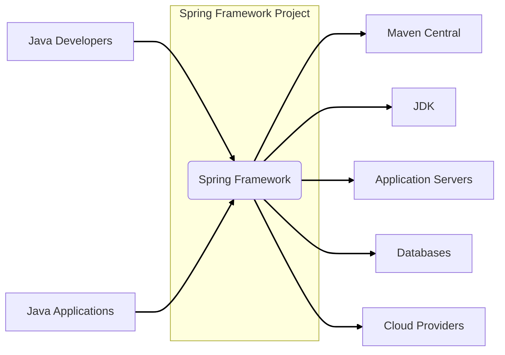

# BUSINESS POSTURE

- Business priorities and goals:
  - To provide a comprehensive and widely adopted open-source framework for building Java applications.
  - To simplify enterprise Java development by offering reusable components and abstractions.
  - To enable developers to build robust, scalable, and maintainable applications efficiently.
  - To foster a strong community around the framework, driving innovation and adoption.
  - To ensure the framework remains relevant and adaptable to evolving technology landscapes.
- Most important business risks:
  - Security vulnerabilities in the framework could impact a vast number of applications built upon it, leading to widespread security incidents and reputational damage.
  - Lack of adoption or developer dissatisfaction could lead to the decline of the framework and impact projects relying on it.
  - Performance bottlenecks or architectural limitations could hinder the ability to build high-performance applications.
  - Incompatibility with new technologies or platforms could limit the framework's future relevance.
  - Open-source nature requires careful community management and contribution governance to maintain quality and direction.

# SECURITY POSTURE

- Existing security controls:
  - security control: Open Source Code - The Spring Framework source code is publicly available on GitHub, allowing for community review and scrutiny. Implemented in: GitHub Repository.
  - security control: Community Security Audits - The large and active community around Spring Framework implicitly contributes to security audits through code review and vulnerability reporting. Implemented in: Community forums, issue trackers.
  - security control: Vulnerability Reporting Process - Spring Security project has a documented process for reporting and handling security vulnerabilities. Described in: Spring Security documentation and security advisories.
  - security control: Regular Security Releases - The Spring team releases patched versions of the framework to address identified security vulnerabilities. Implemented in: Spring project release cycle.
  - security control: Dependency Management - Spring Boot helps manage dependencies, including security-related libraries, potentially simplifying updates and reducing vulnerability exposure. Implemented in: Spring Boot project.
- Accepted risks:
  - accepted risk: Open Source Vulnerability Disclosure - Security vulnerabilities, once discovered, are publicly disclosed, potentially creating a window of opportunity for attackers before patches are widely applied.
  - accepted risk: Reliance on Community Vigilance - The security of the framework relies to some extent on the community to identify and report vulnerabilities.
  - accepted risk: Third-Party Dependency Vulnerabilities - Spring Framework depends on numerous third-party libraries, which may contain their own vulnerabilities that could indirectly affect Spring applications.
- Recommended security controls:
  - security control: Automated Static Application Security Testing (SAST) - Implement automated SAST tools in the build pipeline to detect potential security vulnerabilities in the Spring Framework code itself.
  - security control: Automated Dependency Scanning - Integrate dependency scanning tools to identify known vulnerabilities in third-party libraries used by Spring Framework.
  - security control: Regular Penetration Testing - Conduct periodic penetration testing by security experts to identify vulnerabilities that may not be caught by automated tools or community review.
  - security control: Security Champions Program - Establish a security champions program within the Spring development team to promote security awareness and best practices.
  - security control: Security Incident Response Plan - Develop and maintain a detailed incident response plan specifically for security vulnerabilities discovered in the Spring Framework.
- Security requirements:
  - Authentication:
    - Requirement: Spring Framework should provide robust and flexible mechanisms for application developers to implement authentication in their applications.
    - Implementation: Spring Security project provides comprehensive authentication features.
  - Authorization:
    - Requirement: Spring Framework should offer comprehensive authorization capabilities to control access to application resources based on user roles and permissions.
    - Implementation: Spring Security project provides comprehensive authorization features.
  - Input Validation:
    - Requirement: Spring Framework should encourage and facilitate secure input validation practices to prevent common vulnerabilities like injection attacks.
    - Implementation: Spring Framework provides features like data binding and validation annotations that can be used for input validation.
  - Cryptography:
    - Requirement: Spring Framework should provide secure and easy-to-use cryptographic functionalities for developers who need to implement encryption, hashing, and other cryptographic operations in their applications.
    - Implementation: Spring Security and Spring Framework core provide support for various cryptographic operations and integrations with security providers.

# DESIGN

## C4 CONTEXT



- Context Diagram Elements:
  - - Name: Java Developers
    - Type: Person
    - Description: Software developers who use the Spring Framework to build Java applications.
    - Responsibilities: Develop, test, and deploy Java applications using Spring Framework.
    - Security controls: Code review, secure coding practices, developer workstations security.
  - - Name: Java Applications
    - Type: Software System
    - Description: Applications built using the Spring Framework, deployed in various environments.
    - Responsibilities: Provide business functionality, interact with users and other systems.
    - Security controls: Application-level security controls (authentication, authorization, input validation, etc.), deployment environment security.
  - - Name: Maven Central
    - Type: Software System
    - Description: Public repository for Maven artifacts, where Spring Framework libraries are published and downloaded from.
    - Responsibilities: Host and distribute Spring Framework libraries.
    - Security controls: Repository security (access control, integrity checks), artifact signing.
  - - Name: JDK
    - Type: Software System
    - Description: Java Development Kit, the runtime environment and development tools required to use Spring Framework.
    - Responsibilities: Provide Java runtime environment, compile and execute Java code.
    - Security controls: JDK security updates, secure JDK configuration.
  - - Name: Application Servers
    - Type: Software System
    - Description: Runtime environments where Java applications built with Spring Framework are deployed (e.g., Tomcat, Jetty, WildFly).
    - Responsibilities: Host and execute Java applications, provide runtime services.
    - Security controls: Application server security hardening, access control, security updates.
  - - Name: Databases
    - Type: Software System
    - Description: Data storage systems that Java applications built with Spring Framework interact with (e.g., MySQL, PostgreSQL, Oracle).
    - Responsibilities: Store and manage application data.
    - Security controls: Database security hardening, access control, encryption, data backups.
  - - Name: Cloud Providers
    - Type: Software System
    - Description: Cloud platforms (e.g., AWS, Azure, GCP) where Java applications built with Spring Framework can be deployed and run.
    - Responsibilities: Provide infrastructure and services for deploying and running applications.
    - Security controls: Cloud platform security controls (IAM, network security, data encryption), shared responsibility model.

## C4 CONTAINER

```mermaid
flowchart LR
  subgraph "Spring Framework"
    subgraph "Core Container"
      SpringCore("Spring Core")
      SpringBeans("Spring Beans")
      SpringContext("Spring Context")
      SpringAOP("Spring AOP")
    end
    subgraph "Web and Servlet"
      SpringMVC("Spring MVC")
      SpringWebFlux("Spring WebFlux")
      SpringWebSocket("Spring WebSocket")
    end
    subgraph "Data Access"
      SpringData("Spring Data")
      SpringORM("Spring ORM")
      SpringJDBC("Spring JDBC")
      SpringTX("Spring Transactions")
    end
    subgraph "Security"
      SpringSecurity("Spring Security")
    end
    subgraph "Boot"
      SpringBoot("Spring Boot")
    end
    subgraph "Test"
      SpringTest("Spring Test")
    end
  end

  JavaApplications --> SpringMVC
  JavaApplications --> SpringWebFlux
  JavaApplications --> SpringSecurity
  SpringMVC --> SpringCore
  SpringWebFlux --> SpringCore
  SpringSecurity --> SpringCore
  SpringData --> SpringCore
  SpringBoot --> SpringCore

  linkStyle 0,1,2,3,4,5,6,7,8,9,10,11,12,13,14,15,16,17,18,19,20,21,22,23,24,25,26,27,28,29,30,31,32,33,34,35,36,37,38,39,40,41,42,43,44,45,46,47,48,49,50,51,52,53,54,55,56,57,58,59,60,61,62,63,64,65,66,67,68,69,70,71,72,73,74,75,76,77,78,79,80,81,82,83,84,85,86,87,88,89,90,91,92,93,94,95,96,97,98,99,100,101,102,103,104,105,106,107,108,109,110,111,112,113,114,115,116,117,118,119,120,121,122,123,124,125,126,127,128,129,130,131,132,133,134,135,136,137,138,139,140,141,142,143,144,145,146,147,148,149,150,151,152,153,154,155,156,157,158,159,160,161,162,163,164,165,166,167,168,169,170,171,172,173,174,175,176,177,178,179,180,181,182,183,184,185,186,187,188,189,190,191,192,193,194,195,196,197,198,199,200,201,202,203,204,205,206,207,208,209,210,211,212,213,214,215,216,217,218,219,220,221,222,223,224,225,226,227,228,229,230,231,232,233,234,235,236,237,238,239,240,241,242,243,244,245,246,247,248,249,250,251,252,253,254,255,256,257,258,259,260,261,262,263,264,265,266,267,268,269,270,271,272,273,274,275,276,277,278,279,280,281,282,283,284,285,286,287,288,289,290,291,292,293,294,295,296,297,298,299,300,301,302,303,304,305,306,307,308,309,310,311,312,313,314,315,316,317,318,319,320,321,322,323,324,325,326,327,328,329,330,331,332,333,334,335,336,337,338,339,340,341,342,343,344,345,346,347,348,349,350,351,352,353,354,355,356,357,358,359,360,361,362,363,364,365,366,367,368,369,370,371,372,373,374,375,376,377,378,379,380,381,382,383,384,385,386,387,388,389,390,391,392,393,394,395,396,397,398,399,400,401,402,403,404,405,406,407,408,409,410,411,412,413,414,415,416,417,418,419,420,421,422,423,424,425,426,427,428,429,430,431,432,433,434,435,436,437,438,439,440,441,442,443,444,445,446,447,448,449,450,451,452,453,454,455,456,457,458,459,460,461,462,463,464,465,466,467,468,469,470,471,472,473,474,475,476,477,478,479,480,481,482,483,484,485,486,487,488,489,490,491,492,493,494,495,496,497,498,499,500,501,502,503,504,505,506,507,508,509,510,511,512,513,514,515,516,517,518,519,520,521,522,523,524,525,526,527,528,529,530,531,532,533,534,535,536,537,538,539,540,541,542,543,544,545,546,547,548,549,550,551,552,553,554,555,556,557,558,559,560,561,562,563,564,565,566,567,568,569,570,571,572,573,574,575,576,577,578,579,580,581,582,583,584,585,586,587,588,589,590,591,592,593,594,595,596,597,598,599,600,601,602,603,604,605,606,607,608,609,610,611,612,613,614,615,616,617,618,619,620,621,622,623,624,625,626,627,628,629,630,631,632,633,634,635,636,637,638,639,640,641,642,643,644,645,646,647,648,649,650,651,652,653,654,655,656,657,658,659,660,661,662,663,664,665,666,667,668,669,670,671,672,673,674,675,676,677,678,679,680,681,682,683,684,685,686,687,688,689,690,691,692,693,694,695,696,697,698,699,700,701,702,703,704,705,706,707,708,709,710,711,712,713,714,715,716,717,718,719,720,721,722,723,724,725,726,727,728,729,730,731,732,733,734,735,736,737,738,739,740,741,742,743,744,745,746,747,748,749,750,751,752,753,754,755,756,757,758,759,760,761,762,763,764,765,766,767,768,769,770,771,772,773,774,775,776,777,778,779,780,781,782,783,784,785,786,787,788,789,790,791,792,793,794,795,796,797,798,799,800,801,802,803,804,805,806,807,808,809,810,811,812,813,814,815,816,817,818,819,820,821,822,823,824,825,826,827,828,829,830,831,832,833,834,835,836,837,838,839,840,841,842,843,844,845,846,847,848,849,850,851,852,853,854,855,856,857,858,859,860,861,862,863,864,865,866,867,868,869,870,871,872,873,874,875,876,877,878,879,880,881,882,883,884,885,886,887,888,889,890,891,892,893,894,895,896,897,898,899,900,901,902,903,904,905,906,907,908,909,910,911,912,913,914,915,916,917,918,919,920,921,922,923,924,925,926,927,928,929,930,931,932,933,934,935,936,937,938,939,940,941,942,943,944,945,946,947,948,949,950,951,952,953,954,955,956,957,958,959,960,961,962,963,964,965,966,967,968,969,970,971,972,973,974,975,976,977,978,979,980,981,982,983,984,985,986,987,988,989,990,991,992,993,994,995,996,997,998,999,1000 linkStyle stroke-width:2px,stroke:black;
```

- Container Diagram Elements:
  - - Name: Spring Core
    - Type: Container
    - Description: Provides fundamental functionalities like dependency injection, inversion of control, and event handling.
    - Responsibilities: Core functionalities of the framework, managing application components and their lifecycle.
    - Security controls: Input validation within core components, secure handling of application context.
  - - Name: Spring Beans
    - Type: Container
    - Description: Manages the configuration and lifecycle of Java objects (beans) in a Spring application.
    - Responsibilities: Bean creation, wiring, and management.
    - Security controls: Secure bean configuration, prevention of insecure bean instantiation.
  - - Name: Spring Context
    - Type: Container
    - Description: Provides a runtime environment for Spring applications, managing application configuration and resources.
    - Responsibilities: Application context management, resource loading, internationalization.
    - Security controls: Secure context configuration, access control to application resources.
  - - Name: Spring AOP
    - Type: Container
    - Description: Enables aspect-oriented programming, allowing for cross-cutting concerns like logging and security to be applied declaratively.
    - Responsibilities: Aspect weaving, interception of method calls.
    - Security controls: Secure aspect configuration, prevention of malicious aspect injection.
  - - Name: Spring MVC
    - Type: Container
    - Description: Provides a web framework for building web applications and RESTful APIs.
    - Responsibilities: Handling HTTP requests, routing, request processing, view rendering.
    - Security controls: Input validation, output encoding, protection against web vulnerabilities (XSS, CSRF, injection), integration with Spring Security.
  - - Name: Spring WebFlux
    - Type: Container
    - Description: Provides a reactive web framework for building asynchronous and non-blocking web applications.
    - Responsibilities: Reactive HTTP request handling, non-blocking I/O.
    - Security controls: Input validation, output encoding, protection against web vulnerabilities in reactive context, integration with Spring Security.
  - - Name: Spring WebSocket
    - Type: Container
    - Description: Provides support for WebSocket communication in Spring applications.
    - Responsibilities: Handling WebSocket connections, message exchange.
    - Security controls: WebSocket security (authentication, authorization), input validation of WebSocket messages.
  - - Name: Spring Data
    - Type: Container
    - Description: Simplifies data access and persistence across various data stores (relational, NoSQL, etc.).
    - Responsibilities: Data access abstraction, repository implementation, query generation.
    - Security controls: Secure data access configuration, prevention of data injection vulnerabilities (SQL injection, NoSQL injection), secure connection to databases.
  - - Name: Spring ORM
    - Type: Container
    - Description: Integrates with Object-Relational Mapping (ORM) frameworks like JPA and Hibernate.
    - Responsibilities: ORM integration, entity management, transaction management.
    - Security controls: Secure ORM configuration, prevention of ORM-related vulnerabilities.
  - - Name: Spring JDBC
    - Type: Container
    - Description: Provides JDBC abstraction for database access.
    - Responsibilities: JDBC connection management, query execution.
    - Security controls: Prevention of SQL injection vulnerabilities, secure database connection management.
  - - Name: Spring Transactions
    - Type: Container
    - Description: Provides transaction management capabilities for data operations.
    - Responsibilities: Transaction demarcation, transaction management.
    - Security controls: Secure transaction configuration, proper transaction handling to maintain data integrity.
  - - Name: Spring Security
    - Type: Container
    - Description: Provides comprehensive security features for Spring applications, including authentication, authorization, and protection against common web attacks.
    - Responsibilities: Authentication, authorization, security filters, protection against CSRF, XSS, etc.
    - Security controls: Comprehensive security controls for authentication, authorization, and web security.
  - - Name: Spring Boot
    - Type: Container
    - Description: Simplifies the setup and configuration of Spring applications, providing auto-configuration and embedded servers.
    - Responsibilities: Application bootstrapping, auto-configuration, dependency management, embedded server management.
    - Security controls: Secure default configurations, dependency management to mitigate dependency vulnerabilities, secure embedded server configuration.
  - - Name: Spring Test
    - Type: Container
    - Description: Provides testing support for Spring applications, including unit testing and integration testing.
    - Responsibilities: Testing framework, mocking, test context management.
    - Security controls: Secure testing practices, prevention of test-related vulnerabilities.

## DEPLOYMENT

For simplicity, we will consider a common deployment scenario using an Application Server (e.g., Tomcat) in a traditional on-premise or cloud environment.

```mermaid
flowchart LR
  subgraph "Deployment Environment"
    subgraph "Application Server (Tomcat)"
      ApplicationServerInstance("Tomcat Instance")
      SpringWebApp["Spring Web Application"]
    end
    DatabaseServer("Database Server")
    LoadBalancer("Load Balancer")
    Firewall("Firewall")
  end
  Users["Users"]

  Users --> LoadBalancer
  LoadBalancer --> Firewall
  Firewall --> ApplicationServerInstance
  ApplicationServerInstance --> SpringWebApp
  SpringWebApp --> DatabaseServer

  linkStyle 0,1,2,3,4,5,6,7,8,9,10,11,12,13,14,15,16,17,18,19,20,21,22,23,24,25,26,27,28,29,30,31,32,33,34,35,36,37,38,39,40,41,42,43,44,45,46,47,48,49,50,51,52,53,54,55,56,57,58,59,60,61,62,63,64,65,66,67,68,69,70,71,72,73,74,75,76,77,78,79,80,81,82,83,84,85,86,87,88,89,90,91,92,93,94,95,96,97,98,99,100,101,102,103,104,105,106,107,108,109,110,111,112,113,114,115,116,117,118,119,120,121,122,123,124,125,126,127,128,129,130,131,132,133,134,135,136,137,138,139,140,141,142,143,144,145,146,147,148,149,150,151,152,153,154,155,156,157,158,159,160,161,162,163,164,165,166,167,168,169,170,171,172,173,174,175,176,177,178,179,180,181,182,183,184,185,186,187,188,189,190,191,192,193,194,195,196,197,198,199,200,201,202,203,204,205,206,207,208,209,210,211,212,213,214,215,216,217,218,219,220,221,222,223,224,225,226,227,228,229,230,231,232,233,234,235,236,237,238,239,240,241,242,243,244,245,246,247,248,249,250,251,252,253,254,255,256,257,258,259,260,261,262,263,264,265,266,267,268,269,270,271,272,273,274,275,276,277,278,279,280,281,282,283,284,285,286,287,288,289,290,291,292,293,294,295,296,297,298,299,300,301,302,303,304,305,306,307,308,309,310,311,312,313,314,315,316,317,318,319,320,321,322,323,324,325,326,327,328,329,330,331,332,333,334,335,336,337,338,339,340,341,342,343,344,345,346,347,348,349,350,351,352,353,354,355,356,357,358,359,360,361,362,363,364,365,366,367,368,369,370,371,372,373,374,375,376,377,378,379,380,381,382,383,384,385,386,387,388,389,390,391,392,393,394,395,396,397,398,399,400,401,402,403,404,405,406,407,408,409,410,411,412,413,414,415,416,417,418,419,420,421,422,423,424,425,426,427,428,429,430,431,432,433,434,435,436,437,438,439,440,441,442,443,444,445,446,447,448,449,450,451,452,453,454,455,456,457,458,459,460,461,462,463,464,465,466,467,468,469,470,471,472,473,474,475,476,477,478,479,480,481,482,483,484,485,486,487,488,489,490,491,492,493,494,495,496,497,498,499,500,501,502,503,504,505,506,507,508,509,510,511,512,513,514,515,516,517,518,519,520,521,522,523,524,525,526,527,528,529,530,531,532,533,534,535,536,537,538,539,540,541,542,543,544,545,546,547,548,549,550,551,552,553,554,555,556,557,558,559,560,561,562,563,564,565,566,567,568,569,570,571,572,573,574,575,576,577,578,579,580,581,582,583,584,585,586,587,588,589,590,591,592,593,594,595,596,597,598,599,600,601,602,603,604,605,606,607,608,609,610,611,612,613,614,615,616,617,618,619,620,621,622,623,624,625,626,627,628,629,630,631,632,633,634,635,636,637,638,639,640,641,642,643,644,645,646,647,648,649,650,651,652,653,654,655,656,657,658,659,660,661,662,663,664,665,666,667,668,669,670,671,672,673,674,675,676,677,678,679,680,681,682,683,684,685,686,687,688,689,690,691,692,693,694,695,696,697,698,699,700,701,702,703,704,705,706,707,708,709,710,711,712,713,714,715,716,717,718,719,720,721,722,723,724,725,726,727,728,729,730,731,732,733,734,735,736,737,738,739,740,741,742,743,744,745,746,747,748,749,750,751,752,753,754,755,756,757,758,759,760,761,762,763,764,765,766,767,768,769,770,771,772,773,774,775,776,777,778,779,780,781,782,783,784,785,786,787,788,789,790,791,792,793,794,795,796,797,798,799,800,801,802,803,804,805,806,807,808,809,810,811,812,813,814,815,816,817,818,819,820,821,822,823,824,825,826,827,828,829,830,831,832,833,834,835,836,837,838,839,840,841,842,843,844,845,846,847,848,849,850,851,852,853,854,855,856,857,858,859,860,861,862,863,864,865,866,867,868,869,870,871,872,873,874,875,876,877,878,879,880,881,882,883,884,885,886,887,888,889,890,891,892,893,894,895,896,897,898,899,900,901,902,903,904,905,906,907,908,909,910,911,912,913,914,915,916,917,918,919,920,921,922,923,924,925,926,927,928,929,930,931,932,933,934,935,936,937,938,939,940,941,942,943,944,945,946,947,948,949,950,951,952,953,954,955,956,957,958,959,960,961,962,963,964,965,966,967,968,969,970,971,972,973,974,975,976,977,978,979,980,981,982,983,984,985,986,987,988,989,990,991,992,993,994,995,996,997,998,999,1000 linkStyle stroke-width:2px,stroke:black;
```

- Deployment Diagram Elements:
  - - Name: Users
    - Type: Person
    - Description: End-users accessing the Spring Web Application.
    - Responsibilities: Interact with the application to perform business functions.
    - Security controls: User authentication, session management, access control enforced by the Spring Web Application and Spring Security.
  - - Name: Load Balancer
    - Type: Infrastructure
    - Description: Distributes incoming user traffic across multiple Application Server Instances for scalability and availability.
    - Responsibilities: Traffic distribution, health checks, SSL termination (optional).
    - Security controls: SSL/TLS termination, DDoS protection, access control to management interfaces.
  - - Name: Firewall
    - Type: Infrastructure
    - Description: Network firewall to control inbound and outbound traffic, protecting the Application Server and Database Server.
    - Responsibilities: Network traffic filtering, intrusion prevention.
    - Security controls: Network access control lists (ACLs), intrusion detection/prevention system (IDS/IPS).
  - - Name: Application Server Instance (Tomcat)
    - Type: Infrastructure
    - Description: Instance of Tomcat application server running the Spring Web Application.
    - Responsibilities: Host and execute the Spring Web Application, handle requests, interact with the database.
    - Security controls: Operating system hardening, application server hardening, regular security patching, access control, monitoring and logging.
  - - Name: Spring Web Application
    - Type: Software System
    - Description: The Java web application built using Spring Framework, deployed within the Tomcat Application Server.
    - Responsibilities: Implement business logic, handle user requests, interact with the database, enforce application security.
    - Security controls: Spring Security for authentication and authorization, input validation, output encoding, secure session management, vulnerability scanning.
  - - Name: Database Server
    - Type: Infrastructure
    - Description: Database server (e.g., MySQL, PostgreSQL) storing application data.
    - Responsibilities: Data storage and retrieval, data integrity, data backups.
    - Security controls: Database server hardening, access control, encryption at rest and in transit, regular security patching, database activity monitoring.

## BUILD

```mermaid
flowchart LR
  Developer["Developer"] --> GitRepository["Git Repository (GitHub)"]
  GitRepository --> BuildSystem["Build System (GitHub Actions)"]
  BuildSystem --> Maven["Maven Build"]
  Maven --> SAST["SAST Scanner"]
  Maven --> DependencyCheck["Dependency Check"]
  SAST --> BuildArtifacts["Build Artifacts"]
  DependencyCheck --> BuildArtifacts
  BuildArtifacts --> MavenCentralPublish["Maven Central (Publish)"]

  style GitRepository fill:#f9f,stroke:#333,stroke-width:2px
  style BuildSystem fill:#ccf,stroke:#333,stroke-width:2px
  style Maven fill:#cfc,stroke:#333,stroke-width:2px
  style SAST fill:#fcc,stroke:#333,stroke-width:2px
  style DependencyCheck fill:#fcc,stroke:#333,stroke-width:2px
  style BuildArtifacts fill:#eee,stroke:#333,stroke-width:2px
  style MavenCentralPublish fill:#eee,stroke:#333,stroke-width:2px

  linkStyle 0,1,2,3,4,5,6,7,8,9,10,11,12,13,14,15,16,17,18,19,20,21,22,23,24,25,26,27,28,29,30,31,32,33,34,35,36,37,38,39,40,41,42,43,44,45,46,47,48,49,50,51,52,53,54,55,56,57,58,59,60,61,62,63,64,65,66,67,68,69,70,71,72,73,74,75,76,77,78,79,80,81,82,83,84,85,86,87,88,89,90,91,92,93,94,95,96,97,98,99,100,101,102,103,104,105,106,107,108,109,110,111,112,113,114,115,116,117,118,119,120,121,122,123,124,125,126,127,128,129,130,131,132,133,134,135,136,137,138,139,140,141,142,143,144,145,146,147,148,149,150,151,152,153,154,155,156,157,158,159,160,161,162,163,164,165,166,167,168,169,170,171,172,173,174,175,176,177,178,179,180,181,182,183,184,185,186,187,188,189,190,191,192,193,194,195,196,197,198,199,200,201,202,203,204,205,206,207,208,209,210,211,212,213,214,215,216,217,218,219,220,221,222,223,224,225,226,227,228,229,230,231,232,233,234,235,236,237,238,239,240,241,242,243,244,245,246,247,248,249,250,251,252,253,254,255,256,257,258,259,260,261,262,263,264,265,266,267,268,269,270,271,272,273,274,275,276,277,278,279,280,281,282,283,284,285,286,287,288,289,290,291,292,293,294,295,296,297,298,299,300,301,302,303,304,305,306,307,308,309,310,311,312,313,314,315,316,317,318,319,320,321,322,323,324,325,326,327,328,329,330,331,332,333,334,335,336,337,338,339,340,341,342,343,344,345,346,347,348,349,350,351,352,353,354,355,356,357,358,359,360,361,362,363,364,365,366,367,368,369,370,371,372,373,374,375,376,377,378,379,380,381,382,383,384,385,386,387,388,389,390,391,392,393,394,395,396,397,398,399,400,401,402,403,404,405,406,407,408,409,410,411,412,413,414,415,416,417,418,419,420,421,422,423,424,425,426,427,428,429,430,431,432,433,434,435,436,437,438,439,440,441,442,443,444,445,446,447,448,449,450,451,452,453,454,455,456,457,458,459,460,461,462,463,464,465,466,467,468,469,470,471,472,473,474,475,476,477,478,479,480,481,482,483,484,485,486,487,488,489,490,491,492,493,494,495,496,497,498,499,500,501,502,503,504,505,506,507,508,509,510,511,512,513,514,515,516,517,518,519,520,521,522,523,524,525,526,527,528,529,530,531,532,533,534,535,536,537,538,539,540,541,542,543,544,545,546,547,548,549,550,551,552,553,554,555,556,557,558,559,560,561,562,563,564,565,566,567,568,569,570,571,572,573,574,575,576,577,578,579,580,581,582,583,584,585,586,587,588,589,590,591,592,593,594,595,596,597,598,599,600,601,602,603,604,605,606,607,608,609,610,611,612,613,614,615,616,617,618,619,620,621,622,623,624,625,626,627,628,629,630,631,632,633,634,635,636,637,638,639,640,641,642,643,644,645,646,647,648,649,650,651,652,653,654,655,656,657,658,659,660,661,662,663,664,665,666,667,668,669,670,671,672,673,674,675,676,677,678,679,680,681,682,683,684,685,686,687,688,689,690,691,692,693,694,695,696,697,698,699,700,701,702,703,704,705,706,707,708,709,710,711,712,713,714,715,716,717,718,719,720,721,722,723,724,725,726,727,728,729,730,731,732,733,734,735,736,737,738,739,740,741,742,743,744,745,746,747,748,749,750,751,752,753,754,755,756,757,758,759,760,761,762,763,764,765,766,767,768,769,770,771,772,773,774,775,776,777,778,779,780,781,782,783,784,785,786,787,788,789,790,791,792,793,794,795,796,797,798,799,800,801,802,803,804,805,806,807,808,809,810,811,812,813,814,815,816,817,818,819,820,821,822,823,824,825,826,827,828,829,830,831,832,833,834,835,836,837,838,839,840,841,842,843,844,845,846,847,848,849,850,851,852,853,854,855,856,857,858,859,860,861,862,863,864,865,866,867,868,869,870,871,872,873,874,875,876,877,878,879,880,881,882,883,884,885,886,887,888,889,890,891,892,893,894,895,896,897,898,899,900,901,902,903,904,905,906,907,908,909,910,911,912,913,914,915,916,917,918,919,920,921,922,923,924,925,926,927,928,929,930,931,932,933,934,935,936,937,938,939,940,941,942,943,944,945,946,947,948,949,950,951,952,953,954,955,956,957,958,959,960,961,962,963,964,965,966,967,968,969,970,971,972,973,974,975,976,977,978,979,980,981,982,983,984,985,986,987,988,989,990,991,992,993,994,995,996,997,998,999,1000 linkStyle stroke-width:2px,stroke:black;
```

- Build Diagram Elements:
  - - Name: Developer
    - Type: Person
    - Description: Software developer contributing to the Spring Framework project.
    - Responsibilities: Write code, commit changes, create pull requests.
    - Security controls: Developer workstation security, code review process, secure coding training.
  - - Name: Git Repository (GitHub)
    - Type: Software System
    - Description: GitHub repository hosting the Spring Framework source code.
    - Responsibilities: Version control, source code management, collaboration platform.
    - Security controls: Access control (authentication, authorization), branch protection, audit logging, vulnerability scanning of repository infrastructure.
  - - Name: Build System (GitHub Actions)
    - Type: Software System
    - Description: Automated build system using GitHub Actions for CI/CD.
    - Responsibilities: Automate build, test, and deployment processes.
    - Security controls: Secure build pipeline configuration, access control to build system, secret management for credentials, build environment security.
  - - Name: Maven Build
    - Type: Software System
    - Description: Maven build tool used to compile, package, and test the Spring Framework.
    - Responsibilities: Dependency management, compilation, packaging, unit testing, integration testing.
    - Security controls: Dependency management (vulnerability scanning), build process hardening, secure plugin management.
  - - Name: SAST Scanner
    - Type: Software System
    - Description: Static Application Security Testing tool integrated into the build pipeline.
    - Responsibilities: Analyze source code for potential security vulnerabilities.
    - Security controls: SAST tool configuration, vulnerability reporting, integration with build pipeline to fail builds on critical findings.
  - - Name: Dependency Check
    - Type: Software System
    - Description: Dependency checking tool to identify known vulnerabilities in third-party libraries.
    - Responsibilities: Scan dependencies for known vulnerabilities, generate reports.
    - Security controls: Dependency check tool configuration, vulnerability reporting, integration with build pipeline to fail builds on critical findings.
  - - Name: Build Artifacts
    - Type: Data Store
    - Description: Compiled JAR files and other build outputs.
    - Responsibilities: Store build artifacts, make them available for publishing.
    - Security controls: Access control to build artifacts, integrity checks, secure storage.
  - - Name: Maven Central (Publish)
    - Type: Software System
    - Description: Publishing build artifacts to Maven Central repository.
    - Responsibilities: Distribute Spring Framework libraries to the public.
    - Security controls: Secure publishing process, artifact signing, access control to publishing credentials.

# RISK ASSESSMENT

- Critical business process we are trying to protect:
  - Development and distribution of the Spring Framework, ensuring its integrity, availability, and security for the global Java developer community and applications built upon it.
- Data we are trying to protect and their sensitivity:
  - Source code: Highly sensitive. Compromise could lead to vulnerabilities in the framework and all applications using it.
  - Build artifacts (JAR files): Medium sensitivity. Compromised artifacts could be distributed and used in applications, leading to widespread impact.
  - Build system credentials and secrets: Highly sensitive. Compromise could allow unauthorized modifications to the build process and artifact distribution.
  - Vulnerability reports: Sensitive. Premature disclosure could be exploited by attackers.

# QUESTIONS & ASSUMPTIONS

- Questions:
  - What is the target audience for this design document? Is it for the Spring team, security auditors, or application developers using Spring?
  - Are there any specific deployment environments or scenarios that should be prioritized for threat modeling?
  - What level of detail is required for the threat model that will follow this design document?
  - Are there any specific regulatory compliance requirements that are relevant to the Spring Framework project?
- Assumptions:
  - The Spring Framework project prioritizes security and aims to provide a secure foundation for building Java applications.
  - The project follows a secure software development lifecycle, including security considerations in design, development, testing, and deployment.
  - The project has a dedicated security team or individuals responsible for security aspects of the framework.
  - The project values community contributions and leverages the community for security reviews and vulnerability reporting.
  - The deployment scenario described (Application Server in a traditional environment) is representative of a common use case for Spring applications.