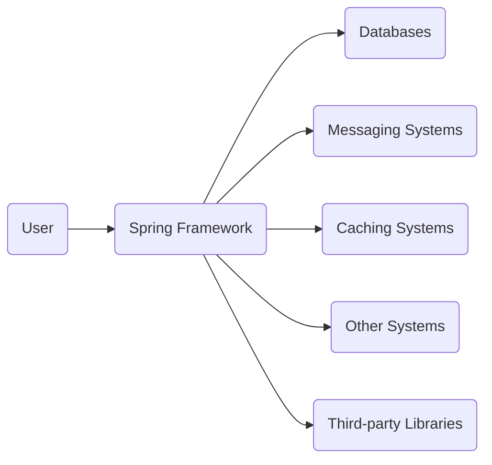
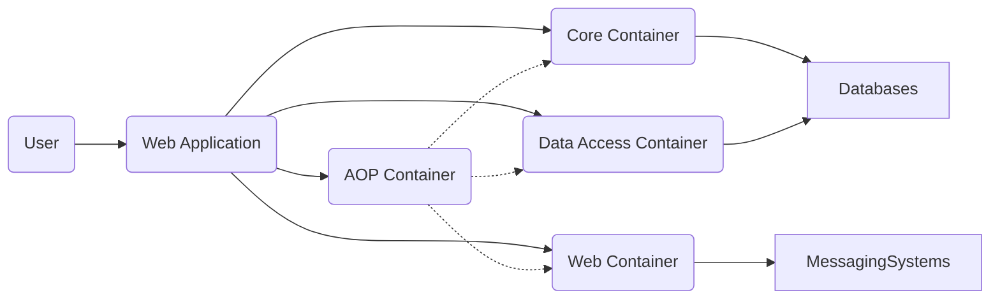
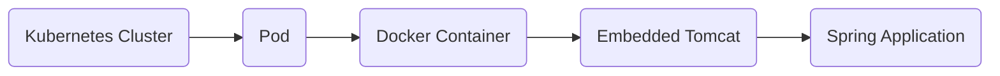
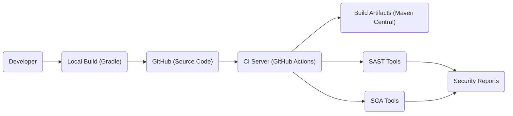

# BUSINESS POSTURE

The Spring Framework is a foundational piece of infrastructure for a vast number of Java applications, ranging from small startups to large enterprises. Its primary business goal is to simplify Java enterprise development and enable developers to build high-performing, easily testable, and maintainable applications.

Business priorities:

- Maintain backward compatibility where possible, minimizing disruption to existing applications.
- Provide a stable and reliable framework for building enterprise applications.
- Enable developers to focus on business logic rather than infrastructure concerns.
- Adapt to evolving technology trends and integrate with new technologies.
- Foster a large and active community to ensure long-term support and growth.
- Reduce development time and cost.
- Improve application performance and scalability.

Business risks:

- Security vulnerabilities in the framework could have widespread impact, affecting a large number of applications.
- Inability to adapt to new technologies could lead to obsolescence.
- Breaking changes could disrupt existing applications and damage the framework's reputation.
- Loss of community support could hinder long-term maintenance and development.
- Competition from alternative frameworks could reduce market share.

# SECURITY POSTURE

The Spring Framework has a mature security model and incorporates numerous security features. It also has a dedicated security sub-project, Spring Security, that provides comprehensive authentication and authorization capabilities.

Existing security controls:

- security control: Spring Security sub-project provides comprehensive authentication and authorization mechanisms. (Described in Spring Security documentation and implemented in Spring Security module).
- security control: Input validation support through JSR-303/JSR-349 Bean Validation and Spring's own validation framework. (Described in Spring Framework documentation and implemented in various modules).
- security control: Protection against common web vulnerabilities like Cross-Site Scripting (XSS), Cross-Site Request Forgery (CSRF), and Session Fixation. (Described in Spring Security documentation and implemented in Spring Security module).
- security control: Support for secure communication protocols like HTTPS and TLS. (Described in Spring Framework and Spring Security documentation and implemented in various modules).
- security control: Regular security audits and penetration testing. (Described in Spring Security documentation).
- security control: Prompt response to reported vulnerabilities and timely release of security patches. (Described in Spring Security documentation).
- security control: Secure coding guidelines and best practices for developers using the framework. (Described in Spring Framework and Spring Security documentation).
- security control: Dependency management to minimize the risk of using vulnerable third-party libraries. (Implemented in build process).

Accepted risks:

- accepted risk: The framework relies on developers to properly configure and use its security features. Misconfiguration or improper use could lead to vulnerabilities.
- accepted risk: While the framework strives to minimize dependencies, it still relies on third-party libraries, which could introduce vulnerabilities.
- accepted risk: Zero-day vulnerabilities are always a possibility, although the Spring team has a strong track record of addressing them quickly.

Recommended security controls:

- Implement Software Composition Analysis (SCA) to continuously monitor and manage third-party dependencies for known vulnerabilities.
- Integrate Static Application Security Testing (SAST) and Dynamic Application Security Testing (DAST) into the build pipeline.

Security Requirements:

- Authentication:
    - Support for various authentication mechanisms, including username/password, OAuth 2.0, OpenID Connect, and SAML.
    - Secure storage of user credentials using strong hashing algorithms.
    - Protection against brute-force attacks.
    - Multi-factor authentication (MFA) support.
- Authorization:
    - Role-Based Access Control (RBAC) and Attribute-Based Access Control (ABAC).
    - Fine-grained access control to resources and functionalities.
    - Support for external authorization providers.
- Input Validation:
    - Validate all user inputs to prevent injection attacks (SQL injection, XSS, etc.).
    - Use a whitelist approach to define allowed input patterns.
    - Sanitize user inputs to remove potentially harmful characters.
- Cryptography:
    - Use strong encryption algorithms for sensitive data at rest and in transit.
    - Secure key management practices.
    - Support for digital signatures.

# DESIGN

## C4 CONTEXT

- User:
    - Name: User
    - Type: Person
    - Description: Represents any user interacting with an application built using the Spring Framework.
    - Responsibilities: Interacts with the application, providing input and receiving output.
    - Security controls: Authentication and authorization are typically handled by the application built on the Spring Framework, not the user directly.
- Spring Framework:
    - Name: Spring Framework
    - Type: Software System
    - Description: The core framework providing dependency injection, aspect-oriented programming, transaction management, and other features.
    - Responsibilities: Provides the foundation for building enterprise Java applications.
    - Security controls: Implements various security features, including input validation, secure communication, and integration with Spring Security.
- Databases:
    - Name: Databases
    - Type: System
    - Description: Represents various database systems used by Spring applications (e.g., relational databases, NoSQL databases).
    - Responsibilities: Stores and retrieves application data.
    - Security controls: Database security is typically managed by the database system itself (access controls, encryption, etc.). Spring Data provides secure ways to interact with databases.
- Messaging Systems:
    - Name: Messaging Systems
    - Type: System
    - Description: Represents messaging systems used for asynchronous communication (e.g., JMS, RabbitMQ, Kafka).
    - Responsibilities: Facilitates communication between different parts of the application or between different applications.
    - Security controls: Messaging systems typically provide their own security mechanisms (authentication, authorization, encryption). Spring provides integration with these mechanisms.
- Caching Systems:
    - Name: Caching Systems
    - Type: System
    - Description: Represents caching systems used to improve performance (e.g., Redis, Memcached).
    - Responsibilities: Stores frequently accessed data in memory for faster retrieval.
    - Security controls: Caching systems may have their own security features, but data sensitivity should be considered when caching.
- Other Systems:
    - Name: Other Systems
    - Type: System
    - Description: Represents any other external systems that the Spring application interacts with (e.g., web services, APIs).
    - Responsibilities: Varies depending on the specific system.
    - Security controls: Security depends on the specific system and the communication protocols used. Spring provides tools for secure communication (e.g., HTTPS).
- Third-Party Libraries:
    - Name: Third-party Libraries
    - Type: System
    - Description: Libraries that are used by Spring Framework.
    - Responsibilities: Provide additional functionality.
    - Security controls: Security depends on the specific library. Spring Framework build process uses dependency management to minimize the risk of using vulnerable third-party libraries.

## C4 CONTAINER

- User:
    - Name: User
    - Type: Person
    - Description: Represents any user interacting with the web application.
    - Responsibilities: Interacts with the application, providing input and receiving output.
    - Security controls: Authentication and authorization are typically handled by the Web Application container, often using Spring Security.
- Web Application:
    - Name: Web Application
    - Type: Container
    - Description: Represents the overall application built using the Spring Framework. This is a logical container representing the deployed application.
    - Responsibilities: Handles user requests, processes business logic, interacts with data sources, and returns responses.
    - Security controls: Implements application-level security, including authentication, authorization, input validation, and protection against web vulnerabilities. Leverages Spring Security extensively.
- Core Container:
    - Name: Core Container
    - Type: Container
    - Description: Provides the core functionality of the Spring Framework, including dependency injection (IoC), and basic building blocks.
    - Responsibilities: Manages object creation, configuration, and lifecycle.
    - Security controls: Provides foundational security features and integration points for other security mechanisms.
- Data Access Container:
    - Name: Data Access Container
    - Type: Container
    - Description: Provides abstractions for interacting with databases (e.g., Spring Data, JDBC, ORM support).
    - Responsibilities: Simplifies data access operations and provides transaction management.
    - Security controls: Helps prevent SQL injection through parameterized queries and proper use of ORM frameworks.
- Web Container:
    - Name: Web Container
    - Type: Container
    - Description: Provides web-related functionality (e.g., Spring MVC, REST controllers).
    - Responsibilities: Handles HTTP requests and responses, manages web controllers, and renders views.
    - Security controls: Implements web-specific security measures, such as CSRF protection, XSS prevention, and secure session management.
- AOP Container:
    - Name: AOP Container
    - Type: Container
    - Description: Provides aspect-oriented programming capabilities.
    - Responsibilities: Enables cross-cutting concerns like logging, security, and transaction management to be implemented in a modular way.
    - Security controls: Can be used to implement security aspects, such as authorization checks, before or after method execution.
- Databases:
    - Name: Databases
    - Type: System
    - Description: External database systems.
    - Responsibilities: Data storage and retrieval.
    - Security controls: Database-level security controls.
- Messaging Systems:
    - Name: Messaging Systems
    - Type: System
    - Description: External messaging systems.
    - Responsibilities: Asynchronous communication.
    - Security controls: Messaging system security controls.

## DEPLOYMENT

The Spring Framework itself is a library, not a deployable artifact. Applications built with Spring can be deployed in various ways:

Possible deployment solutions:

1.  Standalone JAR: Executed directly with `java -jar`.
2.  WAR file: Deployed to a traditional Java EE application server (Tomcat, Jetty, WildFly, etc.).
3.  Embedded Server: Packaged with an embedded server (Tomcat, Jetty, Undertow) and executed as a standalone application.
4.  Cloud Platforms: Deployed to cloud platforms like AWS, Azure, Google Cloud, or Kubernetes.
5.  Serverless: Deployed as serverless functions (AWS Lambda, Azure Functions, Google Cloud Functions).

Chosen deployment solution (example: Embedded Tomcat in a Docker container on Kubernetes):

- Kubernetes Cluster:
    - Name: Kubernetes Cluster
    - Type: Infrastructure Node
    - Description: The cluster managing the containerized application.
    - Responsibilities: Orchestrates the deployment, scaling, and management of the application.
    - Security controls: Kubernetes provides various security features, including network policies, role-based access control (RBAC), and secrets management.
- Pod:
    - Name: Pod
    - Type: Infrastructure Node
    - Description: A Kubernetes Pod representing a single instance of the application.
    - Responsibilities: Runs the Docker container containing the application.
    - Security controls: Pod security policies can be used to control the security context of the Pod.
- Docker Container:
    - Name: Docker Container
    - Type: Container
    - Description: A Docker container packaging the Spring application and its dependencies, including the embedded Tomcat server.
    - Responsibilities: Provides a consistent and isolated runtime environment for the application.
    - Security controls: Docker security best practices should be followed, including using minimal base images, scanning for vulnerabilities, and limiting container privileges.
- Embedded Tomcat:
    - Name: Embedded Tomcat
    - Type: Container
    - Description: An embedded Tomcat server running within the Docker container.
    - Responsibilities: Serves the Spring application.
    - Security controls: Tomcat's security features should be configured appropriately, including secure connectors and appropriate valve configurations.
- Spring Application:
    - Name: Spring Application
    - Type: Application
    - Description: The application built using the Spring Framework.
    - Responsibilities: Handles business logic and user requests.
    - Security controls: Implements application-level security using Spring Security and other security mechanisms.

## BUILD

The Spring Framework build process is complex and involves multiple modules and build tools. It uses Gradle as the primary build system.

- Developer:
    - Name: Developer
    - Type: Person
    - Description: A developer working on the Spring Framework.
    - Responsibilities: Writes code, tests, and documentation.
    - Security controls: Follows secure coding guidelines and best practices.
- Local Build (Gradle):
    - Name: Local Build (Gradle)
    - Type: Process
    - Description: The developer's local build environment using Gradle.
    - Responsibilities: Compiles code, runs tests, and builds local artifacts.
    - Security controls: Developers should use secure coding practices and run local security checks (e.g., linters, static analysis).
- GitHub (Source Code):
    - Name: GitHub (Source Code)
    - Type: System
    - Description: The source code repository hosted on GitHub.
    - Responsibilities: Stores the source code and manages version control.
    - Security controls: GitHub provides access controls and security features to protect the repository.
- CI Server (GitHub Actions):
    - Name: CI Server (GitHub Actions)
    - Type: System
    - Description: The continuous integration server using GitHub Actions.
    - Responsibilities: Automates the build, test, and release process.
    - Security controls: The CI pipeline includes security checks, such as SAST and SCA.
- Build Artifacts (Maven Central):
    - Name: Build Artifacts (Maven Central)
    - Type: System
    - Description: The repository where the built artifacts (JAR files) are published.
    - Responsibilities: Stores and distributes the released artifacts.
    - Security controls: Maven Central has its own security measures to ensure the integrity of the artifacts.
- SAST Tools:
    - Name: SAST Tools
    - Type: System
    - Description: Static Application Security Testing tools used to analyze the source code for vulnerabilities.
    - Responsibilities: Identifies potential security flaws in the code.
    - Security controls: The SAST tools themselves should be kept up-to-date and configured correctly.
- SCA Tools:
    - Name: SCA Tools
    - Type: System
    - Description: Software Composition Analysis tools used to identify vulnerabilities in third-party dependencies.
    - Responsibilities: Scans the project's dependencies for known vulnerabilities.
    - Security controls: The SCA tools should be regularly updated with the latest vulnerability databases.
- Security Reports:
    - Name: Security Reports
    - Type: System
    - Description: Reports generated by SAST and SCA tools.
    - Responsibilities: Provides information about identified vulnerabilities.
    - Security controls: Access to security reports should be restricted to authorized personnel.

# RISK ASSESSMENT

Critical Business Processes:

- Application Development: The Spring Framework is critical for enabling developers to build and deploy applications. Any vulnerabilities or instability in the framework directly impact the development process.
- Application Runtime: Applications running on the Spring Framework rely on its stability and security. Vulnerabilities could lead to application downtime, data breaches, or other disruptions.

Data Sensitivity:

- The Spring Framework itself does not directly handle sensitive data. However, applications built using Spring often process various types of data, including:
    - Personally Identifiable Information (PII): User data, customer information, etc. (High sensitivity)
    - Financial Data: Payment information, transaction details, etc. (High sensitivity)
    - Authentication Credentials: Usernames, passwords, API keys, etc. (High sensitivity)
    - Business Data: Proprietary data, intellectual property, etc. (Variable sensitivity, depending on the specific data)
    - Configuration Data: Database credentials, API keys, etc. (High sensitivity)

# QUESTIONS & ASSUMPTIONS

Questions:

- What specific SAST and SCA tools are currently used in the Spring Framework build process?
- What is the exact process for handling reported security vulnerabilities?
- Are there any specific compliance requirements (e.g., PCI DSS, HIPAA) that need to be considered for applications built using Spring?
- What are the specific security training requirements for developers contributing to the Spring Framework?

Assumptions:

- Business Posture: The Spring Framework team prioritizes security and has a strong commitment to addressing vulnerabilities promptly.
- Security Posture: The existing security controls described in the Spring documentation are accurately implemented and maintained.
- Design: The provided C4 diagrams are a reasonable representation of the Spring Framework's architecture and deployment, although specific implementations may vary. The build process assumption is based on common practices and may not reflect the exact details of the Spring Framework's build pipeline.