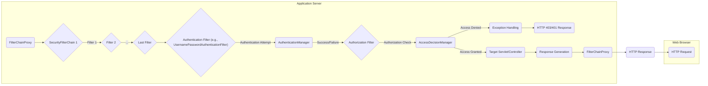

## Project Design Document: Spring Security (Improved)

**1. Introduction**

This document provides an enhanced architectural design overview of the Spring Security project, based on the information available in the provided GitHub repository: [https://github.com/spring-projects/spring-security](https://github.com/spring-projects/spring-security). This improved document aims to provide a more detailed and structured foundation for subsequent threat modeling activities. It elaborates on the key components, functionalities, and data flows within the Spring Security framework, utilizing tables and Mermaid diagrams for enhanced clarity.

**2. Goals and Objectives**

The primary goal of Spring Security is to deliver a robust and adaptable security framework for Java-based enterprise applications, particularly those leveraging the Spring Framework. Key objectives include:

* **Comprehensive Authentication:**  Providing diverse mechanisms for verifying the identity of users or principals seeking access.
* **Fine-Grained Authorization:** Enabling precise control over resource access and actions based on user permissions.
* **Proactive Web Attack Mitigation:** Implementing built-in defenses against prevalent web vulnerabilities.
* **Seamless Spring Integration:**  Ensuring smooth interoperability with other Spring components through dependency injection and Aspect-Oriented Programming (AOP).
* **Extensibility and Customization:**  Offering a flexible architecture that allows developers to tailor security behavior and integrate with various identity providers.
* **Standard Protocol Support:**  Providing native support for industry-standard security protocols.

**3. System Architecture**

Spring Security's architecture is centered around a chain of responsibility pattern, primarily realized through Servlet Filters for web applications and AOP for method-level security.

* **Core Architectural Concepts:**
    * **Security Context:**  Represents the security information of the current execution, including the authenticated principal and their granted authorities. Managed by `SecurityContextHolder`.
    * **Authentication Process:** The procedure for verifying a user's identity. Orchestrated by `AuthenticationManager` implementations.
    * **Authorization Process:** The procedure for determining if an authenticated user has the necessary permissions. Managed by `AccessDecisionManager` implementations.
    * **Principal:** An abstraction representing the currently authenticated user or entity.
    * **Granted Authority:** Represents a permission or role granted to a principal.

* **Web Security Architecture Breakdown:**
    * **`FilterChainProxy`:** The central entry point for Spring Security in web applications. It acts as a `Servlet Filter` and delegates to a chain of `SecurityFilterChain` instances.
    * **`SecurityFilterChain`:** An ordered collection of individual `Filter` instances that are applied sequentially to incoming HTTP requests. Each chain typically handles a specific set of request patterns.
    * **Individual `Filter` Components:**  Specialized components responsible for specific security tasks within the filter chain.

* **Method Security Architecture Overview:**
    * **Annotation-Based Security:** Securing individual methods using annotations (e.g., `@PreAuthorize`, `@PostAuthorize`).
    * **Aspect-Oriented Enforcement:** Spring's AOP framework intercepts method calls to enforce security constraints defined by annotations or configuration.

**4. Key Components and Functionality**

| Component Category        | Component Example                      | Description                                                                                                                               |
|-------------------------|---------------------------------------|-------------------------------------------------------------------------------------------------------------------------------------------|
| **Authentication**      | `UsernamePasswordAuthenticationFilter` | Extracts username and password from a login request and attempts authentication.                                                        |
|                         | `BasicAuthenticationFilter`            | Handles HTTP Basic Authentication by extracting credentials from the `Authorization` header.                                            |
|                         | `OAuth2LoginAuthenticationFilter`      | Handles the OAuth 2.0 authorization code grant flow for login.                                                                            |
| **Authorization**       | `AuthorizationFilter`                  | Makes authorization decisions based on the authenticated user's authorities and the requested resource.                                  |
|                         | `PreAuthorize` Annotation              | An annotation used to specify authorization rules that must be met before a method can be executed.                                     |
| **Session Management**  | `SessionManagementFilter`              | Manages user sessions, including session fixation protection and concurrent session control.                                             |
| **CSRF Protection**     | `CsrfFilter`                           | Protects against Cross-Site Request Forgery attacks by verifying the presence and validity of a CSRF token.                               |
| **Exception Handling**  | `ExceptionTranslationFilter`           | Handles Spring Security exceptions and converts them into appropriate HTTP responses (e.g., 401 Unauthorized, 403 Forbidden).             |
| **Header Security**     | `HstsHeaderWriter`                     | Adds the `Strict-Transport-Security` header to enforce HTTPS connections.                                                                 |
| **Security Context**    | `SecurityContextHolder`                | Provides access to the `SecurityContext` associated with the current thread of execution.                                                |
| **Authentication Logic** | `ProviderManager`                      | A central `AuthenticationManager` that delegates to a chain of `AuthenticationProvider` instances.                                       |
|                         | `DaoAuthenticationProvider`            | An `AuthenticationProvider` that authenticates users against a `UserDetailsService`.                                                    |
| **User Details**        | `UserDetailsService`                   | An interface responsible for retrieving user information (username, password, authorities) based on a username.                         |
| **Access Decisions**    | `AffirmativeBased`                     | An `AccessDecisionManager` that grants access if at least one voter votes to grant access.                                                |
|                         | `RoleVoter`                            | An `AccessDecisionVoter` that checks if the user has the required role.                                                                   |

**5. Data Flow (Typical Web Request)**

**Detailed Data Flow Steps:**

1. **HTTP Request Received:** The web browser sends an HTTP request to the application server.
2. **`FilterChainProxy` Invoked:** The `FilterChainProxy` Servlet Filter intercepts the request.
3. **`SecurityFilterChain` Selection:** The `FilterChainProxy` determines the appropriate `SecurityFilterChain` to apply based on the request URL.
4. **Filter Chain Execution:** The filters within the selected `SecurityFilterChain` are executed sequentially.
    * **Initial Filters:**  Filters like `SecurityContextPersistenceFilter` load security context information.
    * **Authentication Attempt:** An authentication filter (e.g., `UsernamePasswordAuthenticationFilter`, `BasicAuthenticationFilter`) attempts to authenticate the user based on request information.
    * **`AuthenticationManager` Interaction:** The authentication filter delegates to the `AuthenticationManager` (typically a `ProviderManager`).
    * **`AuthenticationProvider` Selection:** The `ProviderManager` iterates through registered `AuthenticationProvider` instances to find one that can handle the authentication request.
    * **Authentication:** The selected `AuthenticationProvider` authenticates the user (e.g., by checking credentials against a database via a `UserDetailsService`).
    * **Authorization Check:** If authentication is successful, an authorization filter (e.g., `AuthorizationFilter`) checks if the authenticated user has the necessary permissions to access the requested resource.
    * **`AccessDecisionManager` Interaction:** The authorization filter consults an `AccessDecisionManager` (e.g., `AffirmativeBased`) to make the access decision.
    * **`AccessDecisionVoter` Evaluation:** The `AccessDecisionManager` delegates to a collection of `AccessDecisionVoter` instances (e.g., `RoleVoter`, `AuthenticatedVoter`).
5. **Access Control Decision:**
    * **Access Granted:** If the `AccessDecisionManager` grants access, the request proceeds to the target servlet or controller.
    * **Access Denied:** If access is denied, an `AccessDeniedException` is thrown.
6. **Exception Handling:** The `ExceptionTranslationFilter` catches Spring Security exceptions.
7. **HTTP Response:** An appropriate HTTP response (e.g., 403 Forbidden for authorization failure, 401 Unauthorized for authentication failure) is sent back to the client.
8. **Response Processing:** If access was granted, the target servlet or controller processes the request and generates a response.
9. **Security Context Persistence:** The `SecurityContextPersistenceFilter` saves the updated `SecurityContext` (if modified) back to the `HttpSession`.
10. **HTTP Response Sent:** The application server sends the HTTP response back to the web browser.

**6. Security Considerations (Detailed)**

| Security Aspect             | Potential Threats                                  | Spring Security Mechanisms                                                                                                | Configuration Considerations                                                                                                                                                                                             |
|-----------------------------|---------------------------------------------------|---------------------------------------------------------------------------------------------------------------------------|-------------------------------------------------------------------------------------------------------------------------------------------------------------------------------------------------------------------------|
| **Authentication Strength** | Brute-force attacks, credential stuffing          | Password encoding (e.g., BCrypt), account lockout, multi-factor authentication (MFA) integration.                         | Use strong password hashing algorithms, configure appropriate lockout policies, enforce MFA where necessary.                                                                                                        |
| **Authorization Granularity**| Privilege escalation, unauthorized access to data | Role-Based Access Control (RBAC), Attribute-Based Access Control (ABAC) through integration, expression-based security. | Define granular roles and permissions, carefully design authorization rules, avoid overly permissive configurations.                                                                                             |
| **Session Management**      | Session fixation, session hijacking               | Session ID regeneration on login, HTTPOnly and Secure flags for session cookies, concurrent session control, session timeouts. | Configure secure cookie attributes, implement session fixation protection, set appropriate session timeout values, consider using a distributed session store for scalability.                                       |
| **CSRF Protection**         | Malicious requests on behalf of authenticated users | Synchronization Token Pattern (CSRF tokens).                                                                              | Ensure CSRF protection is enabled for all state-changing requests (typically non-GET requests), use appropriate token handling mechanisms (e.g., synchronizer token).                                                |
| **Input Validation**        | Injection attacks (e.g., SQL injection, XSS)      | While not directly handled, Spring Security can integrate with validation frameworks and provides mechanisms like CSP.      | Implement robust input validation on the application layer, sanitize user input, leverage Content Security Policy (CSP) headers to mitigate XSS risks.                                                              |
| **Output Encoding**         | Cross-Site Scripting (XSS)                        | Spring Security can integrate with templating engines that offer automatic escaping, and provides mechanisms like CSP.      | Use context-aware output encoding to prevent XSS vulnerabilities, configure CSP headers to restrict the sources from which the browser is allowed to load resources.                                                |
| **Dependency Management**   | Vulnerabilities in dependencies                 | Regular updates to Spring Security and its dependencies.                                                                  | Keep all dependencies up-to-date to patch known security vulnerabilities, use dependency management tools to track and manage dependencies.                                                                           |
| **Configuration Security**  | Misconfigurations leading to vulnerabilities      | Secure configuration practices, externalized configuration, principle of least privilege.                                  | Avoid hardcoding sensitive information, use environment variables or secure configuration management tools, grant only necessary permissions to application components.                                             |
| **OAuth 2.0/OIDC**        | Token theft, insecure redirects                 | Secure client registration, proper scope management, strict redirect URI validation, token revocation.                      | Carefully configure OAuth 2.0 clients, validate redirect URIs, use HTTPS for all communication, implement token revocation mechanisms, follow best practices for token storage and handling.                               |

**7. Deployment Considerations**

Spring Security is typically deployed as an integral part of a web application within a Java application server or a standalone servlet container.

* **Application Server Integration:** Spring Security can leverage the security features provided by the application server (e.g., JNDI realms).
* **Cloud Deployment:** In cloud environments, consider integration with cloud-native identity providers (e.g., AWS IAM, Azure AD) and secure storage of secrets.
* **Microservices Architecture:** In microservices, Spring Security can be used to secure individual services, often in conjunction with API gateways and dedicated authentication/authorization servers (e.g., using OAuth 2.0).
* **Containerization (Docker, Kubernetes):** Ensure secure configuration of container images and orchestration platforms.

**8. Assumptions and Constraints**

* **Secure Development Practices:** This design assumes that developers follow secure coding practices.
* **Regular Security Audits:** Periodic security audits and penetration testing are recommended.
* **Network Security:** The underlying network infrastructure is assumed to be reasonably secure.
* **Proper Key Management:**  Secure storage and management of cryptographic keys are essential.

**9. Future Considerations (Potential Enhancements)**

* **Enhanced Reactive Security Support:** Further improvements and features for securing reactive applications built with Spring WebFlux.
* **Standardized API for Authorization Policies:**  Exploring more declarative and standardized ways to define authorization policies.
* **Improved Observability and Monitoring:**  Integration with more comprehensive security logging and monitoring tools.
* **Continued Evolution with Security Standards:**  Adapting to and incorporating new security protocols and best practices.

This improved design document provides a more comprehensive and structured overview of the Spring Security project, incorporating tables and a Mermaid diagram for enhanced clarity. It serves as a more robust foundation for threat modeling and security analysis.