# Project Design Document: Spring Security

**Version:** 1.1
**Date:** October 26, 2023
**Author:** AI Security Architect

## 1. Introduction

This document provides a detailed architectural design of the Spring Security project. It outlines the key components, their interactions, and the overall structure of the framework. This document serves as a foundation for understanding the system's security mechanisms and will be used as input for subsequent threat modeling activities. This revision includes more detail and clarifies certain aspects of the original design.

## 2. Goals

The primary goals of Spring Security are to provide:

* **Robust Authentication:**  Offer a comprehensive and extensible framework to verify the identity of a user or principal accessing the application. This includes support for various authentication mechanisms.
* **Fine-grained Authorization:** Enable developers to define granular access control policies to determine if an authenticated user has permission to access specific resources or perform certain actions.
* **Comprehensive Protection against common vulnerabilities:**  Incorporate built-in defenses and mechanisms to mitigate prevalent web application security risks, such as Cross-Site Request Forgery (CSRF), Session Fixation, Clickjacking, and others.
* **Developer Extensibility and Customization:**  Provide well-defined extension points and interfaces that allow developers to tailor the framework to meet unique and specific security requirements without modifying the core codebase.
* **Seamless Integration with the Spring ecosystem:** Ensure smooth and intuitive integration with other core Spring projects like Spring MVC, Spring WebFlux, and Spring Boot, leveraging Spring's dependency injection and configuration capabilities.

## 3. High-Level Architecture

Spring Security operates primarily as a chain of Servlet `Filter` instances (for traditional Servlet-based applications) or `WebFilter` instances (for reactive applications using Spring WebFlux). These filters intercept incoming HTTP requests and responses, applying security logic at various stages of the request processing lifecycle. The order of these filters within the `SecurityFilterChain` is crucial for proper security enforcement.

The core functionalities of Spring Security are logically organized around these key areas:

* **Authentication:** The process of verifying the identity of a user or principal. This involves validating credentials and establishing the user's identity within the application.
* **Authorization:** The process of determining whether an authenticated user has the necessary permissions to access a specific resource or perform a particular action.
* **Session Management:**  Handling the lifecycle of user sessions, including creation, persistence, invalidation, and protection against session-related attacks.
* **Exception Handling:** Managing security-related exceptions that occur during authentication or authorization and providing appropriate responses or error handling.
* **Protection Mechanisms:** Implementing specific defenses against common web application vulnerabilities by applying security headers, validating requests, and enforcing security policies.

## 4. Component Design

This section provides a more detailed description of the key components within Spring Security.

### 4.1. Core Components

* **`SecurityContextHolder`:**
    *  **Purpose:**  Provides access to the `SecurityContext`, which holds the authentication information of the current user. It acts as a storage mechanism associated with the current thread of execution.
    *  **Details:** Uses a `ThreadLocal` by default to ensure thread-safety. Contains the `Authentication` object.
    *  **Example:**  `SecurityContextHolder.getContext().getAuthentication()` retrieves the current user's authentication details.

* **`Authentication`:**
    *  **Purpose:** Represents the principal being authenticated. It holds information about the user's identity, credentials (which may be null after successful authentication), and granted authorities.
    *  **Details:** An interface with implementations like `UsernamePasswordAuthenticationToken` (for username/password), `OAuth2AuthenticationToken` (for OAuth 2.0), and `PreAuthenticatedAuthenticationToken` (for pre-authenticated scenarios).
    *  **Example:**  `authentication.getPrincipal()` returns the authenticated user object; `authentication.getAuthorities()` returns the user's granted permissions.

* **`GrantedAuthority`:**
    *  **Purpose:** Represents a permission or role granted to an `Authentication`. These are typically simple string representations of permissions.
    *  **Details:**  Often used in authorization decisions to determine if a user has the necessary rights to access a resource.
    *  **Example:**  `ROLE_ADMIN`, `PERMISSION_READ`, `SCOPE_PROFILE`.

* **`AuthenticationManager`:**
    *  **Purpose:** The central interface for the authentication process. It receives an `Authentication` object representing an authentication request and either returns a fully populated `Authentication` object upon successful authentication or throws an `AuthenticationException`.
    *  **Details:**  Typically implemented by `ProviderManager`, which delegates to a list of configured `AuthenticationProvider` instances.
    *  **Example:**  The `UsernamePasswordAuthenticationFilter` uses the `AuthenticationManager` to authenticate user credentials.

* **`AuthenticationProvider`:**
    *  **Purpose:** Responsible for the actual logic of authenticating a specific type of authentication request.
    *  **Details:** Implementations include `DaoAuthenticationProvider` (authenticates against a `UserDetailsService`), `JwtAuthenticationProvider` (authenticates JWT tokens), `LdapAuthenticationProvider` (authenticates against an LDAP server).
    *  **Example:**  A custom `AuthenticationProvider` could be implemented to authenticate users against a proprietary authentication system.

* **`UserDetailsService`:**
    *  **Purpose:** An interface used by `DaoAuthenticationProvider` to load user-specific data (username, password, enabled status, authorities) from a data source (e.g., a database).
    *  **Details:**  Developers implement this interface to integrate with their user data storage mechanism.
    *  **Example:**  An implementation might fetch user details from a relational database using Spring Data JPA.

* **`AuthorizationManager` (or `AccessDecisionManager` in older versions):**
    *  **Purpose:**  Responsible for making the final authorization decision: whether an authenticated user is allowed to access a protected resource.
    *  **Details:**  Uses a collection of `AuthorizationDecisionVoter` (or `AccessDecisionVoter`) instances to evaluate the access request.
    *  **Example:**  Determines if a user with the `ROLE_ADMIN` has access to an administrative endpoint.

* **`AuthorizationDecisionVoter` (or `AccessDecisionVoter`):**
    *  **Purpose:**  Examines the `Authentication`, the secured object being accessed, and the configuration attributes (e.g., required roles or permissions) to cast a vote (approve, deny, or abstain) on the authorization decision.
    *  **Details:**  Different voters can implement various authorization strategies (e.g., role-based, attribute-based).
    *  **Example:**  A `RoleVoter` checks if the user has the required roles.

* **`SecurityFilterChain`:**
    *  **Purpose:**  An ordered list of `Filter` (for Servlet applications) or `WebFilter` (for reactive applications) instances that are applied to incoming requests. Defines the sequence of security processing.
    *  **Details:**  Configured through Spring Security configuration (Java configuration or XML). The order of filters is critical.
    *  **Example:**  A typical chain might include filters for security context persistence, authentication, authorization, and CSRF protection.

### 4.2. Web Security Components

* **`FilterChainProxy`:**
    *  **Purpose:** A central `Filter` that acts as the entry point for Spring Security's filter chain. It delegates to the appropriate `SecurityFilterChain` based on the request URL.
    *  **Details:**  Manages multiple `SecurityFilterChain` instances, allowing different security configurations for different URL patterns.

* **`SecurityContextPersistenceFilter`:**
    *  **Purpose:** Responsible for loading the `SecurityContext` from the `HttpSession` (or `WebSession` for reactive) at the beginning of a request and saving it back to the session before the response is sent. This ensures that the user's authentication is maintained across requests.

* **`UsernamePasswordAuthenticationFilter`:**
    *  **Purpose:**  Handles the processing of username and password-based login requests typically submitted through an HTML form.
    *  **Details:**  Extracts the username and password from the request, creates an `Authentication` object, and attempts authentication using the `AuthenticationManager`.

* **`BasicAuthenticationFilter`:**
    *  **Purpose:** Handles HTTP Basic authentication, where the user's credentials are sent in the `Authorization` header of the request.

* **`CsrfFilter`:**
    *  **Purpose:** Provides protection against Cross-Site Request Forgery (CSRF) attacks by verifying the presence of a valid CSRF token in state-changing requests.

* **`LogoutFilter`:**
    *  **Purpose:** Handles logout requests. It invalidates the user's session, clears the `SecurityContext`, and optionally redirects the user to a logout success page.

* **`AuthorizationFilter` (or `FilterSecurityInterceptor` in older versions):**
    *  **Purpose:** Enforces authorization rules. It intercepts requests and consults the `AuthorizationManager` to determine if the current authenticated user has the necessary permissions to access the requested resource.

* **`SessionManagementFilter`:**
    *  **Purpose:**  Handles various session management concerns, including protection against session fixation attacks, detection of expired sessions, and optional concurrent session control (limiting the number of simultaneous sessions for a user).

* **`HeadersWriterFilter`:**
    *  **Purpose:** Adds security-related HTTP headers to the response, such as `X-Frame-Options` (for clickjacking protection), `X-Content-Type-Options` (to prevent MIME sniffing), and `Strict-Transport-Security` (HSTS).

* **`CorsFilter`:**
    *  **Purpose:** Handles Cross-Origin Resource Sharing (CORS) requests, allowing controlled access to resources from different origins based on configured policies.

### 4.3. Reactive Security Components (for Spring WebFlux)

* **`WebFilterChainProxy`:** Reactive equivalent of `FilterChainProxy`.
* **`SecurityWebFilterChain`:** Reactive equivalent of `SecurityFilterChain`.
* **`AuthenticationWebFilter`:** Reactive component responsible for authenticating web requests.
* **`AuthorizationWebFilter`:** Reactive component responsible for authorizing access to web resources.
* **`ServerHttpSecurity`:** Provides a fluent API for configuring reactive web security.

## 5. Data Flow

The following diagram illustrates a typical authentication and authorization flow for a web request in a Servlet-based application:

```mermaid
graph LR
    subgraph "Client"
        A("User Browser")
    end
    subgraph "Spring Security Application"
        B("FilterChainProxy")
        C("SecurityContextPersistenceFilter")
        D("Authentication Filters (e.g., 'UsernamePasswordAuthenticationFilter')")
        E("AuthenticationManager")
        F("AuthenticationProvider")
        G("UserDetailsService")
        H("AuthorizationFilter")
        I("AuthorizationManager")
        J("Resource (Controller/Service)")
    end
    subgraph "Data Store"
        K("User Database")
    end

    A -- "HTTP Request" --> B
    B -- "Delegates to SecurityFilterChain" --> C
    C -- "Loads SecurityContext from Session" --> D
    D -- "Attempts Authentication" --> E
    E -- "Delegates Authentication" --> F
    F -- "Authenticates User" --> G
    G -- "Retrieves User Details" --> K
    K -- "User Details" --> G
    F -- "Returns Authentication Object" --> E
    E -- "Authentication Success" --> D
    D -- "Sets SecurityContext" --> H
    H -- "Performs Authorization Check" --> I
    I -- "Checks Permissions" --> J
    J -- "Access Granted" --> H
    H --> C
    C -- "Saves SecurityContext to Session" --> B
    B -- "Returns HTTP Response" --> A
```

**Detailed Flow:**

1. **User Request:** The user's browser sends an HTTP request to the application.
2. **`FilterChainProxy`:** The `FilterChainProxy` receives the request and determines the appropriate `SecurityFilterChain` to apply based on the request URL.
3. **`SecurityContextPersistenceFilter`:** This filter attempts to load the `SecurityContext` from the user's `HttpSession`. If a session exists and contains authentication information, it's loaded into the current thread's `SecurityContextHolder`.
4. **Authentication Filters:** The request passes through a chain of authentication filters. For example, if the user is submitting login credentials via a form, the `UsernamePasswordAuthenticationFilter` will process the request.
5. **`AuthenticationManager`:** The authentication filter delegates the authentication attempt to the `AuthenticationManager`.
6. **`AuthenticationProvider`:** The `AuthenticationManager` iterates through its configured `AuthenticationProvider` instances until one supports the type of authentication being attempted.
7. **`UserDetailsService`:** An `AuthenticationProvider` like `DaoAuthenticationProvider` may use a `UserDetailsService` to retrieve user details (username, password, authorities) from a data store like a database.
8. **Authentication Success/Failure:** If authentication is successful, the `AuthenticationProvider` creates a fully populated `Authentication` object (containing user details and granted authorities) and returns it to the `AuthenticationManager`.
9. **`AuthorizationFilter`:** After successful authentication (or if the resource doesn't require authentication), the `AuthorizationFilter` intercepts the request to perform authorization checks.
10. **`AuthorizationManager`:** The `AuthorizationFilter` delegates the authorization decision to the `AuthorizationManager`.
11. **Access Decision:** The `AuthorizationManager` uses configured `AuthorizationDecisionVoter` instances to evaluate if the authenticated user has the necessary permissions to access the requested resource based on their granted authorities and the resource's security configuration.
12. **Resource Access:** If authorization is granted, the request is passed on to the target resource (e.g., a Spring MVC controller or service).
13. **`SecurityContextPersistenceFilter` (Save):** Before the response is sent back to the client, the `SecurityContextPersistenceFilter` saves the updated `SecurityContext` (if it was modified during the request) back to the user's `HttpSession`.
14. **Response:** The application sends the HTTP response back to the user's browser.

## 6. Security Considerations

Spring Security provides robust mechanisms to address various security concerns:

* **Authentication Mechanisms:** Supports a wide range of authentication methods, including:
    * **Username and Password:** Traditional form-based login.
    * **OAuth 2.0 and OpenID Connect:** For delegated authorization and authentication.
    * **SAML:** For enterprise single sign-on.
    * **LDAP Authentication:** For integration with LDAP directories.
    * **Remember-Me Authentication:** To persist authentication across sessions.
    * **Pre-authentication:** For scenarios where authentication is handled by an external system.
* **Authorization Rules:** Offers flexible ways to define access control rules:
    * **Role-Based Access Control (RBAC):** Granting access based on user roles.
    * **Attribute-Based Access Control (ABAC):** Making access decisions based on attributes of the user, resource, and environment.
    * **Expression-Based Access Control:** Using Spring Expression Language (SpEL) to define complex authorization rules.
* **CSRF Protection:** The `CsrfFilter` mitigates CSRF attacks by:
    * **Synchronizer Token Pattern:** Generating a unique token for each user session and requiring this token in state-changing requests.
    * **Automatic Token Handling:**  Spring Security automatically handles the generation and validation of CSRF tokens.
* **Session Management:** Enhances session security through:
    * **Session Fixation Protection:** Preventing attackers from hijacking existing sessions.
    * **Session Timeout Configuration:**  Setting limits on session inactivity.
    * **Concurrent Session Control:** Limiting the number of simultaneous sessions a user can have.
* **Clickjacking Protection:** The `HeadersWriterFilter` can add the `X-Frame-Options` header with values like `DENY` or `SAMEORIGIN` to prevent the application from being embedded in a malicious frame.
* **CORS Configuration:** Allows developers to configure allowed origins, methods, and headers for cross-origin requests, preventing unauthorized access from other domains.
* **Security Headers:**  Facilitates the inclusion of various security headers like `X-Content-Type-Options: nosniff`, `Strict-Transport-Security`, and `Content-Security-Policy` to mitigate common web vulnerabilities.
* **Password Storage:** Encourages the use of secure password hashing algorithms through the `PasswordEncoder` interface, with implementations like `BCryptPasswordEncoder` and `Argon2PasswordEncoder`.
* **Protection Against Common Attacks:** Includes built-in defenses against common web attacks, reducing the burden on developers to implement these protections manually.

## 7. Extensibility

Spring Security is highly extensible, allowing developers to customize its behavior:

* **Custom Authentication:** Developers can implement custom `AuthenticationProvider` instances to support non-standard authentication mechanisms or integrate with proprietary authentication systems.
* **Custom Authorization:**  Developers can create custom `AuthorizationDecisionVoter` implementations to define specific authorization logic based on unique business rules or data attributes.
* **Custom User Details:** The `UserDetailsService` interface can be implemented to integrate with various user data sources, such as different types of databases, external APIs, or in-memory stores.
* **Custom Filters:**  Developers can add their own `Filter` or `WebFilter` instances to the `SecurityFilterChain` to implement custom security logic that is not provided by the framework's built-in filters. This allows for adding custom request processing, logging, or security checks.
* **Event Handling:** Spring Security publishes various application events for security-related actions (e.g., successful login, failed login, authorization denied). Developers can listen to these events to perform custom actions, such as logging, auditing, or triggering notifications.

## 8. Future Considerations

* **Continued enhancements and standardization of OAuth 2.0 and OpenID Connect support,** including support for new specifications and grant types.
* **Further improvements to reactive security patterns and APIs** within Spring WebFlux to provide more flexibility and control for reactive applications.
* **Simplification of the configuration model** through more intuitive and concise APIs, potentially leveraging Kotlin DSLs or other modern approaches.
* **Enhanced support for security header management,** potentially with more declarative ways to configure and manage security headers.
* **Exploration of new security paradigms and integration with emerging security technologies.**

This revised document provides a more detailed and clarified overview of the Spring Security project's architecture and key components. It serves as a valuable and improved resource for understanding the framework's design and will be instrumental in conducting thorough threat modeling activities.
