# Project Design Document: Retrofit HTTP Client

**Version:** 1.1
**Date:** October 26, 2023
**Author:** AI Software Architect

## 1. Project Overview

This document provides an enhanced design overview of the Retrofit library, a type-safe HTTP client for Android and Java. This detailed description serves as a critical input for subsequent threat modeling activities, offering a comprehensive understanding of the library's architecture, core components, and the flow of data during API interactions.

## 2. Goals

* Deliver a more detailed and precise description of Retrofit's internal architecture and workings.
* Provide a deeper understanding of the responsibilities and interactions of each key component.
* Clearly illustrate the data flow during both successful and potentially error-prone API request scenarios.
* Highlight specific areas within the Retrofit lifecycle that are particularly relevant for security analysis and threat modeling.

## 3. Target Audience

This document is primarily intended for:

* Security engineers and architects tasked with performing threat modeling and security assessments.
* Software developers seeking an in-depth understanding of Retrofit's internal mechanisms.
* Quality assurance engineers involved in testing and validating applications utilizing Retrofit.
* Anyone requiring a detailed technical understanding of the Retrofit library for security or development purposes.

## 4. Architectural Overview

Retrofit streamlines HTTP communication by enabling developers to define API endpoints as interfaces with declarative annotations. The library then dynamically generates the necessary implementation to execute these requests, abstracting away low-level HTTP complexities.

```mermaid
graph LR
    A["Client Application"] --> B("Retrofit Instance");
    B --> C("Service Interface Proxy");
    C --> D("Method Invocation Handler");
    D --> E("Request Factory");
    E --> F("Request Builder");
    F --> G("Call Adapter Factory");
    G --> H("Call Adapter");
    H --> I("Converter Factory (Request)");
    I --> J("Request Converter");
    J --> K("OkHttp Client");
    K -- "HTTP Request" --> L("Network");
    L -- "HTTP Response" --> K;
    K --> M("Converter Factory (Response)");
    M --> N("Response Converter");
    N --> O("Call Adapter");
    O --> P("Service Interface Proxy");
    P --> Q["Client Application"];
```

## 5. Component Descriptions

* **Client Application:** The portion of the application's codebase that initiates API requests by invoking methods on the Retrofit-generated service interface.
* **Retrofit Instance:** The central configuration object for Retrofit. It is built using the `Retrofit.Builder` and holds crucial settings like the base URL of the API, the `OkHttpClient` instance, and factories for call adapters and converters.
* **Service Interface:** A developer-defined Java or Kotlin interface. Methods within this interface are annotated with Retrofit annotations (e.g., `@GET`, `@POST`, `@Path`, `@Query`, `@Body`) to declare API endpoints and request parameters.
* **Service Interface Proxy:** A dynamically generated class that implements the service interface. When a method on the service interface is called, the proxy intercepts the invocation and delegates it to a handler.
* **Method Invocation Handler:**  The core logic within the service interface proxy. It receives the method invocation and orchestrates the process of creating and executing the HTTP request.
* **Request Factory:** Responsible for parsing the annotations on the service interface method and creating a `RequestTemplate`. This template contains information about the HTTP method, URL, headers, and request parameters.
* **Request Builder:** Takes the `RequestTemplate` and the method arguments to construct the final `okhttp3.Request` object. This involves substituting path parameters, adding query parameters, and setting headers.
* **Call Adapter Factory:**  A factory responsible for creating a `CallAdapter` that adapts the `okhttp3.Call` returned by OkHttp into the desired return type of the service interface method (e.g., `Observable`, `Flowable`, `CompletableFuture`, or a simple POJO for synchronous calls).
* **Call Adapter:**  An interface that handles the execution of the `okhttp3.Call` and adapts its result to the expected return type. This includes handling asynchronous execution, error handling, and potentially transforming the response.
* **Converter Factory (Request):** A factory responsible for creating a `Converter` that serializes the request body. Retrofit includes built-in factories for common formats like JSON (using Gson, Jackson, or Moshi), XML, and protocol buffers.
* **Request Converter:**  An interface that converts the Java object passed as the request body into the appropriate format for the HTTP request (e.g., converting a Java object to a JSON string).
* **OkHttp Client:** The underlying HTTP client library (`okhttp3.OkHttpClient`). Retrofit delegates the actual network communication to OkHttp, which handles connection pooling, request execution, interceptors, and response handling.
* **Network:** Represents the network layer where the HTTP request is transmitted and the response is received. This is outside the direct control of Retrofit but is a critical part of the overall process.
* **Converter Factory (Response):** A factory responsible for creating a `Converter` that deserializes the response body. Similar to the request converter factory, it handles different data formats.
* **Response Converter:** An interface that converts the raw HTTP response body into a Java object.
* **Key Data Flows:**

    * **Request Construction Phase:**
        * The client application invokes a method on the service interface.
        * The service interface proxy intercepts the call and passes it to the method invocation handler.
        * The request factory analyzes the method annotations to create a `RequestTemplate`.
        * The request builder uses the `RequestTemplate` and method arguments to build an `okhttp3.Request`.
        * The request converter factory provides a converter to serialize the request body (if present).
    * **Request Execution Phase:**
        * The call adapter factory selects the appropriate call adapter.
        * The call adapter prepares the `okhttp3.Call` for execution using the configured `OkHttpClient`.
        * The `OkHttpClient` executes the HTTP request over the network.
    * **Response Handling Phase:**
        * The `OkHttpClient` receives the HTTP response from the network.
        * The response converter factory provides a converter to deserialize the response body.
        * The response converter transforms the response body into a Java object.
        * The call adapter adapts the response (or error) to the service interface method's return type.
        * The result is returned to the client application.

## 6. Key Data Flows

* **Request Parameters (Path, Query, Headers):** Data passed as arguments to the service interface method, which are then embedded into the URL path, appended as query parameters, or added as HTTP headers.
* **Request Body:** Data sent in the body of the HTTP request, typically used for `POST`, `PUT`, and `PATCH` requests. The format is determined by the request converter.
* **Request Metadata (Annotations):**  Declarative information provided through annotations on the service interface methods, guiding Retrofit in constructing the HTTP request.
* **Response Headers:** HTTP headers included in the response from the server, providing metadata about the response.
* **Response Body:** The main content of the HTTP response, which is deserialized by the response converter.
* **Authentication Credentials (Headers, Interceptors):**  Credentials used for authenticating requests, often added as custom headers or managed through OkHttp interceptors.
* **Configuration Settings (Base URL, Timeouts, Converters):** Parameters set during the creation of the `Retrofit` instance, influencing how requests are made and responses are processed.
* **Error Responses (HTTP Status Codes, Error Bodies):** Information returned by the server indicating an error, which needs to be handled by the client application.

## 7. Security Considerations (Areas for Threat Modeling)

* **Insecure HTTP Usage:**
    * **Cleartext Transmission:** Failure to enforce HTTPS allows for eavesdropping and interception of sensitive data.
    * **HTTP Downgrade Attacks:** Vulnerability to attacks that force the connection to use an insecure protocol.
* **Input Validation and Data Injection:**
    * **Path Traversal:**  Improperly sanitized path parameters could allow access to unintended resources.
    * **Cross-Site Scripting (XSS) via Headers:**  Malicious data in response headers could be exploited if not handled correctly by the client.
    * **SQL Injection (Indirect):** If data fetched via Retrofit is used in SQL queries without proper sanitization.
* **Deserialization Vulnerabilities:**
    * **Code Execution:**  Using vulnerable converter libraries could allow attackers to execute arbitrary code by crafting malicious response bodies.
    * **Denial of Service:**  Large or complex malicious payloads could overwhelm the deserialization process.
* **Man-in-the-Middle (MITM) Attacks:**
    * **Insufficient Certificate Validation:**  Failure to properly validate server certificates allows attackers to intercept and modify communication.
    * **Trust Manager Misconfiguration:**  Incorrectly configured trust managers can bypass certificate validation.
* **Sensitive Data Handling:**
    * **Exposure in Logs:**  Accidental logging of sensitive data like API keys or authentication tokens.
    * **Insecure Storage:**  Storing sensitive data obtained through Retrofit insecurely on the client device.
* **Dependency Vulnerabilities:**
    * **Outdated Libraries:** Using older versions of Retrofit, OkHttp, or converter libraries with known security vulnerabilities.
    * **Transitive Dependencies:** Vulnerabilities in libraries that Retrofit or its dependencies rely on.
* **Error Handling and Information Disclosure:**
    * **Verbose Error Messages:**  Revealing sensitive information about the server or application in error responses.
    * **Stack Traces:**  Exposing internal implementation details through stack traces.
* **Rate Limiting and API Abuse:**
    * **Lack of Client-Side Rate Limiting:**  Vulnerability to overwhelming the server with excessive requests.
    * **Bypassing Server-Side Rate Limits:**  Potential for attackers to manipulate requests to circumvent rate limiting mechanisms.
* **Authentication and Authorization Issues:**
    * **Insecure Credential Storage:** Storing authentication tokens insecurely.
    * **Authorization Bypass:**  Exploiting flaws in the API's authorization logic.

## 8. Technologies Used

* Java (Primarily) or Kotlin
* Retrofit Library (`com.squareup.retrofit2:retrofit`)
* OkHttp Library (`com.squareup.okhttp3:okhttp`) - Typically a transitive dependency
* JSON Converters (e.g., Gson: `com.squareup.retrofit2:converter-gson`, Jackson: `com.squareup.retrofit2:converter-jackson`, Moshi: `com.squareup.retrofit2:converter-moshi`)
* XML Converters (e.g., Simple XML: `com.squareup.retrofit2:converter-simplexml`)
* Protocol Buffer Converter (`com.squareup.retrofit2:converter-protobuf`)
* Call Adapter Libraries (e.g., RxJava: `com.squareup.retrofit2:adapter-rxjava3`, Guava's ListenableFuture)

## 9. Dependencies

* `com.squareup.retrofit2:retrofit:{version}`
* Transitive dependency on `com.squareup.okhttp3:okhttp:{version}`
* One or more converter libraries (e.g., `com.squareup.retrofit2:converter-gson:{version}`)
* Optional call adapter libraries (e.g., `com.squareup.retrofit2:adapter-rxjava3:{version}`)

## 10. Deployment Considerations

Retrofit is a client-side library integrated directly into the application. Security during deployment primarily focuses on:

* **Secure Distribution:** Ensuring the application package itself is not tampered with during distribution.
* **Secure Configuration:**  Properly configuring the `Retrofit` instance and the underlying `OkHttpClient` (e.g., enforcing HTTPS, setting appropriate timeouts).
* **Dependency Management:**  Keeping Retrofit and its dependencies up-to-date to patch known vulnerabilities.

## 11. Future Considerations

* Investigating the security implications of custom interceptors and network layers.
* Analyzing the potential risks associated with different call adapter implementations.
* Exploring advanced security features offered by OkHttp and how they can be leveraged within Retrofit.

This enhanced design document provides a more granular understanding of the Retrofit library's architecture and operation. This detailed information is crucial for conducting thorough threat modeling exercises and identifying potential security vulnerabilities within applications utilizing Retrofit. The outlined components, data flows, and security considerations serve as a comprehensive guide for security analysis.
