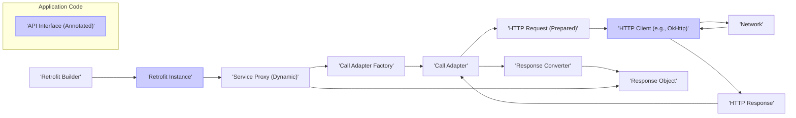
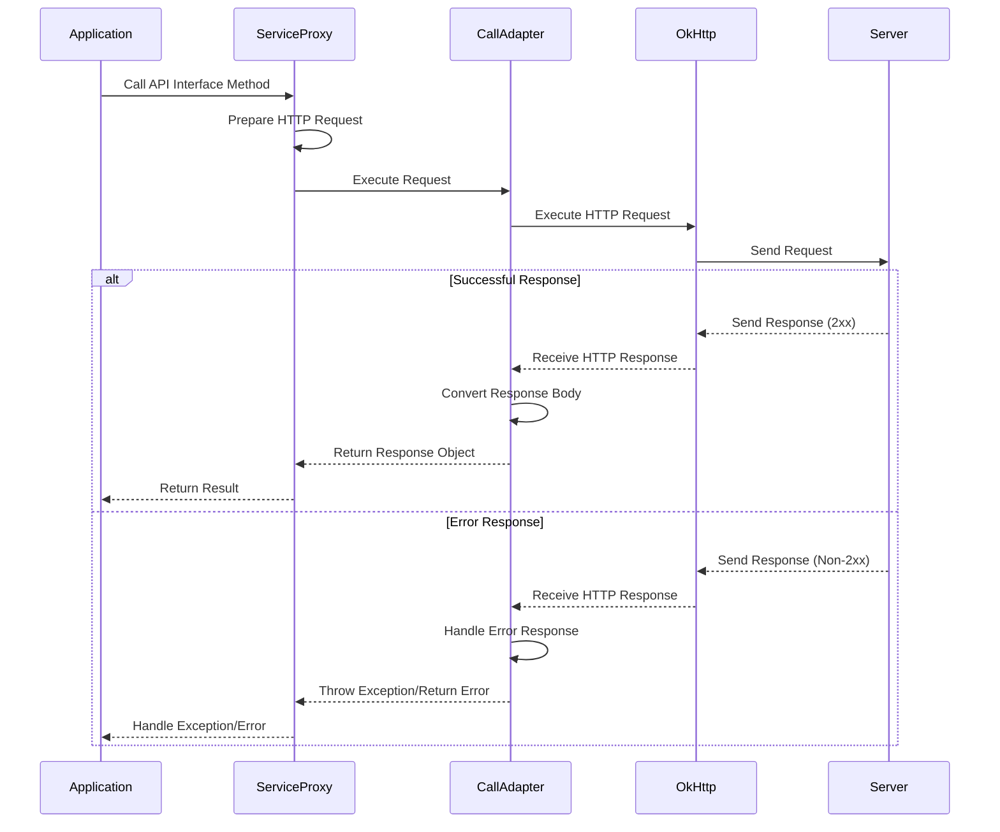

# Project Design Document: Retrofit

**Version:** 1.1
**Date:** October 26, 2023
**Author:** AI Software Architect

## 1. Introduction

This document provides an enhanced and more detailed design overview of the Retrofit library, a type-safe HTTP client for Android and Java. This document is specifically tailored to serve as a robust foundation for subsequent threat modeling activities. It meticulously outlines the key components, architecture, and data flow within Retrofit, highlighting potential areas of interest and concern for security analysis.

## 2. Goals

*   Provide a comprehensive and in-depth architectural overview of the Retrofit library.
*   Clearly identify key components, elaborating on their specific responsibilities and interactions.
*   Describe the data flow during both successful and error request/response processing with greater precision.
*   Establish a clear and granular understanding of Retrofit's functionality to facilitate effective and targeted threat modeling.
*   Document all relevant technologies, dependencies, and their potential security implications.

## 3. High-Level Architecture

Retrofit functions as an abstraction layer built upon an underlying HTTP client, most commonly OkHttp. It significantly simplifies the process of making network requests by enabling developers to define API endpoints as intuitive Java or Kotlin interfaces.

**Key Components:**

*   **API Interface (Annotated):** A Java or Kotlin interface serving as the blueprint for API interactions. Methods within this interface are annotated with Retrofit-specific annotations (e.g., `'@GET'`, `'@POST'`, `'@Path'`, `'@Query'`) to declare HTTP methods, URL paths, and request parameters.
*   **Retrofit Builder:** A builder pattern class responsible for the configuration and instantiation of the central `'Retrofit Instance'`. This involves setting crucial parameters like the base URL, the underlying HTTP client, converter factories for data serialization/deserialization, and call adapter factories for handling asynchronous operations.
*   **Retrofit Instance:** The core orchestrator of the library. It holds the global configuration and provides the entry point for creating dynamic implementations of the API interfaces (service proxies).
*   **Service Proxy (Dynamic):** A dynamically generated class that implements the API interface. When a method on the interface is invoked, the proxy intercepts the call and orchestrates the entire process of building and executing the corresponding network request.
*   **Call Adapter Factory:** An interface responsible for creating concrete `'Call Adapter'` instances. The factory determines which adapter to use based on the return type of the API interface method, enabling support for various asynchronous patterns (e.g., `Call`, `CompletableFuture`, RxJava `Observable`).
*   **Call Adapter:** An interface defining the strategy for executing the prepared `'HTTP Request'` and adapting the raw `'HTTP Response'` into a more usable format. It handles the asynchronous nature of network operations.
*   **HTTP Request (Prepared):** An immutable representation of the HTTP request, containing all necessary information such as the target URL, HTTP method, headers, and the request body (if applicable). This object is constructed based on the API interface method's annotations and parameters.
*   **HTTP Client (e.g., OkHttp):** The underlying HTTP client library responsible for the actual network communication. Retrofit is designed to be agnostic and can work with different clients, but OkHttp is the most common and recommended choice due to its features and performance.
*   **HTTP Response:** The raw HTTP response received from the server, including status codes, headers, and the response body in its original format.
*   **Response Converter:** An interface responsible for transforming the raw `'HTTP Response'` body into a usable Java or Kotlin object. Different implementations (e.g., GsonConverterFactory, JacksonConverterFactory) handle various data formats like JSON, XML, and others.
*   **Response Object:** The deserialized Java or Kotlin object representing the data received from the server. This object is the result of the `'Response Converter'` processing the `'HTTP Response'` body.

## 4. Detailed Component Breakdown

*   **API Interface:**
    *   Serves as the contract defining the available API endpoints and their expected request/response structures.
    *   Employs annotations to declaratively specify:
        *   HTTP methods (`@GET`, `@POST`, `@PUT`, `@DELETE`, etc.).
        *   URL paths and dynamic path segments (`@Path`).
        *   Query parameters (`@Query`, `@QueryMap`).
        *   Request headers (`@Header`, `@Headers`).
        *   Request body content and encoding (`@Body`, `@Field`, `@FieldMap`, `@Part`, `@PartMap`).
    *   The return type of each method dictates how the response will be handled:
        *   Directly as a POJO (Plain Old Java Object) or data class.
        *   Wrapped in a `Call<T>` object for asynchronous execution.
        *   As a reactive stream using libraries like RxJava or Coroutines.

*   **Retrofit Builder:**
    *   Provides a fluent and configurable way to create `'Retrofit Instance'` objects.
    *   Key configuration options include:
        *   `baseUrl(String)`: Sets the base URL for all API endpoints.
        *   `client(OkHttpClient)`: Allows specifying a custom OkHttp client, enabling advanced configurations like interceptors, timeouts, and certificate pinning. This is a critical point for security customizations.
        *   `addConverterFactory(Converter.Factory)`: Registers factories for converting request bodies and response bodies to and from various data formats. Multiple factories can be added to support different content types.
        *   `addCallAdapterFactory(CallAdapter.Factory)`: Registers factories for adapting the `okhttp3.Call` into different asynchronous types.
        *   `validateEagerly(boolean)`:  Option to validate the API interface at the time of building the Retrofit instance, catching potential configuration errors early.

*   **Retrofit Instance:**
    *   Manages the configured settings and acts as a factory for creating service proxies.
    *   The `create(Class<T> service)` method dynamically generates an implementation of the provided API interface. This implementation handles the underlying network communication.

*   **Service Proxy:**
    *   The generated implementation of the API interface.
    *   When a method is called:
        *   It analyzes the method's annotations to determine the HTTP method, URL, headers, and request body.
        *   It uses the provided method arguments to populate dynamic parts of the request (e.g., path parameters, query parameters, request body).
        *   It utilizes the configured `'Call Adapter'` to create and execute the `okhttp3.Call`.
        *   Upon receiving the response, it uses the appropriate `'Response Converter'` to deserialize the response body.
        *   It returns the converted response object or throws an exception in case of errors.

*   **Call Adapter Factory & Call Adapter:**
    *   **Call Adapter Factory:** Examines the return type of the API interface method and selects the appropriate `'Call Adapter'` to handle the execution and response adaptation. For example, if the method returns `Call<User>`, a `CallAdapter` for `Call` will be chosen. If it returns `Observable<User>`, an RxJava adapter will be used.
    *   **Call Adapter:** Encapsulates the logic for:
        *   Creating an `okhttp3.Call` object representing the HTTP request based on the information provided by the service proxy.
        *   Executing the `okhttp3.Call` either synchronously (blocking the current thread) or asynchronously (using callbacks or reactive streams).
        *   Adapting the raw `okhttp3.Response` into the desired return type. This might involve wrapping the response in a `Call` object, emitting it through an RxJava `Observable`, or returning a `CompletableFuture`.

*   **HTTP Request Preparation:**
    *   The service proxy meticulously constructs the `okhttp3.Request` object based on the API interface method's annotations and arguments. This involves:
        *   Building the complete URL by combining the base URL with the path specified in the annotations and replacing path parameters.
        *   Adding headers specified through `@Header` and `@Headers` annotations.
        *   Constructing the request body based on the `@Body`, `@Field`, `@FieldMap`, `@Part`, and `@PartMap` annotations, utilizing the configured `'Response Converter'` to serialize the data.

*   **HTTP Client (OkHttp):**
    *   A highly performant and feature-rich HTTP client library.
    *   Manages low-level network operations, including:
        *   Connection pooling for efficient reuse of connections.
        *   Transparent handling of redirects.
        *   Support for various HTTP protocols (HTTP/1.1, HTTP/2).
        *   Configuration of timeouts (connection, read, write).
        *   Interceptors for adding custom logic to request and response processing.
        *   Caching mechanisms to reduce network traffic.
        *   TLS/SSL configuration for secure communication.

*   **Response Conversion:**
    *   The `'Response Converter'`, selected based on the `Content-Type` header of the response and the configured converter factories, is responsible for deserializing the raw response body.
    *   Retrofit provides built-in support for common data formats through libraries like Gson, Jackson, Moshi, and Protocol Buffers. Developers can also create custom converters for specific needs.

## 5. Data Flow

The data flow for a Retrofit request can be visualized as follows, including both successful and error scenarios:

**Detailed Steps:**

1. **API Interface Method Call:** The application initiates a network request by calling a method on the generated service interface.
2. **Service Proxy Interception:** The dynamic proxy intercepts the method call and begins the request processing.
3. **Request Preparation:** The proxy uses the method's annotations and arguments to construct an `okhttp3.Request` object, including URL construction, header addition, and request body serialization.
4. **Call Adapter Invocation:** The proxy delegates the execution of the prepared request to the appropriate `'Call Adapter'`.
5. **HTTP Client Execution:** The `'Call Adapter'` utilizes the underlying `okhttp3.OkHttpClient` to execute the `okhttp3.Request` over the network.
6. **Network Communication:** OkHttp handles the low-level network communication with the server.
7. **Response Handling (Successful):** If the server returns a successful HTTP response (typically a 2xx status code):
    *   OkHttp receives the `okhttp3.Response`.
    *   The `'Call Adapter'` receives the response.
    *   The `'Call Adapter'` uses the configured `'Response Converter'` to deserialize the response body into the expected Java or Kotlin object.
    *   The converted response object is returned to the service proxy.
    *   The service proxy returns the result to the calling application code.
8. **Response Handling (Error):** If the server returns an error HTTP response (non-2xx status code):
    *   OkHttp receives the `okhttp3.Response`.
    *   The `'Call Adapter'` receives the error response.
    *   The `'Call Adapter'` typically handles the error by:
        *   Throwing an exception (e.g., `HttpException`).
        *   Returning an error object or a specific error state.
    *   The service proxy propagates the exception or error back to the application code, allowing for error handling.

## 6. Key Technologies and Dependencies

*   **Java or Kotlin:** The primary programming languages for utilizing Retrofit.
*   **OkHttp:** The default and highly recommended HTTP client library.
*   **Converter Libraries:**
    *   Gson (com.google.code.gson:gson)
    *   Jackson (com.fasterxml.jackson.core:jackson-databind)
    *   Moshi (com.squareup.moshi:moshi)
    *   Protocol Buffers (com.google.protobuf:protobuf-java)
    *   Simple XML (org.simpleframework:simple-xml)
*   **Call Adapter Libraries:**
    *   RxJava 2 & 3 (io.reactivex.rxjava2:rxjava, io.reactivex.rxjava3:rxjava3)
    *   Guava's ListenableFuture (com.google.guava:guava)
    *   Java 8's CompletableFuture (part of the standard JDK)
    *   Kotlin Coroutines (org.jetbrains.kotlinx:kotlinx-coroutines-android)
*   **Annotations:**  Fundamental to Retrofit's declarative approach for defining API interactions.

## 7. Deployment Considerations

Retrofit is a client-side library integrated directly into Android or Java applications. Its deployment is inherently linked to the deployment of the application itself. There is no separate server-side deployment required for Retrofit. Considerations during application deployment include:

*   **Dependency Inclusion:** Ensuring the correct Retrofit and related dependency artifacts are included in the application's build process.
*   **Configuration:**  Properly configuring the `Retrofit Builder` with the correct base URL, HTTP client, and converter/call adapter factories.
*   **Security Configurations:** Implementing necessary security measures within the OkHttp client, such as TLS/SSL configuration, certificate pinning, and custom interceptors.

## 8. Security Considerations (For Threat Modeling)

This section expands on the initial security considerations, providing more specific examples and potential attack vectors for threat modeling.

*   **Insecure HTTP Connections (CWE-319):**
    *   **Threat:** If the base URL or API endpoints use `http://` instead of `https://`, communication is unencrypted, making it susceptible to eavesdropping and man-in-the-middle (MITM) attacks. Attackers can intercept sensitive data like credentials or personal information.
    *   **Mitigation:** Enforce the use of HTTPS for all API communication. Configure the `Retrofit Builder` with HTTPS base URLs. Consider using tools or linters to enforce secure URL schemes.

*   **TLS/SSL Configuration Vulnerabilities (CWE-295, CWE-327):**
    *   **Threat:** Weak TLS/SSL configurations in the underlying OkHttp client can be exploited. This includes using outdated TLS versions, weak cipher suites, or disabling certificate validation. Attackers could downgrade connections or impersonate the server.
    *   **Mitigation:** Ensure OkHttp is configured with strong TLS versions (TLS 1.2 or higher) and secure cipher suites. Implement proper certificate validation, potentially including certificate pinning for enhanced security against compromised CAs.

*   **Data Serialization/Deserialization Vulnerabilities (CWE-502):**
    *   **Threat:** Vulnerabilities in the chosen converter libraries (e.g., Gson, Jackson) can lead to remote code execution (RCE) or denial-of-service (DoS) attacks if the API returns maliciously crafted data. For example, deserializing untrusted JSON with known vulnerabilities could allow an attacker to execute arbitrary code on the client device.
    *   **Mitigation:** Keep converter libraries up-to-date with the latest security patches. Carefully consider the security implications of using converters that allow arbitrary code execution during deserialization. Implement input validation on the server-side to prevent malicious data from being sent.

*   **Injection Attacks (CWE-74, CWE-79, CWE-89, CWE-918):**
    *   **Threat:** Improperly handling user input when constructing API requests can lead to various injection attacks:
        *   **URL Injection:** Manipulating URL parameters to access unauthorized resources or perform unintended actions.
        *   **Header Injection:** Injecting malicious headers to bypass security checks or manipulate server behavior.
        *   **Body Injection:** Injecting malicious data into the request body, potentially leading to server-side vulnerabilities.
    *   **Mitigation:** Sanitize and validate all user-provided input before incorporating it into API requests. Use parameterized queries or prepared statements on the server-side to prevent SQL injection if applicable. Avoid directly embedding user input into URLs or headers without proper encoding.

*   **Authentication and Authorization Issues (CWE-287, CWE-288):**
    *   **Threat:** Flaws in how Retrofit is used to implement authentication and authorization can expose sensitive data or functionality. This includes:
        *   Storing API keys or tokens insecurely on the client-side.
        *   Implementing weak or broken authentication mechanisms.
        *   Failing to properly authorize requests, allowing unauthorized access.
    *   **Mitigation:** Utilize secure storage mechanisms for credentials. Implement robust authentication protocols (e.g., OAuth 2.0). Ensure proper authorization checks are performed on the server-side for all API endpoints. Consider using interceptors to add authentication headers securely to all requests.

*   **Rate Limiting and Denial of Service (CWE-400):**
    *   **Threat:** Without proper rate limiting, an attacker could send a large number of requests to the API, potentially overwhelming the server and causing a denial of service.
    *   **Mitigation:** Implement rate limiting on the server-side to restrict the number of requests from a single client within a specific timeframe. Consider implementing client-side mechanisms to avoid excessive requests.

*   **Interceptors Security Risks:**
    *   **Threat:** While interceptors offer powerful customization, poorly implemented interceptors can introduce security vulnerabilities. For example, an interceptor might inadvertently log sensitive data or modify requests in an insecure way.
    *   **Mitigation:** Carefully review and test all custom interceptors. Ensure they do not expose sensitive information or introduce unintended side effects. Follow secure coding practices when developing interceptors.

*   **Dependency Management Vulnerabilities (CWE-937):**
    *   **Threat:** Using outdated versions of Retrofit or its dependencies (like OkHttp or converter libraries) can expose the application to known security vulnerabilities.
    *   **Mitigation:** Regularly update Retrofit and all its dependencies to the latest stable versions to patch known security flaws. Utilize dependency management tools to track and manage dependencies effectively.

This enhanced design document provides a more comprehensive and detailed understanding of the Retrofit library, specifically tailored for effective threat modeling. The expanded descriptions of components, data flow, and security considerations offer a solid foundation for identifying potential vulnerabilities and designing appropriate security mitigations.