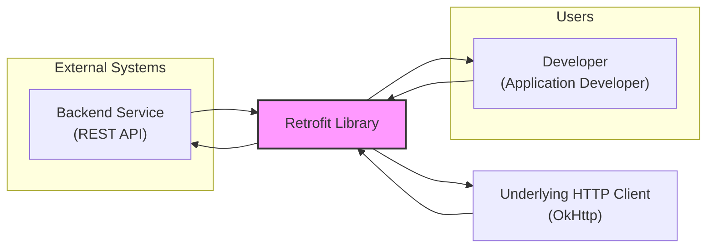

# BUSINESS POSTURE

- Business Priorities and Goals:
 - Simplify HTTP client implementation for Android and Java developers.
 - Provide a type-safe and efficient way to interact with RESTful APIs.
 - Enhance developer productivity by abstracting away low-level HTTP concerns.
 - Promote code readability and maintainability in applications that consume web services.
- Business Risks:
 - Security vulnerabilities in Retrofit library could compromise applications using it.
 - Performance bottlenecks in Retrofit could impact application responsiveness.
 - Incompatibility issues with evolving backend APIs could break applications.
 - Lack of proper security guidance for developers could lead to insecure usage of Retrofit.

# SECURITY POSTURE

- Existing Security Controls:
 - security control: HTTPS support is implicitly provided by underlying HTTP client (OkHttp). Implemented in OkHttp library.
 - security control: Input validation is expected to be implemented by the application using Retrofit, before sending data to backend services. Implemented in user application code.
 - accepted risk: Reliance on user applications to correctly implement authentication and authorization.
 - accepted risk: Vulnerabilities in underlying OkHttp library.
 - accepted risk: Misconfiguration of Retrofit by developers leading to insecure communication.
- Recommended Security Controls:
 - security control: Dependency scanning of Retrofit's dependencies to identify and address known vulnerabilities.
 - security control: Static Application Security Testing (SAST) on Retrofit codebase to identify potential security flaws.
 - security control: Provide security guidelines and best practices for developers using Retrofit, emphasizing secure configuration and usage.
- Security Requirements:
 - Authentication:
  - Requirement: Retrofit itself does not handle authentication, it relies on the application to provide authentication tokens or credentials.
  - Requirement: Applications using Retrofit MUST implement appropriate authentication mechanisms based on the backend API requirements.
 - Authorization:
  - Requirement: Retrofit itself does not handle authorization, it relies on the application to ensure proper authorization logic.
  - Requirement: Applications using Retrofit MUST implement authorization checks to control access to backend resources.
 - Input Validation:
  - Requirement: Retrofit should perform basic input validation to prevent common injection attacks, especially in areas where user-provided data might influence HTTP requests.
  - Requirement: Applications using Retrofit MUST perform thorough input validation on data received from backend services and data sent to backend services.
 - Cryptography:
  - Requirement: Retrofit MUST support and encourage the use of HTTPS for all communication to ensure data confidentiality and integrity in transit.
  - Requirement: Retrofit should not implement custom cryptography but rely on well-established and vetted cryptographic libraries provided by the underlying platform (Java/Android).

# DESIGN

## C4 CONTEXT



- Context Diagram Elements:
 - - Name: Developer
   - Type: Person
   - Description: Software developer who uses Retrofit library to build Android and Java applications that consume RESTful APIs.
   - Responsibilities: Integrate Retrofit into applications, define API interfaces, handle API responses, manage authentication and authorization.
   - Security controls: Responsible for secure usage of Retrofit, including proper input validation, authentication, and authorization implementation in their applications.
 - - Name: Retrofit Library
   - Type: System
   - Description: Type-safe HTTP client library for Android and Java. Simplifies the process of making HTTP requests to RESTful APIs.
   - Responsibilities: Generate HTTP client code from API interface definitions, handle request serialization and response deserialization, manage HTTP connections, provide a high-level API for making HTTP requests.
   - Security controls: Relies on underlying HTTP client for transport security (HTTPS), provides mechanisms for request and response interception, expects secure configuration by developers.
 - - Name: Backend Service
   - Type: System
   - Description: RESTful API that provides data and functionality to applications using Retrofit.
   - Responsibilities: Process API requests, provide data responses, implement API authentication and authorization.
   - Security controls: Implements API security measures, including authentication, authorization, input validation, and protection against common web vulnerabilities.
 - - Name: Underlying HTTP Client
   - Type: System
   - Description: HTTP client library (OkHttp) used by Retrofit to handle low-level HTTP communication.
   - Responsibilities: Manage HTTP connections, handle HTTP requests and responses, implement HTTP protocols, provide TLS/SSL for HTTPS.
   - Security controls: Implements transport layer security (TLS/SSL) for HTTPS, handles HTTP protocol security aspects.

## C4 CONTAINER

```mermaid
flowchart LR
    subgraph "Retrofit Library"
        ContainerLibrary["Retrofit Core\n(Java/Kotlin Library)"]
        ContainerAnnotations["Annotations Processor\n(Java)"]
    end
    ContainerLibrary --> UnderlyingHTTPClient["OkHttp Client\n(Java Library)"]
    Developer["Developer Application Code"] --> ContainerLibrary
    ContainerAnnotations --> ContainerLibrary: Generates Code
    style ContainerLibrary fill:#f9f,stroke:#333,stroke-width:2px
    style ContainerAnnotations fill:#f9f,stroke:#333,stroke-width:2px
```

- Container Diagram Elements:
 - - Name: Retrofit Core
   - Type: Container - Library
   - Description: Core logic of the Retrofit library, written in Java and Kotlin. Provides the main API for developers to define and use REST API interfaces.
   - Responsibilities: API interface processing, request building, response handling, integration with annotation processor and underlying HTTP client.
   - Security controls: Input validation on API interface definitions, secure handling of request and response data, relies on underlying HTTP client for transport security.
 - - Name: Annotations Processor
   - Type: Container - Build-time Component
   - Description: Java annotation processor that generates implementation code based on API interface definitions with Retrofit annotations.
   - Responsibilities: Code generation during compilation, processing annotations to create HTTP client implementations.
   - Security controls: Secure code generation practices, prevention of code injection vulnerabilities during code generation.
 - - Name: OkHttp Client
   - Type: Container - Library
   - Description: Underlying HTTP client library (OkHttp) used by Retrofit for actual HTTP communication.
   - Responsibilities: HTTP connection management, request execution, response handling, TLS/SSL for HTTPS, HTTP protocol implementation.
   - Security controls: Transport layer security (TLS/SSL), HTTP protocol security, vulnerability management of OkHttp library itself.

## DEPLOYMENT

```mermaid
flowchart LR
    subgraph "Developer Machine"
        DeveloperAppCode["Developer Application Code"]
        RetrofitLib["Retrofit Library"]
        OkHttpLib["OkHttp Library"]
    end
    subgraph "Target Environment (e.g., Android Device, Java Server)"
        ApplicationInstance["Application Instance\n(Running Application)"]
        DeployedRetrofit["Retrofit Library\n(Deployed)"]
        DeployedOkHttp["OkHttp Library\n(Deployed)"]
    end
    DeveloperAppCode --> RetrofitLib: Compile-time Dependency
    RetrofitLib --> OkHttpLib: Runtime Dependency
    ApplicationInstance --> DeployedRetrofit: Runtime Usage
    DeployedRetrofit --> DeployedOkHttp: Runtime Usage
    DeployedOkHttp --> Network["Network"]
    Network --> BackendService["Backend Service"]
    style ApplicationInstance fill:#f9f,stroke:#333,stroke-width:2px
    style DeployedRetrofit fill:#f9f,stroke:#333,stroke-width:2px
    style DeployedOkHttp fill:#f9f,stroke:#333,stroke-width:2px
```

- Deployment Diagram Elements:
 - - Name: Developer Application Code
   - Type: Component - Code
   - Description: Application code written by developers that utilizes Retrofit library.
   - Responsibilities: Defining API interfaces, using Retrofit to make API calls, handling responses, implementing application logic.
   - Security controls: Application-level security controls, input validation, authentication, authorization, secure data handling.
 - - Name: Retrofit Library (Deployed)
   - Type: Component - Library
   - Description: Deployed instance of the Retrofit library within the target application environment.
   - Responsibilities: Providing HTTP client functionality to the application at runtime.
   - Security controls: Inherits security controls from the library itself and the underlying platform.
 - - Name: OkHttp Library (Deployed)
   - Type: Component - Library
   - Description: Deployed instance of the OkHttp library within the target application environment.
   - Responsibilities: Handling low-level HTTP communication at runtime.
   - Security controls: Transport layer security (TLS/SSL), HTTP protocol security, vulnerability management of OkHttp library.
 - - Name: Application Instance
   - Type: Environment - Runtime Environment
   - Description: Running instance of the application that uses Retrofit, deployed in the target environment (e.g., Android device, Java server).
   - Responsibilities: Executing application code, running Retrofit and OkHttp libraries, interacting with the network and backend services.
   - Security controls: Operating system security, runtime environment security, application-level security controls.
 - - Name: Network
   - Type: Infrastructure - Network
   - Description: Network infrastructure connecting the application instance to the backend service.
   - Responsibilities: Network communication, data transmission.
   - Security controls: Network security controls, firewalls, intrusion detection systems, network segmentation.
 - - Name: Backend Service
   - Type: System - External System
   - Description: Backend REST API service that the application communicates with over the network.
   - Responsibilities: Processing API requests, providing data responses, implementing backend logic.
   - Security controls: Backend security controls, API security, server security, data security.

## BUILD

```mermaid
flowchart LR
    subgraph "Developer Environment"
        Developer["Developer"]
        SourceCode["Source Code\n(GitHub)"]
    end
    subgraph "CI Environment (GitHub Actions)"
        CI["CI System\n(GitHub Actions)"]
        BuildArtifacts["Build Artifacts\n(JAR/AAR)"]
    end
    Developer --> SourceCode: Push Code
    SourceCode --> CI: Trigger Build
    CI --> BuildArtifacts: Produce Artifacts
    CI --> SecurityChecks["Security Checks\n(SAST, Dependency Scan)"]
    SecurityChecks --> CI: Report
    CI --> ArtifactRepository["Artifact Repository\n(Maven Central)"] : Publish Artifacts
    BuildArtifacts --> ArtifactRepository
    style CI fill:#f9f,stroke:#333,stroke-width:2px
    style SecurityChecks fill:#f9f,stroke:#333,stroke-width:2px
```

- Build Process Elements:
 - - Name: Developer
   - Type: Person
   - Description: Software developer contributing to the Retrofit project.
   - Responsibilities: Writing code, committing changes, creating pull requests.
   - Security controls: Secure coding practices, code review, authentication to GitHub.
 - - Name: Source Code
   - Type: Component - Code Repository
   - Description: GitHub repository hosting the Retrofit source code.
   - Responsibilities: Version control, code storage, collaboration platform.
   - Security controls: Access control to repository, branch protection, audit logs.
 - - Name: CI System
   - Type: System - Automation System
   - Description: GitHub Actions CI environment used for building, testing, and publishing Retrofit.
   - Responsibilities: Automated build process, running tests, performing security checks, publishing artifacts.
   - Security controls: Secure CI configuration, access control to CI system, secrets management, build isolation.
 - - Name: Security Checks
   - Type: Component - Security Tooling
   - Description: Automated security checks integrated into the CI pipeline, including SAST and dependency scanning.
   - Responsibilities: Identifying potential security vulnerabilities in code and dependencies.
   - Security controls: Regularly updated security rules, vulnerability databases, reporting mechanisms.
 - - Name: Build Artifacts
   - Type: Data - Software Artifacts
   - Description: Compiled JAR and AAR files produced by the build process.
   - Responsibilities: Packaging and distributing the Retrofit library.
   - Security controls: Artifact signing, integrity checks, secure storage.
 - - Name: Artifact Repository
   - Type: System - Repository
   - Description: Maven Central repository where Retrofit artifacts are published for public consumption.
   - Responsibilities: Hosting and distributing Retrofit library artifacts.
   - Security controls: Repository security controls, artifact verification, access control.

# RISK ASSESSMENT

- Critical Business Processes:
 - Ensuring secure and reliable communication between applications and backend services for applications using Retrofit.
 - Maintaining the integrity and availability of the Retrofit library for developers.
- Data to Protect and Sensitivity:
 - Retrofit library code itself (low sensitivity, publicly available on GitHub, but integrity is important).
 - Build process and signing keys (high sensitivity, compromise could lead to malicious library versions).
 - User data transmitted through applications using Retrofit (sensitivity depends on the application, could be highly sensitive PII, financial data, etc.).

# QUESTIONS & ASSUMPTIONS

- Business Posture Questions:
 - What is the expected risk appetite for applications using Retrofit? (Assumption: Varies depending on the application, Retrofit should aim for high security).
 - Are there specific compliance requirements for applications using Retrofit? (Assumption: Retrofit should be designed to facilitate compliance, e.g., with HTTPS enforcement).
- Security Posture Questions:
 - What security testing is currently performed on Retrofit codebase? (Assumption: Basic testing, recommended to enhance with SAST and dependency scanning).
 - Are there documented security guidelines for developers using Retrofit? (Assumption: Basic usage guidelines, recommended to add specific security best practices).
 - What is the process for handling security vulnerabilities reported in Retrofit or its dependencies? (Assumption: Standard open-source vulnerability disclosure and patching process).
- Design Questions:
 - Are there plans to incorporate more security features directly into Retrofit library? (Assumption: Focus is on providing secure defaults and guidance, not implementing application-level security features).
 - How is input validation handled within Retrofit itself? (Assumption: Limited input validation, primarily responsibility of user applications).
 - What are the considerations for secure configuration of Retrofit by developers? (Assumption: Developers need clear guidance on secure configuration options, e.g., HTTPS enforcement).