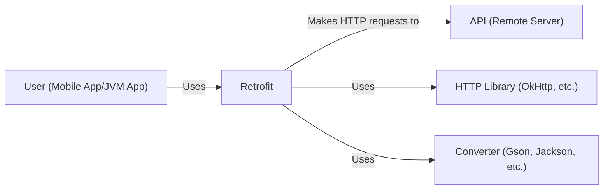
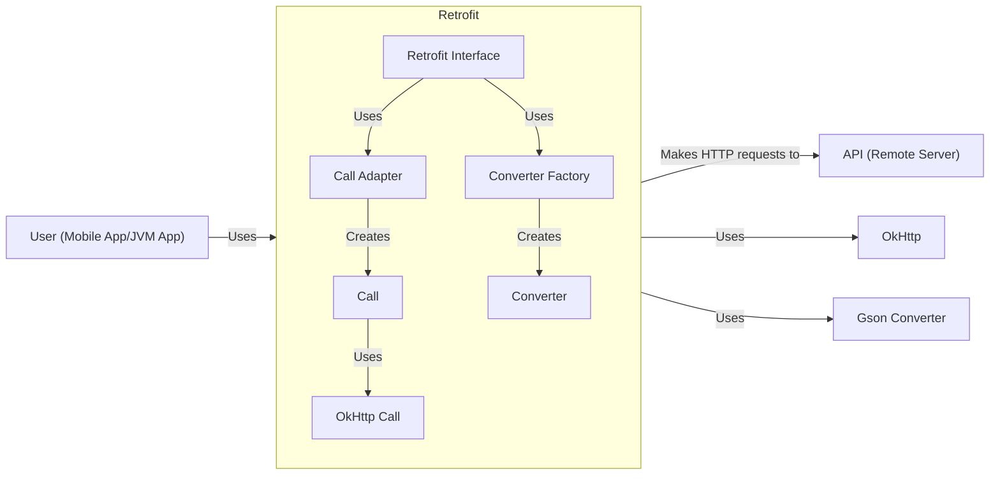
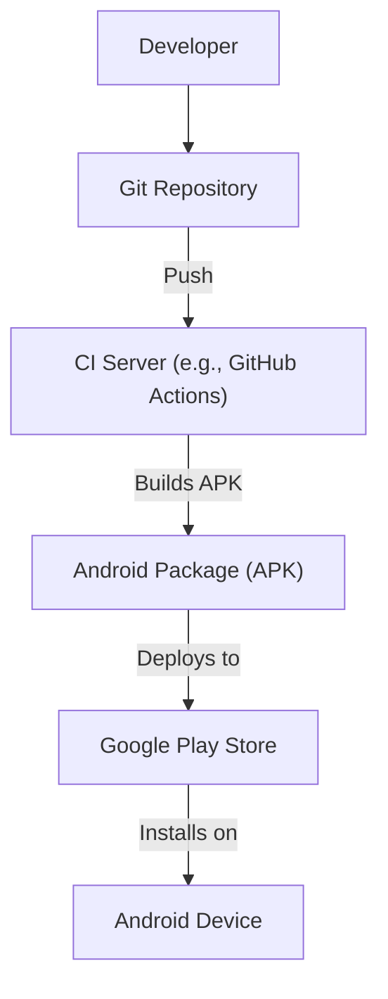
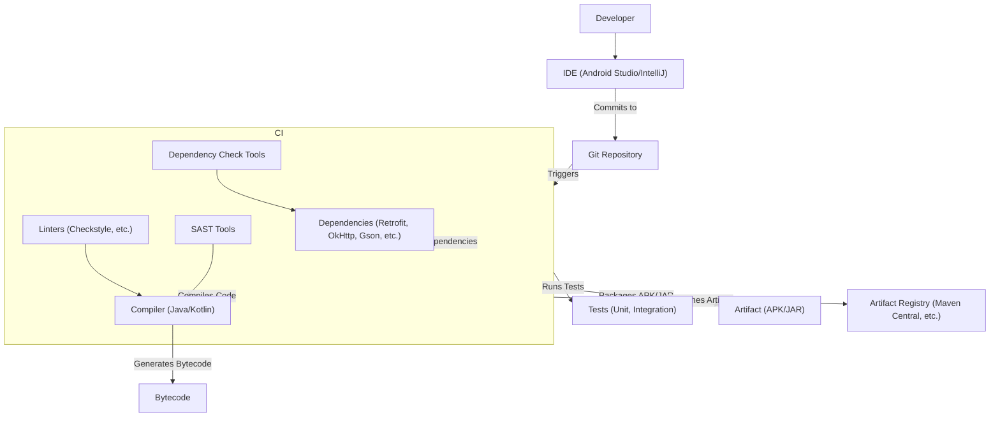

# BUSINESS POSTURE

Business Priorities and Goals:

*   Provide a type-safe HTTP client for Android and Java applications.
*   Simplify the process of making network requests and handling responses.
*   Improve developer productivity by reducing boilerplate code.
*   Maintain high performance and efficiency.
*   Ensure compatibility with various HTTP libraries (OkHttp, etc.) and converters (Gson, Jackson, Moshi, etc.).
*   Foster a large and active community for support and contributions.
*   Maintain backward compatibility and a stable API.

Business Risks:

*   Data breaches due to vulnerabilities in the library or its dependencies.
*   Service disruption caused by incorrect usage or integration of the library.
*   Reputational damage due to security incidents or performance issues.
*   Compatibility issues with future versions of Android, Java, or underlying HTTP libraries.
*   Loss of developer trust due to instability or lack of support.
*   Exposure of sensitive data (API keys, user credentials, etc.) if improperly handled by applications using Retrofit.

# SECURITY POSTURE

Existing Security Controls:

*   security control: The library itself focuses on abstracting HTTP requests, relying on underlying HTTP clients (like OkHttp) for secure communication (TLS/SSL).
*   security control: Retrofit supports various converters for data serialization/deserialization, allowing developers to choose secure options.
*   security control: The project uses GitHub for version control and issue tracking, providing some level of transparency and community involvement in identifying and addressing potential security issues.
*   security control: The project is open source, allowing for community scrutiny and contributions to security.
*   security control: The project has a well-defined API, reducing the risk of misuse.
*   security control: The project is actively maintained by Square, a reputable company with a strong focus on security.

Accepted Risks:

*   accepted risk: Retrofit, by design, handles potentially sensitive data (API keys, user data, etc.). The responsibility for securely storing and transmitting this data lies with the application using Retrofit.
*   accepted risk: The security of the network communication ultimately depends on the underlying HTTP client (e.g., OkHttp) and its configuration. Retrofit itself does not implement TLS/SSL.
*   accepted risk: Vulnerabilities in third-party converters (Gson, Jackson, etc.) could potentially impact applications using Retrofit.
*   accepted risk: The library's flexibility allows developers to potentially create insecure configurations if not used carefully.

Recommended Security Controls:

*   security control: Implement a comprehensive security testing strategy, including static analysis, dynamic analysis, and dependency scanning.
*   security control: Provide clear and detailed security documentation, guiding developers on best practices for secure usage.
*   security control: Establish a vulnerability disclosure program to encourage responsible reporting of security issues.
*   security control: Regularly audit dependencies for known vulnerabilities.
*   security control: Consider adding built-in support for features like certificate pinning (though this can be complex and may be better handled by the underlying HTTP client).

Security Requirements:

*   Authentication:
    *   Retrofit should facilitate the implementation of various authentication mechanisms (e.g., OAuth 2.0, API keys, Basic Auth) through request headers or interceptors. The specific implementation is the responsibility of the application developer.
*   Authorization:
    *   Retrofit should not directly handle authorization logic. Authorization is typically handled server-side. Retrofit should allow for the transmission of necessary authorization tokens or credentials.
*   Input Validation:
    *   Retrofit should encourage the use of type-safe interfaces, reducing the risk of injection vulnerabilities.
    *   Input validation is primarily the responsibility of the application using Retrofit and the server-side API. Retrofit's role is to ensure data is correctly serialized and transmitted.
*   Cryptography:
    *   Retrofit should rely on the underlying HTTP client (e.g., OkHttp) for secure communication (HTTPS/TLS).
    *   Retrofit should not handle encryption/decryption of data directly, except for facilitating the use of secure converters.

# DESIGN

## C4 CONTEXT

Element Descriptions:

*   Element:
    *   Name: User
    *   Type: Person
    *   Description: A user interacting with a mobile or JVM application that uses Retrofit.
    *   Responsibilities: Initiates actions that trigger network requests.
    *   Security controls: None directly within Retrofit's scope. Security is handled by the application.

*   Element:
    *   Name: Retrofit
    *   Type: Software System
    *   Description: A type-safe HTTP client for Android and Java.
    *   Responsibilities: Provides an interface for defining API endpoints, handles request creation and response parsing.
    *   Security controls: Relies on underlying HTTP client for secure communication, supports secure converters.

*   Element:
    *   Name: API
    *   Type: Software System
    *   Description: The remote server providing the API that the application interacts with.
    *   Responsibilities: Handles requests from the application, processes data, and returns responses.
    *   Security controls: Server-side security controls (authentication, authorization, input validation, etc.).

*   Element:
    *   Name: HTTPLibrary
    *   Type: Software System
    *   Description: The underlying HTTP client library used by Retrofit (e.g., OkHttp).
    *   Responsibilities: Handles the actual network communication, including TLS/SSL.
    *   Security controls: Implements TLS/SSL, handles connection security.

*   Element:
    *   Name: Converter
    *   Type: Software System
    *   Description: Library used for serializing and deserializing data (e.g., Gson, Jackson, Moshi).
    *   Responsibilities: Converts data between Java objects and formats like JSON.
    *   Security controls: Secure parsing and serialization to prevent injection vulnerabilities.

## C4 CONTAINER

Element Descriptions:

*   Element:
    *   Name: Retrofit Interface
    *   Type: Component
    *   Description: User-defined interface describing the API endpoints.
    *   Responsibilities: Defines the API methods and their parameters.
    *   Security controls: Type-safety helps prevent injection vulnerabilities.

*   Element:
    *   Name: Call Adapter
    *   Type: Component
    *   Description: Adapts Retrofit's `Call` to other asynchronous patterns (e.g., RxJava).
    *   Responsibilities: Provides flexibility in handling asynchronous operations.
    *   Security controls: None specific.

*   Element:
    *   Name: Converter Factory
    *   Type: Component
    *   Description: Creates converters for serializing and deserializing data.
    *   Responsibilities: Provides instances of converters based on the configured type.
    *   Security controls: Should be configured to use secure converters.

*   Element:
    *   Name: Call
    *   Type: Component
    *   Description: Represents a single API request.
    *   Responsibilities: Encapsulates the request information.
    *   Security controls: None specific.

*   Element:
    *   Name: OkHttp Call
    *   Type: Component
    *   Description: Implementation of `Call` using OkHttp.
    *   Responsibilities: Executes the HTTP request using OkHttp.
    *   Security controls: Relies on OkHttp for secure communication.

*   Element:
    *   Name: Converter
    *   Type: Component
    *   Description: Converts data between Java objects and formats like JSON.
    *   Responsibilities: Serializes and deserializes data.
    *   Security controls: Secure parsing and serialization to prevent injection vulnerabilities.

*   Element:
    *   Name: OkHttp
    *   Type: Container (Library)
    *   Description: The underlying HTTP client library.
    *   Responsibilities: Handles network communication, including TLS/SSL.
    *   Security controls: Implements TLS/SSL, handles connection security.

*   Element:
    *   Name: Gson Converter
    *   Type: Container (Library)
    *   Description: A converter library for JSON serialization/deserialization.
    *   Responsibilities: Converts Java objects to JSON and vice versa.
    *   Security controls: Secure parsing and serialization to prevent injection vulnerabilities.

*   Element:
    *   Name: API
    *   Type: Container (External System)
    *   Description: The remote server providing the API.
    *   Responsibilities: Handles requests, processes data, returns responses.
    *   Security controls: Server-side security controls.

*   Element:
    *   Name: User
    *   Type: Person
    *   Description: User of the mobile or JVM application.
    *   Responsibilities: Initiates actions that trigger network requests.
    *   Security controls: None directly within Retrofit's scope.

## DEPLOYMENT

Possible Deployment Solutions:

1.  **Android Application:** Retrofit is typically included as a dependency in an Android application's Gradle build file. The application is then packaged as an APK and deployed to devices through the Google Play Store or other distribution mechanisms.
2.  **JVM Application:** Retrofit can be used in any JVM application (e.g., a backend service). It's included as a dependency in the project's build file (e.g., Maven, Gradle) and deployed according to the application's deployment process (e.g., to a server, a containerized environment).

Chosen Deployment Solution (Android Application):

Element Descriptions:

*   Element:
    *   Name: Developer
    *   Type: Person
    *   Description: The developer writing the Android application code.
    *   Responsibilities: Writes code, commits changes to the Git repository.
    *   Security controls: Code reviews, secure coding practices.

*   Element:
    *   Name: Git Repository
    *   Type: System
    *   Description: The version control repository storing the application code.
    *   Responsibilities: Stores code, tracks changes, manages versions.
    *   Security controls: Access control, branch protection rules.

*   Element:
    *   Name: CI Server
    *   Type: System
    *   Description: The continuous integration server (e.g., GitHub Actions).
    *   Responsibilities: Builds the application, runs tests, creates the APK.
    *   Security controls: Secure build environment, dependency scanning, SAST.

*   Element:
    *   Name: Android Package (APK)
    *   Type: Artifact
    *   Description: The packaged Android application.
    *   Responsibilities: Contains the application code, resources, and manifest.
    *   Security controls: Code signing, obfuscation.

*   Element:
    *   Name: Google Play Store
    *   Type: System
    *   Description: The official app store for Android applications.
    *   Responsibilities: Distributes the application to users.
    *   Security controls: App review process, malware scanning.

*   Element:
    *   Name: Android Device
    *   Type: Device
    *   Description: The user's Android device.
    *   Responsibilities: Runs the Android application.
    *   Security controls: Device security features (e.g., screen lock, encryption).

## BUILD

Build Process Description:

1.  **Development:** Developers write code using an IDE (e.g., Android Studio, IntelliJ IDEA).
2.  **Version Control:** Code is committed and pushed to a Git repository (e.g., GitHub, GitLab).
3.  **Continuous Integration:** A CI server (e.g., GitHub Actions, Jenkins) is triggered by changes in the repository.
4.  **Dependency Management:** The CI server fetches project dependencies (including Retrofit, OkHttp, Gson, etc.) from artifact repositories (e.g., Maven Central, JCenter).
5.  **Security Checks:**
    *   **Linters:** Static analysis tools (e.g., Checkstyle, ktlint) enforce coding standards and identify potential issues.
    *   **SAST:** Static Application Security Testing tools scan the code for security vulnerabilities.
    *   **Dependency Check:** Tools like OWASP Dependency-Check scan dependencies for known vulnerabilities.
6.  **Compilation:** The Java/Kotlin compiler compiles the code into bytecode.
7.  **Testing:** Unit and integration tests are executed to ensure code quality and functionality.
8.  **Packaging:** The build process packages the application into an artifact (e.g., an APK for Android, a JAR for a JVM application).
9.  **Publishing:** The artifact is published to an artifact registry (e.g., Maven Central, a private repository).

Security Controls in Build Process:

*   security control: Code reviews before merging changes to the main branch.
*   security control: Secure build environment on the CI server.
*   security control: Use of linters to enforce coding standards and identify potential issues.
*   security control: SAST tools to scan for security vulnerabilities in the code.
*   security control: Dependency check tools to identify and mitigate known vulnerabilities in dependencies.
*   security control: Automated tests (unit, integration) to ensure code quality and functionality.
*   security control: Code signing for Android APKs to ensure authenticity and integrity.

# RISK ASSESSMENT

Critical Business Processes:

*   Making network requests to backend APIs.
*   Handling responses from backend APIs.
*   Serializing and deserializing data exchanged with APIs.

Data Sensitivity:

*   **API Keys:** Highly sensitive. Must be protected from unauthorized access.
*   **User Credentials:** Highly sensitive. Must be protected using strong encryption and secure storage.
*   **User Data (PII):** Sensitivity depends on the specific data. Must be handled according to privacy regulations (e.g., GDPR, CCPA).
*   **Application Data:** Sensitivity depends on the specific data. May include proprietary information or data that needs to be protected from unauthorized access or modification.
*   **Response Data:** Sensitivity depends on data provided by API.

# QUESTIONS & ASSUMPTIONS

Questions:

*   Are there any specific compliance requirements (e.g., PCI DSS, HIPAA) that apply to applications using Retrofit?
*   What are the specific security requirements for the backend APIs that Retrofit will interact with?
*   What is the expected threat model for applications using Retrofit? (e.g., What types of attackers are we most concerned about?)
*   What level of security testing is currently performed on Retrofit and its dependencies?
*   Is there a process for handling security vulnerabilities discovered in Retrofit or its dependencies?

Assumptions:

*   BUSINESS POSTURE: The primary goal is to provide a reliable and efficient HTTP client, with security being a critical consideration but not the sole focus.
*   SECURITY POSTURE: Developers using Retrofit are responsible for implementing appropriate security measures in their applications, including secure storage of sensitive data and proper configuration of the underlying HTTP client.
*   DESIGN: Retrofit relies on well-established and actively maintained libraries (like OkHttp) for secure communication. The design prioritizes flexibility and extensibility, allowing developers to customize the library's behavior.