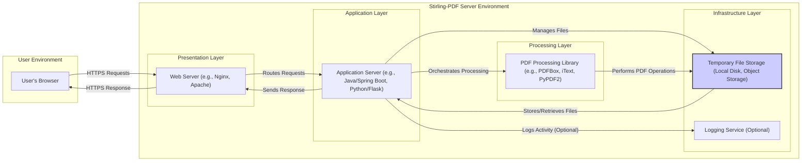
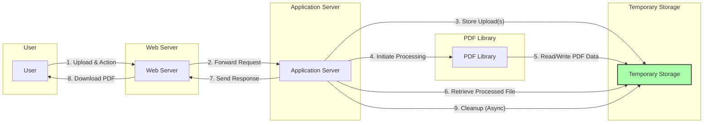

# Project Design Document: Stirling-PDF

**Version:** 1.1
**Date:** October 26, 2023
**Prepared By:** Gemini (AI Language Model)

## 1. Project Overview

Stirling-PDF is envisioned as a robust, self-hosted, web-based application designed for comprehensive PDF manipulation. The project aims to empower users with a suite of functionalities, including merging, splitting, converting between formats, editing metadata, and applying security measures to PDF documents. The focus is on providing a user-friendly experience while maintaining data privacy through its self-hosted nature.

## 2. Goals and Objectives

*   **User Accessibility:**  Offer an intuitive and straightforward web interface accessible across various modern browsers.
*   **Feature Richness:**  Implement a wide array of essential PDF manipulation capabilities.
*   **Self-Hosting Priority:**  Enable easy deployment and management on user-controlled infrastructure, ensuring data sovereignty.
*   **Modularity and Extensibility:** Design the architecture to facilitate the addition of new features and integrations without significant rework.
*   **Security and Data Integrity:**  Prioritize the secure handling of user data and the application's resilience against common web vulnerabilities.
*   **Performance and Scalability:**  Ensure efficient processing of PDF documents of varying sizes and potential for scaling under increased load.

## 3. Target Audience

*   Individual users who frequently work with PDF documents and require a versatile tool for various tasks.
*   Small to medium-sized businesses (SMBs) seeking a cost-effective and privacy-focused alternative to SaaS-based PDF manipulation services.
*   Organizations with strict data privacy regulations or internal security policies that necessitate self-hosted solutions.
*   Developers interested in contributing to an open-source project or integrating PDF manipulation capabilities into their own applications (potentially through future API development).

## 4. System Architecture

The system adheres to a layered architecture, promoting separation of concerns and maintainability:

*   **Presentation Layer (Frontend):**  Responsible for rendering the user interface and handling user interactions within the web browser.
*   **Application Layer (Backend):**  Contains the core business logic, processes user requests, orchestrates PDF manipulations, and manages data flow.
*   **Processing Layer (PDF Engine):** Encapsulates the PDF manipulation functionalities provided by underlying libraries.
*   **Infrastructure Layer (Storage & Services):** Provides supporting services such as temporary file storage and potentially logging or monitoring.

### 4.1. Component Description

*   **User:** Interacts with Stirling-PDF through a standard web browser (Chrome, Firefox, Safari, Edge, etc.).
*   **Web Server:** Serves as the entry point, handling incoming HTTP/HTTPS requests. It performs tasks like:
    *   SSL/TLS termination for secure communication.
    *   Serving static content (HTML, CSS, JavaScript).
    *   Reverse proxying requests to the application server.
    *   Potential load balancing in a scaled deployment.
    *   Examples: Nginx, Apache HTTP Server.
*   **Application Server:** The central component responsible for:
    *   Receiving and interpreting user requests from the web server.
    *   Implementing the core application logic for various PDF operations.
    *   Managing user sessions and potential authentication/authorization.
    *   Interacting with the PDF processing library to perform PDF manipulations.
    *   Managing temporary storage of uploaded and processed files.
    *   Potential implementation using frameworks like Spring Boot (Java), Flask or Django (Python), Express.js (Node.js).
*   **PDF Processing Library:** A software library that provides the low-level functionalities for reading, writing, and manipulating PDF files. Specific examples depend on the chosen backend technology:
    *   Java: PDFBox, iText.
    *   Python: PyPDF2, ReportLab.
    *   Other languages have their respective libraries.
*   **Temporary File Storage:**  Used for transient storage of files during the processing lifecycle. This includes:
    *   Uploaded PDF files before processing.
    *   Intermediate files generated during multi-step operations.
    *   The final processed PDF file before it's downloaded by the user.
    *   Could be the local file system of the server or a dedicated object storage service (e.g., AWS S3, Azure Blob Storage) for scalability and resilience.
*   **Logging Service (Optional):** A component for recording application events, errors, and potentially user activity for debugging, monitoring, and auditing purposes. This could be a simple file-based logging or a more sophisticated centralized logging system.

## 5. Data Flow

A typical PDF manipulation workflow illustrates the data flow:

1. **User Action & File Upload:** The user initiates an action (e.g., merge PDFs) and uploads the necessary PDF file(s) through the web interface.
2. **HTTPS Request to Web Server:** The browser sends an HTTPS request containing the uploaded file(s) and operation details to the web server.
3. **Request Routing to Application Server:** The web server forwards the request to the appropriate endpoint on the application server.
4. **Temporary File Storage:** The application server receives the uploaded file(s) and saves them to the temporary file storage.
5. **Processing Orchestration:** The application server invokes the relevant functions of the PDF processing library, providing the file paths and operation parameters.
6. **PDF Library Operations:** The PDF processing library reads the input file(s) from temporary storage, performs the requested manipulation, and writes the output file to temporary storage.
7. **Response Generation:** The application server retrieves the processed PDF file from temporary storage.
8. **HTTPS Response with Download:** The application server sends an HTTPS response back to the web server, including the processed PDF file as an attachment or a link to download it.
9. **File Download to User:** The web server streams the processed PDF file to the user's browser for download.
10. **Temporary File Cleanup:**  A scheduled task or immediate post-download process removes the temporary files from storage to conserve space and maintain security.

## 6. Key Technologies

The specific technologies employed will influence the system's capabilities and security profile. Potential choices include:

*   **Backend Programming Language:**
    *   Java with Spring Boot: Offers robust enterprise features and a mature ecosystem.
    *   Python with Flask or Django: Provides rapid development and a rich set of libraries.
    *   Node.js with Express.js: Suitable for real-time applications and leverages JavaScript expertise.
*   **Frontend Technologies:**
    *   HTML, CSS, JavaScript: Core web technologies for structuring, styling, and adding interactivity.
    *   JavaScript Frameworks (React, Vue.js, Angular):  Enhance development efficiency and create more dynamic user interfaces.
*   **Web Server:**
    *   Nginx: Known for its performance, stability, and reverse proxy capabilities.
    *   Apache HTTP Server: A widely used and mature web server with a vast array of modules.
*   **PDF Processing Libraries (Examples):**
    *   Java: Apache PDFBox, iText.
    *   Python: PyPDF2, ReportLab, pdfminer.six.
*   **Temporary Storage:**
    *   Local File System: Simple for initial development but might lack scalability and resilience.
    *   Object Storage (AWS S3, Azure Blob Storage, Google Cloud Storage): Offers scalability, durability, and cost-effectiveness for production environments.
*   **Build and Dependency Management:**
    *   Maven or Gradle (Java).
    *   npm or yarn (Node.js).
    *   pip (Python).
*   **Containerization (Optional):**
    *   Docker: For packaging the application and its dependencies into containers for consistent deployment.
*   **Orchestration (Optional):**
    *   Kubernetes: For managing and scaling containerized deployments.

## 7. Security Considerations

Security is paramount for Stirling-PDF, given it handles user-uploaded files. Key considerations include:

*   **Input Validation and Sanitization:**
    *   Verifying that uploaded files are valid PDF files (magic number checks, header analysis).
    *   Sanitizing user inputs to prevent injection attacks (e.g., command injection if file names are used in system calls).
    *   Limiting file upload sizes to prevent denial-of-service.
*   **Authentication and Authorization (If Applicable):**
    *   Implementing secure authentication mechanisms (e.g., password hashing, multi-factor authentication) if user accounts are required.
    *   Enforcing authorization controls to restrict access to specific functionalities based on user roles.
*   **Secure File Handling:**
    *   Storing temporary files in secure locations with restricted permissions.
    *   Generating unique and unpredictable filenames for temporary files to prevent unauthorized access.
    *   Implementing secure deletion of temporary files after processing.
    *   Protecting against path traversal vulnerabilities during file access.
*   **Dependency Management:**
    *   Regularly scanning dependencies for known vulnerabilities and updating them promptly.
    *   Using software composition analysis (SCA) tools to automate vulnerability detection.
*   **Protection Against Web Application Vulnerabilities:**
    *   Cross-Site Scripting (XSS): Encoding output and sanitizing input to prevent malicious scripts from being injected.
    *   Cross-Site Request Forgery (CSRF): Implementing anti-CSRF tokens to prevent unauthorized actions on behalf of authenticated users.
    *   SQL Injection (if a database is used): Using parameterized queries or ORM frameworks to prevent malicious SQL code injection.
*   **Denial of Service (DoS) Prevention:**
    *   Implementing rate limiting to prevent abuse of the application.
    *   Considering resource limits for file processing to prevent resource exhaustion.
*   **Secure Communication (HTTPS):**
    *   Enforcing HTTPS for all communication to encrypt data in transit and protect against eavesdropping.
    *   Properly configuring TLS certificates.
*   **Error Handling and Logging:**
    *   Avoiding exposing sensitive information in error messages.
    *   Implementing comprehensive logging for security auditing and incident response.
*   **Security Headers:**
    *   Configuring appropriate security headers (e.g., Content Security Policy, HTTP Strict Transport Security) to enhance browser-side security.

## 8. Deployment Model

Stirling-PDF's self-hosted nature allows for flexible deployment options:

*   **Standalone Server Deployment:** Deploying the application directly onto a physical or virtual machine. This is suitable for smaller deployments or when direct control over the environment is required.
*   **Containerized Deployment (Docker):** Packaging the application and its dependencies into a Docker container simplifies deployment, ensures consistency across environments, and facilitates scaling. This is a popular choice for modern applications.
*   **Container Orchestration (Kubernetes):** Managing and scaling containerized deployments using Kubernetes provides advanced features like automated deployments, scaling, and self-healing. This is ideal for larger deployments requiring high availability and scalability.
*   **Cloud Platform Deployment:** Deploying on cloud infrastructure services (AWS, Azure, GCP) offers scalability, reliability, and managed services. Specific services used might include:
    *   Compute instances (EC2, Azure VMs, Compute Engine).
    *   Container services (ECS, AKS, GKE).
    *   Object storage (S3, Azure Blob Storage, Cloud Storage).

## 9. Future Considerations

The following enhancements could be considered for future development:

*   **API Development:**  Providing a RESTful API to allow programmatic access to Stirling-PDF's functionalities, enabling integration with other applications and workflows.
*   **Enhanced User Management:** Implementing a more sophisticated user management system with features like user roles, permissions, and potentially integration with existing authentication providers (LDAP, OAuth 2.0).
*   **Optical Character Recognition (OCR):** Integrating OCR capabilities to extract text from scanned PDFs or images.
*   **Digital Signatures:**  Adding functionality to apply and verify digital signatures on PDF documents.
*   **Advanced Editing Features:**  Expanding editing capabilities beyond basic metadata to include content modification, annotation, and form filling.
*   **Performance Optimization:**  Continuously improving the performance of PDF processing, especially for large or complex documents, through techniques like asynchronous processing and resource optimization.
*   **Multi-Language Support (Internationalization):**  Localizing the user interface to support multiple languages.
*   **Plugin Architecture:**  Designing a plugin system to allow developers to extend Stirling-PDF's functionality with custom modules.

This revised design document provides a more detailed and comprehensive overview of the Stirling-PDF project, offering a solid foundation for subsequent threat modeling activities.