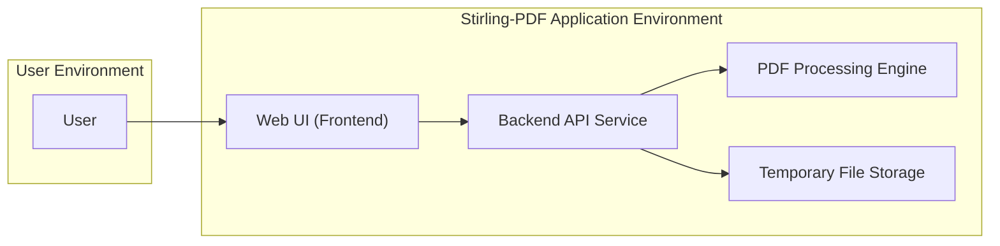
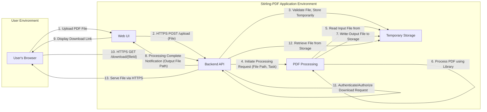
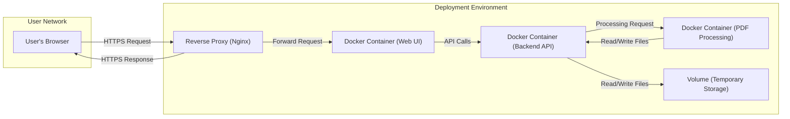

## Project Design Document: Stirling-PDF (Improved)

**1. Introduction**

This document provides an enhanced design overview of the Stirling-PDF project, an open-source, locally hosted web application designed for various PDF manipulation tasks. This document aims to provide a clear and detailed understanding of the system's architecture, components, data flow, and key technologies, specifically tailored for subsequent threat modeling activities. The improvements in this version aim to provide greater clarity and detail for security analysis.

**2. Goals and Objectives**

* **Project Goal:** To offer a user-friendly, self-hosted web application enabling a wide range of PDF manipulation functionalities.
* **Document Objective:** To create a comprehensive and detailed design document that accurately reflects the Stirling-PDF architecture, providing a solid foundation for effective threat modeling, security analysis, and risk assessment.

**3. High-Level Architecture**

The Stirling-PDF application is structured using a layered architecture, promoting separation of concerns:

* **Presentation Tier (Frontend):**  Responsible for the user interface and user interaction.
* **Application Tier (Backend):**  Contains the core business logic and orchestrates PDF processing.
* **Data Tier (Storage):**  Manages the temporary storage of files during processing.

**4. Component Details**

This section provides a more detailed breakdown of each component within the Stirling-PDF application, highlighting their functionalities and potential security considerations.

* **4.1. Web UI (Frontend)**
    * **Description:** The client-side interface built with web technologies, enabling user interaction with the application.
    * **Functionality:**
        * Presents a user-friendly interface for selecting PDF manipulation tasks (e.g., merge, split, compress).
        * Facilitates the secure upload of PDF files from the user's local machine.
        * Displays real-time progress updates during PDF processing.
        * Provides mechanisms for downloading the processed PDF files.
        * Manages user sessions and potentially authentication credentials (if implemented).
    * **Technology:**  Likely implemented using HTML, CSS, and a JavaScript framework or library such as React, Vue.js, or Angular. May utilize browser APIs for file handling.
    * **Key Interactions:**
        * Receives user input (file selections, task parameters, credentials).
        * Sends asynchronous requests (AJAX/Fetch) to the Backend API Service.
        * Receives responses from the Backend API Service (processing status, download URLs, error messages).
    * **Security Considerations:**
        * Vulnerable to Cross-Site Scripting (XSS) attacks if user-provided data is not properly sanitized before rendering.
        * Susceptible to Cross-Site Request Forgery (CSRF) attacks if proper anti-CSRF tokens are not implemented.
        * Requires secure handling of any potentially sensitive data within the browser's local storage or session storage.
        * Needs protection against clickjacking attacks.

* **4.2. Backend API Service**
    * **Description:** The server-side component responsible for handling requests from the Web UI and orchestrating the PDF processing workflow.
    * **Functionality:**
        * Receives and validates requests from the Web UI, including file uploads and task specifications.
        * Implements authentication and authorization mechanisms to control access to functionalities (if implemented).
        * Manages the temporary storage of uploaded files, ensuring secure access and lifecycle management.
        * Delegates the actual PDF manipulation tasks to the PDF Processing Engine.
        * Handles error logging and reporting.
        * Provides API endpoints for the Web UI to interact with (e.g., for uploading files, initiating processing, checking status, downloading results).
    * **Technology:** Likely built using a backend framework such as Spring Boot (Java), Node.js with Express, or similar.
    * **Key Interactions:**
        * Receives HTTP requests from the Web UI.
        * Interacts with the Temporary File Storage to store and retrieve files.
        * Communicates with the PDF Processing Engine to execute PDF operations.
        * Sends HTTP responses back to the Web UI.
    * **Security Considerations:**
        * Requires robust input validation to prevent injection attacks (e.g., SQL injection, command injection).
        * Needs secure handling of file uploads to prevent malicious file uploads and path traversal vulnerabilities.
        * Must implement proper authentication and authorization to protect sensitive operations and data.
        * Vulnerable to API abuse if rate limiting and other security measures are not in place.
        * Requires secure logging practices to avoid exposing sensitive information.

* **4.3. PDF Processing Engine**
    * **Description:** The core component responsible for performing the actual manipulation of PDF files.
    * **Functionality:**
        * Executes various PDF operations based on instructions received from the Backend API Service (e.g., merging, splitting, rotating, compressing, converting).
        * Reads input PDF files from the Temporary File Storage.
        * Writes processed PDF files back to the Temporary File Storage.
        * May involve the use of external libraries or system calls for specific PDF operations.
    * **Technology:**  Likely utilizes a dedicated PDF processing library such as Apache PDFBox (Java), iText (Java), or similar libraries in other languages.
    * **Key Interactions:**
        * Receives instructions and file paths from the Backend API Service.
        * Reads PDF files from the Temporary File Storage.
        * Writes processed PDF files to the Temporary File Storage.
    * **Security Considerations:**
        * Potential vulnerabilities within the PDF processing library itself (requires keeping libraries up-to-date).
        * Risk of resource exhaustion if processing very large or complex PDF files without proper safeguards.
        * Needs careful handling of file paths to prevent access to unauthorized files.

* **4.4. Temporary File Storage**
    * **Description:** A mechanism for temporarily storing uploaded PDF files and the resulting processed files during the operation lifecycle.
    * **Functionality:**
        * Provides secure and temporary storage for uploaded PDF files before and during processing.
        * Stores processed PDF files temporarily, allowing users to download them.
        * Implements a cleanup mechanism to automatically delete temporary files after a defined period or upon successful download.
        * May involve setting appropriate file permissions to restrict access.
    * **Technology:** Could be the local filesystem (within a designated temporary directory), a dedicated temporary storage service, or potentially a more ephemeral storage solution.
    * **Key Interactions:**
        * Backend API Service writes uploaded files to the storage.
        * PDF Processing Engine reads input files from the storage and writes output files to the storage.
        * Backend API Service retrieves processed files for download by the user.
    * **Security Considerations:**
        * Requires proper access controls to prevent unauthorized access to uploaded and processed files.
        * Needs secure deletion mechanisms to ensure that temporary files are completely removed and cannot be recovered.
        * Potential risk of denial-of-service if the storage fills up due to excessive uploads or failures in the cleanup process.
        * If using the local filesystem, ensure appropriate directory permissions are set.

**5. Data Flow Diagram**

This diagram provides a more detailed illustration of the data flow within the Stirling-PDF application for a typical PDF processing task, highlighting potential security touchpoints.

**Data Flow Steps:**

1. **User Uploads PDF File:** The user selects a PDF file through the Web UI.
2. **HTTPS POST /upload (File):** The Web UI sends an HTTPS POST request to the Backend API, including the file data.
3. **Validate File, Store Temporarily:** The Backend API validates the uploaded file (e.g., file type, size) and stores it securely in the Temporary Storage.
4. **Initiate Processing Request (File Path, Task):** The Backend API sends a request to the PDF Processing Engine, specifying the path to the input file in temporary storage and the desired processing task.
5. **Read Input File from Storage:** The PDF Processing Engine reads the input PDF file from the Temporary Storage.
6. **Process PDF using Library:** The PDF Processing Engine utilizes a PDF processing library to perform the requested manipulation.
7. **Write Output File to Storage:** The PDF Processing Engine writes the processed PDF file back to the Temporary Storage.
8. **Processing Complete Notification (Output File Path):** The Backend API notifies the Web UI that the processing is complete and provides the path or identifier for the output file.
9. **Display Download Link:** The Web UI displays a download link to the user.
10. **HTTPS GET /download/{fileId}:** The user clicks the download link, triggering an HTTPS GET request to the Backend API with a file identifier.
11. **Authenticate/Authorize Download Request:** The Backend API authenticates and authorizes the download request to ensure the user has permission to access the file.
12. **Retrieve File from Storage:** The Backend API retrieves the requested file from the Temporary Storage.
13. **Serve File via HTTPS:** The Backend API serves the processed PDF file to the user's browser over HTTPS.

**6. Security Considerations (Detailed)**

This section expands on the initial security considerations, providing more specific examples of potential threats and vulnerabilities associated with each component and the data flow.

* **Web UI (Frontend):**
    * **Threat:** Malicious scripts injected through XSS could steal user credentials or perform actions on their behalf.
    * **Mitigation:** Implement robust input sanitization and output encoding. Utilize Content Security Policy (CSP) headers.
    * **Threat:** CSRF attacks could trick users into performing unintended actions.
    * **Mitigation:** Implement anti-CSRF tokens synchronized with the backend.
    * **Threat:** Sensitive information stored in browser storage could be compromised.
    * **Mitigation:** Avoid storing sensitive data in local or session storage. If necessary, encrypt the data.
    * **Threat:** Clickjacking attacks could trick users into clicking on malicious elements.
    * **Mitigation:** Implement frame busting techniques or use the `X-Frame-Options` header.

* **Backend API Service:**
    * **Threat:** SQL injection attacks if database queries are constructed using unsanitized user input (if a database is used for user management or other data).
    * **Mitigation:** Use parameterized queries or an ORM to prevent SQL injection.
    * **Threat:** Command injection attacks if the application executes system commands based on user input.
    * **Mitigation:** Avoid executing system commands based on user input. If necessary, sanitize input thoroughly and use safe APIs.
    * **Threat:** Path traversal vulnerabilities during file upload could allow attackers to write files to arbitrary locations.
    * **Mitigation:** Implement strict validation of uploaded file paths and store files in a secure location with restricted access.
    * **Threat:** Brute-force attacks on authentication endpoints (if implemented).
    * **Mitigation:** Implement rate limiting, account lockout policies, and strong password requirements.
    * **Threat:** Exposure of sensitive information through error messages or logs.
    * **Mitigation:** Implement secure logging practices and avoid displaying detailed error messages to users in production.

* **PDF Processing Engine:**
    * **Threat:** Vulnerabilities within the PDF processing library could be exploited to execute arbitrary code or cause denial-of-service.
    * **Mitigation:** Keep the PDF processing library up-to-date with the latest security patches.
    * **Threat:** Processing extremely large or complex PDF files could lead to resource exhaustion (CPU, memory).
    * **Mitigation:** Implement file size limits and timeouts for processing operations.
    * **Threat:** Maliciously crafted PDF files could exploit vulnerabilities in the processing library.
    * **Mitigation:** Consider using sandboxing techniques or running the processing engine in a restricted environment.

* **Temporary File Storage:**
    * **Threat:** Unauthorized access to temporary files could expose sensitive data.
    * **Mitigation:** Implement strong access controls and file permissions on the temporary storage location.
    * **Threat:** Failure to securely delete temporary files could leave sensitive data vulnerable.
    * **Mitigation:** Implement secure deletion mechanisms that overwrite file data before deletion.
    * **Threat:** Filling up the temporary storage could lead to denial-of-service.
    * **Mitigation:** Implement mechanisms to monitor storage usage and automatically clean up old files.

**7. Deployment Architecture**

A typical deployment of Stirling-PDF, emphasizing security considerations, might involve:

* **Containerization (Docker):** Packaging the application and its dependencies in Docker containers for consistent and isolated deployments. This helps in limiting the impact of potential security breaches within the container.
* **Reverse Proxy (e.g., Nginx with TLS Termination):** Placing a reverse proxy in front of the application to handle SSL/TLS encryption, protecting data in transit. The reverse proxy can also provide additional security features like request filtering and rate limiting.
* **Secure Network Configuration:** Deploying the application within a secure network environment with appropriate firewall rules to restrict access to necessary ports and services.
* **Regular Security Audits and Penetration Testing:** Periodically assessing the security of the deployed environment and the application itself to identify and address potential vulnerabilities.
* **Principle of Least Privilege:** Ensuring that each component and process runs with the minimum necessary permissions.

**8. Technologies Used**

* **Programming Languages:** Java, JavaScript (likely).
* **Backend Framework:** Spring Boot (likely).
* **Frontend Framework:** React, Vue.js, or Angular (likely).
* **PDF Processing Library:** Apache PDFBox or iText (likely).
* **Containerization:** Docker.
* **Reverse Proxy:** Nginx.
* **Operating System:** Linux (common for deployment).

**9. Future Considerations**

* **User Authentication and Authorization:** Implementing a robust system for managing user accounts and controlling access to features.
* **Database Integration:** Utilizing a database for persistent storage of user data, settings, and potentially audit logs.
* **Enhanced Security Features:** Implementing features like two-factor authentication, intrusion detection, and security information and event management (SIEM).
* **Plugin Architecture with Security Considerations:** If plugins are introduced, careful consideration must be given to their security implications and potential vulnerabilities.
* **Cloud Integration with Secure Credentials Management:** If integrating with cloud services, secure management of API keys and credentials is crucial.

This improved design document provides a more detailed and security-focused overview of the Stirling-PDF project. It serves as a valuable resource for conducting thorough threat modeling and implementing appropriate security controls.