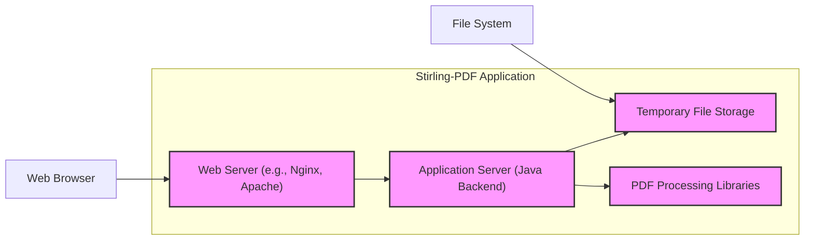
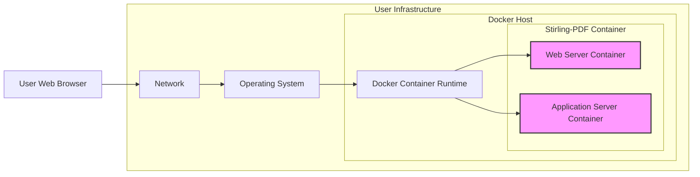

# BUSINESS POSTURE

This project, Stirling-PDF, aims to provide a self-hosted, open-source PDF manipulation tool. It addresses the business need for users and organizations to handle PDF documents securely and privately, without relying on third-party cloud services.

Business Priorities and Goals:
- Provide a comprehensive suite of PDF manipulation tools.
- Ensure user privacy and data security through self-hosting.
- Offer a free and open-source alternative to commercial PDF software.
- Maintain ease of use and accessibility for a wide range of users.
- Foster a community around the project for contributions and support.

Business Risks:
- Reputational damage due to security vulnerabilities in the software.
- Operational risks associated with self-hosting complexity and user configuration errors.
- Legal and compliance risks if the software is misused for malicious purposes or data breaches.
- Risk of insufficient community support and maintenance leading to project stagnation.
- Competition from established commercial and open-source PDF tools.

# SECURITY POSTURE

Existing Security Controls:
- security control HTTPS enforcement for web access (inferred from typical web application best practices).
- security control Input validation on file uploads (inferred as necessary for PDF processing).
- security control Dependency scanning as part of development process (inferred as good practice for open-source projects).
- accepted risk Reliance on user's infrastructure security for self-hosting deployments.
- accepted risk Potential vulnerabilities in third-party libraries used for PDF processing.

Recommended Security Controls:
- security control Implement robust authentication and authorization mechanisms to control access to the application and its features.
- security control Regularly perform security audits and penetration testing to identify and address vulnerabilities.
- security control Implement a Content Security Policy (CSP) to mitigate Cross-Site Scripting (XSS) attacks.
- security control Employ a Web Application Firewall (WAF) to protect against common web attacks.
- security control Implement rate limiting to prevent denial-of-service attacks.
- security control Secure file handling practices, including secure temporary file storage and deletion.
- security control Regularly update dependencies to patch known vulnerabilities.
- security control Implement logging and monitoring for security events and anomalies.

Security Requirements:
- Authentication:
    - Requirement Implement a secure authentication mechanism to verify user identity. Consider supporting various authentication methods (e.g., username/password, OAuth).
    - Requirement Protect authentication credentials in transit and at rest.
- Authorization:
    - Requirement Implement a role-based access control (RBAC) system to manage user permissions and access to different functionalities.
    - Requirement Enforce the principle of least privilege, granting users only the necessary permissions.
- Input Validation:
    - Requirement Validate all user inputs, especially file uploads and form data, to prevent injection attacks (e.g., SQL injection, command injection, path traversal).
    - Requirement Sanitize user inputs before processing and displaying them to prevent XSS attacks.
    - Requirement Implement file type validation and size limits for uploaded files to prevent malicious uploads and resource exhaustion.
- Cryptography:
    - Requirement Use strong cryptography for sensitive data at rest and in transit.
    - Requirement Securely store cryptographic keys and manage their lifecycle.
    - Requirement Utilize HTTPS for all communication to protect data in transit.
    - Requirement Consider encrypting sensitive data at rest, such as user configurations or temporary files containing sensitive information.

# DESIGN

## C4 CONTEXT

```mermaid
flowchart LR
    subgraph "Self-Hosted Environment"
        A["Stirling-PDF Application"]
    end
    B["User"] --> A
    C["File System"] --> A
    D["Operating System"] --> A
    E["Web Browser"] <-- B
    style A fill:#f9f,stroke:#333,stroke-width:2px
```

Context Diagram Elements:

- Element:
    - Name: User
    - Type: Person
    - Description: Individuals who interact with the Stirling-PDF application to perform PDF manipulation tasks.
    - Responsibilities: Access Stirling-PDF through a web browser, upload PDF files, select and execute PDF operations, download processed PDF files.
    - Security controls: User-managed credentials (if authentication is implemented), secure browsing practices.

- Element:
    - Name: Stirling-PDF Application
    - Type: Software System
    - Description: The self-hosted PDF manipulation application, providing a web interface for users to perform various PDF operations.
    - Responsibilities: Receive user requests, process PDF files according to user selections, interact with the file system and operating system, return processed PDF files to the user.
    - Security controls: Authentication, authorization, input validation, secure file handling, HTTPS, logging, monitoring.

- Element:
    - Name: File System
    - Type: Infrastructure
    - Description: The local file system where Stirling-PDF is deployed, used for temporary storage of uploaded and processed PDF files.
    - Responsibilities: Provide storage for PDF files, manage file access permissions.
    - Security controls: File system permissions, access controls, disk encryption (depending on the hosting environment).

- Element:
    - Name: Operating System
    - Type: Infrastructure
    - Description: The operating system on which Stirling-PDF is deployed, providing the runtime environment and system resources.
    - Responsibilities: Execute Stirling-PDF application, manage system resources, provide network connectivity.
    - Security controls: Operating system security hardening, access controls, patching, firewall.

- Element:
    - Name: Web Browser
    - Type: Software System
    - Description: The user's web browser used to access and interact with the Stirling-PDF web interface.
    - Responsibilities: Render the Stirling-PDF web interface, send user requests to the application, display processed results.
    - Security controls: Browser security features, user-installed browser extensions, HTTPS support.

## C4 CONTAINER



Container Diagram Elements:

- Element:
    - Name: Web Server (e.g., Nginx, Apache)
    - Type: Container
    - Description: Handles incoming HTTP requests from users' web browsers, serves static content, and proxies requests to the Application Server.
    - Responsibilities: Web request handling, TLS termination (HTTPS), static content serving, reverse proxy, rate limiting, basic security filtering.
    - Security controls: HTTPS configuration, TLS certificates, rate limiting, web server security hardening, CSP, HSTS.

- Element:
    - Name: Application Server (Java Backend)
    - Type: Container
    - Description: The core application logic written in Java, responsible for processing user requests, performing PDF manipulations using libraries, and managing temporary files.
    - Responsibilities: Business logic execution, PDF processing, input validation, authorization, session management, interaction with temporary file storage.
    - Security controls: Input validation, authorization, secure coding practices, dependency management, logging, error handling, secure temporary file handling.

- Element:
    - Name: Temporary File Storage
    - Type: Container
    - Description: A designated storage area on the file system for temporarily storing uploaded PDF files and intermediate processing results.
    - Responsibilities: Temporary file storage, access control for the application server, file cleanup.
    - Security controls: File system permissions, access controls, secure temporary directory configuration, automated file deletion, disk space monitoring.

- Element:
    - Name: PDF Processing Libraries
    - Type: Container (Libraries)
    - Description: Third-party Java libraries used by the Application Server to perform various PDF manipulation operations (e.g., PDFBox, iText).
    - Responsibilities: Provide PDF processing functionalities.
    - Security controls: Dependency scanning, vulnerability monitoring, library updates, usage within a sandboxed environment (if feasible).

## DEPLOYMENT

Deployment Solution: Docker Container Deployment



Deployment Diagram Elements:

- Element:
    - Name: User Web Browser
    - Type: Software
    - Description: User's web browser accessing Stirling-PDF.
    - Responsibilities: Access the application via HTTPS.
    - Security controls: Browser security features.

- Element:
    - Name: Network
    - Type: Network
    - Description: User's local network or internet connection.
    - Responsibilities: Provide network connectivity between user and Stirling-PDF server.
    - Security controls: Network firewall, network segmentation (user responsibility).

- Element:
    - Name: Operating System
    - Type: Infrastructure
    - Description: Host operating system for Docker.
    - Responsibilities: Host Docker runtime, manage system resources.
    - Security controls: OS hardening, patching, access control, firewall.

- Element:
    - Name: Docker Host
    - Type: Infrastructure
    - Description: Server or VM running Docker.
    - Responsibilities: Run Docker containers.
    - Security controls: Docker security best practices, container isolation, resource limits.

- Element:
    - Name: Docker Container Runtime
    - Type: Software
    - Description: Docker engine responsible for running containers.
    - Responsibilities: Container lifecycle management, resource allocation, isolation.
    - Security controls: Docker security configurations, vulnerability scanning of Docker images.

- Element:
    - Name: Stirling-PDF Container
    - Type: Container
    - Description: Docker container encapsulating Stirling-PDF application.
    - Responsibilities: Run Stirling-PDF application components (Web Server and Application Server).
    - Security controls: Container image security scanning, least privilege user within container, resource limits.

- Element:
    - Name: Web Server Container
    - Type: Container
    - Description: Docker container running the Web Server.
    - Responsibilities: Serve web requests, reverse proxy to Application Server.
    - Security controls: Web server security configurations within container.

- Element:
    - Name: Application Server Container
    - Type: Container
    - Description: Docker container running the Java backend Application Server.
    - Responsibilities: Application logic, PDF processing.
    - Security controls: Application security controls within container.

## BUILD

```mermaid
flowchart LR
    A["Developer"] --> B["Code Repository (GitHub)"]
    B --> C["CI/CD Pipeline (GitHub Actions)"]
    C --> D["Build Process (Maven, Docker Build)"]
    D --> E["Security Scans (SAST, Dependency Check)"]
    E --> F["Artifact Repository (Docker Hub/Registry)"]
    F --> G["Deployment Environment"]
    style C fill:#f9f,stroke:#333,stroke-width:2px
    style D fill:#f9f,stroke:#333,stroke-width:2px
    style E fill:#f9f,stroke:#333,stroke-width:2px
```



Build Process Diagram Elements:

- Element:
    - Name: Developer
    - Type: Person
    - Description: Software developers contributing to the Stirling-PDF project.
    - Responsibilities: Write code, commit changes to the code repository.
    - Security controls: Secure development practices, code review, access control to code repository.

- Element:
    - Name: Code Repository (GitHub)
    - Type: Software System
    - Description: GitHub repository hosting the Stirling-PDF source code.
    - Responsibilities: Version control, code storage, collaboration platform.
    - Security controls: Access control, branch protection, audit logs, vulnerability scanning (GitHub Dependabot).

- Element:
    - Name: CI/CD Pipeline (GitHub Actions)
    - Type: Software System
    - Description: GitHub Actions workflows automating the build, test, and deployment processes.
    - Responsibilities: Automated build, testing, security scanning, artifact publishing.
    - Security controls: Secure pipeline configuration, access control to workflows, secret management, audit logs.

- Element:
    - Name: Build Process (Maven, Docker Build)
    - Type: Software System
    - Description: Build tools and scripts used to compile the Java backend, package the application, and build Docker images.
    - Responsibilities: Code compilation, dependency management, artifact creation, Docker image building.
    - Security controls: Dependency management (Maven), secure build configurations, reproducible builds.

- Element:
    - Name: Security Scans (SAST, Dependency Check)
    - Type: Software System
    - Description: Automated security scanning tools integrated into the CI/CD pipeline to identify vulnerabilities in the code and dependencies.
    - Responsibilities: Static Application Security Testing (SAST), Dependency vulnerability scanning.
    - Security controls: SAST tool configuration, dependency check tool configuration, vulnerability reporting, integration with CI/CD pipeline.

- Element:
    - Name: Artifact Repository (Docker Hub/Registry)
    - Type: Software System
    - Description: Repository for storing and distributing build artifacts, such as Docker images.
    - Responsibilities: Artifact storage, versioning, distribution.
    - Security controls: Access control, image signing, vulnerability scanning of stored images, secure registry configuration.

- Element:
    - Name: Deployment Environment
    - Type: Infrastructure
    - Description: User's infrastructure where Stirling-PDF is deployed (e.g., Docker host).
    - Responsibilities: Run and host the Stirling-PDF application.
    - Security controls: Infrastructure security controls (as described in Deployment section).

# RISK ASSESSMENT

Critical Business Processes:
- PDF manipulation services provided by Stirling-PDF.
- Availability and integrity of the Stirling-PDF application.
- Confidentiality of user-uploaded PDF documents during processing.

Data Sensitivity:
- User-uploaded PDF documents: Sensitivity depends on the content of the documents. Could contain personal data, confidential business information, or sensitive government data. Sensitivity level can range from low to high depending on the user and document content.
- Application logs: May contain operational information and potentially user activity details. Sensitivity level is medium, requiring protection against unauthorized access.
- Configuration data: May contain sensitive settings and credentials. Sensitivity level is high, requiring strong protection.

# QUESTIONS & ASSUMPTIONS

Questions:
- What is the intended user base for Stirling-PDF (individuals, small businesses, large organizations)?
- What are the expected workloads and performance requirements?
- Are there any specific compliance requirements (e.g., GDPR, HIPAA) that the application needs to adhere to?
- What level of security expertise is expected from the users who will self-host Stirling-PDF?
- Are there any plans for implementing user authentication and authorization in the future?
- What are the current security practices in place for development and deployment?

Assumptions:
- Stirling-PDF is intended for users who prioritize privacy and control over their data.
- Users are expected to have some technical knowledge to self-host the application.
- The application is currently designed for single-instance deployment, without built-in clustering or high availability features.
- Security is a growing concern for the project, and the development team is open to implementing security improvements.
- The primary deployment method is assumed to be Docker containers for ease of self-hosting.
- The project is currently in active development and open to community contributions.