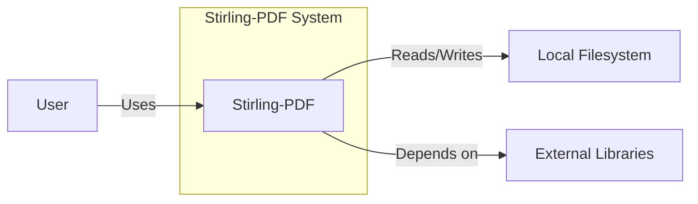
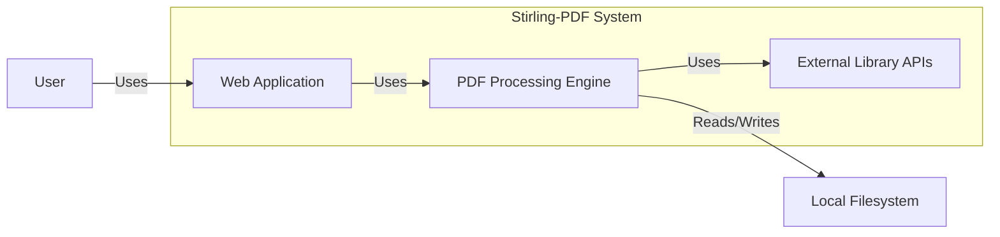
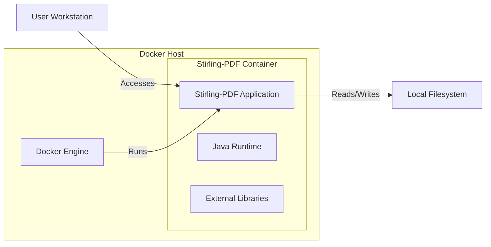

Okay, let's create a design document for the Stirling-PDF project.

# BUSINESS POSTURE

Stirling-PDF is a locally hosted web application that allows users to perform various operations on PDF files, such as splitting, merging, rotating, and converting them.  The project appears to be targeted towards individual users or small teams who need to manipulate PDFs but have concerns about uploading sensitive documents to cloud-based services.  It emphasizes local processing and privacy.

Business Priorities:

*   Provide a free, open-source, and easy-to-use tool for PDF manipulation.
*   Ensure user data privacy by processing all files locally.
*   Offer a wide range of PDF manipulation features.
*   Maintain a user-friendly interface.
*   Build a community around the project (evidenced by the GitHub repository and discussions).

Business Goals:

*   Become a widely recognized and trusted tool for local PDF manipulation.
*   Attract a community of contributors to enhance and maintain the project.
*   Potentially, in the future, explore options for sustainable development (e.g., donations, enterprise features, etc. - though this is speculative).

Most Important Business Risks:

*   Data breaches or leaks, even though processing is local, vulnerabilities in the application could expose user files.
*   Malicious PDF files uploaded by users could exploit vulnerabilities in the application or underlying libraries, leading to system compromise.
*   Lack of regular updates and security patches could expose users to known vulnerabilities over time.
*   The project's reliance on external libraries introduces supply chain risks.
*   Usability issues or bugs could deter users and damage the project's reputation.
*   Legal issues arising from users utilizing the tool for illegal activities (e.g., copyright infringement).

# SECURITY POSTURE

Existing Security Controls:

*   security control: Local Processing: The core design principle of processing all data locally significantly reduces the attack surface compared to cloud-based solutions. (Described in the project's README and inherent in its architecture).
*   security control: Docker Containerization: The application is packaged as a Docker container, providing some level of isolation and environment consistency. (Described in the project's README and Dockerfile).
*   security control: Use of Java: Java, while having its own set of potential vulnerabilities, is a widely used language with established security best practices and readily available security tooling. (Implicit in the project's codebase).
*   security control: Dependency Management: The project uses Gradle for dependency management, allowing for tracking and updating of external libraries. (Visible in the `build.gradle` file).
*   security control: Limited External Network Access: The application, by design, has limited interaction with external networks, primarily for fetching updates or potentially accessing external resources if configured by the user (e.g., for specific features). (Inferred from the project's description and architecture).

Accepted Risks:

*   accepted risk: Supply Chain Vulnerabilities: The project relies on numerous third-party libraries (e.g., PDFBox, OCRmyPDF), which may contain unknown vulnerabilities.
*   accepted risk: Local File System Access: The application requires read/write access to the local file system to process PDF files, which could be a potential target for attackers.
*   accepted risk: User-Uploaded Malicious Files: The application is inherently vulnerable to attacks involving maliciously crafted PDF files designed to exploit vulnerabilities in the parsing and processing libraries.
*   accepted risk: Lack of Formal Security Audits: The project, being open-source and community-driven, likely hasn't undergone formal, comprehensive security audits.
*   accepted risk: Potential for DoS: A user could upload a very large or complex PDF, potentially causing a denial-of-service condition.

Recommended Security Controls:

*   Implement Content Security Policy (CSP) to mitigate XSS risks.
*   Implement regular security scanning of dependencies (e.g., using tools like Snyk, Dependabot, or OWASP Dependency-Check).
*   Implement input sanitization and validation to prevent injection attacks.
*   Consider sandboxing the PDF processing components to further isolate them from the host system.
*   Provide clear security guidelines and recommendations for users, especially regarding the handling of sensitive documents.
*   Establish a security reporting process for vulnerabilities discovered by the community.
*   Consider using a more memory-safe language or runtime for critical components, if feasible.

Security Requirements:

*   Authentication: Not strictly required for the core functionality, as it's designed for local use. However, if features like user accounts or access controls are added, strong authentication mechanisms (including password hashing and salting) will be necessary.
*   Authorization: Currently, authorization is implicit (local file system access). If user roles or permissions are introduced, a robust authorization system will be needed to control access to features and files.
*   Input Validation: Crucial to prevent injection attacks and ensure that the application only processes valid PDF files. This includes validating file types, sizes, and potentially scanning for malicious content.
*   Cryptography: While not directly used for core functionality, if features like encryption or digital signatures are added, strong cryptographic algorithms and secure key management practices must be implemented. Consider using established libraries like Bouncy Castle.
*   Output Encoding: Important to prevent XSS vulnerabilities if the application displays any user-provided data or metadata.

# DESIGN

## C4 CONTEXT



Element Descriptions:

*   Element:
    *   Name: User
    *   Type: Person
    *   Description: A person who interacts with Stirling-PDF to manipulate PDF files.
    *   Responsibilities: Uploading PDFs, selecting operations, downloading processed PDFs.
    *   Security controls: None (external to the system).

*   Element:
    *   Name: Stirling-PDF
    *   Type: Software System
    *   Description: The web application that provides PDF manipulation capabilities.
    *   Responsibilities: Providing the user interface, managing PDF processing, interacting with the local filesystem.
    *   Security controls: Local processing, Docker containerization, dependency management.

*   Element:
    *   Name: Local Filesystem
    *   Type: System
    *   Description: The user's local file system where PDF files are stored and accessed.
    *   Responsibilities: Storing input and output PDF files.
    *   Security controls: Operating system file permissions.

*   Element:
    *   Name: External Libraries
    *   Type: System
    *   Description: Third-party libraries used by Stirling-PDF for PDF processing and other functionalities.
    *   Responsibilities: Providing core PDF manipulation logic (e.g., PDFBox), OCR (e.g., OCRmyPDF), and other utilities.
    *   Security controls: Rely on the security practices of the library developers and regular updates.

## C4 CONTAINER



Element Descriptions:

*   Element:
    *   Name: User
    *   Type: Person
    *   Description: A person who interacts with the Stirling-PDF web application.
    *   Responsibilities: Uploading PDFs, selecting operations, downloading processed PDFs.
    *   Security controls: None (external to the system).

*   Element:
    *   Name: Web Application
    *   Type: Web Application
    *   Description: The front-end and user interface of Stirling-PDF, built with Spring Boot.
    *   Responsibilities: Handling user requests, displaying the UI, communicating with the PDF processing engine.
    *   Security controls: Input validation, output encoding (recommended), CSP (recommended).

*   Element:
    *   Name: PDF Processing Engine
    *   Type: Java Library
    *   Description: The core logic for manipulating PDF files, utilizing external libraries.
    *   Responsibilities: Splitting, merging, rotating, converting, and performing other PDF operations.
    *   Security controls: Input sanitization (recommended), sandboxing (recommended).

*   Element:
    *   Name: External Library APIs
    *   Type: API
    *   Description: Interfaces to the third-party libraries used for PDF processing (e.g., PDFBox, OCRmyPDF).
    *   Responsibilities: Providing the underlying functionality for PDF manipulation.
    *   Security controls: Rely on the security practices of the library developers and regular updates.

*   Element:
    *   Name: Local Filesystem
    *   Type: System
    *   Description: The user's local file system where PDF files are stored.
    *   Responsibilities: Storing input and output PDF files.
    *   Security controls: Operating system file permissions.

## DEPLOYMENT

Possible Deployment Solutions:

1.  Docker (using the provided Dockerfile): This is the primary and recommended deployment method.
2.  Manual setup (building from source and running the JAR file): This is possible but less convenient and requires manual dependency management.
3.  Cloud deployment (e.g., on a VM or container service): While possible, this goes against the project's core principle of local processing and introduces additional security considerations.

Chosen Deployment Solution: Docker



Element Descriptions:

*   Element:
    *   Name: User Workstation
    *   Type: Device
    *   Description: The user's computer where they access the Stirling-PDF web application.
    *   Responsibilities: Running a web browser to interact with the application.
    *   Security controls: Browser security settings, operating system security.

*   Element:
    *   Name: Docker Engine
    *   Type: Software
    *   Description: The Docker runtime environment that manages and runs containers.
    *   Responsibilities: Creating, starting, stopping, and managing the Stirling-PDF container.
    *   Security controls: Docker security best practices (e.g., running containers as non-root users, limiting resource usage).

*   Element:
    *   Name: Stirling-PDF Container
    *   Type: Container
    *   Description: The isolated environment containing the Stirling-PDF application and its dependencies.
    *   Responsibilities: Running the application and providing PDF manipulation services.
    *   Security controls: Container isolation, limited resource usage (recommended).

*   Element:
    *   Name: Stirling-PDF Application
    *   Type: Application
    *   Description: The running instance of the Stirling-PDF web application.
    *   Responsibilities: Handling user requests and performing PDF operations.
    *   Security controls: Input validation, output encoding, CSP (recommended).

*   Element:
    *   Name: Java Runtime
    *   Type: Runtime
    *   Description: The Java Virtual Machine (JVM) that executes the Stirling-PDF application code.
    *   Responsibilities: Providing the runtime environment for the Java application.
    *   Security controls: Regular updates to the JVM to address security vulnerabilities.

*   Element:
    *   Name: External Libraries
    *   Type: Libraries
    *   Description: The third-party libraries used by Stirling-PDF.
    *   Responsibilities: Providing core PDF manipulation functionality.
    *   Security controls: Dependency management, regular security scanning (recommended).

*   Element:
    *   Name: Local Filesystem
    *   Type: System
    *   Description: The user's local file system, mounted into the Docker container.
    *   Responsibilities: Storing input and output PDF files.
    *   Security controls: Operating system file permissions, Docker volume permissions.

## BUILD

The Stirling-PDF project uses Gradle as its build system. The build process is defined in the `build.gradle` file.

```mermaid
graph LR
    A[Developer] -- Commits code --> B[GitHub Repository]
    B -- Triggers --> C[GitHub Actions (CI)]
    C -- Uses --> D[Gradle]
    D -- Downloads --> E[Dependencies]
    D -- Compiles --> F[Java Code]
    D -- Runs --> G[Tests]
    D -- Packages --> H[JAR File]
    D -- Builds --> I[Docker Image]
    I -- Pushes to --> J[Docker Hub]
    subgraph Security Checks
        K[SAST (e.g., SpotBugs)]
        L[Dependency Scanning (e.g., Dependabot)]
    end
    G -- Includes --> K
    C -- Includes --> L
```

Build Process Description:

1.  Developer commits code changes to the GitHub repository.
2.  GitHub Actions (the CI/CD system) is triggered by the commit.
3.  GitHub Actions uses Gradle to manage the build process.
4.  Gradle downloads the necessary dependencies (external libraries).
5.  Gradle compiles the Java source code.
6.  Gradle runs unit and integration tests.
7.  Static Application Security Testing (SAST) tools (like SpotBugs, which is already integrated) are run as part of the testing process to identify potential security vulnerabilities in the code.
8.  Dependency scanning tools (like Dependabot, which is a GitHub feature) are used to monitor and alert on vulnerabilities in the project's dependencies.
9.  Gradle packages the application into a JAR file.
10. Gradle builds a Docker image containing the JAR file and its dependencies.
11. The Docker image is pushed to a container registry (e.g., Docker Hub).

Security Controls in Build Process:

*   security control: Dependency Management (Gradle): Tracks and manages external libraries, allowing for updates and vulnerability mitigation.
*   security control: Automated Build (GitHub Actions): Ensures consistent and reproducible builds.
*   security control: Testing (Unit and Integration Tests): Helps identify bugs and regressions that could lead to security vulnerabilities.
*   security control: SAST (SpotBugs): Detects potential security flaws in the code during the build process.
*   security control: Dependency Scanning (Dependabot): Monitors for vulnerabilities in dependencies and provides automated updates.
*   security control: Docker Image Building: Creates a consistent and isolated runtime environment for the application.

# RISK ASSESSMENT

Critical Business Processes to Protect:

*   User data privacy: Ensuring that user-uploaded PDF files are not exposed or leaked.
*   Application availability: Maintaining the uptime and responsiveness of the application.
*   Project reputation: Protecting the project's image as a secure and reliable tool.

Data to Protect and Sensitivity:

*   User-uploaded PDF files: Sensitivity varies greatly depending on the content of the files. They could range from publicly available documents to highly confidential information (e.g., financial records, personal data, legal documents). Therefore, all uploaded files should be treated as potentially sensitive.
*   Application logs: May contain information about user activity and file names, which could be considered sensitive.
*   Configuration files: May contain sensitive information like API keys or database credentials (if any are used).

# QUESTIONS & ASSUMPTIONS

Questions:

*   Are there any specific compliance requirements (e.g., GDPR, HIPAA) that the project needs to adhere to, even though it's designed for local use?
*   Are there any plans to add features that would require network connectivity (e.g., cloud storage integration, online collaboration)?
*   What is the expected user base and usage volume? This will help assess the potential impact of performance and security issues.
*   Is there a process for handling user support requests and bug reports?
*   Are there any plans for monetization or long-term sustainability of the project?

Assumptions:

*   BUSINESS POSTURE: The primary goal is to provide a free, open-source, and privacy-focused PDF manipulation tool for individual users or small teams.
*   BUSINESS POSTURE: The project prioritizes user privacy and data security over features that might require network connectivity or cloud storage.
*   SECURITY POSTURE: Users are responsible for the security of their own local systems and the files they upload to the application.
*   SECURITY POSTURE: The project relies on the community for contributions and security reviews.
*   DESIGN: The application is primarily designed for single-user, local use.
*   DESIGN: The Docker deployment method is the preferred and recommended way to run the application.
*   DESIGN: The project will continue to use Gradle and GitHub Actions for build and CI/CD.