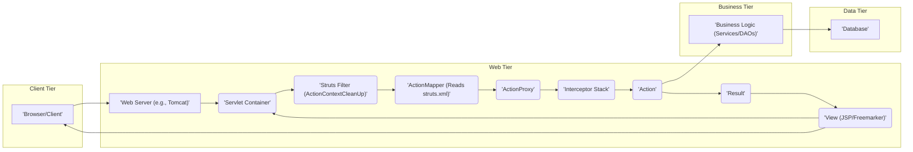
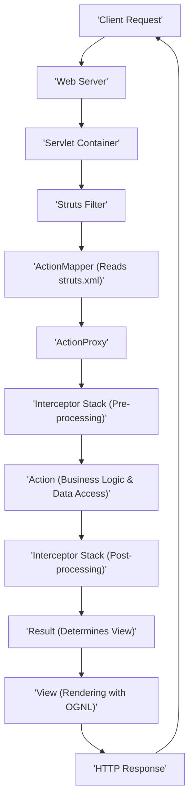

# Project Design Document: Apache Struts Framework

**Version:** 1.1
**Date:** October 26, 2023
**Author:** AI Software Architect

## 1. Project Overview

The Apache Struts framework is a mature, open-source web application framework for developing Java Enterprise Edition (Java EE) web applications. It extends the Java Servlet API and promotes the Model-View-Controller (MVC) architectural pattern. Struts aims to decouple the presentation layer, business logic, and data access layers, leading to more organized, maintainable, and scalable applications. This document details the architecture and core components of the Struts framework, specifically for use in threat modeling exercises.

## 2. Goals and Objectives

* To provide a detailed and accurate representation of the Apache Struts framework's architecture and its key elements.
* To clearly identify the interactions between different components within the framework.
* To illustrate the typical flow of data and control within a Struts application.
* To list the essential technologies and dependencies that underpin the Struts framework.
* To serve as a comprehensive resource for security professionals to conduct thorough threat modeling and identify potential vulnerabilities.

## 3. Target Audience

* Security architects and engineers responsible for identifying and mitigating security risks in applications built with Apache Struts.
* Software developers who are building, maintaining, or integrating with Apache Struts applications.
* DevOps engineers involved in the deployment, configuration, and monitoring of Struts-based systems.
* Penetration testers and security auditors assessing the security posture of Struts applications.

## 4. High-Level Architecture

A Struts application is structured around the Model-View-Controller (MVC) pattern. The `struts.xml` configuration file plays a crucial role in mapping incoming requests to specific Actions. The following diagram provides a high-level view of the architecture:

**Description of Components:**

* **Browser/Client:** The user's web browser or any client application that sends HTTP requests to the Struts application.
* **Web Server:**  The software that receives HTTP requests from clients and forwards them to the Servlet Container (e.g., Apache Tomcat, Jetty).
* **Servlet Container:** Provides the runtime environment for Java servlets and JavaServer Pages (JSPs). It manages the lifecycle of servlets.
* **Struts Filter (ActionContextCleanUp):** A Servlet Filter configured in `web.xml` that initializes and cleans up the Struts environment for each incoming request. This includes setting up the `ActionContext`.
* **ActionMapper (Reads struts.xml):** Responsible for determining which Struts Action should handle a given request based on the request URL and the mappings defined in the `struts.xml` configuration file.
* **ActionProxy:** Acts as a facade and central point of control for the execution of an Action. It manages the invocation of interceptors and the Action itself.
* **Interceptor Stack:** An ordered collection of interceptors that are executed before and after the Action. Interceptors handle cross-cutting concerns like validation, logging, security checks, and workflow management.
* **Action:** A Java class that contains the application's business logic to handle a specific request. It receives input, processes it, and returns a logical outcome.
* **Result:**  Determines the next step after the Action has been executed. This typically involves selecting a View to render or redirecting the user. The mapping between logical results and actual views is defined in `struts.xml`.
* **View (JSP/Freemarker):** The presentation layer responsible for rendering the user interface. Common view technologies used with Struts include JavaServer Pages (JSP) and Freemarker templates.
* **Business Logic (Services/DAOs):**  Contains the core business logic of the application, often implemented as service classes and Data Access Objects (DAOs) for interacting with the data tier.
* **Database:** The persistent storage for the application's data.

## 5. Detailed Component Description

This section provides a more in-depth look at the key components of the Struts framework, highlighting their functionality and potential security implications:

* **Action:**
    * Java classes that extend `ActionSupport` or implement the `Action` interface.
    * Contain methods (typically `execute()`) that encapsulate specific business logic.
    * Receive user input parameters, often automatically populated via the `params` interceptor. **Security Implication:**  Vulnerable if input is not properly validated, leading to injection attacks.
    * Return a `String` representing a logical outcome, which is then used by the `Result` to determine the next step.

* **Interceptors:**
    * Implement the `Interceptor` interface.
    * Provide a powerful mechanism for implementing cross-cutting concerns in a modular way.
    * Executed in a defined order before and/or after the Action.
    * Examples include:
        * `params`: Populates Action properties from request parameters. **Security Implication:**  Can be exploited if not configured carefully, potentially allowing attackers to manipulate internal state.
        * `validation`: Executes validation rules defined for the Action. **Security Implication:**  Crucial for preventing invalid data from reaching the business logic. Misconfigured or missing validation can lead to vulnerabilities.
        * `workflow`: Manages the workflow of the Action.
        * `i18n`: Provides internationalization support.
        * `servletConfig`: Makes servlet API objects available to the Action. **Security Implication:**  Direct access to servlet objects requires careful handling to avoid security issues.
        * Custom interceptors for authentication, authorization, logging, etc. **Security Implication:**  Custom interceptors must be developed with security in mind to avoid introducing new vulnerabilities.

* **Result Types:**
    * Define how the response is rendered to the client based on the logical result returned by the Action.
    * Mapped to logical result names in `struts.xml`.
    * Common result types include:
        * `dispatcher`: Forwards the request to another resource (e.g., JSP). **Security Implication:**  Incorrectly configured dispatchers can expose internal resources.
        * `redirect`: Sends an HTTP redirect to the client's browser. **Security Implication:**  Open redirects can be exploited to redirect users to malicious sites.
        * `redirectAction`: Redirects to another Struts Action.
        * `stream`: Sends raw data (e.g., file download). **Security Implication:**  Requires careful handling to prevent access to sensitive files or injection of malicious content.
        * `freemarker`: Renders a Freemarker template. **Security Implication:**  Template injection vulnerabilities can occur if user input is directly embedded in templates without proper escaping.

* **Value Stack and OGNL (Object-Graph Navigation Language):**
    * The Value Stack is a runtime data structure that holds objects relevant to the current request, including the Action, model objects, and request parameters.
    * OGNL is a powerful expression language used to access and manipulate objects within the Value Stack. It is used extensively in JSPs and Interceptors. **Security Implication:**  OGNL injection vulnerabilities have been a significant security concern in Struts. If user input is used directly in OGNL expressions, attackers can execute arbitrary code.

* **Configuration Files (struts.xml, struts.properties, web.xml):**
    * `struts.xml`: The primary configuration file that defines Actions, Interceptors, Result Types, mappings between URLs and Actions, and validation rules. **Security Implication:**  Misconfigurations in `struts.xml` can lead to security vulnerabilities, such as exposing unintended actions or allowing unauthorized access.
    * `struts.properties`: Contains framework-level settings and customizations.
    * `web.xml`: The standard Java EE deployment descriptor, configuring servlets, filters (including the Struts filter), and other web application components. **Security Implication:**  Incorrect filter mappings or other misconfigurations in `web.xml` can bypass security measures.

* **Tag Libraries:**
    * Provide reusable UI components for JSPs, simplifying the process of accessing data from the Value Stack and generating HTML.
    * Examples include:
        * `<s:form>`: For creating HTML forms. **Security Implication:**  Ensure proper handling of form submissions to prevent CSRF.
        * `<s:textfield>`: For input fields. **Security Implication:**  Requires proper output encoding to prevent XSS.
        * `<s:property>`: For displaying values. **Security Implication:**  Ensure proper output encoding to prevent XSS.
        * `<s:iterator>`: For looping through collections.

* **Validation Framework:**
    * Allows developers to define validation rules for Action properties, ensuring data integrity and preventing invalid input from reaching the business logic.
    * Can be configured using XML files (`*-validation.xml`) or annotations.
    * Interceptors like `validation` execute these rules. **Security Implication:**  Robust validation is crucial for preventing various attacks, including injection flaws and data manipulation.

## 6. Data Flow

The following diagram illustrates the detailed data flow within a Struts application for a single HTTP request:

**Detailed Steps:**

1. **Client Request:** The user initiates an HTTP request (e.g., by clicking a link or submitting a form).
2. **Web Server:** The web server receives the HTTP request.
3. **Servlet Container:** The request is passed to the Servlet Container.
4. **Struts Filter:** The `ActionContextCleanUp` filter initializes the Struts environment, creating the `ActionContext` and other necessary objects.
5. **ActionMapper (Reads struts.xml):** The `ActionMapper` examines the request URL and consults the `struts.xml` configuration file to determine the appropriate Action to handle the request.
6. **ActionProxy:** The `ActionProxy` is instantiated to manage the lifecycle of the Action invocation.
7. **Interceptor Stack (Pre-processing):** The interceptors configured for the Action are executed in order. This may involve tasks like parameter population (`params` interceptor), validation (`validation` interceptor), security checks, and logging. **Security Focus:** This is a critical point for security checks. Ensure authentication and authorization interceptors are correctly configured.
8. **Action (Business Logic & Data Access):** The `execute()` method of the selected Action is invoked. The Action performs the core business logic, potentially interacting with service classes and Data Access Objects (DAOs) to retrieve or manipulate data. **Security Focus:**  Ensure secure coding practices within Actions to prevent vulnerabilities like SQL injection.
9. **Interceptor Stack (Post-processing):** The interceptors are executed again in reverse order after the Action has completed. This might include tasks like transaction management, logging, and cleanup.
10. **Result (Determines View):** The Action returns a logical result name (e.g., "success", "error"). The `Result` component uses this name and the configuration in `struts.xml` to determine which View should be rendered.
11. **View (Rendering with OGNL):** The chosen View technology (e.g., JSP, Freemarker) renders the response. Data is often accessed from the Value Stack using OGNL expressions. **Security Focus:**  Ensure proper output encoding in views to prevent XSS vulnerabilities. Be extremely cautious when using user input directly in OGNL expressions due to the risk of OGNL injection.
12. **HTTP Response:** The rendered response is sent back to the Servlet Container.
13. **Client:** The web server sends the HTTP response back to the client's browser.

## 7. Key Technologies and Dependencies

* **Java Servlet API:** The foundational technology for Struts, providing the request/response lifecycle and core web application components.
* **JavaServer Pages (JSP):** A common view technology used with Struts for creating dynamic web pages.
* **Freemarker:** An alternative template engine that can be used for creating views.
* **OGNL (Object-Graph Navigation Language):** A powerful expression language used for accessing and manipulating data within the Value Stack.
* **XML:** Used extensively for configuration files (`struts.xml`, validation files).
* **Jakarta Commons Libraries:** Struts relies on various Apache Commons libraries (e.g., BeanUtils, Collections, FileUpload). **Security Implication:**  Ensure these dependencies are kept up-to-date to patch known vulnerabilities.
* **Logging Framework (e.g., Log4j, SLF4j):** Used for application logging. **Security Implication:**  Proper logging is essential for security monitoring and incident response.
* **Dependency Injection (Optional):** Struts can be integrated with DI frameworks like Spring or Guice.

## 8. Security Considerations (Initial)

This section outlines key security considerations relevant to Apache Struts applications. These points will be further explored during detailed threat modeling.

* **Input Validation:**  Rigorous validation of all user-supplied input is crucial to prevent injection attacks (e.g., SQL injection, Cross-Site Scripting, Command Injection, OGNL Injection). Utilize Struts' validation framework and implement server-side validation.
* **Cross-Site Scripting (XSS):**  Implement proper output encoding in JSPs and other view technologies to prevent the injection of malicious scripts. Be mindful of both reflected and stored XSS.
* **Cross-Site Request Forgery (CSRF):**  Employ CSRF prevention mechanisms, such as synchronizer tokens, to protect against unauthorized actions performed on behalf of authenticated users. Struts provides built-in support for CSRF protection.
* **SQL Injection:**  Use parameterized queries or ORM frameworks (like Hibernate) to prevent the injection of malicious SQL code. Avoid constructing SQL queries by concatenating user input directly.
* **OGNL Injection:**  Exercise extreme caution when using OGNL expressions, especially when processing user input. Avoid using user input directly in OGNL expressions. Sanitize or validate input thoroughly if it must be used in OGNL.
* **Authentication and Authorization:**  Implement robust authentication mechanisms to verify user identities and authorization controls to restrict access to resources based on user roles and permissions. Integrate with security frameworks like Spring Security if needed.
* **Session Management:**  Securely manage user sessions to prevent session hijacking. Use secure session IDs, set appropriate session timeouts, and protect session cookies.
* **Dependency Management:**  Regularly update Struts and all its dependencies to patch known security vulnerabilities. Utilize dependency management tools to track and manage dependencies.
* **Error Handling:**  Avoid disclosing sensitive information in error messages. Implement custom error pages and logging mechanisms to handle errors gracefully.
* **File Upload Vulnerabilities:**  Implement strict controls on file uploads, including validating file types, sizes, and content. Store uploaded files securely and prevent direct access to the upload directory.
* **Remote Code Execution (RCE):**  Be aware of historical RCE vulnerabilities in Struts, particularly related to OGNL injection. Keep the framework updated and follow security best practices to mitigate this risk.
* **Secure Configuration:**  Ensure that `struts.xml`, `web.xml`, and other configuration files are properly configured and secured. Avoid exposing sensitive information in configuration files.

## 9. Deployment Model

Struts applications are typically packaged as Web Application Archive (WAR) files and deployed to Java EE application servers or servlet containers such as Apache Tomcat, Jetty, or GlassFish. The WAR file contains all the necessary components, including compiled Java code, JSPs, configuration files, and static resources.

## 10. Assumptions and Constraints

* This document describes the general architecture and common configurations of the Apache Struts framework. Specific implementations and customizations may vary.
* The focus is primarily on the core Struts framework components and their interactions. Integration with other frameworks (e.g., Spring, Hibernate) is mentioned but not detailed extensively.
* The security considerations outlined are initial points for discussion and will be further elaborated upon during a dedicated threat modeling exercise.
* It is assumed that developers are following secure coding practices and are aware of common web application vulnerabilities.
