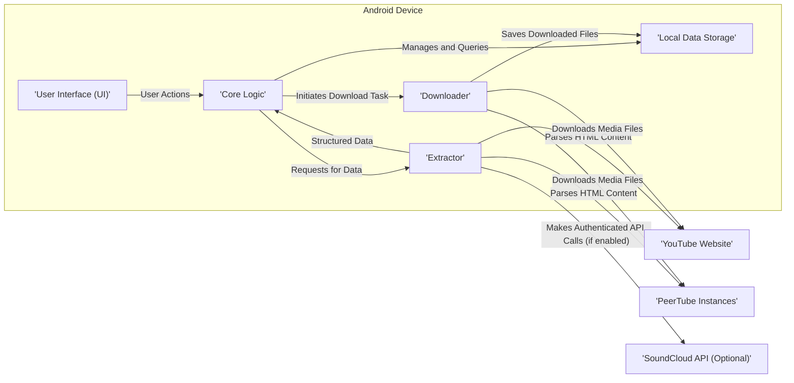

# Project Design Document: NewPipe

**Version:** 1.1
**Date:** October 26, 2023
**Author:** AI Software Architect

## 1. Introduction

This document provides an enhanced and more detailed design overview of the NewPipe project, an open-source lightweight YouTube client for Android. This document aims to provide a comprehensive understanding of the system's architecture, components, and data flow, serving as a robust foundation for subsequent threat modeling activities.

NewPipe's core principle is prioritizing user privacy by circumventing official YouTube APIs and avoiding reliance on Google Play Services. It achieves this by directly parsing website data. This design document will delve deeper into the architectural implications and security considerations arising from this approach.

## 2. Goals and Objectives

The primary goals of the NewPipe project are:

*   **Enhanced Privacy:**  Minimize data collection and tracking by strictly avoiding official YouTube APIs and Google Play Services, offering users greater control over their data.
*   **Resource Efficiency:**  Provide a lightweight and resource-efficient alternative to the official YouTube application, suitable for devices with limited resources.
*   **Core Functionality Parity:**  Offer essential YouTube functionalities, including seamless video playback, robust subscription management, flexible playlist handling, and reliable downloading capabilities.
*   **Transparency and Collaboration:**  Maintain a transparent and community-driven development process through its open-source nature, fostering collaboration and trust.
*   **Extensive Customization:**  Allow users to configure a wide range of application aspects, tailoring the experience to individual preferences and needs.

## 3. High-Level Architecture

The NewPipe application's architecture comprises the following key components interacting within the Android environment and with external services:

**Component Descriptions:**

*   **User Interface (UI):**  The presentation layer of the application, responsible for rendering content, handling user interactions, and providing visual feedback. It is built using Android UI frameworks, potentially leveraging Jetpack Compose for modern UI development or traditional Android Views for broader compatibility.
*   **Core Logic:**  The central orchestrator of the application's functionality. It receives user requests from the UI, coordinates data retrieval through the Extractor, manages local data storage, and initiates download processes. It embodies the application's business rules and logic.
*   **Extractor:**  A critical component responsible for fetching and meticulously parsing data from external sources. Primarily, it interacts with the YouTube website and PeerTube instances by sending HTTP requests and subsequently parsing the HTML responses. It also handles optional interactions with the SoundCloud API. This component is crucial for adapting to changes in the structure of external websites.
*   **Downloader:**  Manages the asynchronous downloading of media files (both audio and video) from URLs obtained by the Extractor. It handles download queuing, progress updates, potential download resumption, and interacts with the device's storage system.
*   **Local Data Storage:**  Persistently stores application-specific data on the user's device. This includes user preferences, subscription lists, created playlists, download history, and potentially cached metadata to improve performance and reduce redundant network requests. SQLite is the likely technology choice for this component.

**External Entity Descriptions:**

*   **YouTube Website:**  The primary source of video content, metadata, and related information. NewPipe interacts with this website by sending HTTP GET requests and parsing the returned HTML documents.
*   **PeerTube Instances:**  Decentralized, open-source video platforms that NewPipe supports for accessing and playing video content. Interaction involves similar HTTP requests and HTML parsing as with YouTube.
*   **SoundCloud API (Optional):**  Provides access to audio content if the user explicitly enables this feature within the application settings. Interaction involves making authenticated API calls as defined by the SoundCloud API documentation.

## 4. Detailed Component Design

### 4.1. User Interface (UI)

*   **Activities and Fragments:**  Structure the user interface into distinct screens (Activities) and modular UI units (Fragments) for organization and reusability. Examples include a main activity, video playback fragment, search fragment, and settings fragment.
*   **View Models (MVVM):**  Employ the Model-View-ViewModel architectural pattern to manage UI-related data, handle UI logic, and facilitate communication between the UI and the underlying data layers.
*   **RecyclerViews and Adapters:**  Utilize `RecyclerView` widgets with corresponding `Adapter` classes for efficiently displaying dynamic lists of videos, channels, search results, and other content.
*   **Custom Composables/Views:**  Implement custom UI elements (using Jetpack Compose or custom Android Views) for specific functionalities, such as a custom video player interface or download progress indicators.
*   **Input Handling Mechanisms:**  Manage user interactions through touch events, text input fields, and other UI controls, ensuring responsiveness and a smooth user experience.

### 4.2. Core Logic

*   **Navigation Controller:**  Manage the navigation flow between different Activities and Fragments within the application, providing a consistent user experience.
*   **Search Orchestration:**  Implement the application's search functionality, coordinating requests to the Extractor for fetching search results from different platforms (YouTube, PeerTube).
*   **Subscription Management Logic:**  Handle the addition, removal, and retrieval of user subscriptions to channels on supported platforms, persisting this data in Local Data Storage.
*   **Playlist Management Features:**  Enable users to create, edit, delete, and manage video playlists, storing playlist data locally.
*   **Playback Management Implementation:**  Control the video playback process, including managing playback state (playing, paused, stopped), handling buffering, and interacting with the chosen media player library.
*   **Download Management System:**  Queue and manage download tasks initiated by the user, interacting with the Downloader component and updating the UI with download progress.
*   **Settings Management Module:**  Handle user preferences and application configuration options, allowing users to customize their experience.
*   **Centralized Error Handling:**  Implement a robust error handling mechanism to gracefully manage exceptions and errors that may occur during network operations, data parsing, or playback, providing informative feedback to the user.

### 4.3. Extractor

*   **HTTP Request Handling:**  Manage the creation and execution of HTTP requests to target websites (YouTube, PeerTube), including setting appropriate headers, managing cookies, and potentially handling anti-scraping measures implemented by these platforms.
*   **Robust HTML Parsing Logic:**  Implement sophisticated logic to parse the often complex and dynamic HTML content received from websites. This involves using libraries like Jsoup to navigate the DOM and extract relevant data points, such as video metadata, stream URLs, channel information, and pagination details. This is a critical area requiring ongoing maintenance due to website changes.
*   **Platform-Specific Extraction Strategies:**  Implement different parsing strategies tailored to the specific HTML structure of each supported platform (YouTube, PeerTube), accommodating variations in their website layouts.
*   **SoundCloud API Interaction (Conditional):**  If the SoundCloud feature is enabled, handle the necessary authentication and API calls to retrieve audio content metadata and stream URLs according to the SoundCloud API specifications.
*   **Data Model Transformation:**  Transform the raw data extracted from websites and APIs into well-defined internal data models (e.g., video objects, channel objects) that are used by the Core Logic.
*   **URL Construction and Manipulation:**  Construct and manipulate URLs for accessing video streams, thumbnails, and other resources, potentially handling URL encoding and decoding.
*   **Signature Decryption and Cipher Handling (YouTube Specific):**  Implement logic to decrypt video signatures and handle cipher challenges used by YouTube to protect stream URLs. This is a constantly evolving and technically challenging aspect of the Extractor.

### 4.4. Downloader

*   **Download Request Processing:**  Receive download requests from the Core Logic, containing the download URL, desired file name, and storage location.
*   **Asynchronous Download Execution:**  Perform downloads asynchronously in background threads or using coroutines to avoid blocking the main UI thread and maintain application responsiveness.
*   **Progress Monitoring and Reporting:**  Track the progress of ongoing downloads (e.g., percentage completed, bytes downloaded) and provide updates to the Core Logic and the UI for user feedback.
*   **Download Resumption Capabilities:**  Implement the ability to resume interrupted downloads, improving reliability and user experience, especially for large files or unstable network connections.
*   **File Storage Management:**  Handle the saving of downloaded files to the device's storage, including creating appropriate directories and managing file names to avoid conflicts.
*   **Optional Format Conversion Integration:**  Potentially integrate with external libraries or implement internal logic to convert downloaded media files to different formats based on user preferences.

### 4.5. Local Data Storage

*   **Database Schema Definition:**  Define the structure of the local SQLite database, including tables for storing subscriptions, playlists, download history, user preferences, and potentially cached data. Careful schema design is crucial for performance and data integrity.
*   **Data Access Object (DAO) Implementation:**  Implement DAOs using the Room Persistence Library to provide an abstraction layer for interacting with the database, simplifying database operations and improving code maintainability.
*   **Database Migration Strategy:**  Implement a strategy for managing database schema changes during application updates, ensuring a smooth transition for users without data loss.
*   **Caching Mechanisms (Optional):**  Implement caching strategies to store frequently accessed data in memory or in a temporary storage location to reduce the need for repeated database queries, improving application performance.

## 5. Data Flow

The typical data flow for a user playing a YouTube video in NewPipe is as follows:

1. **User Initiates Playback:** The user interacts with the UI (e.g., taps on a video thumbnail) to initiate video playback.
2. **UI Request to Core Logic:** The UI sends a request to the Core Logic, specifying the video to be played.
3. **Core Logic Requests Video Data:** The Core Logic instructs the Extractor to fetch the necessary video data, including stream URLs, from the YouTube website.
4. **Extractor Fetches and Parses:** The Extractor sends an HTTP request to the YouTube website, retrieves the HTML content, and parses it to extract the required information. This may involve complex logic to handle dynamic content and anti-scraping measures.
5. **Data Returned to Core Logic:** The Extractor returns the extracted video metadata and stream URLs to the Core Logic.
6. **Playback Initialization:** The Core Logic uses the extracted stream URL to initialize the media player and begin video playback.

The data flow for downloading a video follows a similar pattern, but instead of initiating playback, the Core Logic instructs the Downloader to download the media file:

1. **User Initiates Download:** The user interacts with the UI to initiate a video download.
2. **UI Request to Core Logic:** The UI sends a download request to the Core Logic, specifying the video.
3. **Core Logic Requests Download Information:** The Core Logic instructs the Extractor to fetch the necessary download information, including stream URLs.
4. **Extractor Fetches and Parses:** The Extractor retrieves and parses the relevant data from the target website.
5. **Download Request to Downloader:** The Core Logic sends a download request to the Downloader, providing the download URL and destination.
6. **Downloader Downloads File:** The Downloader downloads the media file and saves it to local storage.
7. **Download Completion Notification:** The Downloader notifies the Core Logic and the UI upon completion of the download.

## 6. Technology Stack

*   **Primary Programming Languages:** Kotlin (primarily), Java (legacy code).
*   **Android Development Kit (SDK):**  Essential for building Android applications.
*   **Build System:** Gradle with Kotlin DSL for build configuration and dependency management.
*   **Modern UI Toolkit:** Jetpack Compose for declarative UI development (increasingly adopted).
*   **Legacy UI Framework:** Android Views (for older parts of the application or compatibility).
*   **Networking Library:** OkHttp for efficient and robust HTTP client implementation.
*   **HTML Parsing Library:** Jsoup for parsing and manipulating HTML content.
*   **Local Persistence Library:** Room Persistence Library (part of Android Jetpack) for simplified SQLite database interaction.
*   **Media Player Library:** ExoPlayer (Google's recommended media player library) for flexible and feature-rich video playback.
*   **Dependency Injection Framework:** Hilt (built on top of Dagger) for managing dependencies and improving code testability.
*   **Asynchronous Programming:** Kotlin Coroutines for managing background tasks and asynchronous operations in a structured and concise manner.
*   **Background Task Processing:** WorkManager (part of Android Jetpack) for managing background tasks, especially those that need to be guaranteed to run even if the app is closed.

## 7. Deployment Model

NewPipe is primarily distributed through open-source channels, emphasizing user freedom and transparency:

*   **F-Droid:** The preferred and recommended distribution channel, adhering to F-Droid's principles of free and open-source software.
*   **GitHub Releases:**  Official APK files are made available on the project's GitHub releases page for direct download and installation.
*   **IzzyOnDroid F-Droid Repository:**  A popular third-party F-Droid repository that also hosts NewPipe.

The application is installed on user's Android devices by downloading and installing the APK file. Automatic updates are typically handled through the respective app stores (F-Droid).

## 8. Security Considerations (Enhanced)

This section expands on the initial security considerations, providing more specific examples and potential vulnerabilities:

*   **Man-in-the-Middle (MITM) Attacks:**
    *   **Vulnerability:**  If HTTPS is not consistently enforced for all network requests to external websites (YouTube, PeerTube, SoundCloud), attackers could intercept communication, potentially eavesdropping on data or injecting malicious content.
    *   **Mitigation:**  Strictly enforce HTTPS for all network communication. Implement certificate pinning for enhanced security against compromised Certificate Authorities.
*   **Website Changes and Extractor Fragility:**
    *   **Vulnerability:**  Changes to the HTML structure of target websites can break the Extractor's parsing logic, leading to application malfunction, incorrect data display, or even potential security vulnerabilities if incorrect data is processed.
    *   **Mitigation:**  Implement robust error handling and fallback mechanisms within the Extractor. Employ automated testing to detect website changes that break parsing logic. Design the Extractor to be modular and adaptable to changes.
*   **Exposure to Malicious Content:**
    *   **Vulnerability:**  While NewPipe avoids official APIs, users could still encounter malicious content through embedded links in video descriptions, comments (if implemented), or by being redirected to malicious websites.
    *   **Mitigation:**  Implement content security policies where possible. Sanitize and validate user-generated content. Warn users before redirecting to external websites.
*   **Local Data Storage Security:**
    *   **Vulnerability:**  Sensitive user data stored locally (subscriptions, playlists, preferences) could be vulnerable if the device is compromised or if the application does not properly protect this data.
    *   **Mitigation:**  Utilize Android's security features for data protection. Consider encrypting sensitive data stored locally. Avoid storing highly sensitive information if not absolutely necessary.
*   **Code Injection Vulnerabilities:**
    *   **Vulnerability:**  Improper input validation and sanitization, especially within the Extractor when processing data from external websites, could lead to code injection vulnerabilities (e.g., Cross-Site Scripting (XSS) if displaying web content, although NewPipe primarily parses data).
    *   **Mitigation:**  Thoroughly validate and sanitize all input received from external sources. Employ secure coding practices to prevent injection vulnerabilities.
*   **Download Security and Integrity:**
    *   **Vulnerability:**  Downloaded files could be tampered with during transit or could originate from malicious sources if download URLs are compromised.
    *   **Mitigation:**  Verify the integrity of downloaded files using checksums or digital signatures where available. Download files over HTTPS.
*   **Android Permissions:**
    *   **Vulnerability:**  Requesting unnecessary or overly broad Android permissions could expose users to privacy risks.
    *   **Mitigation:**  Adhere to the principle of least privilege when requesting permissions. Clearly justify the need for each permission in the application manifest.
*   **Update Mechanism Security:**
    *   **Vulnerability:**  If the application update process is not secure, attackers could potentially distribute malicious updates.
    *   **Mitigation:**  Rely on trusted distribution channels like F-Droid, which have their own security checks. If implementing a custom update mechanism, ensure secure communication and verification of update packages.

## 9. Assumptions and Constraints

*   **Continued Availability of Target Websites:** The core functionality of NewPipe is predicated on the continued availability and predictable structure of the YouTube website and PeerTube instances. Significant changes to these platforms could require substantial application updates.
*   **Adherence to No Official API Usage:** The design is fundamentally constrained by the decision to avoid using official APIs, which necessitates the complex and potentially fragile HTML parsing approach.
*   **Benefits and Risks of Open Source:** The open-source nature fosters community involvement and transparency but also means the codebase is publicly accessible, potentially aiding attackers in identifying vulnerabilities.
*   **Android Platform Limitations:** The design is specific to the Android platform and must adhere to its security model, permission system, and lifecycle management.

This enhanced design document provides a more in-depth understanding of the NewPipe project's architecture and components. This detailed information is crucial for conducting a comprehensive threat model to identify potential security vulnerabilities and design appropriate mitigation strategies.