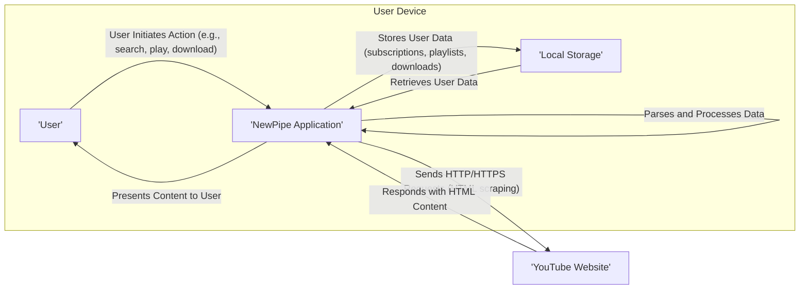
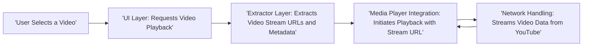
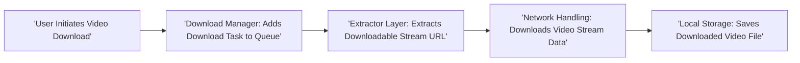

# Project Design Document: NewPipe

**Version:** 1.1
**Date:** October 26, 2023
**Author:** AI Software Architect

## 1. Introduction

This document provides an enhanced architectural design of the NewPipe project, building upon the previous version. NewPipe remains a free and open-source, privacy-focused YouTube client for Android, deliberately avoiding the official YouTube API and Google Play Services. This detailed design will serve as a robust foundation for subsequent threat modeling exercises.

## 2. Goals and Objectives

The core objectives of NewPipe are to:

*   **Prioritize User Privacy:** Offer a YouTube experience without Google's pervasive tracking mechanisms.
*   **Maintain Lightweight Design:** Ensure efficient resource utilization and a smooth user experience on various Android devices.
*   **Enable Open Access:** Facilitate access to YouTube content without requiring a Google account or specific Google services.
*   **Provide Essential Features:**  Support core functionalities like background playback, video downloads, and subscription management.
*   **Foster Community Contribution:** Maintain an open-source codebase that encourages community involvement and development.

## 3. High-Level Architecture

NewPipe functions as a standalone Android application interacting directly with the YouTube website to retrieve content. The primary entities and their interactions are illustrated below:

**Key Components:**

*   **User:** The individual utilizing the NewPipe application on their Android device.
*   **NewPipe Application:** The central Android application encompassing all features and functionalities.
*   **Local Storage:** The persistent storage on the user's device where NewPipe stores application data.
*   **YouTube Website:** The external web service serving the video content and related information that NewPipe scrapes.

## 4. Detailed Component Design

The NewPipe application is composed of several interconnected modules, each with specific responsibilities:

*   **User Interface (UI) Layer:**
    *   **Responsibility:**  Rendering the application's visual elements and handling user interactions.
    *   **Details:**  Utilizes Android Activities, Fragments, and Views. Manages navigation between screens (e.g., main feed, search results, video player, settings). Implements UI elements for displaying video lists, player controls, and settings options.
*   **Network Handling Layer:**
    *   **Responsibility:** Managing all network communication with the YouTube website.
    *   **Details:**  Uses HTTP/HTTPS protocols for requests and responses. Implements mechanisms for handling network errors (e.g., timeouts, connection issues). May employ libraries like `OkHttp` or `HttpURLConnection` for efficient network operations. Handles setting appropriate user-agent headers.
*   **Extractor Layer:**
    *   **Responsibility:**  Scraping and parsing HTML content from the YouTube website to extract relevant data.
    *   **Details:**  Contains logic for identifying and extracting video metadata (title, description, duration, thumbnails), stream URLs (various resolutions and formats), channel information, and comments. Relies on HTML parsing libraries such as `Jsoup` to navigate the DOM structure. Requires ongoing maintenance to adapt to changes in YouTube's website layout.
*   **Media Player Integration:**
    *   **Responsibility:** Handling the playback of video and audio streams.
    *   **Details:**  Integrates with Android's `MediaPlayer` or a more advanced library like `ExoPlayer` for enhanced playback capabilities. Manages video buffering, playback controls (play, pause, seek, volume), and background playback functionality.
*   **Download Manager:**
    *   **Responsibility:**  Managing the downloading of video and audio streams for offline access.
    *   **Details:**  Handles download initiation, progress tracking, pausing, resuming, and cancellation. Interacts with the Network Handling Layer to download stream data. Stores downloaded files in designated directories within Local Storage. Manages download queues and potential storage limitations.
*   **Subscription Manager:**
    *   **Responsibility:**  Allowing users to subscribe to YouTube channels and manage their subscriptions within NewPipe.
    *   **Details:**  Stores subscription information (channel IDs, names) in Local Storage. Uses the Extractor Layer to fetch new videos from subscribed channels. May implement mechanisms for checking for new content periodically.
*   **Playlist Manager:**
    *   **Responsibility:**  Enabling users to create and manage local playlists of videos.
    *   **Details:**  Stores playlist data (playlist names, video IDs) in Local Storage. Provides functionality for adding, removing, and reordering videos within playlists.
*   **Search Functionality:**
    *   **Responsibility:**  Allowing users to search for videos on YouTube through NewPipe.
    *   **Details:**  Constructs search queries and sends them to the YouTube website via the Network Handling Layer. Utilizes the Extractor Layer to parse the search results page and present them to the user.
*   **Settings and Preferences:**
    *   **Responsibility:**  Providing users with options to customize the application's behavior.
    *   **Details:**  Stores user preferences (e.g., default download location, preferred video quality, theme) in Local Storage. Manages the application's configuration settings.
*   **Update Mechanism:**
    *   **Responsibility:**  Handling the process of checking for and installing new versions of the NewPipe application.
    *   **Details:**  Typically involves checking for new releases on F-Droid or the project's GitHub repository. Guides the user through the update process, which usually involves downloading and installing an APK file.

## 5. Data Flow

Illustrative examples of data flow for common user interactions:

**Searching for a Video:**

```mermaid
flowchart LR
    A["'User Enters Search Query'"] --> B["'UI Layer: Captures Search Input'"];
    B --> C["'Network Handling: Sends HTTP Request to YouTube Search Page'"];
    C --> D["'YouTube Website: Processes Search Request'"];
    D --> E["'YouTube Website: Returns HTML Response with Search Results'"];
    E --> F["'Network Handling: Receives HTML Response'"];
    F --> G["'Extractor Layer: Parses HTML to Extract Search Results'"];
    G --> H["'Data Processing: Formats Search Results for Display'"];
    H --> I["'UI Layer: Displays Search Results'"];
```

**Playing a Video:**

**Downloading a Video:**

## 6. Security Considerations (Pre-Threat Modeling)

This section outlines potential security considerations that will be explored further during formal threat modeling:

*   **Reliance on Web Scraping:**
    *   **Threat:** Changes to YouTube's website structure can break the Extractor Layer, leading to denial of service or incorrect data extraction.
    *   **Mitigation:** Implement robust and adaptable parsing logic, monitor YouTube's website for changes, and have mechanisms for quick updates.
*   **Data Privacy and Information Disclosure:**
    *   **Threat:** Potential for accidental leakage of user data or activity patterns if not handled carefully.
    *   **Mitigation:** Adhere to privacy best practices, minimize data collection, and ensure data is stored securely on the device.
*   **Malicious Content from YouTube:**
    *   **Threat:** Exposure to potentially malicious links or misleading information embedded within YouTube content.
    *   **Mitigation:** Implement content sanitization where necessary and educate users about potential risks.
*   **Network Security (Man-in-the-Middle Attacks):**
    *   **Threat:**  Interception of network traffic between NewPipe and YouTube, potentially exposing data or allowing for manipulation.
    *   **Mitigation:** Enforce HTTPS for all communication with YouTube.
*   **Local Data Security:**
    *   **Threat:** Unauthorized access to locally stored data (subscriptions, downloads, preferences) if the device is compromised.
    *   **Mitigation:** Consider using Android's security features for local data protection.
*   **Update Mechanism Vulnerabilities:**
    *   **Threat:**  Compromised update channels could lead to the installation of malicious NewPipe versions.
    *   **Mitigation:**  Verify the integrity of updates (e.g., through F-Droid's signing process or verifying signatures for direct APK downloads).
*   **Code Injection through Extracted Data:**
    *   **Threat:**  Maliciously crafted content on YouTube could potentially inject code if not properly sanitized before rendering.
    *   **Mitigation:**  Implement robust input validation and sanitization techniques.

## 7. Technologies Used

*   **Programming Languages:** Kotlin, Java
*   **Android SDK:** For application development and access to Android APIs.
*   **Networking Libraries:** `OkHttp`, `Retrofit` (common choices for efficient and robust HTTP communication).
*   **HTML Parsing Library:** `Jsoup` (a widely used library for parsing and manipulating HTML).
*   **Media Player Library:** `ExoPlayer` (a flexible and customizable media player library for Android).
*   **Asynchronous Task Handling:** Coroutines (Kotlin) or RxJava (for managing background tasks and network operations).
*   **Dependency Injection:** Hilt or Dagger (for managing dependencies and improving code maintainability).
*   **Build System:** Gradle (for automating the build process).

## 8. Deployment

NewPipe is primarily distributed through open and verifiable channels:

*   **F-Droid:** The preferred method, leveraging F-Droid's built-in security and signing mechanisms. Releases are built and signed by the F-Droid maintainers.
*   **GitHub Releases:** Direct APK files are provided on the project's GitHub releases page. These APKs are typically signed with the NewPipe project's release key. Users downloading from this source should verify the signature.

## 9. Future Considerations

Potential future enhancements and areas of development include:

*   **Integration with Decentralized Video Platforms:** Exploring support for alternative, decentralized video hosting services.
*   **Enhanced Extractor Resilience:** Implementing more sophisticated parsing techniques and fallback mechanisms to better handle changes on the YouTube website.
*   **Improved Download Management:** Adding features like segmented downloads for faster speeds or more granular control over download settings.
*   **Accessibility Improvements:** Enhancing the application's accessibility features for users with disabilities.
*   **Customization Options:** Providing more user-configurable options for the UI and application behavior.
*   **Support for Additional Streaming Services:**  Potentially expanding beyond YouTube to support other video platforms (with careful consideration of their terms of service).

This revised design document provides a more detailed and comprehensive understanding of the NewPipe project's architecture, offering a solid foundation for effective threat modeling and future development efforts.