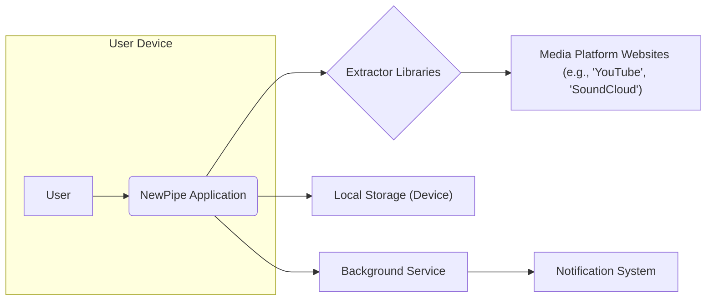
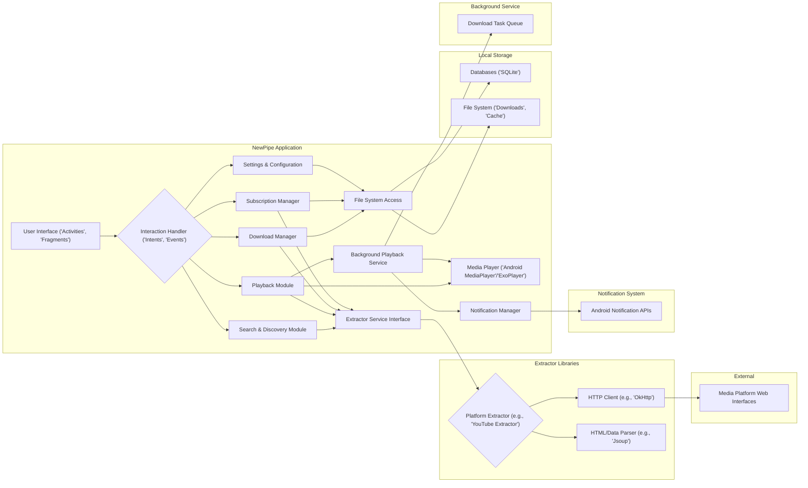
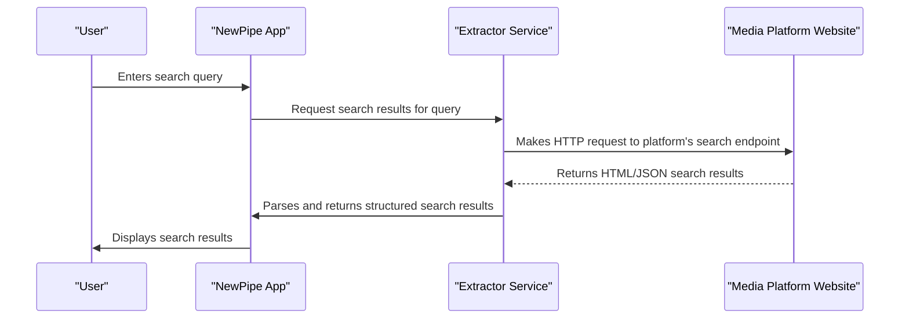
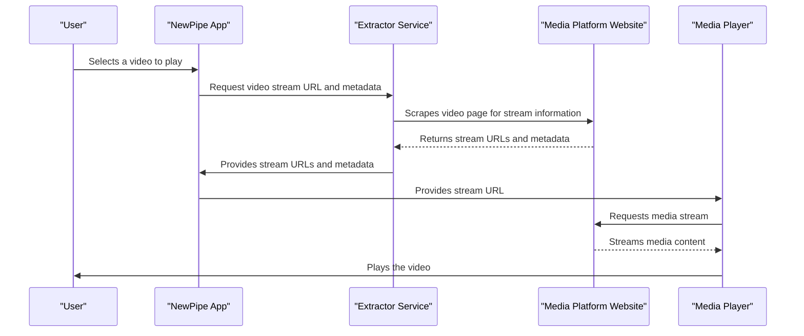
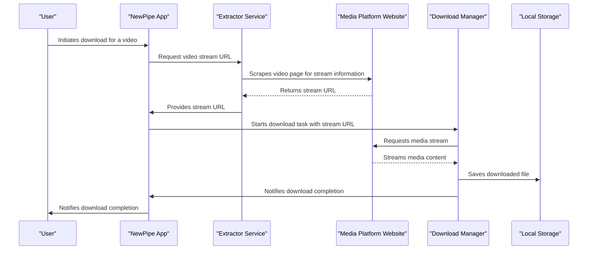

# Project Design Document: NewPipe

**Version:** 1.1
**Date:** October 26, 2023
**Prepared By:** AI Software Architect

## 1. Project Overview

NewPipe is a free and open-source media player application for Android, meticulously designed with a strong emphasis on user privacy. It distinguishes itself by accessing content from various media platforms, such as YouTube, SoundCloud, and PeerTube, through direct website scraping rather than relying on official, often privacy-invasive, APIs. This approach allows NewPipe to offer features like background playback, downloading, and subscription management without requiring users to have a Google account or utilize Google Play Services, thereby minimizing data collection and tracking.

This document provides a detailed architectural blueprint of the NewPipe application, focusing on its core components, intricate data flows, and key interactions. This design serves as a foundational resource for subsequent threat modeling exercises, enabling a thorough evaluation of potential security vulnerabilities.

## 2. Goals and Objectives

*   **Privacy-Centric Media Playback:** To deliver a media player experience on Android that prioritizes user privacy and minimizes data collection.
*   **API-Independent Content Access:** To enable access to media content from diverse platforms (e.g., YouTube, SoundCloud, PeerTube, Bandcamp) without depending on their proprietary APIs, thus circumventing potential tracking mechanisms.
*   **Essential Media Player Functionality:** To offer core media player features, including seamless playback, robust downloading capabilities, and efficient playlist management.
*   **Minimization of Google Services Dependency:** To significantly reduce or eliminate reliance on Google Play Services and associated user tracking infrastructure.
*   **Lightweight and Efficient Application:** To maintain a small application footprint and ensure optimal performance on a range of Android devices.
*   **Open-Source and Community-Driven Development:** To foster transparency, collaboration, and community involvement in the application's development and maintenance.

## 3. Target Audience

*   Android users who are deeply concerned about their online privacy and data security.
*   Individuals who actively seek alternatives to applications that heavily rely on Google services and tracking.
*   Users residing in areas with limited or costly internet connectivity who benefit significantly from offline downloading capabilities.
*   Users who desire background playback functionality without being required to purchase premium subscriptions on official platform applications.
*   Software developers and contributors who are passionate about open-source Android development and privacy-respecting software.

## 4. System Architecture

### 4.1. High-Level Architecture

*   **User:** The individual interacting with the NewPipe application to consume media content.
*   **NewPipe Application:** The primary Android application providing the user interface, managing user interactions, and orchestrating communication between various internal components.
*   **Extractor Libraries:**  Specialized components responsible for scraping and parsing data directly from the HTML structure of supported media platform websites. Each supported platform typically has a dedicated extractor library.
*   **Media Platform Websites:** External websites that host the media content accessed by NewPipe (e.g., YouTube, SoundCloud). NewPipe interacts with these websites as a regular web client.
*   **Local Storage (Device):** The storage area on the user's Android device used for persistently storing downloaded media files, user-created playlists, subscription information, and application settings.
*   **Background Service:** An Android service that runs in the background, enabling functionalities like ongoing downloads and uninterrupted playback even when the application is not in the foreground.
*   **Notification System:** The Android system component used to display notifications to the user regarding download progress, playback status, and other relevant events.

### 4.2. Detailed Component Architecture

*   **User Interface ('Activities', 'Fragments'):** The visual components of the application, built using Android UI framework elements, that provide the user interface for interacting with NewPipe's features.
*   **Interaction Handler ('Intents', 'Events'):**  Manages user interactions within the application and facilitates communication between different internal components using Android Intents and custom event mechanisms.
*   **Search & Discovery Module:**  Handles user search queries, retrieves and displays search results, and manages the browsing of trending or recommended content.
*   **Playback Module:**  Manages the media playback experience, including controlling playback functions (play, pause, seek), displaying playback controls, and handling video quality selection.
*   **Download Manager:**  Responsible for managing the downloading of media files, including queuing downloads, tracking download progress, handling download errors, and managing download settings.
*   **Subscription Manager:**  Allows users to subscribe to channels on supported platforms, manage their subscriptions, and receive notifications for new content from their subscriptions.
*   **Settings & Configuration:**  Provides a user interface for customizing the application's behavior, such as download locations, preferred video quality, and notification settings.
*   **Extractor Service Interface:**  Defines a standardized interface for interacting with the platform-specific extractor libraries, abstracting away the implementation details of each extractor.
*   **Platform Extractor (e.g., 'YouTube Extractor'):**  Specific implementations for each supported media platform, responsible for scraping the platform's website, parsing the HTML structure, and extracting relevant data like video URLs, metadata, and channel information.
*   **HTTP Client (e.g., 'OkHttp'):** A library used by the extractor libraries to make HTTP requests to the media platform websites to retrieve web pages and other resources.
*   **HTML/Data Parser (e.g., 'Jsoup'):** A library used by the extractor libraries to parse the HTML content retrieved from the websites, extracting structured data from the unstructured HTML.
*   **Media Player ('Android MediaPlayer'/'ExoPlayer'):** The underlying media playback engine used to decode and render audio and video streams. NewPipe can utilize either the built-in Android MediaPlayer or the more feature-rich ExoPlayer library.
*   **File System Access:**  Provides controlled access to the device's file system for storing downloaded media files, application settings, and temporary cache data.
*   **Databases ('SQLite'):**  A local relational database used for storing structured application data, such as user subscriptions, playlists, download history, and application preferences.
*   **File System ('Downloads', 'Cache'):** Specific directories within the device's file system designated for storing downloaded media files and temporary data used by the application.
*   **Background Playback Service:**  An Android service that runs in the background to ensure uninterrupted media playback even when the user switches to other applications or the device screen is locked.
*   **Download Task Queue:**  Manages a queue of pending download tasks, ensuring that downloads are processed efficiently and in an orderly manner.
*   **Notification Manager:**  Handles the creation, configuration, and display of notifications to the user through the Android Notification APIs.
*   **Android Notification APIs:** The standard Android system APIs used to display notifications to the user.
*   **Media Platform Web Interfaces:** The publicly accessible web interfaces of the supported media platforms, which NewPipe interacts with through HTTP requests and HTML scraping.

## 5. Data Flow Diagrams

### 5.1. Searching for a Video

### 5.2. Playing a Video

### 5.3. Downloading a Video

## 6. Key Components

*   **UI Layer ('Activities', 'Fragments', 'ViewModels'):** Responsible for rendering the user interface, handling user input, and managing the presentation logic. Built using Android UI components and following architectural patterns like Model-View-ViewModel (MVVM).
*   **Interaction Layer ('Intents', 'EventBus', 'RxJava'):** Manages communication and data flow between different parts of the application. This can involve Android Intents for inter-component communication, event bus libraries for loosely coupled communication, or reactive programming libraries like RxJava for asynchronous data streams.
*   **Extractor Layer ('Platform-Specific Extractors'):** The core of NewPipe's content retrieval mechanism. Each extractor is specifically designed to understand the unique HTML structure and data formats of a particular media platform's website.
*   **Data Layer ('Repositories', 'Data Sources', 'Room Persistence Library'):** Manages data persistence, retrieval, and caching. This layer typically includes repositories that abstract data access, data sources that handle fetching data from local or remote sources, and local databases (using libraries like Room) for persistent storage.
*   **Domain Layer ('Use Cases', 'Entities', 'Interactors'):** Contains the core business logic of the application, defining how different components interact to perform specific tasks. Use cases or interactors represent specific user actions or application functionalities.
*   **Media Playback Layer ('MediaPlayer', 'ExoPlayer', 'MediaSession'):** Handles the actual playback of media content. This layer interacts with Android's built-in `MediaPlayer` or the more advanced `ExoPlayer` library and manages media sessions for background playback control.
*   **Download Management Layer ('DownloadManager API', 'WorkManager'):** Manages the download process, including queuing downloads, tracking progress, handling errors, and interacting with the Android DownloadManager API or WorkManager for background download tasks.
*   **Background Service Layer ('Services', 'Foreground Services'):** Handles tasks that need to run independently of the application's foreground state, such as background playback and ongoing downloads. Foreground services are used for tasks that require continuous execution and user notification.
*   **Notification Layer ('NotificationManagerCompat'):**  Manages the creation and display of notifications to the user, utilizing Android's `NotificationManagerCompat` for backward compatibility.

## 7. Security Considerations (For Threat Modeling)

*   **Data Scraping Vulnerabilities:**
    *   **HTML Injection:** Malicious content embedded within the scraped HTML could be interpreted as code by the application, leading to potential vulnerabilities.
    *   **Parsing Errors:** Unexpected changes in website structure can cause parsing errors, potentially leading to application crashes or unexpected behavior that could be exploited.
    *   **Data Integrity Issues:**  Compromised or manipulated data obtained through scraping could lead to incorrect information being displayed to the user.
*   **Man-in-the-Middle (MITM) Attacks:**
    *   **Data Interception:**  Unencrypted communication with media platform websites could allow attackers to intercept sensitive data or media streams. Enforcing HTTPS is crucial.
    *   **Content Injection:** Attackers could inject malicious content into the media stream or metadata if the connection is not secure.
*   **Local Data Storage Security:**
    *   **Insecure Storage:** Sensitive data (e.g., API keys, user preferences) stored without proper encryption could be compromised if the device is accessed by unauthorized individuals or malware.
    *   **Database Injection:**  If user-provided input is not properly sanitized before being used in database queries, it could lead to SQL injection vulnerabilities.
*   **Permissions Misuse:**
    *   **Over-Permissioning:**  Requesting unnecessary permissions could be exploited by malicious actors if the application is compromised.
    *   **Permission Scope:**  Ensuring permissions are used only for their intended purpose is critical.
*   **Code Injection Vulnerabilities:**
    *   **Dynamic Code Loading:** If the application dynamically loads code from untrusted sources, it could introduce significant security risks.
    *   **WebView Vulnerabilities:** If WebViews are used to display content, they could be susceptible to cross-site scripting (XSS) attacks if not properly configured.
*   **Denial of Service (DoS) against Media Platforms:**
    *   **Aggressive Scraping:**  Sending too many requests to media platform websites in a short period could lead to temporary IP blocking or other forms of service disruption. Implementing rate limiting is important.
*   **Privacy Risks:**
    *   **Accidental Data Logging:**  Unintentional logging of sensitive user data could pose a privacy risk.
    *   **Data Leaks:**  Improper handling of temporary data or cached information could lead to data leaks.
*   **Dependency Vulnerabilities:**
    *   **Third-Party Library Exploits:**  Using outdated or vulnerable third-party libraries could expose the application to known security flaws. Regularly updating dependencies is essential.

## 8. Technologies Used

*   **Programming Languages:** Kotlin, Java
*   **Android SDK:**  For developing the Android application and utilizing Android APIs.
*   **Build Tool:** Gradle with Kotlin DSL for managing dependencies and build processes.
*   **HTTP Client:** OkHttp for efficient and robust network requests.
*   **HTML/XML Parsing:** Jsoup for parsing and manipulating HTML and XML content.
*   **JSON Parsing:** Gson or kotlinx.serialization for handling JSON data.
*   **Media Player:** ExoPlayer for advanced media playback capabilities and customization.
*   **Database:** Room Persistence Library (an abstraction layer over SQLite) for structured data storage.
*   **Background Task Management:** Android WorkManager for managing background tasks reliably.
*   **UI Framework:** Android Jetpack components, including ViewModel, LiveData, Data Binding, and Navigation.
*   **Dependency Injection:** Hilt (built on top of Dagger) for managing dependencies and improving code maintainability.
*   **Reactive Programming:**  Potentially RxJava or Kotlin Coroutines with Flow for handling asynchronous operations and data streams.
*   **Image Loading:** Coil or Glide for efficient image loading and caching.

## 9. Deployment Model

*   Primarily distributed through F-Droid, an open-source app repository known for its focus on free and open-source software.
*   Direct APK downloads are often provided on the project's website or GitHub releases page.
*   Generally not available on the Google Play Store due to its core functionality conflicting with Google's terms of service regarding access to YouTube content without using official APIs.

## 10. Future Considerations

*   Expanding support for additional media platforms and content sources.
*   Implementing more sophisticated download management features, such as segmented downloading and background download progress notifications.
*   Enhancing playlist management capabilities with features like collaborative playlists and cloud synchronization.
*   Exploring integration with decentralized or federated media platforms to further enhance user privacy and content accessibility.
*   Continuously focusing on security audits, code reviews, and incorporating best practices to mitigate potential vulnerabilities and enhance user privacy.
*   Improving the user interface and user experience based on community feedback and usability testing.

This revised design document provides a more detailed and comprehensive overview of the NewPipe project's architecture. It elaborates on the key components, clarifies data flows, and provides more specific examples within the security considerations section, making it a more robust foundation for subsequent threat modeling activities.