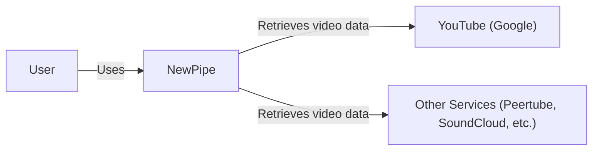
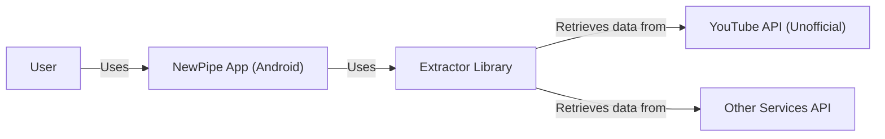
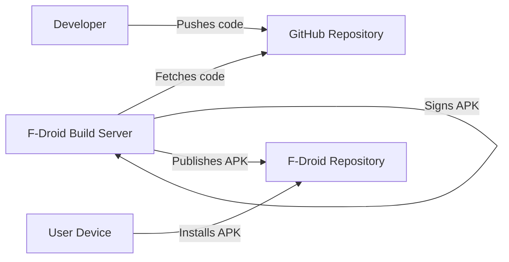
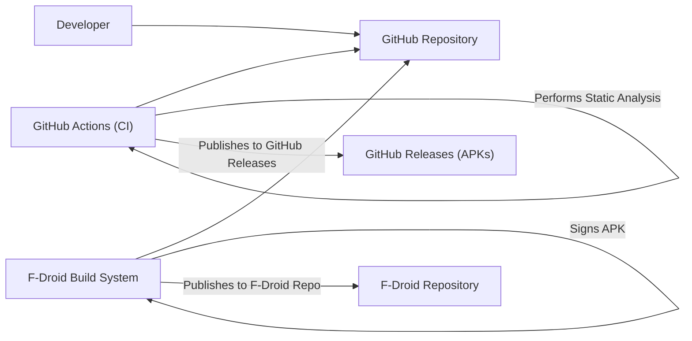

# BUSINESS POSTURE

NewPipe is an open-source, lightweight YouTube client for Android. It aims to provide a privacy-respecting, ad-free experience without requiring Google Play Services or a YouTube account. The project prioritizes user privacy and minimizing data collection.

Business Priorities:

*   Provide a free and open-source alternative to the official YouTube app.
*   Ensure user privacy by minimizing data collection and avoiding tracking.
*   Offer an ad-free viewing experience.
*   Maintain a lightweight application with low resource consumption.
*   Provide features not available in the official app, such as background playback and downloads.
*   Maintain a positive user experience and good performance.

Business Goals:

*   Increase user adoption and maintain a positive reputation.
*   Attract and retain contributors to the project.
*   Ensure the long-term sustainability of the project.

Most Important Business Risks:

*   Legal challenges from Google/YouTube due to copyright or terms of service violations.
*   Dependency on the continued availability and structure of YouTube's public-facing data. Changes to YouTube's API or website structure could break NewPipe's functionality.
*   Maintaining user trust and privacy in the face of potential security vulnerabilities.
*   Reliance on a community-driven development model, which can lead to inconsistent development speed and potential burnout of contributors.
*   Malicious forks or clones of NewPipe that could harm users or damage the project's reputation.

# SECURITY POSTURE

Existing Security Controls:

*   security control: No user accounts or persistent user-specific data storage within the app itself.
*   security control: Limited data collection: NewPipe does not collect personally identifiable information (PII) by design. It fetches data directly from YouTube without routing it through intermediary servers controlled by NewPipe.
*   security control: Open-source codebase: The entire codebase is publicly available on GitHub, allowing for community scrutiny and auditing.
*   security control: Use of HTTPS: Communication with YouTube is done via HTTPS, encrypting the data in transit.
*   security control: No reliance on Google Play Services: This reduces the attack surface and potential privacy concerns associated with Google's proprietary libraries.
*   security control: Regular updates: The development team actively releases updates to address bugs and security vulnerabilities.
*   security control: Content Security Policy (CSP) is not applicable as it is not a web application.
*   security control: Dependency analysis: Dependencies are reviewed, although the process isn't explicitly documented as highly formalized.
*   security control: Code reviews: Pull requests are reviewed by other developers before merging.
*   security control: Static analysis: Basic static analysis is likely performed by Android Studio's built-in lint checks.

Accepted Risks:

*   accepted risk: Reliance on YouTube's unofficial API: NewPipe relies on reverse-engineering YouTube's website and internal APIs, which are subject to change without notice. This is an accepted risk due to the project's core functionality.
*   accepted risk: Limited formal security audits: While the code is open source, there's no indication of regular, professional security audits.
*   accepted risk: Potential for vulnerabilities in third-party libraries: Like any software project, NewPipe depends on external libraries that may contain vulnerabilities.

Recommended Security Controls:

*   Implement a more formalized vulnerability disclosure program.
*   Perform regular penetration testing, either by engaging external security researchers or through a bug bounty program.
*   Integrate more advanced static analysis tools (e.g., FindBugs, SpotBugs, PMD) into the build process.
*   Implement dynamic analysis/fuzzing to identify potential runtime vulnerabilities.
*   Consider using a Software Bill of Materials (SBOM) to track and manage dependencies more effectively.
*   Explore options for reproducible builds to ensure that the published APKs correspond exactly to the source code.

Security Requirements:

*   Authentication: Not applicable, as NewPipe does not have user accounts.
*   Authorization: Not applicable, as there are no user-specific roles or permissions.
*   Input Validation:
    *   Validate all input from external sources, including YouTube's API responses and user-provided search queries. Sanitize data to prevent potential injection vulnerabilities (e.g., cross-site scripting, although less relevant in a native Android app).
    *   Handle malformed data gracefully to prevent crashes or unexpected behavior.
*   Cryptography:
    *   Ensure continued use of HTTPS for all communication with YouTube.
    *   If any local data storage is implemented (e.g., for settings or downloaded content), use appropriate encryption to protect the data at rest.
    *   Use strong, well-vetted cryptographic libraries provided by the Android platform.
*   Data Protection:
    *   Minimize data retention. Do not store any user data unnecessarily.
    *   If storing downloaded content, provide options for users to manage and delete their data.

# DESIGN

## C4 CONTEXT

Element Descriptions:

*   Element:
    *   Name: User
    *   Type: Person
    *   Description: A person who wants to watch videos from YouTube and other services without ads and with enhanced privacy.
    *   Responsibilities: Interacts with the NewPipe application to search for, browse, and play videos.
    *   Security controls: None (client-side). Relies on the security controls implemented in NewPipe.

*   Element:
    *   Name: NewPipe
    *   Type: Software System
    *   Description: An Android application that acts as a client for YouTube and other video services.
    *   Responsibilities: Fetches video data, displays it to the user, handles playback, and provides additional features like background playback and downloads.
    *   Security controls: HTTPS communication, input validation, no user accounts, limited data collection, open-source codebase.

*   Element:
    *   Name: YouTube (Google)
    *   Type: External System
    *   Description: Google's video-sharing platform.
    *   Responsibilities: Provides video content and metadata.
    *   Security controls: Google's internal security controls (not directly relevant to NewPipe's threat model, but assumed to be robust).

*   Element:
    *   Name: Other Services (Peertube, SoundCloud, etc.)
    *   Type: External System
    *   Description: Other video and audio platforms that NewPipe supports.
    *   Responsibilities: Provides video/audio content and metadata.
    *   Security controls: Varies depending on the specific service.

## C4 CONTAINER

Element Descriptions:

*   Element:
    *   Name: User
    *   Type: Person
    *   Description: A person who wants to watch videos.
    *   Responsibilities: Interacts with the NewPipe application.
    *   Security controls: None (client-side).

*   Element:
    *   Name: NewPipe App (Android)
    *   Type: Mobile App
    *   Description: The main Android application.
    *   Responsibilities: Handles user interface, playback, downloads, and overall application logic.
    *   Security controls: Input validation, HTTPS communication (via the Extractor library).

*   Element:
    *   Name: YouTube API (Unofficial)
    *   Type: External System
    *   Description: The reverse-engineered YouTube API used by NewPipe.
    *   Responsibilities: Provides video data and metadata.
    *   Security controls: Relies on YouTube's security measures.

*   Element:
    *   Name: Other Services API
    *   Type: External System
    *   Description: APIs of other supported platforms.
    *   Responsibilities: Provides video/audio data and metadata.
    *   Security controls: Varies depending on the service.

*   Element:
    *   Name: Extractor Library
    *   Type: Library
    *   Description: A library used by NewPipe to extract data from YouTube and other services.
    *   Responsibilities: Handles the complexities of interacting with different video platforms and parsing their data formats.
    *   Security controls: Input validation, HTTPS communication.

## DEPLOYMENT

Possible deployment solutions:

1.  F-Droid: NewPipe is primarily distributed through F-Droid, a repository of free and open-source Android apps.
2.  GitHub Releases: NewPipe also publishes APKs on its GitHub releases page.
3.  User-side loading: Users can download the APK and manually install it on their devices.

Chosen solution (F-Droid):

Element Descriptions:

*   Element:
    *   Name: Developer
    *   Type: Person
    *   Description: A contributor to the NewPipe project.
    *   Responsibilities: Writes code, submits pull requests.
    *   Security controls: Code review process, developer authentication to GitHub.

*   Element:
    *   Name: GitHub Repository
    *   Type: Code Repository
    *   Description: The main source code repository for NewPipe.
    *   Responsibilities: Stores the source code, manages versions, and facilitates collaboration.
    *   Security controls: GitHub's access controls and security features.

*   Element:
    *   Name: F-Droid Build Server
    *   Type: Server
    *   Description: F-Droid's infrastructure for building and signing applications.
    *   Responsibilities: Builds NewPipe from source, signs the APK with F-Droid's key.
    *   Security controls: F-Droid's build environment security, reproducible builds (ideally).

*   Element:
    *   Name: F-Droid Repository
    *   Type: App Repository
    *   Description: F-Droid's repository of applications.
    *   Responsibilities: Hosts the signed NewPipe APK and makes it available for download.
    *   Security controls: F-Droid's repository security.

*   Element:
    *   Name: User Device
    *   Type: Mobile Device
    *   Description: An Android device on which NewPipe is installed.
    *   Responsibilities: Runs the NewPipe application.
    *   Security controls: Android's application sandboxing, user permissions.

## BUILD

Build Process Description:

1.  Developers push code changes to the GitHub repository.
2.  GitHub Actions, the CI/CD system used by NewPipe, triggers a build.
3.  The build process includes:
    *   Compiling the code.
    *   Running unit and integration tests.
    *   Performing static analysis (using tools like lint).
    *   Potentially, running additional security checks (e.g., dependency analysis).
4.  If all checks pass, the build process generates an APK.
5.  The APK is published as a GitHub Release.
6.  F-Droid's build system independently fetches the source code from GitHub.
7.  F-Droid builds the APK from source in its own controlled environment.
8.  F-Droid signs the APK with its own private key.
9.  The signed APK is published to the F-Droid repository.

Security Controls in Build Process:

*   Code review: All code changes are reviewed by other developers before being merged.
*   Automated testing: Unit and integration tests help ensure code quality and prevent regressions.
*   Static analysis: Lint checks identify potential code style issues and some security vulnerabilities.
*   F-Droid build process: Building from source in a controlled environment and signing with F-Droid's key enhances trust and reduces the risk of tampering.
*   GitHub Actions: Provides a consistent and automated build environment.

# RISK ASSESSMENT

Critical Business Processes:

*   Providing a functional and reliable YouTube client.
*   Maintaining user privacy and trust.
*   Ensuring the application is free of malware and security vulnerabilities.
*   Responding to changes in YouTube's API and website structure.

Data to Protect:

*   User search queries (sensitivity: low, as they are not stored persistently by NewPipe).
*   Video metadata (sensitivity: low, as it is publicly available information).
*   Downloaded video content (sensitivity: medium, as it may be copyrighted material, but is stored locally on the user's device).
*   Application settings (sensitivity: low, as they typically don't contain sensitive information).

NewPipe itself does *not* handle highly sensitive data by design. The primary risk is to the *availability* of the service and the *reputation* of the project, rather than to the confidentiality or integrity of user data.

# QUESTIONS & ASSUMPTIONS

Questions:

*   What is the exact process for reviewing and updating dependencies?
*   Are there any plans to implement a formal vulnerability disclosure program or bug bounty program?
*   What specific static analysis tools are used beyond the basic Android lint checks?
*   Are there any plans to implement more robust security testing, such as penetration testing or fuzzing?
*   What is the process for responding to security vulnerabilities reported by external researchers?
*   What is the long-term strategy for dealing with potential legal challenges from Google/YouTube?
*   How are changes to YouTube's API and website structure monitored and addressed?

Assumptions:

*   BUSINESS POSTURE: The primary goal of NewPipe is to provide a privacy-focused, ad-free YouTube experience, even if it means operating in a legal gray area.
*   SECURITY POSTURE: The development team is committed to security best practices, but resources for dedicated security efforts may be limited.
*   DESIGN: NewPipe will continue to rely on reverse-engineering YouTube's API and website structure, as there is no official API available for its intended use case. The project will prioritize maintaining compatibility with YouTube. The F-Droid build process is considered the primary and most trusted distribution method.