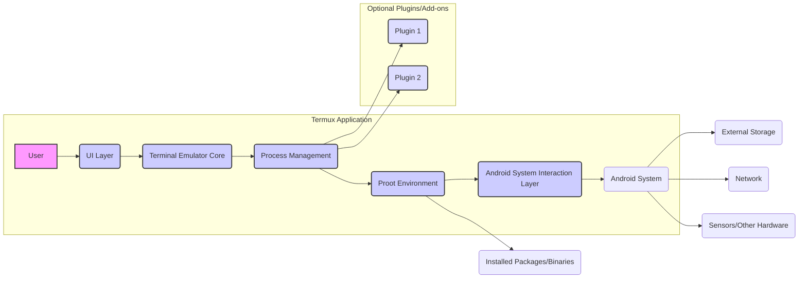
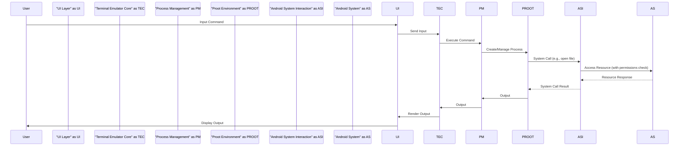

# Project Design Document: Termux App

**Version:** 1.1
**Date:** October 26, 2023
**Author:** AI Software Architect

## 1. Introduction

This document provides a detailed architectural design of the Termux application, an Android terminal emulator and Linux environment application. This design is specifically intended to serve as a foundation for subsequent threat modeling activities, offering a clear understanding of the application's structure and interactions for security analysis.

## 2. Goals and Objectives

The primary goal of this document is to provide a comprehensive and clear understanding of the Termux application's architecture for security analysis and threat identification. The specific objectives are:

*   Clearly define the major components of the Termux application and their responsibilities.
*   Illustrate the interactions and data flow between these components, highlighting potential security implications.
*   Define the trust boundaries and interfaces of the application and its environment.
*   Provide sufficient technical detail to enable effective and targeted threat modeling.
*   Serve as a living document and reference point for future development and security assessments.

## 3. System Architecture

The Termux application architecture comprises several key components working together to provide its functionality:

*   **User Interface (UI) Layer:** Responsible for user interaction and display.
*   **Terminal Emulator Core:** Handles terminal emulation and display logic.
*   **Process Management:** Manages the lifecycle of processes within the Termux environment.
*   **Proot Environment:** Provides an isolated Linux-like environment.
*   **Android System Interaction Layer:** Facilitates communication with the underlying Android OS.
*   **Plugin/Add-on Framework (Optional):** Enables extending Termux functionality.

### 3.1. Component Descriptions

*   **User Interface (UI) Layer:**
    *   Presents the terminal interface to the user, handling input events (touch, keyboard).
    *   Renders the terminal output, interpreting escape sequences for formatting.
    *   Manages UI elements such as the extra keys view, session management, and potentially copy/paste functionality.
    *   Implemented primarily using Android UI framework components (Java/Kotlin).
    *   **Security Relevance:** Potential entry point for malicious input; vulnerabilities in UI rendering could lead to issues.

*   **Terminal Emulator Core:**
    *   The central component responsible for emulating a terminal.
    *   Interprets ANSI escape codes to control text formatting, cursor movement, and other terminal behaviors.
    *   Manages the terminal buffer, storing the displayed text.
    *   Handles character encoding and translation between the UI and the underlying processes.
    *   Likely implemented in Java/Kotlin with potential use of native libraries for performance-critical tasks.
    *   **Security Relevance:** Vulnerabilities in escape code parsing could lead to unexpected behavior or even code execution.

*   **Process Management:**
    *   Responsible for creating, managing, and terminating processes within the isolated Termux environment.
    *   Handles signal delivery to processes.
    *   Manages process groups and sessions, providing a Unix-like process hierarchy.
    *   Relies on Android's process management capabilities in conjunction with the `proot` environment.
    *   **Security Relevance:**  Critical for maintaining isolation and preventing unauthorized access between processes.

*   **Proot Environment:**
    *   Provides an isolated Linux-like environment by leveraging the `proot` tool.
    *   Intercepts system calls made by processes within the Termux environment.
    *   Redirects file system access, allowing processes to operate within a virtualized root directory.
    *   Provides a chroot-like functionality without requiring root privileges.
    *   Crucial for providing a functional and relatively isolated Linux environment on Android.
    *   **Security Relevance:** The effectiveness of isolation depends on the robustness of `proot`'s system call interception and redirection mechanisms. Vulnerabilities here could break isolation.

*   **Android System Interaction Layer:**
    *   Provides controlled interfaces for the Termux environment to interact with the underlying Android operating system.
    *   Handles requests for accessing storage (internal and external), respecting Android's permission model.
    *   Manages network connections, subject to Android's network security policies.
    *   Provides access to device sensors and other hardware components, contingent on granted Android permissions.
    *   Utilizes Android APIs and system calls to bridge the gap between the Termux environment and the Android OS.
    *   **Security Relevance:** This layer acts as a gatekeeper; vulnerabilities here could allow bypassing Android's security measures.

*   **Plugin/Add-on Framework (Optional):**
    *   Allows extending Termux functionality through installable packages (e.g., via `pkg`).
    *   Provides APIs for plugins to interact with the Termux core and potentially access Android resources.
    *   Examples include Termux:API (for accessing Android APIs) and Termux:GUI.
    *   **Security Relevance:** Introduces a potential attack surface if plugins are malicious or contain vulnerabilities. Trust in plugin sources is crucial.

## 4. Data Flow

The following describes the typical data flow within the Termux application, highlighting potential security touchpoints:

1. **User Input:** The user provides input (commands, text) through the UI Layer.
2. **Input Transmission:** The UI Layer transmits the input to the Terminal Emulator Core.
3. **Command Processing:** The Terminal Emulator Core forwards the input to the Process Management component for execution.
4. **Process Execution:** The Process Management component initiates the execution of the command within the Proot Environment.
5. **System Call Handling:** Processes within the Proot Environment make system calls, which are intercepted by `proot`.
6. **Redirection and System Interaction:** `proot` redirects system calls, and if necessary, the Android System Interaction Layer handles communication with the Android OS (e.g., file access, network requests).
7. **Resource Access:** The Android System interacts with hardware or software resources based on the request and granted permissions.
8. **Output Generation:** The executed command generates output (text, errors).
9. **Output Transmission:** The output is sent back through the layers (Proot Environment, Process Management, Terminal Emulator Core) to the UI Layer.
10. **Output Rendering:** The UI Layer renders the output on the user's screen.

### 4.1. Key Data Paths and Security Considerations

*   **Command Execution Path:** User input -> UI (potential injection point) -> Terminal Emulator Core (escape code vulnerabilities) -> Process Management -> Proot Environment (isolation vulnerabilities) -> Android System (permission checks, API vulnerabilities).
*   **Output Display Path:** Process within Proot -> Process Management -> Terminal Emulator Core (potential for malicious output) -> UI (rendering vulnerabilities) -> User.
*   **File Access Path:** Process within Proot -> Proot Environment (redirection bypass) -> Android File System (permission bypass, data leakage).
*   **Network Access Path:** Process within Proot -> Proot Environment -> Android Network Stack (network policy enforcement, potential for unauthorized access).
*   **Plugin Interaction Path:** Process within Proot <-> Plugin (API vulnerabilities, malicious plugin code).

## 5. Security Considerations

This section details potential security considerations and threat vectors based on the architecture:

*   **Arbitrary Code Execution:** The core functionality of Termux involves executing user-provided commands, inherently posing a risk of arbitrary code execution if vulnerabilities exist in the underlying system or `proot`.
*   **Privilege Escalation:** While Termux operates without root privileges, vulnerabilities in `proot` or the Android System Interaction Layer could potentially be exploited to gain elevated privileges on the Android system.
*   **Data Security and Leakage:** Data handled within the Termux environment (files, environment variables, command history) could be at risk of unauthorized access or leakage if isolation is compromised or permissions are misconfigured.
*   **Input Validation Vulnerabilities:** The UI Layer and Terminal Emulator Core must properly sanitize and validate user input to prevent injection attacks (e.g., command injection through specially crafted escape sequences).
*   **Inter-Process Communication (IPC) Vulnerabilities:** If plugins or other processes within the Termux environment communicate, vulnerabilities in IPC mechanisms could be exploited.
*   **Plugin Security Risks:** Malicious or vulnerable plugins can introduce significant security risks, potentially accessing sensitive data or compromising the entire Termux environment.
*   **Network Security Risks:** Processes within Termux can initiate network connections, potentially exposing the device to network-based attacks if proper security measures are not in place within the proot environment or the applications being run.
*   **Android Permission Model Bypass:** Vulnerabilities in the Android System Interaction Layer could potentially allow bypassing Android's permission model, granting unauthorized access to device resources.
*   **Supply Chain Attacks:** The security of packages installed within the Termux environment depends on the integrity of the repositories and package maintainers. Compromised packages could introduce malware.
*   **Denial of Service (DoS):** Malicious commands or processes could potentially consume excessive resources, leading to a denial of service within the Termux environment or even impacting the Android system.

## 6. Assumptions and Constraints

*   The user has installed the official Termux application from a trusted source (e.g., F-Droid, Google Play Store).
*   The underlying Android operating system has its own security mechanisms and policies in place.
*   This design focuses on the core Termux application and its immediate runtime environment. Interactions with external services or websites accessed by users within Termux are considered out of scope.
*   The `proot` tool is a critical and trusted component for providing the isolated environment. Its security is paramount.
*   The user has granted the necessary permissions to the Termux application as requested by the Android system.
*   The security of the Android kernel and its drivers is assumed.

## 7. Future Considerations

*   Further detailed security analysis of the plugin framework and its API.
*   Regular security audits and penetration testing of the core Termux application and the `proot` integration.
*   Exploration of more robust sandboxing techniques within the Termux environment beyond `proot`.
*   Implementation of security features such as content security policies for terminal output rendering.
*   Strengthening the integrity verification mechanisms for installed packages.
*   Consideration of user interface enhancements to provide clearer security indicators.

This document provides a comprehensive architectural overview of the Termux application, specifically tailored for threat modeling. The detailed component descriptions, data flow diagrams, and identified security considerations offer a solid foundation for understanding the application's security posture and potential vulnerabilities.