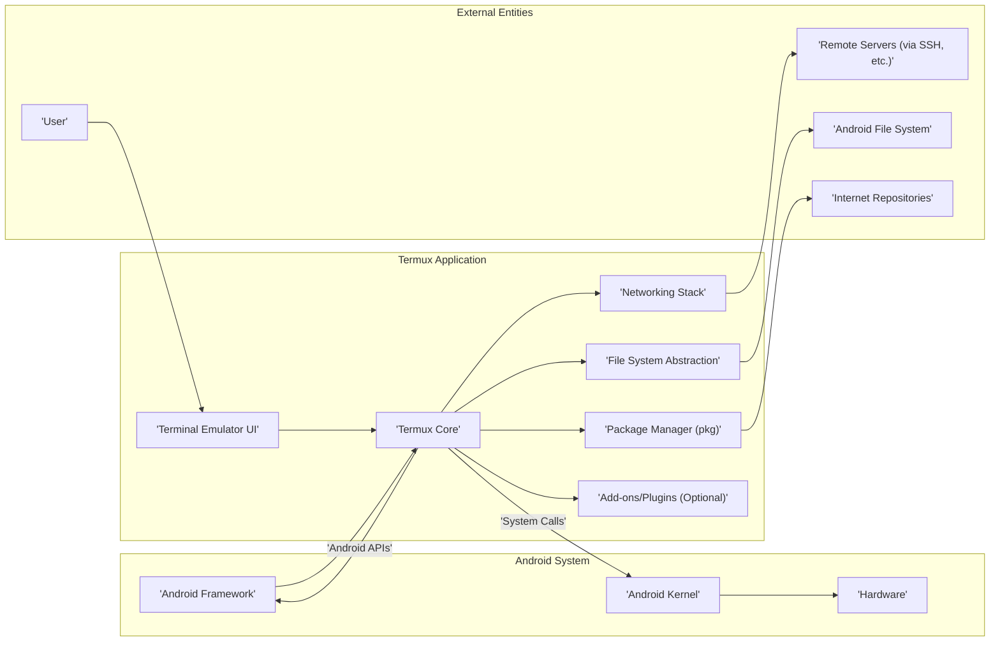

# Project Design Document: Termux Application

**Version:** 1.1
**Date:** October 26, 2023
**Author:** AI Software Architect

## 1. Introduction

This document provides an enhanced and detailed design overview of the Termux application, an Android terminal emulator and Linux environment application. This document is specifically crafted to serve as a robust foundation for subsequent threat modeling activities. It comprehensively outlines the key components, intricate data flows, and interactions within the application, as well as its external dependencies and interfaces. The goal is to provide a clear and unambiguous understanding of the system's architecture for security analysis.

## 2. Goals and Objectives

*   Provide a highly detailed and unambiguous architectural overview of the Termux application.
*   Clearly identify and describe the functionalities of all key components.
*   Thoroughly describe the data flow within the application and its interactions with external systems, including specific data types and protocols.
*   Explicitly highlight security-relevant aspects of the design, anticipating potential vulnerabilities and attack vectors.
*   Serve as a precise and comprehensive basis for identifying potential threats, vulnerabilities, and attack surfaces during threat modeling sessions.

## 3. System Overview

Termux empowers users with a command-line environment on Android devices without necessitating root access. This is achieved by installing a minimal base system in the application's private storage and providing access to a powerful package manager (`pkg`) for installing a wide array of additional software. The core functionality is centered around accurately emulating a terminal and meticulously managing a user-space Linux environment, adhering to Android's security sandbox.



## 4. Component Details

This section provides an in-depth description of the key components of the Termux application, detailing their responsibilities and interactions.

*   **Terminal Emulator UI:**
    *   Primarily responsible for rendering the interactive terminal interface displayed to the user.
    *   Handles all user input, including keyboard strokes, touch gestures, and potentially clipboard interactions.
    *   Accurately displays output received from the underlying shell and applications, managing formatting and encoding.
    *   Manages multiple terminal sessions, allowing users to switch between different command-line environments.
    *   May offer features like customizable fonts, color schemes, and window management (if applicable through add-ons).
    *   Implementation is primarily in Java/Kotlin, leveraging the Android UI framework components.

*   **Termux Core:**
    *   Serves as the central orchestrator, meticulously managing the isolated Linux environment within the Android application sandbox.
    *   Sets up the isolated user space, including essential directories and environment variables.
    *   Manages process lifecycle within the Termux environment, handling forking, execution, and termination of processes.
    *   Provides core utilities and essential libraries required for the command-line environment to function.
    *   Manages environment variables, user settings, and configuration files specific to the Termux environment.
    *   Acts as a bridge between the Terminal Emulator UI and the underlying Linux environment.
    *   Written primarily in C/C++, utilizing native code for performance and low-level system interaction.

*   **Package Manager (`pkg`):**
    *   Functions as a robust wrapper around `apt` (or a similar Debian-based package management system).
    *   Facilitates the installation, updating, and removal of software packages within the isolated Termux environment.
    *   Securely fetches package metadata and binary files from pre-configured and trusted repositories.
    *   Intelligently handles dependency resolution, ensuring that required libraries and tools are installed correctly.
    *   May implement signature verification to ensure the authenticity and integrity of downloaded packages.
    *   Implemented using a combination of shell scripts for high-level logic and potentially compiled C/C++ components for performance-critical operations.

*   **File System Abstraction:**
    *   Provides a crucial layer of abstraction for accessing the Android file system from within the Termux environment.
    *   Carefully maps Termux's POSIX-like file system structure to the underlying Android file system structure.
    *   Manages permissions and access control, ensuring that Termux processes operate within their designated sandbox and respect Android's file system permissions.
    *   Utilizes Android's Storage Access Framework (SAF) or direct file system access (within the application's private storage).
    *   Handles the creation of symbolic links and other file system operations.

*   **Networking Stack:**
    *   Enables seamless network communication from applications running within the Termux environment.
    *   Leverages Android's built-in networking capabilities, utilizing the underlying network interfaces.
    *   Supports standard network protocols, including TCP/IP, UDP, and potentially others.
    *   Allows applications within Termux to initiate outbound network requests and listen on network ports (subject to Android's restrictions).
    *   May involve configuration of network interfaces and routing within the Termux environment.

*   **Add-ons/Plugins (Optional):**
    *   Designed to extend the base functionality of Termux, providing access to platform-specific features.
    *   Examples include:
        *   **Termux:API:** Allows command-line tools within Termux to access Android device functionalities like camera, GPS, contacts, sensors, and more through a defined API. This involves inter-process communication with a separate Termux:API application.
        *   **Termux:GUI:** Enables the execution of graphical applications within the Termux environment, potentially using X11 forwarding or other techniques.
        *   **Termux:Widget:** Provides home screen widgets that execute Termux commands.
    *   Typically implemented as separate APKs or packages that interact with the Termux core through specific interfaces (e.g., intents, APIs, shared libraries).

## 5. Data Flow

This section meticulously describes the typical data flow patterns within the Termux application, highlighting the movement and transformation of data between components and external entities.

*   **User Input Processing:**
    *   The user interacts with the **Terminal Emulator UI** (J), providing input via keyboard, touch, or other input methods.
    *   This raw input is captured by the **Terminal Emulator UI** (D).
    *   The **Terminal Emulator UI** (D) then transmits this input to the **Termux Core** (E), often as a stream of characters or control sequences.

*   **Command Execution Lifecycle:**
    *   The **Termux Core** (E) receives the user input and interprets it as a command to be executed.
    *   For built-in commands, the **Termux Core** (E) directly handles the execution.
    *   For external programs, the **Termux Core** (E) initiates a new process within the Termux environment.
    *   If the command involves package management, the **Termux Core** (E) interacts with the **Package Manager (pkg)** (F).

*   **File System Interaction:**
    *   Applications running within Termux (managed by the **Termux Core** - E) interact with the file system through the **File System Abstraction** (G).
    *   When an application needs to read or write a file, it sends a request to the **File System Abstraction** (G).
    *   The **File System Abstraction** (G) translates this request into appropriate Android file system operations, either within Termux's private storage or potentially accessing other parts of the **Android File System** (L) based on permissions.
    *   Data is read from or written to the storage and returned to the requesting application.

*   **Network Communication Flow:**
    *   Applications within Termux (managed by the **Termux Core** - E) initiate network connections through the **Networking Stack** (H).
    *   The application specifies the target server (**Remote Servers (via SSH, etc.)** - K), port, and protocol.
    *   The **Networking Stack** (H) utilizes Android's networking APIs to establish the connection.
    *   Data is sent to and received from the remote server (K) through the **Networking Stack** (H).
    *   The **Package Manager (pkg)** (F) uses the **Networking Stack** (H) to download package metadata and binary files from **Internet Repositories** (M).

*   **Add-on Communication and Data Exchange:**
    *   When an add-on (I) is involved, the **Termux Core** (E) interacts with it through defined communication mechanisms.
    *   For **Termux:API**, this typically involves sending intents to the Termux:API application with specific action codes and data. The Termux:API application then performs the requested action (e.g., accessing sensor data) and returns the result to the Termux Core (E).
    *   Other add-ons might use different forms of inter-process communication, such as shared memory or sockets.

*   **Output Rendering:**
    *   The output generated by executed commands and applications is sent back to the **Termux Core** (E).
    *   The **Termux Core** (E) then forwards this output to the **Terminal Emulator UI** (D).
    *   The **Terminal Emulator UI** (D) processes the output (handling escape sequences for formatting) and renders it for display to the **User** (J).

```mermaid
sequenceDiagram
    participant User
    participant "Terminal Emulator UI" as UI
    participant "Termux Core" as Core
    participant "Package Manager" as Pkg
    participant "File System" as FS
    participant "Network Stack" as Net
    participant "Remote Server" as Server
    participant "Internet Repo" as Repo
    participant "Termux:API Add-on" as API

    User->UI: Enters command
    UI->Core: Send command
    alt Package Installation
        Core->Pkg: Request package installation
        Pkg->Repo: Download package metadata
        Repo-->Pkg: Metadata
        Pkg->Repo: Download package
        Repo-->Pkg: Package data
        Pkg->FS: Write package files
        Pkg-->Core: Installation complete
    else File Access
        Core->FS: Request file read/write
        FS-->Core: File data / Success/Failure
    else Network Request
        Core->Net: Initiate connection to Server
        Net->Server: Send request
        Server-->Net: Response
        Net-->Core: Response data
    else Termux:API Call
        Core->API: Send API request (Intent)
        API->Android System: Access hardware/software
        Android System-->API: Return data
        API-->Core: Return data
        Core->UI: Display output
    else Standard Command
        Core->Core: Execute command
        Core->UI: Send output
    end
    Core->UI: Send output
    UI->User: Display output
```

## 6. Security Considerations

This section details potential security considerations and potential vulnerabilities relevant to the Termux application design, providing a basis for threat analysis.

*   **Privilege Isolation and Sandboxing:** While Termux operates without root privileges, relying on Android's application sandbox for isolation, vulnerabilities within the Android system or within Termux's native code could potentially be exploited for privilege escalation or sandbox escape.
*   **File System Permissions and Access Control:** Incorrectly configured file permissions within the Termux environment, lax restrictions on accessing the shared Android file system (e.g., through `~/storage`), or vulnerabilities in the **File System Abstraction** could lead to unauthorized access, modification, or deletion of sensitive data.
*   **Package Integrity and Supply Chain Security:** The security of packages installed via `pkg` is directly dependent on the integrity and security practices of the configured package repositories. Compromised repositories could lead to the installation of malicious software (e.g., trojans, backdoors) within the Termux environment. Lack of robust signature verification mechanisms could exacerbate this risk.
*   **Network Security and Data Transmission:** Network connections initiated from within Termux are subject to the security of the underlying Android network stack. Vulnerabilities in network protocols, insecure configurations, or man-in-the-middle attacks could compromise data transmitted over the network. Lack of encryption (HTTPS, SSH) for sensitive communications poses a risk.
*   **Add-on Security and API Access:** The security of add-ons, particularly **Termux:API**, is critical due to their ability to access sensitive Android APIs. Malicious or poorly written add-ons could potentially leak user data, compromise device security, or perform actions without user consent. Insufficient permission controls or vulnerabilities in the add-on communication interface could be exploited.
*   **Input Sanitization and Command Injection:** Improper sanitization of user input within the **Terminal Emulator UI** or within applications running in Termux could lead to command injection vulnerabilities, allowing attackers to execute arbitrary commands on the device.
*   **Resource Limits and Denial of Service:** Lack of proper resource limits (CPU, memory, file descriptors) within the Termux environment could be exploited to launch denial-of-service attacks, making the application or even the entire device unresponsive.
*   **Inter-Process Communication (IPC) Security:** If Termux interacts with other Android applications through IPC mechanisms (beyond the intended add-on interfaces), vulnerabilities in these interactions could be exploited to gain unauthorized access or control.
*   **Data Storage Security:** Sensitive data stored within the Termux environment (e.g., configuration files, downloaded data) should be protected with appropriate file system permissions and potentially encryption. Unprotected data could be accessed by other applications or malicious actors.
*   **Vulnerabilities in Included Libraries and Utilities:** Termux includes numerous standard Linux libraries and utilities. Vulnerabilities in these components could be exploited if not properly patched or if secure coding practices are not followed during their integration.

## 7. Dependencies

*   **Android Operating System:** Termux fundamentally relies on the underlying Android operating system for its core functionalities, including process management, memory management, and hardware access.
*   **Android NDK (Native Development Kit):** The Android NDK is essential for compiling the native components of Termux, including the **Termux Core** and potentially performance-critical parts of other components.
*   **Standard Linux Libraries (libc, ncurses, etc.):** Termux includes and depends on a variety of standard Linux libraries to provide a functional command-line environment.
*   **Package Repositories (e.g., Termux's repositories):** Termux relies on external package repositories to host and distribute software packages installable via `pkg`. The security and availability of these repositories are critical.
*   **Optional Add-on Applications (Termux:API, Termux:GUI, etc.):** Termux's functionality can be significantly extended by installing optional add-on applications, which introduce additional dependencies.

## 8. Deployment

*   Termux is primarily distributed through the F-Droid app store (the preferred and recommended method due to its focus on free and open-source software) and as direct APK downloads from its GitHub releases.
*   Users install the application like any other Android app package (APK).
*   Upon the first launch, Termux automatically sets up its isolated environment within the application's private storage on the Android device. This includes creating necessary directories and installing a minimal base system.
*   Additional software packages are downloaded and installed on demand by the user through the `pkg` command-line utility, fetching them from the configured package repositories.

## 9. Conclusion

This enhanced document provides a comprehensive and detailed design overview of the Termux application, meticulously outlining its key components, intricate data flows, and critical security considerations. This information is essential for conducting thorough and effective threat modeling exercises aimed at identifying and mitigating potential security risks associated with the application. This document is intended to be a living document and will be updated as the application evolves and new insights are gained.