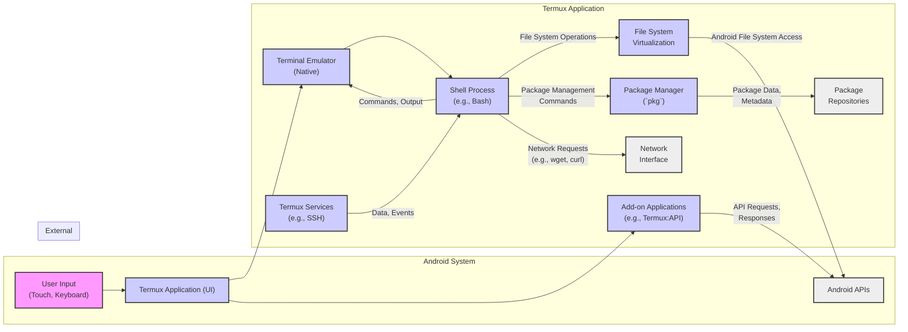

# Project Design Document: Termux App

**Version:** 1.1
**Date:** October 26, 2023
**Author:** AI Software Architect

## 1. Introduction

This document provides a detailed design overview of the Termux application for Android, specifically for the purpose of threat modeling. It outlines the system architecture, key components, and data flows to facilitate the identification of potential security vulnerabilities. Termux is an Android terminal emulator and Linux environment application enabling users to run a command-line interface (CLI) environment on their Android devices without requiring root access.

## 2. Goals and Objectives

* Provide a functional and responsive terminal emulation experience on Android.
* Offer a user-space Linux environment capable of running standard command-line tools.
* Operate securely within the Android application sandbox without requiring privileged access.
* Enable users to install and manage software packages through a dedicated package manager.
* Facilitate user interaction with the Android system through command-line utilities and optional APIs.

## 3. System Architecture

The Termux application is structured into several interacting layers:

* **User Interface (UI) Layer:**
    * Responsible for rendering the terminal display and handling user input (keyboard, touch).
    * Implemented using Android Activities and Views.
    * Interacts with the Terminal Emulation Layer to display output and send input.
* **Terminal Emulation Layer:**
    * The core of the application, responsible for emulating a terminal.
    * Interprets ANSI escape codes for formatting and control.
    * Manages the terminal buffer and scrollback.
    * Handles input from the UI and output from the Shell Process.
    * Often implemented in native code (C/C++) for performance.
* **Process Management Layer:**
    * Manages the lifecycle of processes within the Termux environment.
    * Responsible for launching the initial shell process and subsequent commands.
    * Utilizes Android's process management capabilities.
* **File System Virtualization Layer:**
    * Provides a virtualized Linux-like file system structure within the application's private data directory.
    * Uses `proot` or similar techniques to achieve this without root.
    * Intercepts file system calls and redirects them to the virtualized environment.
    * Interacts with the underlying Android file system.
* **Package Management Layer:**
    * Handles the installation, removal, and updating of software packages.
    * Implements the `pkg` command, which is based on `apt` or a similar system.
    * Downloads packages from configured repositories.
    * Manages package dependencies and installation locations within the virtualized file system.
* **Android System Integration Layer:**
    * Provides controlled access to specific Android system functionalities.
    * Primarily achieved through optional add-on applications (e.g., Termux:API).
    * Requires explicit user permissions for accessing sensitive resources.

## 4. Key Components

* **Termux Application (Android APK):**
    * The main installable package for the application.
    * Contains the UI, core logic, and native libraries.
    * Entry point for user interaction.
* **Terminal Emulator (Native Library):**
    * Implements the terminal emulation logic.
    * Handles rendering, input processing, and communication with the shell.
    * Potential point for vulnerabilities related to escape code parsing or buffer overflows.
* **Shell (e.g., Bash, Zsh):**
    * The command-line interpreter that executes user commands.
    * Can be a source of vulnerabilities if not properly configured or if users execute untrusted commands.
* **Package Manager (`pkg`):**
    * Manages software packages within the Termux environment.
    * Relies on trusted repositories for package integrity.
    * Vulnerable to man-in-the-middle attacks if HTTPS is not enforced for repository communication.
* **Base System (Busybox or similar):**
    * Provides essential Linux utilities.
    * Security depends on the security of the individual utilities included.
* **Proot (or similar virtualization tool):**
    * Creates the isolated Linux environment.
    * Its security is crucial for preventing escape from the virtualized environment.
    * Misconfigurations could lead to security breaches.
* **Termux Services (Background Processes):**
    * Optional background services for features like SSH server.
    * Introduce potential attack vectors if not properly secured (e.g., default credentials, unpatched vulnerabilities).
* **Add-on Applications (e.g., Termux:API):**
    * Extend Termux functionality by providing access to Android APIs.
    * Require careful permission management to prevent abuse.
    * Communication between Termux and add-ons needs to be secure.

## 5. Data Flow

**Detailed Data Flow:**

* **User Interaction:** The user provides input through the Android system (touchscreen, keyboard). This input is received by the Termux Application's UI.
* **Input Processing:** The UI forwards the input to the Terminal Emulator.
* **Command Execution:** The Terminal Emulator sends the interpreted input (commands) to the Shell Process.
* **Shell Operations:** The Shell Process executes the commands, which may involve:
    * **Local Operations:** Executing built-in commands or scripts within the Termux environment.
    * **File System Access:**  The Shell interacts with the File System Virtualization layer to access files and directories. This layer translates requests to the underlying Android file system.
    * **Package Management:** The Shell can invoke the Package Manager (`pkg`) to install, remove, or update software. The Package Manager retrieves package data and metadata from configured Package Repositories.
    * **Network Communication:** The Shell can initiate network requests using tools like `curl` or `wget`, which utilize the Android device's Network Interface.
    * **Service Interaction:** The Shell can communicate with background Termux Services for specific functionalities.
    * **Add-on Communication:** The Shell or other Termux components can interact with Add-on Applications through inter-process communication (IPC), exchanging API requests and responses.
* **Output Rendering:** The output generated by the Shell Process is sent back to the Terminal Emulator for rendering and display in the UI.
* **Android API Access:** Termux or its Add-on Applications can directly interact with Android APIs, subject to granted permissions.

## 6. Security Considerations

* **Android Application Sandbox:** Termux operates within the Android application sandbox, which provides a degree of isolation from other applications and the system. However, vulnerabilities within Termux could potentially be exploited to escape this sandbox.
* **`proot` Security:** The security of the `proot` environment is critical. Vulnerabilities in `proot` could allow for privilege escalation or escape from the virtualized environment.
* **Input Validation:**  The Terminal Emulator and Shell must rigorously validate user input to prevent command injection attacks. Maliciously crafted escape sequences could also be a threat.
* **Package Management Security:**
    * **Repository Integrity:** The security of the packages depends on the integrity of the configured repositories. Compromised repositories could serve malicious software.
    * **HTTPS Enforcement:** Communication with package repositories should always use HTTPS to prevent man-in-the-middle attacks.
    * **Package Signing:** Verifying package signatures can help ensure the authenticity and integrity of downloaded packages.
* **Network Security:**
    * **Unencrypted Connections:** User actions within Termux might involve unencrypted network connections, making them susceptible to eavesdropping.
    * **Exposure of Services:** Running network services within Termux (e.g., SSH) exposes them to potential attacks if not properly configured and secured.
* **Inter-Process Communication (IPC) Security:** Communication between Termux and its add-ons needs to be secured to prevent malicious applications from injecting commands or data.
* **Permissions Management:** While Termux requests minimal permissions by default, users might grant additional permissions to add-ons. Overly permissive grants could increase the attack surface.
* **Code Integrity:** Ensuring the integrity of the Termux application code is crucial. Tampering with the APK could introduce vulnerabilities.
* **Update Mechanism Security:** The update process for Termux itself needs to be secure to prevent the distribution of malicious updates.
* **User Data Security:** Data stored within the Termux environment should be protected. Default permissions on files and directories should be restrictive.
* **Root Access Implications:** While Termux doesn't require root, if the device is rooted, users might inadvertently grant root privileges to processes within Termux, bypassing security measures designed for non-rooted environments. This can significantly increase the risk.

## 7. Deployment

Termux is primarily distributed through:

* **F-Droid:** The preferred and recommended source, offering reproducible builds and a focus on privacy.
* **GitHub Releases:** APK files are available for direct download from the official Termux GitHub repository.
* **Historical Google Play Store:** While previously available, updates are no longer provided through this channel due to API changes. Users might still have older versions installed from the Play Store.

## 8. Future Considerations

* **Strengthened Sandboxing:** Explore and implement more robust sandboxing techniques beyond `proot` to further isolate the Termux environment.
* **Formal Security Audits:** Conduct regular, independent security audits of the codebase, including native components and dependencies.
* **Improved Permission Granularity:** Offer more fine-grained control over permissions granted to Termux and its add-ons, allowing users to minimize the attack surface.
* **Integration with Android Security Features:**  Leverage newer Android security features and APIs to enhance the security posture of Termux.
* **Secure Boot and Integrity Checks:** Implement mechanisms to verify the integrity of the Termux installation at runtime.
* **Enhanced Vulnerability Disclosure Program:** Establish a clear and responsive process for reporting and addressing security vulnerabilities.

This improved design document provides a more detailed and security-focused overview of the Termux application. It highlights key components, data flows, and potential security considerations, making it a valuable resource for subsequent threat modeling activities.