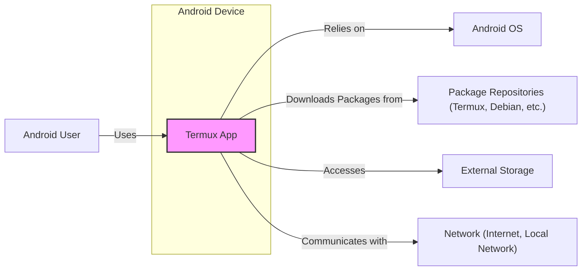

# BUSINESS POSTURE

The Termux project aims to provide a powerful and accessible terminal emulator and Linux environment for Android devices.

- Business Priorities and Goals:
  - Provide a free and open-source terminal emulator for Android.
  - Offer a complete Linux environment on Android without requiring rooting.
  - Empower users with command-line tools for development, system administration, and general computing tasks on mobile devices.
  - Maintain user privacy and security within the Termux environment.
  - Foster a community around the Termux project and encourage contributions.

- Business Risks:
  - Security vulnerabilities in the application or provided packages could compromise user devices and data.
  - Dependence on volunteer developers and maintainers can lead to slow updates or project stagnation.
  - Changes in Android OS or Google Play Store policies could break Termux functionality or distribution.
  - Competition from other terminal emulators or alternative mobile computing solutions.
  - Misuse of Termux for malicious activities due to its powerful capabilities.

# SECURITY POSTURE

- Security Controls:
  - security control: Open-source codebase (publicly auditable on GitHub). Implemented: GitHub Repository.
  - security control: Use of standard Linux packages and tools. Implemented: Termux environment.
  - security control: Android permission model restricting access to device resources. Implemented: Android OS.
  - security control: Regular updates of packages within the Termux environment. Implemented: `pkg` package manager.
  - security control: Distribution through reputable app stores (Google Play, F-Droid). Implemented: App store distribution channels.

- Accepted Risks:
  - accepted risk: Reliance on upstream package security. Risk accepted due to the nature of providing a Linux environment.
  - accepted risk: Potential for user misconfiguration leading to security issues within the Termux environment. Risk accepted as Termux provides a powerful and flexible environment.
  - accepted risk: Vulnerabilities in open-source dependencies. Risk mitigated by regular updates and community scrutiny.

- Recommended Security Controls:
  - security control: Automated security scanning of the Termux application code (SAST/DAST).
  - security control: Dependency vulnerability scanning for packages included in the Termux environment.
  - security control: Implement reproducible builds to ensure build integrity and prevent supply chain attacks.
  - security control: User education and documentation on secure usage of Termux, including best practices for permissions and package management.

- Security Requirements:
  - Authentication:
    - Requirement: Termux itself does not require user authentication to access the terminal environment.
    - Requirement: Authentication to external services (SSH, web servers) should be handled by standard Linux tools within Termux.
  - Authorization:
    - Requirement: Termux should respect Android's permission model to control access to device resources.
    - Requirement: Within the Termux environment, standard Linux file permissions should be enforced.
    - Requirement: Consider implementing optional fine-grained permission control for Termux features if feasible and beneficial.
  - Input Validation:
    - Requirement:  Input to Termux commands should be validated to prevent command injection vulnerabilities. This is primarily the responsibility of the underlying Linux tools and shell.
    - Requirement:  Ensure proper handling of user input in any Termux-specific components or scripts.
  - Cryptography:
    - Requirement:  Utilize standard cryptographic libraries provided by the Android OS and Linux environment for secure communication and data handling within Termux.
    - Requirement:  Ensure proper configuration and usage of cryptographic tools (e.g., SSH, GnuPG) within the Termux environment.

# DESIGN

## C4 CONTEXT



- Context Diagram Elements:
  - - Name: Termux App
    - Type: Software System
    - Description: The Termux application, providing a terminal emulator and Linux environment on Android.
    - Responsibilities:
      - Emulate a terminal interface.
      - Provide a Linux-like environment on Android.
      - Manage packages and software installations.
      - Allow users to run command-line tools and applications.
    - Security controls:
      - Android permission model.
      - Open-source codebase.
      - Package management system for updates.

  - - Name: Android User
    - Type: Person
    - Description: A user who interacts with the Termux application on their Android device.
    - Responsibilities:
      - Install and configure the Termux application.
      - Use the terminal emulator to run commands and applications.
      - Manage files and data within the Termux environment.
    - Security controls:
      - User awareness and responsible usage of the terminal environment.
      - Management of Android device security settings.

  - - Name: Android OS
    - Type: Software System
    - Description: The underlying Android operating system that Termux runs on.
    - Responsibilities:
      - Provide the runtime environment for Termux.
      - Enforce system-level security policies and permissions.
      - Manage device resources and hardware.
    - Security controls:
      - Android permission model.
      - Security updates and patches.
      - Sandboxing of applications.

  - - Name: Package Repositories (Termux, Debian, etc.)
    - Type: External System
    - Description: Online repositories that host software packages that can be installed within the Termux environment.
    - Responsibilities:
      - Store and distribute software packages.
      - Provide package metadata and dependencies.
      - Ensure package integrity (checksums, signatures).
    - Security controls:
      - HTTPS for package downloads.
      - Package signing and verification.
      - Repository security measures.

  - - Name: External Storage
    - Type: External System
    - Description: The Android device's external storage (SD card, shared storage) that Termux can access.
    - Responsibilities:
      - Store user files and data.
      - Provide persistent storage for the Termux environment.
    - Security controls:
      - Android file permissions.
      - User management of file access.
      - Potential encryption of external storage by Android OS.

  - - Name: Network (Internet, Local Network)
    - Type: External System
    - Description: Networks that the Android device is connected to, allowing Termux to communicate with external systems.
    - Responsibilities:
      - Provide network connectivity for Termux.
      - Enable communication with remote servers and services.
    - Security controls:
      - Network security protocols (HTTPS, SSH).
      - Firewall and network security configurations on the user's network.
      - Android network permissions.

## C4 CONTAINER

```mermaid
graph LR
    subgraph "Android Device"
        subgraph "Termux App Container"
            A["Termux Application"]
            B["Terminal Emulator"]
            C["Package Manager (pkg)"]
            D["Core Utilities (shell, coreutils)"]
        end
    end
    E["Android OS"]
    F["Package Repositories"]
    G["File System (Android Storage)"]
    H["Network Interfaces"]

    A -- Uses --> B
    A -- Uses --> C
    A -- Uses --> D
    B -- Uses --> D
    C -- Downloads from --> F
    D -- Accesses --> G
    A -- Uses --> E
    A -- Uses --> H
    B -- Communicates with --> H

    style A fill:#f9f,stroke:#333,stroke-width:2px
    style "Termux App Container" fill:#ccf,stroke:#333,stroke-width:2px,stroke-dasharray: 5 5
```

- Container Diagram Elements:
  - - Name: Termux Application
    - Type: Container - Android Application
    - Description: The main Termux Android application package, acting as the entry point and orchestrator.
    - Responsibilities:
      - Manage application lifecycle on Android.
      - Integrate with Android OS services.
      - Provide user interface and settings.
      - Coordinate terminal emulation and package management.
    - Security controls:
      - Android application sandboxing.
      - Application signing.
      - Regular updates through app stores.

  - - Name: Terminal Emulator
    - Type: Container - Software Component
    - Description: The component responsible for emulating a terminal interface, handling user input and output.
    - Responsibilities:
      - Render terminal display.
      - Process user input (keyboard, touch).
      - Interact with the underlying shell and core utilities.
      - Manage terminal sessions.
    - Security controls:
      - Input validation (to prevent escape sequences vulnerabilities).
      - Secure handling of terminal data.

  - - Name: Package Manager (pkg)
    - Type: Container - Software Component
    - Description: The package manager used to install, update, and remove software packages within the Termux environment.
    - Responsibilities:
      - Download packages from repositories.
      - Resolve package dependencies.
      - Install and uninstall software.
      - Manage package updates.
    - Security controls:
      - HTTPS for package downloads.
      - Package signature verification.
      - Repository security policies.

  - - Name: Core Utilities (shell, coreutils)
    - Type: Container - Software Component
    - Description: The core Linux utilities and shell (e.g., bash, zsh, coreutils) that provide the fundamental command-line environment.
    - Responsibilities:
      - Execute user commands.
      - Provide basic command-line tools (ls, cp, mv, etc.).
      - Manage processes and file system interactions.
    - Security controls:
      - Standard Linux security mechanisms (file permissions, process isolation).
      - Security updates for core utilities packages.

  - - Name: Android OS
    - Type: Container - Operating System
    - Description: The underlying Android operating system.
    - Responsibilities:
      - Provide system calls and APIs for Termux.
      - Manage resources and security policies.
    - Security controls:
      - Android security features (sandboxing, permissions).
      - OS-level security updates.

  - - Name: Package Repositories
    - Type: Container - External System
    - Description: Remote servers hosting software packages.
    - Responsibilities:
      - Host and distribute packages.
      - Maintain package metadata.
    - Security controls:
      - Repository security measures.
      - HTTPS.
      - Package signing.

  - - Name: File System (Android Storage)
    - Type: Container - Data Store
    - Description: The Android device's file system, used for storing Termux files and user data.
    - Responsibilities:
      - Persistent storage for Termux environment.
      - File access and management.
    - Security controls:
      - Android file permissions.
      - User data encryption (optional Android feature).

  - - Name: Network Interfaces
    - Type: Container - Infrastructure
    - Description: Android's network interfaces, allowing Termux to communicate over networks.
    - Responsibilities:
      - Network connectivity for Termux.
    - Security controls:
      - Android network permissions.
      - Device network security settings.

## DEPLOYMENT

Deployment Architecture: App Store Distribution

```mermaid
graph LR
    A["Developer"] --> B["Build System (GitHub Actions)"]
    B --> C["Termux APK Artifact"]
    C --> D{ "Google Play Store / F-Droid" }
    D --> E["Android User Devices"]

    style D fill:#ccf,stroke:#333,stroke-width:2px,stroke-dasharray: 5 5
```

- Deployment Diagram Elements:
  - - Name: Developer
    - Type: Person/Role
    - Description: Software developers contributing to the Termux project.
    - Responsibilities:
      - Write and maintain Termux code.
      - Commit code changes to the GitHub repository.
    - Security controls:
      - Secure coding practices.
      - Code review process.
      - Access control to the code repository.

  - - Name: Build System (GitHub Actions)
    - Type: Infrastructure - CI/CD
    - Description: Automated build system (e.g., GitHub Actions) used to compile and package Termux.
    - Responsibilities:
      - Automate the build process.
      - Compile code, run tests, and create APK artifacts.
      - Potentially perform security checks during build.
    - Security controls:
      - Secure CI/CD pipeline configuration.
      - Access control to CI/CD system.
      - Build artifact signing.

  - - Name: Termux APK Artifact
    - Type: Artifact - Software Package
    - Description: The compiled Android Application Package (APK) file for Termux.
    - Responsibilities:
      - Contain the complete Termux application.
      - Be installable on Android devices.
    - Security controls:
      - Application signing.
      - Integrity checks (checksums).

  - - Name: Google Play Store / F-Droid
    - Type: Infrastructure - App Store
    - Description: App stores used to distribute Termux to Android users.
    - Responsibilities:
      - Host and distribute the Termux APK.
      - Verify application integrity (Google Play Protect).
      - Provide update mechanisms.
    - Security controls:
      - App store security scanning.
      - Developer account verification.
      - User reviews and ratings.

  - - Name: Android User Devices
    - Type: Infrastructure - End User Devices
    - Description: Android devices where users install and run the Termux application.
    - Responsibilities:
      - Run the Termux application.
      - Provide the runtime environment.
    - Security controls:
      - Device security settings.
      - Android OS security features.
      - User responsibility for device security.

## BUILD

```mermaid
graph LR
    A["Developer"] --> B["Code Repository (GitHub)"]
    B --> C["Build System (GitHub Actions)"]
    C --> D["Security Checks (SAST, Linters)"]
    D --> E["Compilation & Packaging"]
    E --> F["Artifact Signing"]
    F --> G["Termux APK Artifact"]

    subgraph "Build System (GitHub Actions)"
        direction TB
        C
        D
        E
        F
    end
    style "Build System (GitHub Actions)" fill:#ccf,stroke:#333,stroke-width:2px,stroke-dasharray: 5 5
```

- Build Process Elements:
  - - Name: Developer
    - Type: Role
    - Description: Software developers writing and contributing code.
    - Responsibilities:
      - Write secure and functional code.
      - Follow coding standards and best practices.
      - Submit code changes via pull requests.
    - Security controls:
      - Secure development training.
      - Code review process.
      - Access control to code repository.

  - - Name: Code Repository (GitHub)
    - Type: Tool - Version Control
    - Description: GitHub repository hosting the Termux source code.
    - Responsibilities:
      - Store and manage source code.
      - Track code changes and versions.
      - Facilitate collaboration among developers.
    - Security controls:
      - Access control (authentication, authorization).
      - Audit logging.
      - Branch protection.

  - - Name: Build System (GitHub Actions)
    - Type: Tool - CI/CD
    - Description: GitHub Actions workflow for automated building and testing.
    - Responsibilities:
      - Automate build process.
      - Run tests and security checks.
      - Package the application.
    - Security controls:
      - Secure workflow configuration.
      - Secret management for signing keys.
      - Isolation of build environments.

  - - Name: Security Checks (SAST, Linters)
    - Type: Tool - Security Scanning
    - Description: Static Application Security Testing (SAST) tools and linters integrated into the build process.
    - Responsibilities:
      - Automatically scan code for potential security vulnerabilities and code quality issues.
      - Provide feedback to developers.
      - Enforce coding standards.
    - Security controls:
      - Regularly updated security rules and vulnerability databases.
      - Configuration of scanning tools for relevant checks.

  - - Name: Compilation & Packaging
    - Type: Process - Build Step
    - Description: Steps to compile source code and package it into an APK.
    - Responsibilities:
      - Compile native code (if any).
      - Package resources and assets.
      - Create the APK file.
    - Security controls:
      - Use of trusted build tools and toolchains.
      - Dependency management and vulnerability scanning of dependencies.

  - - Name: Artifact Signing
    - Type: Process - Build Step
    - Description: Signing the APK artifact with a digital signature.
    - Responsibilities:
      - Ensure the integrity and authenticity of the APK.
      - Allow Android to verify the application's origin.
    - Security controls:
      - Secure storage and management of signing keys.
      - Protection of signing process from unauthorized access.

  - - Name: Termux APK Artifact
    - Type: Artifact - Software Package
    - Description: The final Termux Android Application Package (APK) ready for distribution.
    - Responsibilities:
      - Be the distributable package for Termux.
    - Security controls:
      - Digital signature.
      - Integrity checksums.

# RISK ASSESSMENT

- Critical Business Processes:
  - Providing a functional and reliable terminal emulator and Linux environment on Android.
  - Maintaining the open-source nature and community around the project.
  - Ensuring user privacy and security within the Termux environment.
  - Distributing Termux through trusted channels (app stores).

- Data to Protect and Sensitivity:
  - User commands and input within the terminal: Medium sensitivity. Could contain personal or sensitive information depending on user activity.
  - Files and data stored within the Termux environment: High sensitivity. Can include user documents, code, configuration files, and potentially credentials.
  - Application code and build artifacts: Medium sensitivity. Protecting against tampering and unauthorized modification is important for maintaining trust and preventing supply chain attacks.
  - Developer credentials and signing keys: High sensitivity. Compromise could lead to unauthorized code changes or malicious application releases.

# QUESTIONS & ASSUMPTIONS

- Questions:
  - What specific SAST/DAST tools and linters are currently used or planned for use in the Termux build process?
  - Are reproducible builds currently implemented or planned for Termux?
  - What is the process for managing and rotating signing keys for the Termux APK?
  - Are there specific security guidelines or training for Termux developers?
  - Is there a formal security incident response plan for Termux?

- Assumptions:
  - BUSINESS POSTURE: The primary goal is to provide a free and open-source tool for users, with a focus on functionality and community rather than direct revenue generation.
  - SECURITY POSTURE: Security is a significant concern for the project, and efforts are made to maintain a secure application, but resources may be limited due to the volunteer-driven nature of the project.
  - DESIGN: The build process is automated using GitHub Actions, and distribution primarily occurs through app stores like Google Play Store and F-Droid. The project relies on standard Linux security practices within the Termux environment.