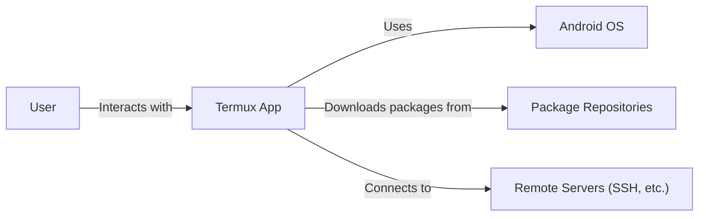
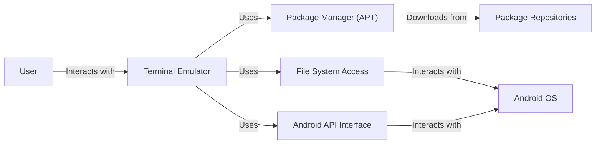
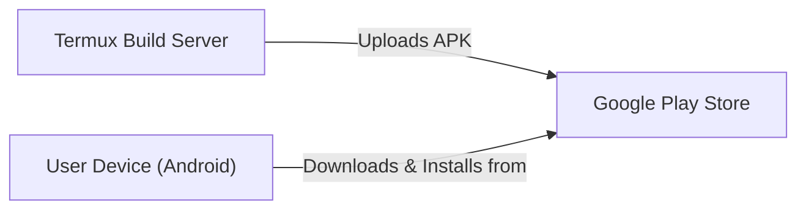
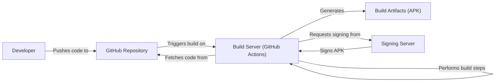

# Project Design Document: Termux

## BUSINESS POSTURE

Termux is an Android terminal emulator and Linux environment app that works directly with no rooting or setup required. A minimal base system is installed automatically - additional packages are available using the package manager. The project aims to provide a powerful and flexible terminal environment on Android devices, enabling users to perform a wide range of tasks typically associated with desktop Linux systems.

Business Priorities:

*   Provide a stable and reliable terminal environment.
*   Maintain compatibility with a wide range of Android devices.
*   Ensure the security of the user's device and data.
*   Offer a user-friendly experience, even for users unfamiliar with Linux.
*   Enable extensibility through a robust package management system.
*   Foster a strong community around the project.

Business Goals:

*   Empower users to utilize their Android devices for advanced tasks.
*   Become the leading terminal emulator solution for Android.
*   Maintain a high level of user trust and satisfaction.
*   Continuously improve the app based on user feedback and technological advancements.

Most Important Business Risks:

*   Malicious packages or exploits could compromise user devices.
*   Compatibility issues with new Android versions or device-specific hardware could arise.
*   Lack of proper sandboxing or permissions management could lead to data breaches.
*   Usability issues could deter users from adopting the app.
*   Failure to keep up with security best practices could expose users to vulnerabilities.

## SECURITY POSTURE

Existing Security Controls:

*   security control: Package management using APT, with signed repositories. (Implemented in Termux's package management system)
*   security control: Android's built-in sandboxing mechanisms. (Implemented by the Android operating system)
*   security control: Permissions model requiring user consent for sensitive actions. (Implemented by the Android operating system and Termux app)
*   security control: Regular updates to address security vulnerabilities. (Implemented through Termux's update process)
*   security control: Community vetting of packages (to some extent). (Implemented through community involvement in package maintenance)

Accepted Risks:

*   accepted risk: The inherent risk of running a terminal environment with access to system resources.
*   accepted risk: Potential for user error leading to security compromises.
*   accepted risk: Reliance on the security of upstream package repositories.
*   accepted risk: Limited control over the security of third-party packages.

Recommended Security Controls:

*   security control: Implement a more robust sandboxing mechanism specifically for Termux, potentially using technologies like seccomp or SELinux.
*   security control: Introduce mandatory code signing for all packages, including those from third-party repositories.
*   security control: Conduct regular security audits of the codebase and package infrastructure.
*   security control: Implement a vulnerability disclosure program to encourage responsible reporting of security issues.
*   security control: Provide clear and concise security guidelines for users.
*   security control: Integrate with Android's SafetyNet Attestation API to verify device integrity.

Security Requirements:

*   Authentication:
    *   The app should leverage Android's existing authentication mechanisms (e.g., PIN, password, biometrics) for device access.
    *   Consider optional support for SSH key-based authentication for remote access.
*   Authorization:
    *   The app should adhere to the principle of least privilege, granting only necessary permissions to processes.
    *   Implement granular control over access to system resources and sensitive data.
    *   Clearly define and enforce permissions for different types of packages.
*   Input Validation:
    *   All user input should be treated as untrusted and carefully validated.
    *   Implement robust input sanitization to prevent command injection and other vulnerabilities.
    *   Use appropriate encoding and escaping techniques to handle special characters.
*   Cryptography:
    *   Use strong, industry-standard cryptographic algorithms for secure communication (e.g., SSH, HTTPS).
    *   Securely store sensitive data, such as passwords and keys, using Android's Keystore system.
    *   Regularly update cryptographic libraries to address known vulnerabilities.

## DESIGN

### C4 CONTEXT

Element Descriptions:

*   Element:
    *   Name: User
    *   Type: Person
    *   Description: A person who interacts with the Termux application.
    *   Responsibilities: Interacts with the terminal interface, executes commands, installs packages, manages files.
    *   Security controls: Relies on Android OS security controls and Termux security features.

*   Element:
    *   Name: Termux App
    *   Type: Software System
    *   Description: The Termux application itself, providing the terminal environment.
    *   Responsibilities: Provides a terminal interface, manages packages, interacts with the Android OS.
    *   Security controls: Package signing, sandboxing (in conjunction with Android OS), permissions management.

*   Element:
    *   Name: Android OS
    *   Type: Software System
    *   Description: The underlying Android operating system.
    *   Responsibilities: Provides core system services, manages hardware resources, enforces security policies.
    *   Security controls: Sandboxing, permissions model, SELinux (on some devices), regular security updates.

*   Element:
    *   Name: Package Repositories
    *   Type: Software System
    *   Description: Remote servers hosting Termux packages.
    *   Responsibilities: Store and serve packages to Termux users.
    *   Security controls: Package signing, repository access controls, HTTPS for secure communication.

*   Element:
    *   Name: Remote Servers (SSH, etc.)
    *   Type: Software System
    *   Description: External servers that users might connect to using Termux (e.g., via SSH).
    *   Responsibilities: Varies depending on the server.
    *   Security controls: Relies on the security of the remote server and the chosen communication protocol (e.g., SSH).

### C4 CONTAINER

Element Descriptions:

*   Element:
    *   Name: User
    *   Type: Person
    *   Description: A person who interacts with the Termux application.
    *   Responsibilities: Interacts with the terminal interface, executes commands, installs packages, manages files.
    *   Security controls: Relies on Android OS security controls and Termux security features.

*   Element:
    *   Name: Terminal Emulator
    *   Type: Container
    *   Description: Provides the core terminal interface and command execution environment.
    *   Responsibilities: Handles user input, displays output, executes commands, manages terminal sessions.
    *   Security controls: Input validation, command sanitization.

*   Element:
    *   Name: Package Manager (APT)
    *   Type: Container
    *   Description: Manages the installation, updating, and removal of packages.
    *   Responsibilities: Interacts with package repositories, resolves dependencies, installs and removes packages.
    *   Security controls: Package signature verification, repository access controls.

*   Element:
    *   Name: File System Access
    *   Type: Container
    *   Description: Provides access to the Android file system.
    *   Responsibilities: Allows users to read, write, and manage files within the Termux environment.
    *   Security controls: Adheres to Android's file system permissions, sandboxing.

*   Element:
    *   Name: Android API Interface
    *   Type: Container
    *   Description: Provides an interface to interact with Android-specific APIs.
    *   Responsibilities: Allows Termux to access Android features like storage, networking, and sensors.
    *   Security controls: Relies on Android's permission model.

*   Element:
    *   Name: Android OS
    *   Type: Software System
    *   Description: The underlying Android operating system.
    *   Responsibilities: Provides core system services, manages hardware resources, enforces security policies.
    *   Security controls: Sandboxing, permissions model, SELinux (on some devices), regular security updates.

*   Element:
    *   Name: Package Repositories
    *   Type: Software System
    *   Description: Remote servers hosting Termux packages.
    *   Responsibilities: Store and serve packages to Termux users.
    *   Security controls: Package signing, repository access controls, HTTPS for secure communication.

### DEPLOYMENT

Possible Deployment Solutions:

1.  Google Play Store: Standard distribution channel for Android apps.
2.  F-Droid: Alternative app store focusing on free and open-source software.
3.  GitHub Releases: Direct download of APK files from the project's repository.

Chosen Solution (Google Play Store):

Element Descriptions:

*   Element:
    *   Name: Termux Build Server
    *   Type: Infrastructure
    *   Description: The server responsible for building the Termux APK.
    *   Responsibilities: Compiles the source code, creates the APK package, signs the APK.
    *   Security controls: Secure build environment, code signing key protection.

*   Element:
    *   Name: Google Play Store
    *   Type: Infrastructure
    *   Description: Google's official app distribution platform.
    *   Responsibilities: Hosts the Termux APK, manages app updates, provides a secure download channel.
    *   Security controls: Google Play Protect, app signing verification, developer account security.

*   Element:
    *   Name: User Device (Android)
    *   Type: Infrastructure
    *   Description: The user's Android device.
    *   Responsibilities: Downloads and installs the Termux app, runs the app.
    *   Security controls: Android OS security features, user-controlled permissions.

### BUILD

Build Process Description:

1.  Developers write and commit code to the Termux GitHub repository.
2.  A push to the repository triggers a build process on a build server (e.g., using GitHub Actions).
3.  The build server fetches the latest code from the repository.
4.  Build steps are executed, including:
    *   Compiling the code.
    *   Running linters and static analysis tools (SAST).
    *   Potentially running unit tests.
5.  The build server requests to sign build artifacts.
6.  Signing server signs APK.
7.  The build server generates build artifacts (APK file).

Security Controls:

*   security control: Use of a dedicated build server (GitHub Actions) for automated builds.
*   security control: Code review process before merging changes into the main branch.
*   security control: Use of linters and static analysis tools (SAST) to identify potential code quality and security issues.
*   security control: Signing the APK with a secure key to ensure authenticity and integrity.
*   security control: Secure storage and management of the signing key.
*   security control: Regular updates to build dependencies to address security vulnerabilities.

## RISK ASSESSMENT

Critical Business Processes:

*   Providing a functional and reliable terminal environment on Android.
*   Maintaining the security and privacy of user data.
*   Distributing the application through trusted channels (e.g., Google Play Store, F-Droid).
*   Managing and updating packages securely.

Data Sensitivity:

*   User commands and scripts: Potentially sensitive, could contain credentials or reveal user activity. High sensitivity.
*   Files accessed within Termux: Sensitivity varies depending on the user's files, potentially including personal or confidential data. High sensitivity.
*   Network traffic: Could contain sensitive data if unencrypted. High sensitivity.
*   Installed packages: List of installed packages could reveal user's interests or activities. Medium sensitivity.
*   Termux configuration files: Could contain user preferences and customizations. Low sensitivity.

## QUESTIONS & ASSUMPTIONS

Questions:

*   What specific security audits or penetration tests have been conducted on Termux?
*   What is the process for handling security vulnerabilities reported by users or researchers?
*   What are the specific mechanisms used for package signing and verification?
*   Are there any plans to implement additional sandboxing or security features beyond what Android provides?
*   What is the long-term strategy for maintaining compatibility with future Android versions?
*   What level of support is provided for users who encounter security issues?

Assumptions:

*   BUSINESS POSTURE: The primary user base consists of technically proficient individuals who understand the risks associated with using a terminal emulator.
*   BUSINESS POSTURE: Maintaining a positive reputation and user trust is crucial for the project's success.
*   SECURITY POSTURE: Users are responsible for securing their own devices and data, including using strong passwords and practicing safe browsing habits.
*   SECURITY POSTURE: The Android operating system provides a reasonable level of security, including sandboxing and permissions management.
*   SECURITY POSTURE: Upstream package repositories are reasonably secure and trustworthy.
*   DESIGN: The Termux architecture is relatively simple and well-defined.
*   DESIGN: The build process is automated and secure.
*   DESIGN: The deployment process through Google Play Store is reliable and secure.