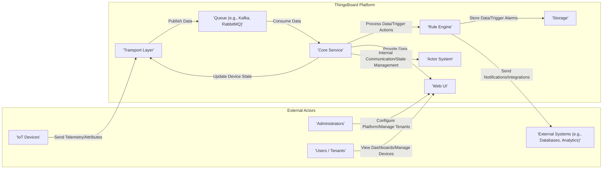
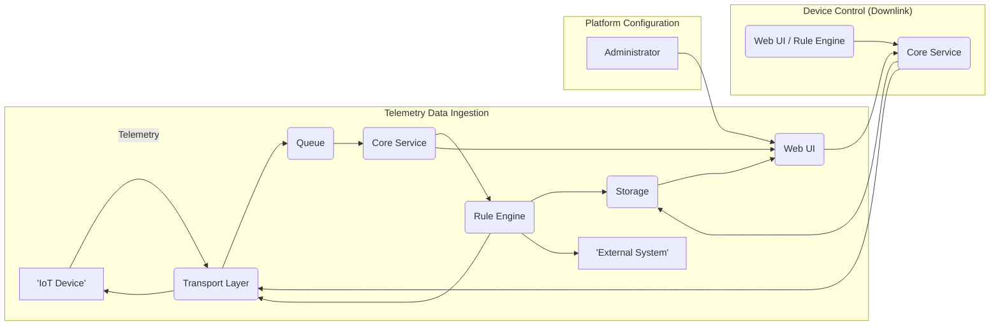

# Project Design Document: ThingsBoard IoT Platform

**Version:** 1.1
**Date:** October 26, 2023
**Author:** AI Architecture Expert

## 1. Introduction

This document provides an enhanced architectural design of the ThingsBoard IoT platform, an open-source IoT platform for data collection, processing, visualization, and device management. This document is intended to serve as a robust foundation for subsequent threat modeling activities. It outlines the key components, their interactions, data flows, and deployment considerations with greater detail. This design is based on the information available at the official ThingsBoard GitHub repository: [https://github.com/thingsboard/thingsboard](https://github.com/thingsboard/thingsboard).

## 2. Goals

*   Provide a comprehensive and detailed overview of the ThingsBoard architecture.
*   Clearly identify key components, their specific responsibilities, and internal workings.
*   Describe the primary data flows within the platform, including variations and edge cases.
*   Outline common deployment scenarios with specific considerations for each.
*   Highlight key security considerations for each component and data flow.
*   Serve as a robust and informative basis for threat modeling exercises.

## 3. System Overview

ThingsBoard is a multi-tenant IoT platform built on a microservices architecture, designed for scalability, fault tolerance, and flexibility. It facilitates the connection and management of diverse IoT devices and the comprehensive handling of their data lifecycle.

Here's a more detailed high-level overview of the system's main actors and their interactions:

## 4. Component Details

This section provides a more in-depth look at the key components of the ThingsBoard platform:

*   **Transport Layer:**
    *   **Description:** The entry point for IoT device communication, responsible for protocol adaptation and initial device interaction.
    *   **Responsibilities:**
        *   Establishing and managing persistent connections with devices.
        *   Performing initial device authentication based on configured credentials.
        *   Parsing and validating incoming telemetry and attribute data according to the specific protocol.
        *   Serializing and sending commands to devices.
        *   Handling protocol-specific security aspects (e.g., TLS for MQTT).
    *   **Key Functionalities:**
        *   Modular design supporting pluggable protocol implementations (MQTT, CoAP, HTTP, LwM2M, etc.).
        *   Device provisioning and registration mechanisms, potentially involving secure key exchange.
        *   Management of device sessions and connection state.
        *   Rate limiting and traffic shaping to prevent overload.
    *   **Internal Sub-components:** Protocol-specific adapters, connection managers, security handlers.

*   **Core Service:**
    *   **Description:** The heart of the platform, managing entities, relationships, security, and orchestrating data processing.
    *   **Responsibilities:**
        *   Managing the lifecycle of all entities (devices, assets, customers, users, etc.), including creation, updates, and deletion.
        *   Defining and enforcing relationships between entities, enabling complex data modeling.
        *   Performing comprehensive authentication and authorization using a role-based access control system.
        *   Validating and transforming data received from the Transport Layer before further processing.
        *   Orchestrating communication with other services via the message queue and internal actor system.
    *   **Key Functionalities:**
        *   Provides a comprehensive set of REST and gRPC APIs for external and internal interaction.
        *   Manages various types of device credentials (access tokens, X.509 certificates, etc.).
        *   Enforces multi-tenancy, isolating data and resources between different tenants.
        *   Handles data partitioning and sharding for scalability.
    *   **Internal Sub-components:** Entity management modules, security context propagation, API handlers, data validation pipelines.

*   **Rule Engine:**
    *   **Description:** A highly configurable and extensible engine for real-time data processing, event handling, and action execution.
    *   **Responsibilities:**
        *   Filtering incoming telemetry and attribute data based on defined criteria.
        *   Transforming data into different formats or enriching it with additional information.
        *   Executing complex rule chains composed of interconnected nodes.
        *   Detecting and triggering alarms based on predefined conditions and thresholds.
        *   Initiating various actions, including sending notifications, updating device attributes, and integrating with external systems.
    *   **Key Functionalities:**
        *   Visual, drag-and-drop rule chain editor for intuitive configuration.
        *   A rich set of built-in rule node types (filters, transformations, enrichments, actions, external integrations).
        *   Support for custom rule node development and deployment.
        *   Asynchronous processing of data events for high throughput.
    *   **Internal Sub-components:** Rule chain execution engine, node registry, alarm management, integration connectors.

*   **Storage:**
    *   **Description:** The persistent layer responsible for storing various types of data generated and managed by the platform.
    *   **Responsibilities:**
        *   Efficiently storing time-series telemetry data with high ingestion rates and query performance.
        *   Persisting entity attributes and metadata, enabling quick retrieval of entity properties.
        *   Storing alarms and events, providing an audit trail of significant platform activities.
        *   Storing user and tenant information, including credentials and permissions.
    *   **Key Functionalities:**
        *   Supports a variety of database technologies optimized for different data types and workloads (e.g., Cassandra for telemetry, PostgreSQL for relational data).
        *   Data partitioning and replication for scalability and high availability.
        *   Data retention policies and archival mechanisms.
    *   **Internal Sub-components:** Telemetry storage engine, attribute storage engine, alarm storage, user/tenant data storage.

*   **Web UI:**
    *   **Description:** The user interface providing a visual means to interact with and manage the ThingsBoard platform.
    *   **Responsibilities:**
        *   Providing secure user authentication and authorization.
        *   Enabling device management tasks, such as provisioning, configuration, and monitoring.
        *   Facilitating the creation and visualization of real-time and historical data dashboards.
        *   Providing tools for configuring rule chains and managing alarms.
        *   Managing tenants, users, and their associated permissions.
    *   **Key Functionalities:**
        *   Role-based access control to restrict access to specific features and data.
        *   Highly customizable dashboards with a wide range of widget types.
        *   Real-time data streaming and visualization capabilities.
        *   User-friendly interface for rule chain design and management.
    *   **Internal Sub-components:** Authentication and authorization modules, dashboard rendering engine, widget library, administration panels.

*   **Queue (e.g., Kafka, RabbitMQ):**
    *   **Description:** An asynchronous messaging system facilitating internal communication and decoupling between microservices.
    *   **Responsibilities:**
        *   Providing a reliable and ordered message delivery mechanism.
        *   Decoupling services, allowing them to operate independently and scale individually.
        *   Buffering messages during periods of high load.
    *   **Key Functionalities:**
        *   Supports publish/subscribe messaging patterns.
        *   Offers message persistence and durability to prevent data loss.
        *   Provides mechanisms for message routing and filtering.

*   **Actor System:**
    *   **Description:** An internal concurrency model based on actors, used for managing the state and interactions of platform entities.
    *   **Responsibilities:**
        *   Managing the in-memory state of devices and other entities.
        *   Handling concurrent requests and updates to entity state.
        *   Facilitating communication and coordination between different parts of the platform.
    *   **Key Functionalities:**
        *   Provides a fault-tolerant and resilient way to manage entity state.
        *   Enables efficient handling of asynchronous operations.

## 5. Data Flow

The data flow within ThingsBoard can be categorized into several key scenarios:

*   **Telemetry Data Ingestion:**
    1. IoT Device sends telemetry data to the **'Transport Layer'**.
    2. The **'Transport Layer'** authenticates the device and publishes the data to the **'Queue'**.
    3. The **'Core Service'** consumes the data from the **'Queue'**, validates it, and updates the device's latest telemetry.
    4. The **'Rule Engine'** subscribes to telemetry events and processes the data based on configured rule chains.
    5. The **'Rule Engine'** may trigger actions such as storing the data in **'Storage'**, creating alarms, or sending commands back to the device via the **'Transport Layer'**.
    6. The **'Web UI'** can retrieve and display this telemetry data from **'Storage'** or the **'Core Service'**.

*   **Attribute Data Updates:** Similar to telemetry, but often involves less frequent, state-related information. The flow is largely the same as telemetry ingestion.

*   **Device Control (Downlink):**
    1. A user or the **'Rule Engine'** initiates a command via the **'Web UI'** or internal API call to the **'Core Service'**.
    2. The **'Core Service'** validates the command and sends it to the **'Transport Layer'**.
    3. The **'Transport Layer'** formats and sends the command to the specific **'IoT Device'** using the appropriate protocol.

*   **Platform Configuration:**
    1. An **'Administrator'** interacts with the **'Web UI'** to configure tenants, users, devices, rule chains, etc.
    2. The **'Web UI'** sends API requests to the **'Core Service'** to persist these configurations in **'Storage'**.

## 6. Deployment Architecture

ThingsBoard offers flexible deployment options:

*   **Cloud Deployment (Example: AWS):**
    *   **Compute:**  Utilizing EC2 instances or container services like ECS/EKS for running microservices.
    *   **Database:** Managed services like Amazon RDS (PostgreSQL), Amazon Keyspaces (Cassandra), or Amazon Timestream.
    *   **Message Queue:** Amazon MSK (Kafka) or Amazon MQ (RabbitMQ).
    *   **Load Balancing:** Elastic Load Balancer (ELB) or Application Load Balancer (ALB).
    *   **API Gateway:** Amazon API Gateway for managing external access.
    *   **Monitoring & Logging:** Amazon CloudWatch.
    *   **Benefits:** Scalability, high availability, reduced operational overhead.
    *   **Considerations:** Security of cloud resources, data egress costs, vendor lock-in.

*   **On-Premise Deployment (Example: Kubernetes):**
    *   **Orchestration:** Kubernetes for managing and scaling containerized microservices.
    *   **Database:** Self-managed or enterprise-grade database clusters (e.g., Cassandra, TimescaleDB).
    *   **Message Queue:** Self-managed Kafka or RabbitMQ clusters.
    *   **Load Balancing:** Ingress controllers and service meshes.
    *   **Benefits:** Data sovereignty, full control over infrastructure, potentially lower long-term costs.
    *   **Considerations:** Increased operational complexity, responsibility for infrastructure maintenance and security.

*   **Hybrid Deployment:**
    *   Combines cloud and on-premise resources, potentially using cloud services for specific components like storage or analytics while keeping core services on-premise.
    *   **Benefits:** Flexibility, optimized resource utilization, compliance with specific regulations.
    *   **Considerations:** Network connectivity and latency between environments, complexity of managing a distributed system.

## 7. Security Considerations (Detailed)

This section expands on security considerations for each component and data flow:

*   **Transport Layer:**
    *   **Threats:** Unauthorized device access, eavesdropping on communication, denial-of-service attacks.
    *   **Considerations:**
        *   Strong device authentication mechanisms (e.g., X.509 certificates, secure tokens).
        *   Encryption of communication channels (TLS/SSL).
        *   Rate limiting and connection throttling to prevent DoS.
        *   Secure storage of device credentials.
        *   Regular security audits of protocol implementations.

*   **Core Service:**
    *   **Threats:** Unauthorized access to entities and data, privilege escalation, injection attacks on APIs.
    *   **Considerations:**
        *   Robust authentication and authorization mechanisms (RBAC).
        *   Secure API design and implementation (input validation, output encoding).
        *   Protection against common web application vulnerabilities (OWASP Top 10).
        *   Secure management of API keys and secrets.
        *   Regular security penetration testing.

*   **Rule Engine:**
    *   **Threats:** Malicious rule chain creation, data manipulation, unauthorized access to external systems.
    *   **Considerations:**
        *   Authorization controls for rule chain creation and modification.
        *   Input validation and sanitization within rule nodes.
        *   Secure configuration of external system integrations.
        *   Monitoring and logging of rule engine activity.

*   **Storage:**
    *   **Threats:** Data breaches, unauthorized data modification, data loss.
    *   **Considerations:**
        *   Encryption of data at rest and in transit.
        *   Access control lists (ACLs) and permissions on database resources.
        *   Regular backups and disaster recovery plans.
        *   Database security hardening.

*   **Web UI:**
    *   **Threats:** Cross-site scripting (XSS), cross-site request forgery (CSRF), unauthorized access to administrative functions.
    *   **Considerations:**
        *   Secure coding practices to prevent web application vulnerabilities.
        *   Protection against XSS and CSRF attacks.
        *   Secure session management.
        *   Regular security scanning and vulnerability assessments.

*   **Queue:**
    *   **Threats:** Message interception, unauthorized message publishing or consumption.
    *   **Considerations:**
        *   Secure authentication and authorization for queue access.
        *   Encryption of messages in transit.
        *   Access control policies on topics and queues.

*   **Actor System:**
    *   **Threats:** Internal state manipulation, denial-of-service through actor overload.
    *   **Considerations:**
        *   Secure internal communication protocols.
        *   Resource management and monitoring to prevent overload.

## 8. Technologies Used

*   **Programming Languages:** Java, Scala
*   **Databases:** Cassandra, TimescaleDB, PostgreSQL
*   **Message Queues:** Kafka, RabbitMQ
*   **Protocols:** MQTT, CoAP, HTTP, LwM2M
*   **Web Framework:** Spring Boot
*   **UI Framework:** Angular
*   **Actor System:** Akka

## 9. Future Considerations

*   Detailed threat modeling workshops based on this design document.
*   Security architecture reviews of individual microservices.
*   Analysis of specific third-party library vulnerabilities.
*   Development of security best practices and guidelines for ThingsBoard deployments.
*   Implementation of security monitoring and incident response capabilities.

This enhanced document provides a more detailed and comprehensive understanding of the ThingsBoard architecture, serving as a stronger foundation for effective threat modeling.