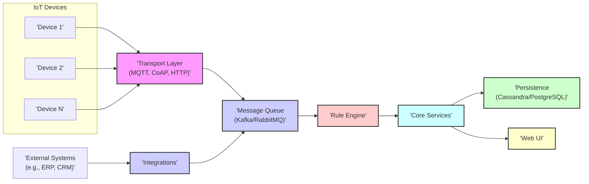
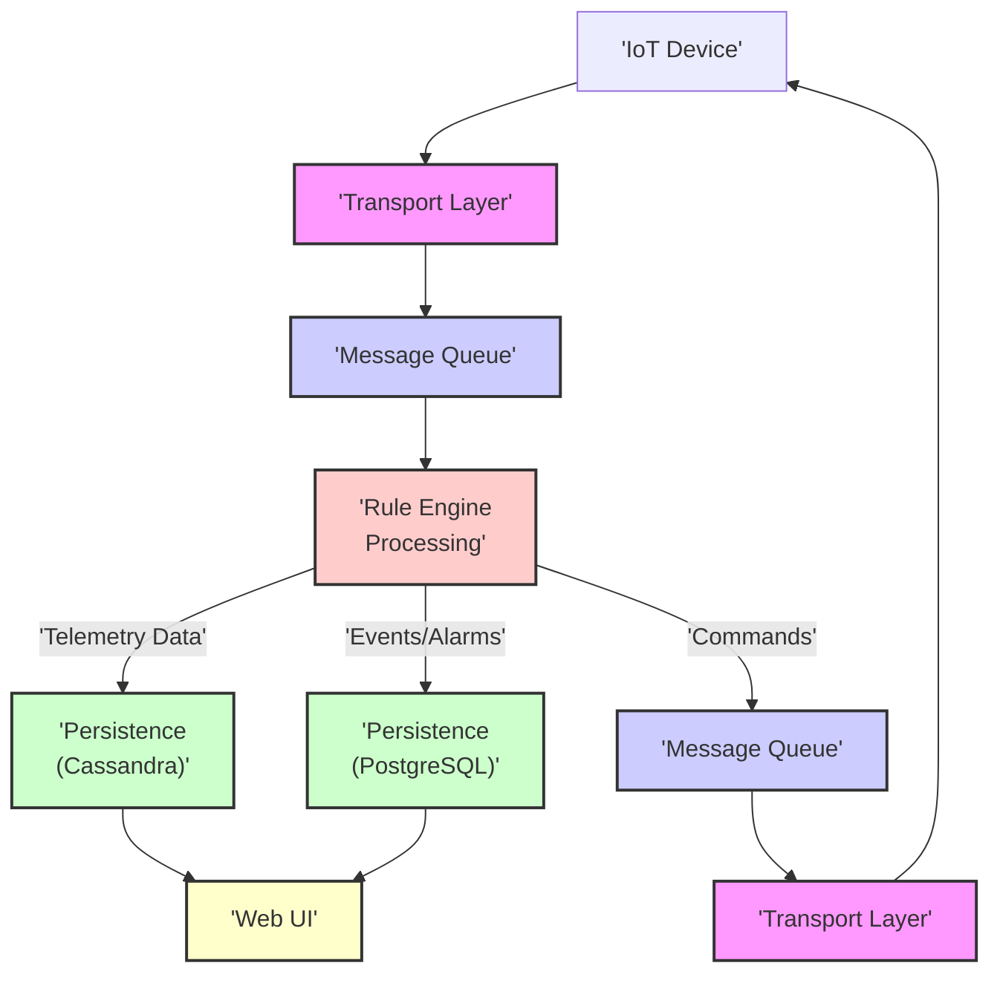

## Project Design Document: ThingsBoard IoT Platform

**Version:** 1.1
**Date:** October 26, 2023
**Prepared By:** AI Software Architect

### 1. Project Title

ThingsBoard IoT Platform

### 2. Project Overview

This document details the architecture of the ThingsBoard IoT platform, an open-source solution designed for IoT data collection, processing, visualization, and device management. This document will serve as the basis for subsequent threat modeling activities.

### 3. Goals

* To provide a clear and comprehensive description of the ThingsBoard architecture.
* To identify the key components of the platform and their interactions.
* To illustrate the flow of data within the ThingsBoard system.
* To list the core technologies utilized by the platform and common deployment strategies.
* To establish a foundation for identifying potential security threats and vulnerabilities within the system.

### 4. Target Audience

* Security engineers and architects responsible for assessing the security of ThingsBoard deployments.
* Software developers involved in the development, deployment, and maintenance of ThingsBoard.
* DevOps engineers managing the infrastructure supporting ThingsBoard.
* Stakeholders participating in the threat modeling process for the ThingsBoard platform.

### 5. Scope

This document focuses on the fundamental architectural elements of the open-source ThingsBoard platform. It encompasses:

* A high-level overview of the architecture and descriptions of its constituent components.
* A detailed explanation of the data flow from IoT devices to the user interface.
* Identification of the primary technologies employed within the platform.
* Common deployment methodologies for ThingsBoard.

This document does not cover:

* In-depth implementation specifics of individual components.
* Granular configuration parameters and options.
* Detailed information on third-party integrations beyond a conceptual level.
* Specific cloud provider managed service implementations in detail.

### 6. High-Level Architecture

ThingsBoard employs a microservices-based architecture. The following diagram illustrates the core components and their relationships:

### 7. Detailed Component Breakdown

* **IoT Devices:** These are the edge devices that generate and transmit telemetry data to the ThingsBoard platform. They can also receive commands from the platform.
* **Transport Layer:** This layer is responsible for handling various communication protocols used by IoT devices to connect to ThingsBoard. Supported protocols include:
    * MQTT
    * CoAP
    * HTTP(S)
    * LwM2M
* **Message Queue:** A message broker, typically Apache Kafka or RabbitMQ, acts as an intermediary, decoupling the Transport Layer from the Core Services. This ensures reliable and asynchronous message delivery and processing.
* **Rule Engine:** This is a central component responsible for processing incoming data, events, and device lifecycle events. It allows users to define complex rule chains for:
    * Data transformation and enrichment.
    * Filtering and routing of data.
    * Triggering alarms and notifications.
    * Executing actions based on specific conditions.
* **Core Services:** This component encompasses the core business logic and functionalities of ThingsBoard, including:
    * **Device Management:**  Functionality for registering, provisioning, authenticating, and managing IoT devices.
    * **Telemetry Storage:**  Storage and retrieval of time-series data received from devices.
    * **Alarm Management:**  Definition, processing, and management of alarms based on data thresholds or events.
    * **Asset Management:**  Management of assets and their relationships with devices, providing a logical grouping and context.
    * **User and Tenant Management:**  Handling user authentication, authorization, role-based access control, and multi-tenancy features.
* **Persistence:** ThingsBoard utilizes databases for storing different types of data:
    * **Time-Series Data:** Primarily stored in Apache Cassandra, chosen for its scalability, fault tolerance, and suitability for handling high-volume time-series data.
    * **Metadata and Configuration:** Stored in a relational database such as PostgreSQL, used for storing device information, user details, rule configurations, and other metadata.
* **Web UI:** The user interface provides a web-based platform for users to interact with ThingsBoard, enabling them to:
    * Visualize data through customizable dashboards and widgets.
    * Manage devices, assets, and users.
    * Configure rule chains and integrations.
    * Monitor system status and performance.
* **Integrations:** This component facilitates the connection of ThingsBoard with external systems and applications. Integrations can be used for:
    * Pushing processed data to external analytics platforms or data lakes.
    * Triggering actions in other systems based on events within ThingsBoard.
    * Receiving data from external sources to enrich device data or trigger rules.

### 8. Data Flow

The typical flow of data within the ThingsBoard platform is as follows:

1. **Device Data Ingestion:** IoT devices transmit telemetry data to ThingsBoard via the Transport Layer, utilizing protocols such as MQTT, CoAP, or HTTP(S).
2. **Message Queuing:** The Transport Layer forwards the received data to the Message Queue (Kafka or RabbitMQ). This ensures reliable delivery and decouples the ingestion process from subsequent processing.
3. **Rule Engine Processing:** The Rule Engine consumes messages from the queue and applies pre-configured rule chains. This involves data transformation, filtering, enrichment, and the triggering of actions based on defined conditions.
4. **Data Persistence:**
    * Telemetry data, representing time-series measurements, is typically stored in Apache Cassandra for efficient storage and retrieval of large volumes of time-stamped data.
    * Events, alarms, device metadata, user information, and rule configurations are stored in PostgreSQL.
5. **Command Handling:** The Rule Engine can initiate commands to be sent back to IoT devices. These commands are routed through the Message Queue and the Transport Layer to reach the target device.
6. **Web UI Interaction:** Users interact with the ThingsBoard platform through the Web UI to visualize data on dashboards, manage devices and assets, configure rule chains, and administer the system. The UI retrieves data from both Cassandra and PostgreSQL as needed.

### 9. Key Technologies

* **Primary Programming Languages:** Java, JavaScript, TypeScript
* **Message Broker Systems:** Apache Kafka, RabbitMQ
* **Databases:** Apache Cassandra, PostgreSQL
* **Frontend Framework:** Angular
* **Supported Communication Protocols:** MQTT, CoAP, HTTP(S), LwM2M
* **Operating System Environment:** Primarily Linux-based systems
* **Containerization Technology:** Docker
* **Container Orchestration:** Kubernetes (commonly used for production deployments)

### 10. Deployment Options

ThingsBoard offers flexibility in deployment options:

* **On-Premise Deployment:**  Installation and operation within the organization's own data centers or infrastructure.
* **Cloud-Based Deployment:** Deployment on public cloud platforms such as AWS, Azure, or Google Cloud Platform, utilizing virtual machines or managed services.
* **Hybrid Deployment:** A combination of on-premise and cloud resources, potentially for specific components or functionalities.
* **Containerized Deployment:** Utilizing Docker containers for packaging and deploying the application, often orchestrated with Kubernetes for scalability and management.

### 11. Security Considerations (Initial)

This section outlines initial security considerations for the ThingsBoard platform. A comprehensive threat model will delve deeper into these and other potential vulnerabilities.

* **Authentication and Authorization Mechanisms:** Securely verifying the identity of devices and users and enforcing appropriate access control policies based on roles and permissions.
* **Data Encryption in Transit and at Rest:** Employing encryption protocols like TLS/SSL for data transmission and encrypting sensitive data stored in databases.
* **Input Validation and Sanitization:**  Implementing robust input validation to prevent injection attacks and ensure data integrity.
* **Rate Limiting and Throttling:** Protecting against denial-of-service attacks by limiting the rate of requests from devices and users.
* **Secure Communication Protocol Enforcement:**  Encouraging or enforcing the use of secure communication protocols such as MQTTS and HTTPS.
* **Regular Security Updates and Patching:** Maintaining up-to-date software versions and applying security patches promptly to address known vulnerabilities.
* **Secure Secrets Management:**  Implementing secure methods for storing and managing sensitive information like API keys, database credentials, and encryption keys.
* **Network Segmentation and Isolation:**  Dividing the network into isolated segments to limit the impact of a potential security breach.
* **Regular Security Audits and Penetration Testing:**  Conducting periodic security assessments to identify and address potential vulnerabilities.

### 12. Assumptions

* This document primarily describes the architecture of the core, open-source version of ThingsBoard. Enterprise editions or specific cloud provider integrations may include additional components and features.
* The specific deployment architecture can vary significantly depending on factors such as scale, performance requirements, and organizational policies. This document provides a general overview of common deployment approaches.

### 13. Out of Scope

* Detailed configuration parameters and procedures for individual components.
* Specific implementation details of individual nodes within the Rule Engine.
* Comprehensive performance benchmarking data and scalability analysis.
* Detailed plans for disaster recovery, business continuity, and high availability.
* Specific security implications of individual third-party integrations.

This document provides a detailed architectural overview of the ThingsBoard IoT platform, serving as a crucial foundation for conducting thorough threat modeling activities. The identified components, data flows, and technologies will be further analyzed to identify potential security risks and vulnerabilities.