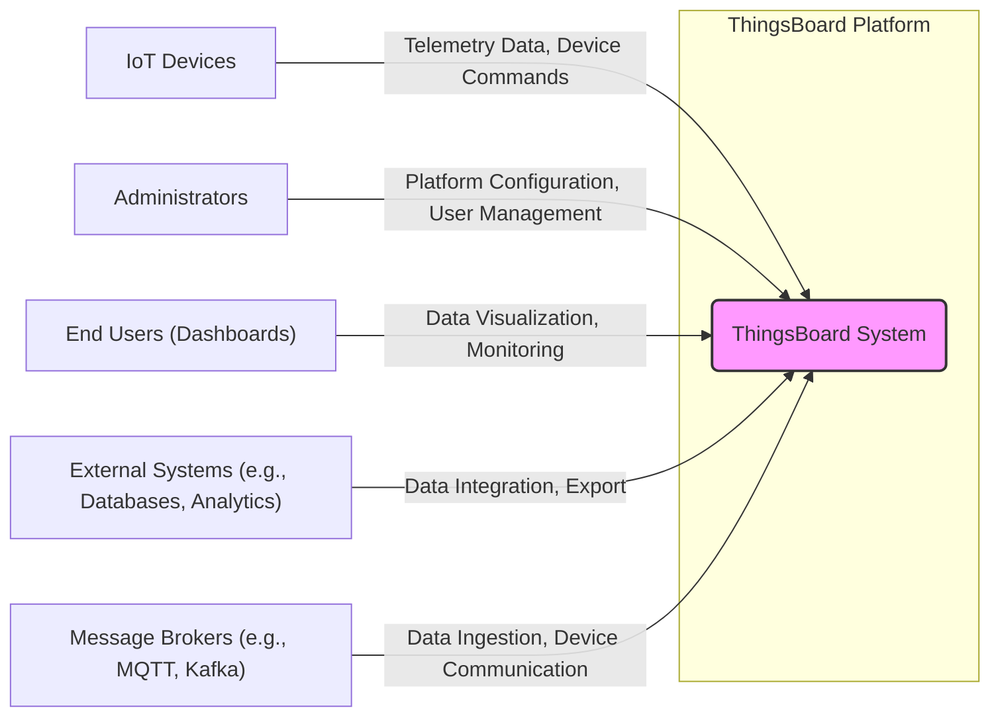
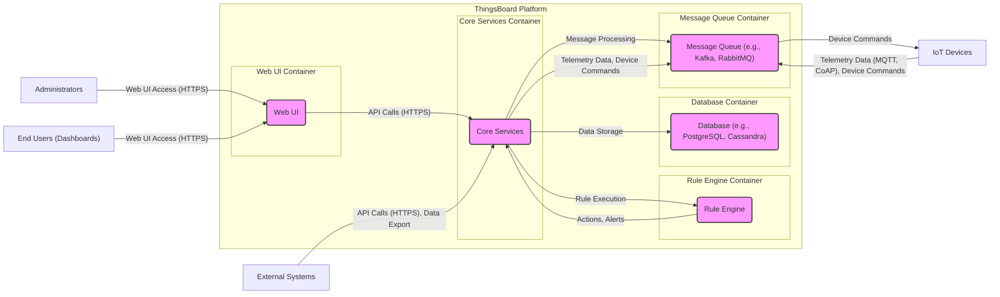
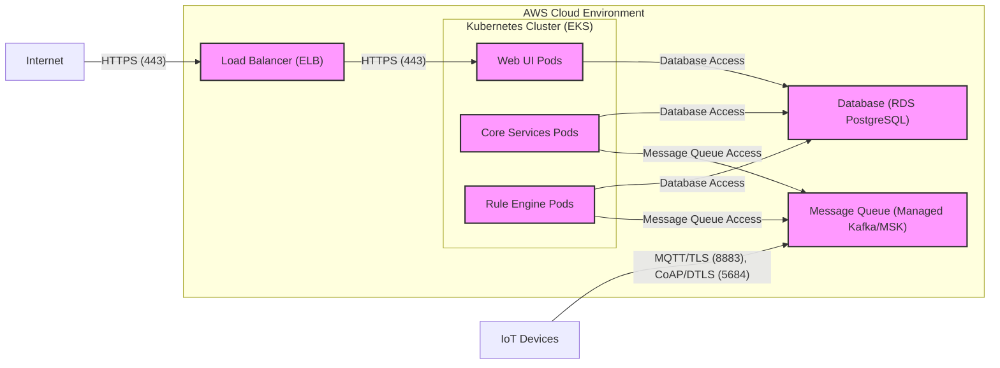

# BUSINESS POSTURE

This project, ThingsBoard, aims to provide an open-source IoT platform. Its primary business goal is to enable users to rapidly develop and deploy IoT solutions. This includes functionalities for device management, data collection, data processing, data visualization, and alerting.

Business priorities for ThingsBoard are:
- Feature richness: Providing a comprehensive set of IoT platform capabilities to address diverse use cases.
- Scalability and Performance: Ensuring the platform can handle a large number of devices and high data volumes.
- Customizability and Extensibility: Allowing users to adapt and extend the platform to meet specific requirements.
- Open Source and Community Driven: Fostering a strong community and leveraging open-source principles for innovation and transparency.
- Ease of Use: Providing a user-friendly interface and tools for development and operation.

Most important business risks that need to be addressed:
- Data Loss: Risk of losing critical IoT data due to system failures or security breaches.
- Data Integrity: Risk of data corruption or manipulation, leading to incorrect insights and decisions.
- System Unavailability: Risk of platform downtime, disrupting IoT operations and potentially critical services.
- Security Breaches: Risk of unauthorized access to the platform and connected devices, leading to data leaks, device compromise, or service disruption.
- Compliance and Regulatory Risks: Risk of failing to meet data privacy and security regulations (e.g., GDPR, HIPAA) when handling sensitive IoT data.
- Vendor Lock-in (for users): While ThingsBoard is open-source, users might become reliant on specific features or configurations, creating a form of lock-in if migration becomes difficult.
- Community Dependency: Reliance on the open-source community for support and maintenance, which can be less predictable than commercial support.

# SECURITY POSTURE

Existing security controls:
- security control: Authentication and Authorization mechanisms are in place to control access to the platform and its resources. Described in ThingsBoard documentation.
- security control: HTTPS is used for communication between the web UI and the backend. Standard web security practice.
- security control: Input validation is likely implemented in various parts of the application to prevent common web vulnerabilities. Best practices in software development.
- security control: Password hashing is used for storing user credentials. Standard security practice.
- security control: Role-Based Access Control (RBAC) is implemented to manage user permissions. Described in ThingsBoard documentation.

Accepted risks:
- accepted risk: As an open-source project, vulnerability disclosure and patching might be community-driven, potentially leading to delays in addressing critical security issues compared to commercially supported platforms.
- accepted risk:  Security configuration and hardening are largely the responsibility of the user deploying ThingsBoard. Misconfigurations can introduce vulnerabilities.
- accepted risk:  Third-party dependencies used in the project might contain vulnerabilities that could affect ThingsBoard. Dependency management and scanning are crucial.

Recommended security controls:
- security control: Implement automated security scanning (SAST/DAST) in the CI/CD pipeline to identify vulnerabilities early in the development process.
- security control: Conduct regular penetration testing to proactively identify and address security weaknesses in the platform.
- security control: Implement a robust vulnerability management process, including timely patching and security updates.
- security control: Provide security hardening guides and best practices for deployment and configuration to users.
- security control: Implement security logging and monitoring to detect and respond to security incidents.
- security control: Consider implementing rate limiting and DDoS protection to protect against denial-of-service attacks.
- security control: Implement data encryption at rest and in transit for sensitive IoT data.

Security requirements:
- Authentication:
    - requirement: The platform must support strong authentication mechanisms for users and devices.
    - requirement: Support for multi-factor authentication (MFA) should be considered for administrative users.
    - requirement: Device authentication should be robust and scalable, supporting various protocols (e.g., tokens, certificates).
- Authorization:
    - requirement: Implement fine-grained role-based access control (RBAC) to manage permissions for users and devices.
    - requirement: Authorization policies should be consistently enforced across all platform components.
    - requirement: Principle of least privilege should be applied when assigning permissions.
- Input Validation:
    - requirement: All user inputs and device data inputs must be thoroughly validated to prevent injection attacks (e.g., SQL injection, XSS).
    - requirement: Input validation should be performed on both the client-side and server-side.
    - requirement: Implement input sanitization and encoding to mitigate injection risks.
- Cryptography:
    - requirement: Sensitive data at rest (e.g., database passwords, API keys) must be encrypted.
    - requirement: All communication channels handling sensitive data (e.g., web UI, device communication) must use encryption (e.g., TLS/HTTPS).
    - requirement: Use strong cryptographic algorithms and key management practices.
    - requirement: Consider end-to-end encryption for sensitive IoT data from device to application.

# DESIGN

## C4 CONTEXT

Context Diagram Elements:

- Element:
    - Name: ThingsBoard System
    - Type: Software System
    - Description: The ThingsBoard IoT platform itself, providing device management, data processing, visualization, and other IoT functionalities.
    - Responsibilities:
        - Device registration and management.
        - Telemetry data ingestion, storage, and processing.
        - Rule engine for data processing and alerting.
        - Data visualization and dashboarding.
        - API for integration with external systems.
    - Security controls:
        - security control: Authentication and authorization for users and devices.
        - security control: Input validation for all data inputs.
        - security control: HTTPS for web UI and API access.
        - security control: Role-Based Access Control (RBAC).
        - security control: Security logging and monitoring.

- Element:
    - Name: IoT Devices
    - Type: External System
    - Description: Physical devices in the field that generate telemetry data and can be controlled remotely. Examples include sensors, actuators, gateways, and industrial equipment.
    - Responsibilities:
        - Sensing and collecting data from the physical environment.
        - Transmitting telemetry data to ThingsBoard.
        - Receiving and executing commands from ThingsBoard.
    - Security controls:
        - security control: Device authentication mechanisms (e.g., device tokens, certificates).
        - security control: Secure communication protocols (e.g., MQTT over TLS, CoAP over DTLS).
        - security control: Device-level security measures (firmware security, physical security).

- Element:
    - Name: Administrators
    - Type: User
    - Description: Users responsible for configuring and managing the ThingsBoard platform. This includes setting up users, devices, rules, dashboards, and system settings.
    - Responsibilities:
        - Platform configuration and setup.
        - User and device management.
        - Rule engine configuration.
        - System monitoring and maintenance.
    - Security controls:
        - security control: Strong password policies and MFA.
        - security control: Role-Based Access Control (RBAC) with administrative privileges.
        - security control: Audit logging of administrative actions.

- Element:
    - Name: End Users (Dashboards)
    - Type: User
    - Description: Users who access ThingsBoard dashboards to visualize IoT data, monitor device status, and gain insights.
    - Responsibilities:
        - Viewing and interacting with dashboards.
        - Monitoring device data and system status.
        - Generating reports and visualizations.
    - Security controls:
        - security control: Authentication and authorization to access dashboards and data.
        - security control: Role-Based Access Control (RBAC) to control data access.

- Element:
    - Name: External Systems (e.g., Databases, Analytics)
    - Type: External System
    - Description: Other software systems that ThingsBoard integrates with for data storage, advanced analytics, or business process integration. Examples include external databases, data warehouses, analytics platforms, and CRM/ERP systems.
    - Responsibilities:
        - Receiving data exported from ThingsBoard.
        - Providing data to ThingsBoard (e.g., for enrichment).
        - Performing advanced analytics and reporting.
        - Integrating IoT data into business workflows.
    - Security controls:
        - security control: Secure API communication between ThingsBoard and external systems (e.g., API keys, OAuth).
        - security control: Data encryption in transit and at rest for data exchanged with external systems.
        - security control: Access control and authorization within external systems.

- Element:
    - Name: Message Brokers (e.g., MQTT, Kafka)
    - Type: External System
    - Description: Message brokers used for asynchronous communication, primarily for ingesting telemetry data from devices and potentially for internal component communication within ThingsBoard.
    - Responsibilities:
        - Receiving telemetry data from IoT devices.
        - Routing data to ThingsBoard backend components.
        - Potentially facilitating command and control communication to devices.
    - Security controls:
        - security control: Secure communication protocols (e.g., MQTT over TLS, Kafka with TLS).
        - security control: Authentication and authorization for device connections to the message broker.
        - security control: Access control and security configuration of the message broker itself.

## C4 CONTAINER

Container Diagram Elements:

- Element:
    - Name: Web UI
    - Type: Web Application
    - Description: The user interface for ThingsBoard, providing dashboards, device management tools, administration panels, and API access. Built using web technologies (e.g., Angular, JavaScript, HTML, CSS).
    - Responsibilities:
        - Presenting dashboards and visualizations to end users.
        - Providing user interface for device management and administration.
        - Handling user authentication and authorization.
        - Exposing REST APIs for external integrations.
    - Security controls:
        - security control: HTTPS for all web traffic.
        - security control: Input validation and output encoding to prevent XSS.
        - security control: Session management and protection against session hijacking.
        - security control: Authentication and authorization checks for all UI actions and API calls.
        - security control: Content Security Policy (CSP) to mitigate XSS risks.

- Element:
    - Name: Core Services
    - Type: Application
    - Description: The backend application core of ThingsBoard, responsible for business logic, API processing, data validation, device management, and orchestration of other components. Likely implemented in Java.
    - Responsibilities:
        - Handling API requests from the Web UI and external systems.
        - Device registration and management logic.
        - Telemetry data processing and validation.
        - Rule engine orchestration.
        - Data persistence and retrieval from the database.
        - Communication with the message queue.
    - Security controls:
        - security control: Authentication and authorization for API access.
        - security control: Input validation for all API requests and data inputs.
        - security control: Secure communication with the database and message queue.
        - security control: Rate limiting and DDoS protection for API endpoints.
        - security control: Secure handling of sensitive data and credentials.

- Element:
    - Name: Rule Engine
    - Type: Application
    - Description: The component responsible for processing telemetry data based on configurable rules, triggering actions, alerts, and data transformations.
    - Responsibilities:
        - Evaluating rules based on incoming telemetry data and events.
        - Executing actions defined in rules (e.g., sending alerts, updating device attributes, forwarding data).
        - Data transformation and enrichment within rules.
    - Security controls:
        - security control: Secure configuration and management of rules to prevent malicious rule creation.
        - security control: Input validation for rule parameters and data inputs within rules.
        - security control: Access control for rule management and modification.
        - security control: Logging and monitoring of rule execution.

- Element:
    - Name: Database (e.g., PostgreSQL, Cassandra)
    - Type: Database
    - Description: Persistent storage for ThingsBoard data, including device information, telemetry data, user accounts, rules, and configurations. Can be relational (PostgreSQL) or NoSQL (Cassandra) depending on deployment choices.
    - Responsibilities:
        - Storing device data, telemetry data, user information, and platform configurations.
        - Providing data persistence and retrieval for Core Services and Rule Engine.
        - Ensuring data integrity and availability.
    - Security controls:
        - security control: Database access control and authentication.
        - security control: Data encryption at rest and in transit (if supported by the database).
        - security control: Regular database backups and disaster recovery procedures.
        - security control: Database hardening and security configuration.
        - security control: Monitoring database activity for security threats.

- Element:
    - Name: Message Queue (e.g., Kafka, RabbitMQ)
    - Type: Message Broker
    - Description: Asynchronous message broker used for decoupling components and handling high volumes of telemetry data and device commands. Examples include Kafka, RabbitMQ, or other MQTT brokers.
    - Responsibilities:
        - Receiving telemetry data from IoT devices.
        - Buffering and queuing messages for processing by Core Services and Rule Engine.
        - Facilitating asynchronous communication between components.
        - Potentially used for device command delivery.
    - Security controls:
        - security control: Message broker access control and authentication.
        - security control: Secure communication protocols (e.g., TLS) for message transport.
        - security control: Message queue hardening and security configuration.
        - security control: Monitoring message queue activity for security threats.

## DEPLOYMENT

Deployment options for ThingsBoard are varied, including cloud deployments (AWS, Azure, GCP), on-premise deployments, and hybrid setups. For detailed description, let's consider a typical cloud deployment on AWS using Kubernetes.

Deployment Diagram Elements (AWS Kubernetes Deployment):

- Element:
    - Name: Web UI Pods
    - Type: Kubernetes Pods
    - Description: Instances of the Web UI container running as pods within the Kubernetes cluster. Scaled horizontally for high availability and performance.
    - Responsibilities:
        - Serving the Web UI application.
        - Handling user requests and API calls.
    - Security controls:
        - security control: Container image security scanning.
        - security control: Network policies to restrict pod-to-pod communication.
        - security control: Resource limits and quotas to prevent resource exhaustion.
        - security control: Regular patching of container OS and application dependencies.

- Element:
    - Name: Core Services Pods
    - Type: Kubernetes Pods
    - Description: Instances of the Core Services container running as pods within the Kubernetes cluster. Scaled horizontally for high availability and performance.
    - Responsibilities:
        - Running the core business logic of ThingsBoard.
        - Processing API requests and managing devices.
    - Security controls:
        - security control: Container image security scanning.
        - security control: Network policies to restrict pod-to-pod communication.
        - security control: Resource limits and quotas.
        - security control: Regular patching of container OS and application dependencies.
        - security control: Secure secrets management for database and message queue credentials.

- Element:
    - Name: Rule Engine Pods
    - Type: Kubernetes Pods
    - Description: Instances of the Rule Engine container running as pods within the Kubernetes cluster. Scaled horizontally for high availability and performance.
    - Responsibilities:
        - Executing rules and processing telemetry data.
    - Security controls:
        - security control: Container image security scanning.
        - security control: Network policies to restrict pod-to-pod communication.
        - security control: Resource limits and quotas.
        - security control: Regular patching of container OS and application dependencies.

- Element:
    - Name: Load Balancer (ELB)
    - Type: AWS Elastic Load Balancer
    - Description: AWS ELB in front of the Web UI pods, distributing incoming HTTPS traffic and providing SSL termination.
    - Responsibilities:
        - Load balancing incoming web traffic.
        - SSL termination and HTTPS enforcement.
        - Providing a single entry point for the Web UI.
    - Security controls:
        - security control: HTTPS configuration and SSL certificate management.
        - security control: Security groups to restrict inbound traffic to HTTPS (443).
        - security control: DDoS protection and rate limiting (AWS WAF can be integrated).

- Element:
    - Name: Database (RDS PostgreSQL)
    - Type: AWS RDS Managed Database
    - Description: AWS RDS PostgreSQL instance used for persistent storage of ThingsBoard data.
    - Responsibilities:
        - Providing a managed PostgreSQL database service.
        - Ensuring data persistence, availability, and scalability.
    - Security controls:
        - security control: RDS security groups to restrict database access.
        - security control: Database authentication and authorization.
        - security control: Data encryption at rest and in transit (RDS encryption features).
        - security control: Regular database backups and point-in-time recovery.
        - security control: Database monitoring and security auditing.

- Element:
    - Name: Message Queue (Managed Kafka/MSK)
    - Type: AWS MSK Managed Kafka
    - Description: AWS MSK (Managed Streaming for Kafka) or similar managed Kafka service used as the message broker for ThingsBoard.
    - Responsibilities:
        - Providing a managed Kafka message broker service.
        - Handling high-throughput message ingestion and delivery.
    - Security controls:
        - security control: MSK security groups to restrict access.
        - security control: Kafka ACLs for topic-level authorization.
        - security control: Encryption in transit (TLS) for Kafka communication.
        - security control: Kafka security configuration and hardening.
        - security control: Monitoring Kafka cluster health and security events.

## BUILD

```mermaid
graph LR
    A["Developer"] -- "Code Changes, Commit, Push" --> B["Version Control (GitHub)"]
    B -- "Webhook Trigger" --> C["CI/CD Pipeline (GitHub Actions)"]
    subgraph "CI/CD Pipeline"
        C -- "Build Application" --> D["Build Stage"]
        D -- "Run SAST Scanners, Linters" --> E["Security Checks"]
        E -- "Build Container Images" --> F["Container Image Build"]
        F -- "Push Images" --> G["Container Registry (e.g., Docker Hub, ECR)"]
    end
    G -- "Deployment Automation" --> H["Deployment Environment (Kubernetes)"]

    style A fill:#ccf,stroke:#333,stroke-width:2px
    style B fill:#ccf,stroke:#333,stroke-width:2px
    style C fill:#ccf,stroke:#333,stroke-width:2px
    style D fill:#f9f,stroke:#333,stroke-width:2px
    style E fill:#f9f,stroke:#333,stroke-width:2px
    style F fill:#f9f,stroke:#333,stroke-width:2px
    style G fill:#f9f,stroke:#333,stroke-width:2px
    style H fill:#f9f,stroke:#333,stroke-width:2px
```

Build Process Description:

The build process for ThingsBoard, assuming a modern CI/CD approach using GitHub Actions, would typically involve the following steps:

1. Developer commits and pushes code changes to the GitHub repository.
2. GitHub triggers a webhook to initiate the CI/CD pipeline defined in GitHub Actions.
3. CI/CD Pipeline stages:
    - Build Stage: Compiles the application code (e.g., Java, Angular).
    - Security Checks: Runs Static Application Security Testing (SAST) scanners and linters to identify potential vulnerabilities and code quality issues.
    - Container Image Build: Builds Docker container images for the different ThingsBoard components (Web UI, Core Services, Rule Engine).
    - Container Image Push: Pushes the built container images to a container registry (e.g., Docker Hub, AWS ECR, Google GCR).
4. Deployment Automation: The CI/CD pipeline or a separate deployment automation process (e.g., using Kubernetes manifests and tools like Helm or ArgoCD) deploys the new container images to the target deployment environment (e.g., Kubernetes cluster).

Build Process Security Controls:

- security control: Version Control (GitHub): Securely manage source code, track changes, and control access to the codebase.
- security control: CI/CD Pipeline (GitHub Actions): Automate the build, test, and deployment process, ensuring consistency and repeatability.
- security control: SAST Scanners: Integrate static application security testing tools to automatically identify potential vulnerabilities in the source code during the build process.
- security control: Linters: Use code linters to enforce code quality standards and identify potential code defects.
- security control: Container Image Scanning: Scan container images for vulnerabilities before pushing them to the registry.
- security control: Container Registry (e.g., Docker Hub, ECR): Securely store and manage container images, control access to images.
- security control: Dependency Management: Use dependency management tools (e.g., Maven, npm) to manage project dependencies and track known vulnerabilities in dependencies. Regularly update dependencies to patch vulnerabilities.
- security control: Build Artifact Signing: Sign build artifacts (e.g., container images) to ensure integrity and authenticity.
- security control: Access Control for CI/CD Pipeline: Restrict access to the CI/CD pipeline configuration and execution to authorized personnel.
- security control: Audit Logging of Build Process: Log all activities within the build process for auditing and security monitoring.

# RISK ASSESSMENT

Critical business processes we are trying to protect:
- IoT Data Collection and Ingestion: Ensuring reliable and secure collection of telemetry data from IoT devices, as this data is the foundation for all platform functionalities.
- Device Management: Maintaining control and management of connected devices, including provisioning, configuration, and remote control.
- Data Processing and Rule Engine: Ensuring the correct and reliable execution of data processing rules and alerting logic, which might be critical for real-time decision-making and automation.
- Data Visualization and Dashboards: Providing access to accurate and up-to-date data visualizations for monitoring and analysis, which is crucial for user insights and operational awareness.
- System Availability: Maintaining the overall availability and reliability of the ThingsBoard platform to ensure continuous IoT operations.

Data we are trying to protect and their sensitivity:
- Telemetry Data: Data collected from IoT devices. Sensitivity depends on the application. Could be highly sensitive (e.g., patient health data, industrial control data) or less sensitive (e.g., environmental sensor data).
- Device Credentials and Keys: Credentials used for device authentication and secure communication. Highly sensitive, as compromise can lead to device takeover and data breaches.
- User Credentials: Usernames and passwords for platform users. Highly sensitive, as compromise can lead to unauthorized access and data breaches.
- Platform Configuration Data: Configuration settings for the platform, rules, dashboards, and integrations. Sensitive, as misconfiguration can lead to security vulnerabilities or operational issues.
- Audit Logs: Logs of system activities and security events. Sensitive, as they contain information about user actions and potential security incidents.

# QUESTIONS & ASSUMPTIONS

Questions:
- What specific regulations and compliance requirements (e.g., GDPR, HIPAA, industry-specific standards) are relevant to deployments of ThingsBoard?
- What are the typical use cases and industries for ThingsBoard deployments, as this will influence the sensitivity of data and security priorities?
- What level of security expertise is expected from users deploying and managing ThingsBoard? Should the platform provide more built-in security features or rely on user configuration?
- What are the performance and scalability requirements for typical ThingsBoard deployments, as these can impact security design choices (e.g., DDoS protection, rate limiting)?
- What are the common integration points with external systems, and what security considerations are relevant for these integrations?

Assumptions:
- BUSINESS POSTURE:
    - The primary business goal is to provide a versatile and scalable open-source IoT platform.
    - Security is a significant concern, but flexibility and ease of use are also important.
    - Users range from small startups to large enterprises with varying security maturity levels.
- SECURITY POSTURE:
    - Basic security controls like authentication, authorization, and HTTPS are already in place.
    - Security hardening and advanced security features are largely the responsibility of the user.
    - Open-source nature implies community-driven security and potential delays in vulnerability patching.
- DESIGN:
    - The architecture is containerized and suitable for cloud deployments, particularly Kubernetes.
    - Message brokers like Kafka or MQTT are used for device communication and internal messaging.
    - Databases like PostgreSQL or Cassandra are used for persistent storage.
    - A CI/CD pipeline is used for building and deploying the platform.