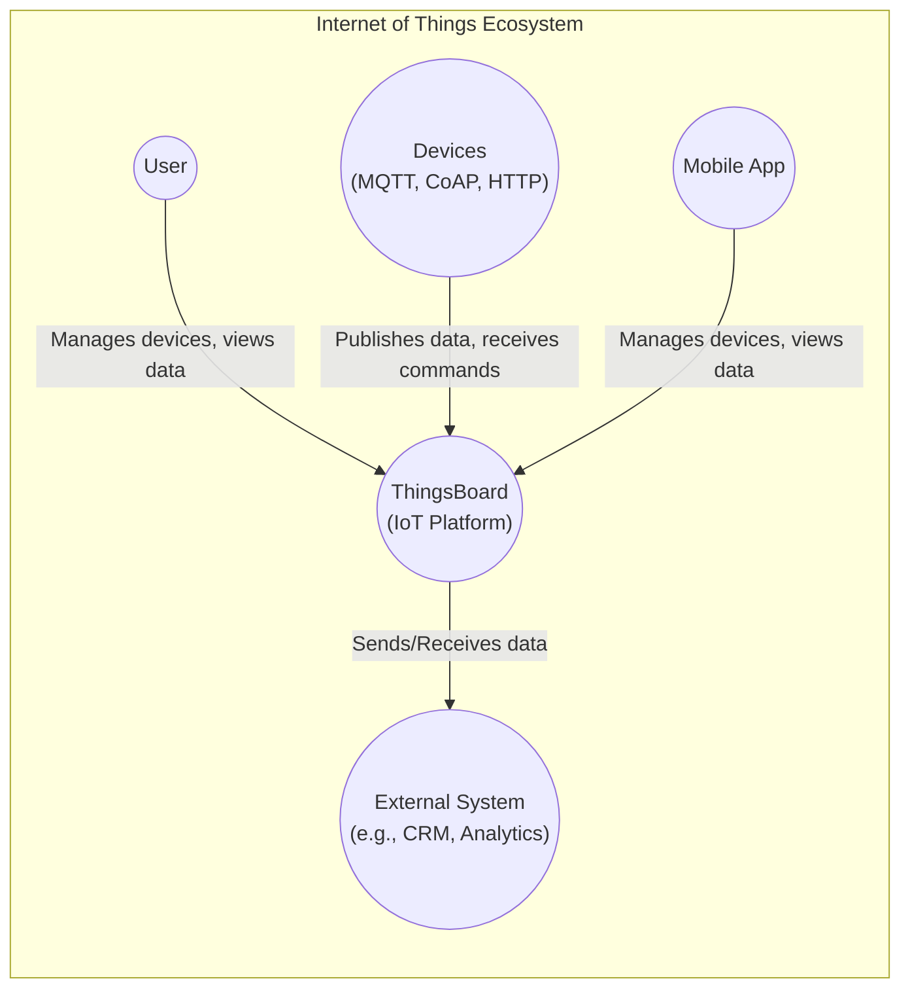
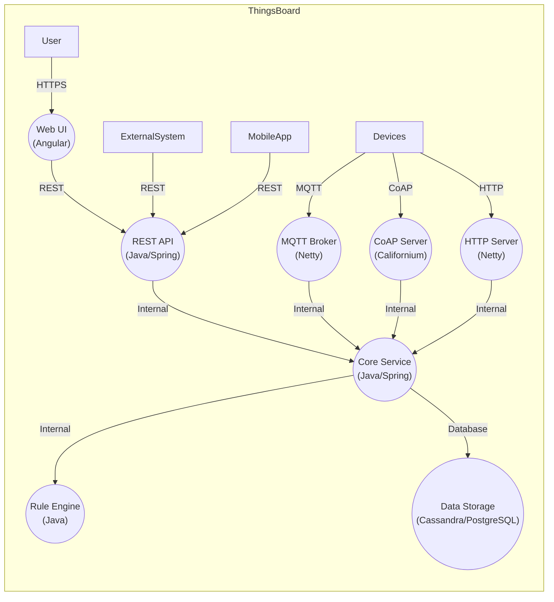
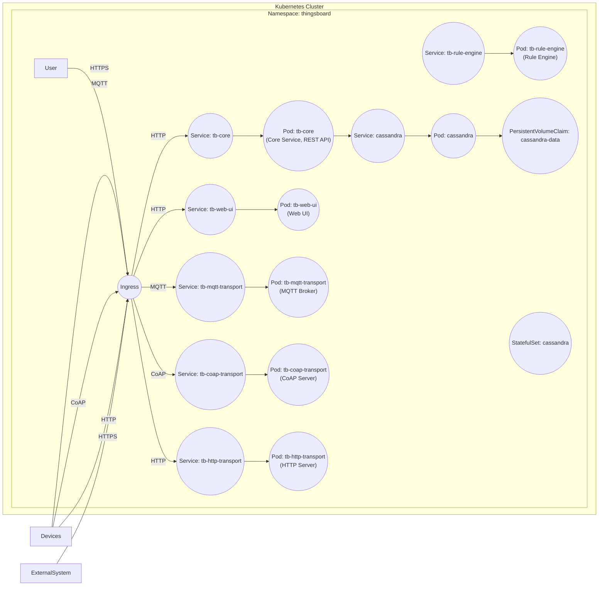
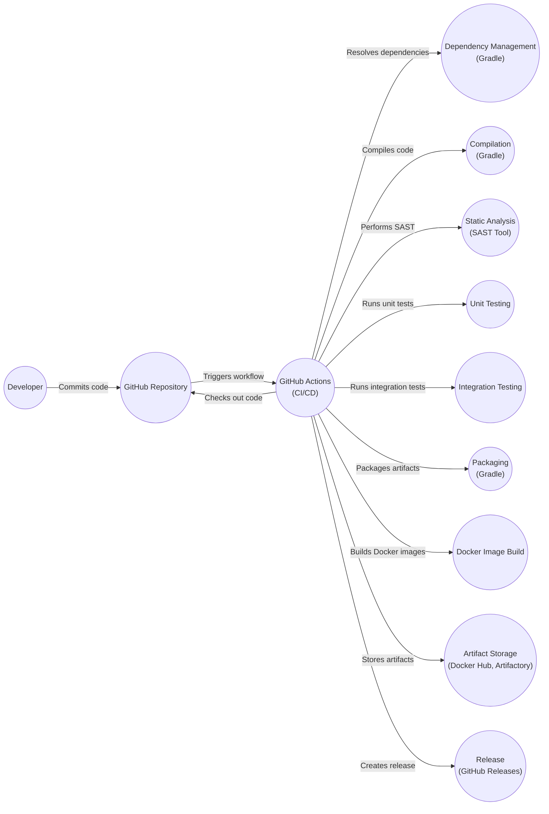

Okay, let's create a design document for the ThingsBoard IoT platform based on the provided GitHub repository.

# BUSINESS POSTURE

ThingsBoard is an open-source IoT platform for data collection, processing, visualization, and device management.  It enables device connectivity via industry-standard IoT protocols - MQTT, CoAP, and HTTP and supports both cloud and on-premises deployments.  The platform is designed to be scalable, fault-tolerant, and performant.  Given its open-source nature and broad applicability, several business priorities and risks can be identified:

Priorities:

*   Enable rapid development and deployment of IoT solutions.
*   Provide a flexible and customizable platform adaptable to various industries and use cases.
*   Maintain a strong and active open-source community.
*   Offer professional services and support for enterprise users.
*   Ensure the platform's scalability and reliability to handle large-scale deployments.
*   Maintain a high level of security to protect sensitive data and devices.

Business Risks:

*   Reputational Damage: Security breaches or vulnerabilities could severely damage the reputation of ThingsBoard, especially given its use in potentially critical infrastructure and sensitive data handling.
*   Competition: The IoT platform market is competitive.  Failure to innovate or provide a compelling feature set could lead to loss of market share.
*   Open Source Sustainability:  Relying on community contributions requires careful management to ensure ongoing development and maintenance.
*   Monetization Challenges: Balancing the open-source nature with the need for revenue generation through professional services and support is crucial.
*   Data Privacy Compliance:  Failure to comply with data privacy regulations (e.g., GDPR, CCPA) could lead to significant fines and legal issues.
*   Supply Chain Vulnerabilities:  Dependencies on third-party libraries and components introduce the risk of supply chain attacks.

# SECURITY POSTURE

Based on the GitHub repository and general knowledge of IoT platforms, the following security controls and accepted risks are likely present:

Existing Security Controls:

*   security control: Authentication: ThingsBoard supports various authentication mechanisms, including username/password, OAuth 2.0, and X.509 certificates. Described in documentation and implemented in code.
*   security control: Authorization: Role-Based Access Control (RBAC) is implemented to manage user permissions and access to resources. Described in documentation and implemented in code.
*   security control: Data Encryption: Support for TLS/SSL for secure communication (MQTT, CoAP, HTTP). Described in documentation and implemented in code.
*   security control: Device Provisioning: Mechanisms for securely onboarding and provisioning devices. Described in documentation and implemented in code.
*   security control: API Rate Limiting: Protection against denial-of-service attacks by limiting API requests. Described in documentation and implemented in code.
*   security control: Auditing: Logging of user and device activities for security monitoring and analysis. Described in documentation and implemented in code.
*   security control: Input Validation: Validation of data received from devices and users to prevent injection attacks. Implemented in code.

Accepted Risks:

*   accepted risk: Complexity: The platform's complexity and numerous features increase the potential attack surface.
*   accepted risk: Open Source: While beneficial, open-source code is publicly visible, potentially allowing attackers to find vulnerabilities more easily.
*   accepted risk: User Misconfiguration:  The platform's flexibility means that users can misconfigure security settings, leading to vulnerabilities.
*   accepted risk: Third-Party Dependencies:  Reliance on external libraries introduces the risk of vulnerabilities in those dependencies.

Recommended Security Controls:

*   Implement Software Composition Analysis (SCA) to identify and manage vulnerabilities in third-party dependencies.
*   Integrate Static Application Security Testing (SAST) and Dynamic Application Security Testing (DAST) into the CI/CD pipeline.
*   Provide comprehensive security hardening guides and best practices for users.
*   Conduct regular penetration testing and security audits.
*   Implement a robust vulnerability disclosure program.

Security Requirements:

*   Authentication:
    *   Support multi-factor authentication (MFA).
    *   Implement strong password policies.
    *   Provide secure session management.
*   Authorization:
    *   Enforce the principle of least privilege.
    *   Regularly review and update user roles and permissions.
    *   Provide fine-grained access control to resources.
*   Input Validation:
    *   Validate all input from devices and users.
    *   Use parameterized queries to prevent SQL injection.
    *   Sanitize data to prevent cross-site scripting (XSS).
*   Cryptography:
    *   Use strong, industry-standard cryptographic algorithms.
    *   Securely manage cryptographic keys.
    *   Encrypt data at rest and in transit.
    *   Use digital signatures to verify the integrity of data and devices.

# DESIGN

## C4 CONTEXT

Element Descriptions:

*   Element:
    *   Name: User
    *   Type: Person
    *   Description: Represents a user interacting with the ThingsBoard platform through a web browser or other client.
    *   Responsibilities: Managing devices, viewing data, configuring rules, and administering the platform.
    *   Security controls: Authentication, Authorization, Session Management.

*   Element:
    *   Name: ThingsBoard
    *   Type: Software System
    *   Description: The core IoT platform for data collection, processing, visualization, and device management.
    *   Responsibilities: Device connectivity, data storage, rule engine processing, user interface, API access.
    *   Security controls: Authentication, Authorization, Data Encryption, API Rate Limiting, Auditing, Input Validation.

*   Element:
    *   Name: External System
    *   Type: Software System
    *   Description: Represents external systems that integrate with ThingsBoard, such as CRM, analytics platforms, or other applications.
    *   Responsibilities: Consuming data from ThingsBoard, providing additional processing or services.
    *   Security controls: Secure API communication (TLS/SSL), Authentication, Authorization.

*   Element:
    *   Name: Devices
    *   Type: External System
    *   Description: Represents IoT devices that connect to ThingsBoard using various protocols (MQTT, CoAP, HTTP).
    *   Responsibilities: Sending sensor data, receiving commands, reporting status.
    *   Security controls: Device Authentication (X.509 certificates, pre-shared keys), Data Encryption (TLS/SSL), Secure Boot, Firmware Updates.

*   Element:
    *   Name: Mobile App
    *   Type: Software System
    *   Description: Represents a mobile application that interacts with ThingsBoard.
    *   Responsibilities: Managing devices, viewing data, configuring rules.
    *   Security controls: Authentication, Authorization, Session Management, Secure communication (TLS/SSL).

## C4 CONTAINER

Element Descriptions:

*   Element:
    *   Name: Web UI
    *   Type: Web Application
    *   Description: Angular-based web interface for user interaction.
    *   Responsibilities: Displaying data, managing devices, configuring rules, user administration.
    *   Security controls: Authentication, Authorization, Session Management, Input Validation, XSS Protection.

*   Element:
    *   Name: REST API
    *   Type: API
    *   Description: Java/Spring-based REST API for programmatic access to the platform.
    *   Responsibilities: Handling API requests, interacting with the core service.
    *   Security controls: Authentication, Authorization, API Rate Limiting, Input Validation, Secure Communication (TLS/SSL).

*   Element:
    *   Name: MQTT Broker
    *   Type: Message Broker
    *   Description: Netty-based MQTT broker for handling MQTT communication with devices.
    *   Responsibilities: Managing MQTT connections, routing messages, enforcing QoS.
    *   Security controls: TLS/SSL, Client Authentication (X.509 certificates, username/password), Access Control Lists (ACLs).

*   Element:
    *   Name: CoAP Server
    *   Type: Server
    *   Description: Californium-based CoAP server for handling CoAP communication with devices.
    *   Responsibilities: Managing CoAP connections, handling requests and responses.
    *   Security controls: DTLS, Client Authentication, Access Control.

*   Element:
    *   Name: HTTP Server
    *   Type: Server
    *   Description: Netty-based HTTP server for handling HTTP communication with devices.
    *   Responsibilities: Handling HTTP requests and responses.
    *   Security controls: TLS/SSL, Authentication, Input Validation.

*   Element:
    *   Name: Rule Engine
    *   Type: Application
    *   Description: Java-based rule engine for processing data and triggering actions.
    *   Responsibilities: Evaluating rules, executing actions, generating events.
    *   Security controls: Input Validation, Secure Script Execution (sandboxing).

*   Element:
    *   Name: Data Storage
    *   Type: Database
    *   Description: Cassandra or PostgreSQL database for storing device data, user information, and platform configuration.
    *   Responsibilities: Data persistence, querying, retrieval.
    *   Security controls: Data Encryption at Rest, Database Access Control, Auditing.

*   Element:
    *   Name: Core Service
    *   Type: Application
    *   Description: Java/Spring-based core service that orchestrates platform functionality.
    *   Responsibilities: Device management, user management, data processing, rule engine integration.
    *   Security controls: Authentication, Authorization, Input Validation, Secure Communication.

## DEPLOYMENT

ThingsBoard supports multiple deployment options:

1.  Single-node deployment: All components are deployed on a single server. Suitable for small-scale deployments and testing.
2.  Multi-node deployment: Components are distributed across multiple servers for scalability and high availability. Suitable for production environments.
3.  Docker-based deployment: Using Docker containers for easy deployment and management.
4.  Kubernetes-based deployment: Using Kubernetes for orchestration and scaling.
5.  Cloud-based deployment: Deploying on cloud platforms like AWS, Azure, or GCP.

Chosen Deployment Solution (Kubernetes-based deployment):

Element Descriptions:

*   Element:
    *   Name: Pod\_TB\_Core
    *   Type: Kubernetes Pod
    *   Description: Pod running the ThingsBoard Core Service and REST API containers.
    *   Responsibilities: Core platform logic, API handling.
    *   Security controls: Network Policies, Resource Limits, Security Context.

*   Element:
    *   Name: Pod\_TB\_Web
    *   Type: Kubernetes Pod
    *   Description: Pod running the ThingsBoard Web UI container.
    *   Responsibilities: Serving the web interface.
    *   Security controls: Network Policies, Resource Limits, Security Context.

*   Element:
    *   Name: Pod\_TB\_MQTT, Pod\_TB\_CoAP, Pod\_TB\_HTTP
    *   Type: Kubernetes Pod
    *   Description: Pods running the transport layer containers (MQTT, CoAP, HTTP).
    *   Responsibilities: Handling device communication.
    *   Security controls: Network Policies, Resource Limits, Security Context, TLS/DTLS termination.

*   Element:
    *   Name: Pod\_TB\_RuleEngine
    *   Type: Kubernetes Pod
    *   Description: Pod running the ThingsBoard Rule Engine container.
    *   Responsibilities: Rule processing.
    *   Security controls: Network Policies, Resource Limits, Security Context.

*   Element:
    *   Name: Service\_TB\_Core, Service\_TB\_Web, Service\_TB\_MQTT, Service\_TB\_CoAP, Service\_TB\_HTTP, Service\_TB\_RuleEngine
    *   Type: Kubernetes Service
    *   Description: Kubernetes Services exposing the corresponding Pods.
    *   Responsibilities: Load balancing, service discovery.
    *   Security controls: Network Policies.

*   Element:
    *   Name: Ingress
    *   Type: Kubernetes Ingress
    *   Description: Kubernetes Ingress controller for external access.
    *   Responsibilities: Routing external traffic to the appropriate services.
    *   Security controls: TLS termination, SSL certificates, Web Application Firewall (WAF).

*   Element:
    *   Name: PVC\_Cassandra
    *   Type: Kubernetes PersistentVolumeClaim
    *   Description: PersistentVolumeClaim for Cassandra data storage.
    *   Responsibilities: Requesting persistent storage.
    *   Security controls: Access Modes, Storage Class configuration.

*   Element:
    *   Name: StatefulSet\_Cassandra
    *   Type: Kubernetes StatefulSet
    *   Description: StatefulSet for managing the Cassandra deployment.
    *   Responsibilities: Ensuring stable network identities and persistent storage for Cassandra pods.
    *   Security controls: Network Policies, Resource Limits, Security Context.

*   Element:
    *   Name: Pod\_Cassandra
    *   Type: Kubernetes Pod
    *   Description: Pod running the Cassandra database container.
    *   Responsibilities: Data storage.
    *   Security controls: Network Policies, Resource Limits, Security Context, Data Encryption at Rest.

*   Element:
    *   Name: Service\_Cassandra
    *   Type: Kubernetes Service
    *   Description: Kubernetes Service exposing the Cassandra Pods.
    *   Responsibilities: Internal service discovery for Cassandra.
    *   Security controls: Network Policies.

*   Element:
    *   Name: User
    *   Type: Person
    *   Description: Represents a user interacting with the ThingsBoard platform.
    *   Responsibilities: Managing devices, viewing data.
    *   Security controls: Authentication, Authorization.

*   Element:
    *   Name: Devices
    *   Type: External System
    *   Description: Represents IoT devices connecting to ThingsBoard.
    *   Responsibilities: Sending data, receiving commands.
    *   Security controls: Device Authentication, Data Encryption.

*   Element:
    *   Name: ExternalSystem
    *   Type: External System
    *   Description: Represents external systems integrating with ThingsBoard.
    *   Responsibilities: Consuming data, providing services.
    *   Security controls: Secure API communication.

## BUILD

The ThingsBoard build process involves several steps, from code compilation to packaging and distribution.  The repository uses Gradle as the build tool.  Here's a breakdown, focusing on security:

1.  Developer:  A developer writes code and commits it to the GitHub repository.
2.  GitHub Actions (CI/CD):  GitHub Actions workflows are triggered on code commits and pull requests. These workflows automate the build process.
3.  Code Checkout: The workflow checks out the source code from the repository.
4.  Dependency Management: Gradle resolves and downloads project dependencies (Java libraries, etc.).
    *   Security Control: Dependency scanning using tools like OWASP Dependency-Check or Snyk to identify known vulnerabilities in dependencies. This should be integrated into the Gradle build.
5.  Compilation:  Gradle compiles the Java code into bytecode.
6.  Static Analysis (SAST):
    *   Security Control:  Integrate a SAST tool (e.g., SonarQube, FindBugs, SpotBugs) into the build process to analyze the source code for potential security vulnerabilities.  This should be a mandatory step in the CI pipeline.
7.  Unit Testing:  Run unit tests to verify the functionality of individual components.
8.  Integration Testing: Run integration tests to verify the interaction between different components.
9.  Packaging:  Gradle packages the compiled code and resources into JAR files and other artifacts.
10. Docker Image Build:  Dockerfiles are used to create Docker images for the various ThingsBoard components (core, web UI, transport services, rule engine).
    *   Security Control:  Use minimal base images for Docker containers to reduce the attack surface.
    *   Security Control:  Scan Docker images for vulnerabilities using tools like Trivy, Clair, or Anchore.
11. Artifact Storage:  Build artifacts (JAR files, Docker images) are stored in a repository (e.g., Docker Hub, Artifactory, Nexus).
    *   Security Control:  Implement access control and authentication for the artifact repository.
12. Release:  Tagged commits trigger the creation of releases on GitHub, making the built artifacts available for download.

# RISK ASSESSMENT

Critical Business Processes:

*   Device Connectivity and Management: Ensuring reliable and secure communication with IoT devices is paramount.
*   Data Collection and Processing:  Accurate and timely collection and processing of data from devices are critical for the platform's functionality.
*   Data Visualization and Reporting:  Providing users with clear and insightful visualizations of their data is essential for decision-making.
*   Rule Engine and Automation:  Enabling users to create rules and automate actions based on device data is a key feature.
*   User and Device Administration:  Managing users, devices, and their permissions is crucial for security and access control.

Data Sensitivity:

*   Device Data:  The sensitivity of device data varies greatly depending on the use case.  It can range from non-sensitive (e.g., public weather data) to highly sensitive (e.g., industrial control systems, healthcare data, personal location data).
*   User Credentials:  Usernames, passwords, API keys, and other credentials must be protected with the highest level of security.
*   Platform Configuration:  Configuration data, including database connection strings and security settings, must be kept confidential.
*   Audit Logs:  Audit logs contain information about user and device activities, which can be sensitive and require protection.

# QUESTIONS & ASSUMPTIONS

Questions:

*   What specific compliance requirements (e.g., GDPR, HIPAA, CCPA) are applicable to the target users and deployments of ThingsBoard?
*   What are the specific performance and scalability requirements for different deployment scenarios?
*   What are the existing security incident response procedures?
*   What is the current process for managing vulnerabilities in third-party dependencies?
*   What level of support is provided for different device authentication methods (e.g., X.509 certificates, pre-shared keys)?
*   Are there any existing integrations with external security systems (e.g., SIEM, IDS/IPS)?

Assumptions:

*   BUSINESS POSTURE: The primary business goal is to provide a robust and versatile IoT platform, balancing open-source accessibility with enterprise-grade features and support.
*   SECURITY POSTURE: Security is a high priority, but there's an acceptance of inherent risks associated with open-source software and user-configurable settings.
*   DESIGN: The platform is designed for scalability and flexibility, with a modular architecture that allows for various deployment options. The use of standard protocols (MQTT, CoAP, HTTP) is assumed. The use of Java and Spring Framework is a core technology choice.