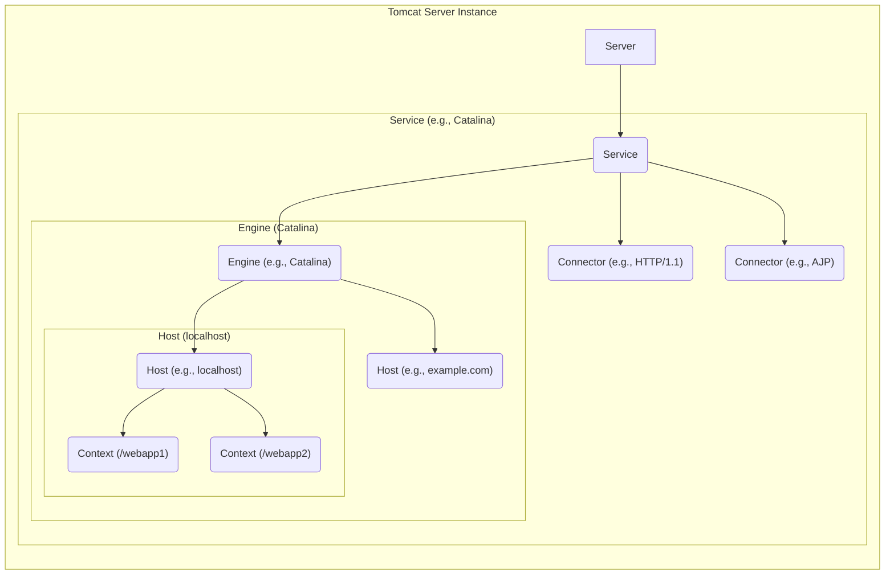

# Project Design Document: Apache Tomcat (Improved)

**Version:** 1.1
**Date:** October 26, 2023
**Author:** AI Software Architect

## 1. Introduction

This document provides an enhanced architectural design of the Apache Tomcat project, with a strong emphasis on aspects critical for effective threat modeling. It meticulously details the core components, their intricate interactions, and the flow of data within the Tomcat server. This refined document serves as a robust foundation for proactively identifying potential security vulnerabilities and formulating comprehensive mitigation strategies. Understanding this architecture is paramount for ensuring the security of web applications deployed on Tomcat.

## 2. Goals and Objectives

*   Deliver a more granular and insightful overview of the Apache Tomcat architecture.
*   Precisely identify key components, elaborating on their specific functionalities and configurations.
*   Thoroughly describe the data flow within the system, with a focus on the request processing lifecycle and data transformations.
*   Sharpen the focus on areas of potential security concern, providing concrete examples for subsequent threat modeling activities.
*   Serve as an authoritative and detailed reference for security assessments, penetration testing, and secure configuration guidance.

## 3. Scope

This document focuses on the fundamental architecture of the Apache Tomcat server, providing a deeper dive into its core functionalities. It includes:

*   An in-depth analysis of the main components of the Tomcat server (e.g., Connector types, Engine functionalities, Host configurations, Context lifecycles).
*   A detailed breakdown of the request processing lifecycle, including data transformations and internal communication.
*   Key configuration files and their roles in security and functionality.
*   Various authentication and authorization mechanisms supported by Tomcat.
*   Session management techniques and their security implications.

This document still does **not** cover:

*   The internal implementation details of specific web applications deployed on Tomcat.
*   The intricacies of third-party libraries or extensions unless they are integral to core Tomcat functionality.
*   Operating system level security configurations beyond their direct interaction with Tomcat.
*   Fine-grained code-level implementation details of Tomcat's internal classes and methods.

## 4. High-Level Architecture

Tomcat's architecture is built upon a well-defined, modular, and hierarchical structure. The core components collaborate to efficiently process incoming requests and serve web applications. The hierarchy ensures a clear separation of concerns and facilitates management.

*   **Server:** The outermost container representing the entire Tomcat instance. It can contain multiple Services.
*   **Service:**  A collection of one or more Connectors and exactly one Engine. It manages the lifecycle of these components and provides a central point for configuration. Common examples include "Catalina".
*   **Connector:**  Responsible for handling communication with clients using specific protocols. It listens on configured ports and converts protocol-specific requests into an internal Tomcat request object. Examples include the HTTP/1.1 Connector (Coyote) and the AJP Connector.
*   **Engine:** The central request processor within a Service. It receives requests from Connectors and determines which Host should handle them based on the requested virtual host. "Catalina" is the default Engine implementation.
*   **Host:** Represents a virtual host within the Tomcat server, typically associated with a specific domain name or IP address. It maps incoming requests to specific Contexts based on the requested hostname.
*   **Context:** Represents a single web application deployed on Tomcat. It encapsulates the servlets, JSPs, static files, and other resources for that application. Each Context has its own deployment descriptor (`web.xml`).

## 5. Component Details

This section provides a more detailed examination of the key components, highlighting their functionalities and security implications:

*   **Connector:**
    *   **Functionality:** Listens on configured network interfaces and ports (e.g., 8080 for HTTP, 8443 for HTTPS, 8009 for AJP). Parses incoming requests according to the specified protocol. Manages threads for handling concurrent client connections (configurable via attributes like `maxThreads`, `minSpareThreads`, `maxConnections`). Handles SSL/TLS termination for HTTPS Connectors (configured via attributes like `keystoreFile`, `keystorePass`).
    *   **Security Considerations:** Vulnerable to protocol-specific attacks such as HTTP request smuggling (due to variations in HTTP parsing implementations), denial-of-service attacks (e.g., SYN floods if not protected at the network level, slowloris attacks), and man-in-the-middle attacks if HTTPS is not properly configured or enforced. Misconfigured `maxThreads` or `connectionTimeout` can also lead to denial of service.

*   **Service:**
    *   **Functionality:**  Manages the lifecycle (start, stop, destroy) of its associated Connectors and the Engine. Provides a central point for configuring shared resources and listeners. Allows for the definition of shared libraries and resources accessible to all web applications within the Service.
    *   **Security Considerations:**  Misconfiguration of shared resources or listeners can introduce vulnerabilities that affect all web applications within the Service. Improper permissions on the Service's configuration files can allow unauthorized modification.

*   **Engine:**
    *   **Functionality:**  Directs incoming requests to the appropriate Host based on the `Host` header in the HTTP request. Can be configured with a default Host to handle requests for unknown hostnames. Implements request logging at the Engine level.
    *   **Security Considerations:**  Incorrect virtual host configuration can lead to requests being routed to the wrong web application, potentially exposing sensitive information or allowing unauthorized actions. If a default Host is not properly secured, it can become a target for attacks.

*   **Host:**
    *   **Functionality:** Represents a virtual host, typically identified by a domain name. Contains one or more Contexts, each representing a deployed web application. Manages the mapping of incoming requests to the appropriate Context based on the request URI. Can be configured with aliases to handle requests for multiple domain names.
    *   **Security Considerations:** Vulnerable to virtual host hijacking if DNS records are compromised or if Tomcat is not configured to only respond to specific hostnames. Misconfigured Context paths can lead to unintended access to web application resources.

*   **Context:**
    *   **Functionality:** Represents a single deployed web application. Loads and manages the web application's deployment descriptor (`web.xml`) and other configuration files. Manages the lifecycle of servlets, filters, listeners, and other application components within the web application. Provides isolation between different web applications deployed on the same Tomcat instance.
    *   **Security Considerations:**  The primary target for many web application vulnerabilities. Vulnerabilities within the web application code (e.g., injection flaws, cross-site scripting) are executed within the Context. Misconfigured security constraints in `web.xml` can lead to unauthorized access. Improperly secured session management within the Context can lead to session hijacking.

*   **Web Application:**
    *   **Functionality:** Contains the application's code (servlets, JSPs, Java classes), static resources (HTML, CSS, JavaScript, images), and configuration files. Implements the business logic and user interface of the web application.
    *   **Security Considerations:** Inherits all the security vulnerabilities present in the application code itself. Dependencies on vulnerable third-party libraries can also introduce security risks.

## 6. Data Flow (Request Processing)

The following diagram provides a more detailed illustration of the typical flow of an HTTP request through Tomcat, highlighting key data transformations and component interactions:

```mermaid
graph LR
    A["Client Browser"] --> B("Connector (e.g., HTTP/1.1)");
    B -- "HTTP Request" --> C("Coyote Adapter");
    C -- "Internal Request Object" --> D("Service");
    D --> E("Engine (Catalina)");
    E -- "Host Header Analysis" --> F{"Host Found?"};
    F -- "Yes" --> G("Host");
    F -- "No" --> H("Default Host");
    G --> I{"Context Found?"};
    H --> I
    I -- "Yes" --> J("Context");
    I -- "No" --> K("Error Handling");
    J -- "Servlet Mapping" --> L("Servlet/JSP");
    L -- "Response Generation" --> M("Response Object");
    M --> N("Context");
    N --> O("Host");
    O --> P("Engine");
    P --> Q("Service");
    Q --> R("Coyote Adapter");
    R -- "HTTP Response" --> S("Connector");
    S --> T["Client Browser"];
```

1. **Client Request:** A client (e.g., a web browser) sends an HTTP request to the Tomcat server on a configured port.
2. **Connector Receives Request:** The appropriate Connector (based on the port and protocol) receives the raw HTTP request.
3. **Coyote Adapter:** The Connector uses an adapter (like Coyote for HTTP) to parse the HTTP request and create an internal Tomcat `Request` object.
4. **Request Handover to Service:** The Connector passes the internal `Request` object to its associated Service.
5. **Engine Processing:** The Service forwards the request to its Engine. The Engine analyzes the `Host` header of the request.
6. **Host Selection:** The Engine attempts to find a matching Host based on the `Host` header. If a match is found, the request is routed to that Host; otherwise, it's routed to the default Host (if configured).
7. **Context Mapping:** The selected Host attempts to map the request URI to a deployed Context (web application).
8. **Context Found?**: If a matching Context is found, the request is passed to it. If not, an error handling mechanism is invoked (e.g., displaying a 404 error).
9. **Servlet/JSP Invocation:** The Context uses its servlet mapping configuration (defined in `web.xml`) to determine which Servlet or JSP should handle the request.
10. **Response Generation:** The Servlet or JSP processes the request and generates a `Response` object.
11. **Response Flow Back:** The `Response` object travels back through the Context, Host, Engine, and Service.
12. **Coyote Adapter (Response):** The Service passes the `Response` object back to the Coyote Adapter.
13. **Connector Sends Response:** The Coyote Adapter converts the internal `Response` object back into an HTTP response, which is then sent back to the client by the Connector.

## 7. Key Configuration Files

*   **`server.xml`:** The primary configuration file for the Tomcat server instance. Defines the `Server`, `Service` elements (including `Connector` and `Engine` configurations), `GlobalNamingResources`, and other server-level settings.
    *   **Security Considerations:** Contains sensitive information such as port numbers, SSL/TLS certificate paths and passwords, administrative user credentials (if configured within this file), and connection pool settings. Improper file permissions can allow unauthorized modification, leading to server compromise. Weak or default passwords for administrative users are a critical vulnerability.
*   **`web.xml` (Deployment Descriptor):** Located within each web application's `WEB-INF` directory. Defines servlets, filters, listeners, security constraints (e.g., authentication requirements, authorized roles), session configuration, and error pages for the specific web application.
    *   **Security Considerations:** Incorrectly configured security constraints can expose sensitive resources or allow unauthorized access. Vulnerable filters or listeners can introduce security flaws affecting the entire web application. Misconfigured session management settings can lead to session fixation or other session-related attacks.
*   **`context.xml`:** Can be placed in the `$CATALINA_BASE/conf/[enginename]/[hostname]/` directory or within the `META-INF` directory of a web application's WAR file. Used to configure individual Contexts, overriding default settings. Can define data sources, resource links, and other context-specific configurations.
    *   **Security Considerations:** Similar to `web.xml`, misconfigurations can lead to vulnerabilities specific to the web application. Defining data sources with embedded credentials requires careful management to prevent exposure.
*   **`tomcat-users.xml`:**  Used for the `UserDatabaseRealm`, a basic authentication realm. Stores user credentials (usernames, passwords, and roles). Passwords are typically stored in a hashed format.
    *   **Security Considerations:**  If used, weak passwords or insecure hashing algorithms can lead to unauthorized access. Improper file permissions can allow unauthorized modification of user credentials. This realm is generally not recommended for production environments due to its simplicity.

## 8. Authentication and Authorization

Tomcat provides various mechanisms for authenticating users and authorizing access to web application resources:

*   **Authentication Realms:** Tomcat uses Realms to authenticate users. Different Realm implementations support various authentication methods:
    *   **Basic Authentication:**  Credentials (username and password) are transmitted in the `Authorization` header, Base64 encoded.
        *   **Security Considerations:** Highly susceptible to interception if HTTPS is not used, as credentials are easily decoded.
    *   **Form-Based Authentication:**  Uses an HTML form to collect credentials, which are then submitted to the server for verification.
        *   **Security Considerations:** Requires HTTPS to protect credentials during transmission. Vulnerable to cross-site scripting (XSS) if not implemented carefully, potentially allowing attackers to steal credentials.
    *   **Digest Authentication:**  A more secure alternative to basic authentication, using a hash of the credentials along with a nonce to prevent replay attacks.
        *   **Security Considerations:** More resistant to eavesdropping than basic authentication but still susceptible to man-in-the-middle attacks if HTTPS is not used.
    *   **Client Certificate Authentication:**  Authenticates users based on digital certificates presented by the client browser.
        *   **Security Considerations:** Requires proper management of client certificates and a robust Public Key Infrastructure (PKI).
    *   **JNDIRealm:** Authenticates against a JNDI directory service (e.g., LDAP).
        *   **Security Considerations:** Security depends on the configuration and security of the JNDI directory service.
    *   **DataSourceRealm:** Authenticates against a database.
        *   **Security Considerations:** Requires secure storage of user credentials in the database and protection against SQL injection vulnerabilities.
*   **Authorization:**  Determines whether an authenticated user has permission to access a specific resource. Authorization rules are typically defined in the `web.xml` file using `<security-constraint>` elements. These constraints specify URL patterns and the roles required to access those resources.
    *   **Security Considerations:**  Incorrectly configured authorization rules can lead to unauthorized access (allowing users to access resources they shouldn't) or privilege escalation (allowing users to perform actions they are not authorized for).

## 9. Session Management

Tomcat provides mechanisms to manage user sessions, allowing web applications to maintain state between multiple requests from the same user:

*   **Cookies:** The most common method. Tomcat generates a unique session ID and stores it in a cookie on the client's browser. The browser sends this cookie with subsequent requests.
    *   **Security Considerations:** Session cookies can be stolen through various attacks, including cross-site scripting (XSS). To mitigate this, the `HttpOnly` flag should be set to prevent client-side JavaScript from accessing the cookie, and the `Secure` flag should be set to ensure the cookie is only transmitted over HTTPS.
*   **URL Rewriting:** The session ID is appended to the URL as a parameter.
    *   **Security Considerations:** Less secure than cookies as session IDs are visible in the URL, making them susceptible to being shared, bookmarked, or exposed in browser history or server logs.
*   **SSL Session IDs:**  Leverages the session ID established by the underlying SSL/TLS connection.
    *   **Security Considerations:** Relies on the security of the SSL/TLS connection. Only applicable when using HTTPS.
*   **Session Attributes:** Web applications can store user-specific data in session attributes.
    *   **Security Considerations:** Sensitive information stored in session attributes should be protected from unauthorized access or modification. Care should be taken to prevent session fixation attacks, where an attacker tricks a user into using a session ID known to the attacker.

## 10. Security Considerations for Threat Modeling

This section outlines potential threats and vulnerabilities based on the Tomcat architecture, categorized for effective threat modeling:

*   **Connector Level Threats:**
    *   **Denial of Service (DoS):**  SYN flood attacks, slowloris attacks exploiting connection handling.
    *   **HTTP Request Smuggling:** Exploiting inconsistencies in HTTP parsing between Tomcat and upstream proxies.
    *   **SSL/TLS Vulnerabilities:**  Weak cipher suites, protocol downgrade attacks if not properly configured.
    *   **Port Scanning and Enumeration:** Discovery of open ports and running services.
*   **Service Level Threats:**
    *   **Unauthorized Access to Management Interfaces:**  Accessing Tomcat Manager or Host Manager applications without proper authentication.
    *   **Information Disclosure:**  Exposure of sensitive information through error pages or verbose logging.
*   **Engine and Host Level Threats:**
    *   **Virtual Host Hijacking:**  Exploiting misconfigurations to route requests for legitimate domains to malicious applications.
    *   **Bypass of Security Constraints:**  Manipulating request headers to bypass authorization checks.
*   **Context and Web Application Level Threats:**
    *   **Injection Attacks:** SQL injection, cross-site scripting (XSS), command injection, LDAP injection.
    *   **Authentication and Authorization Flaws:**  Bypassing login mechanisms, privilege escalation.
    *   **Session Management Vulnerabilities:** Session fixation, session hijacking, predictable session IDs.
    *   **Cross-Site Request Forgery (CSRF):**  Tricking authenticated users into performing unintended actions.
    *   **File Inclusion Vulnerabilities:**  Exploiting flaws to include arbitrary files on the server.
    *   **Information Disclosure:**  Exposing sensitive data through insecure storage or transmission.
*   **Configuration File Threats:**
    *   **Unauthorized Access or Modification:**  Gaining access to sensitive configuration files like `server.xml` or `tomcat-users.xml`.
    *   **Exposure of Credentials:**  Finding plaintext passwords or weakly hashed credentials in configuration files.
*   **Authentication and Authorization Threats:**
    *   **Brute-Force Attacks:**  Attempting to guess user credentials.
    *   **Credential Stuffing:**  Using compromised credentials from other breaches.
    *   **Insecure Credential Storage:**  Storing passwords in plaintext or using weak hashing algorithms.
*   **Session Management Threats:**
    *   **Session Fixation:**  Forcing a user to use a known session ID.
    *   **Session Hijacking:**  Stealing a valid session ID to impersonate a user.
    *   **Predictable Session IDs:**  Easily guessable session IDs.

## 11. Deployment Considerations

Secure deployment practices are crucial for mitigating potential threats:

*   **Network Segmentation:**  Isolating the Tomcat server within a demilitarized zone (DMZ) or a private network segment.
*   **Firewall Configuration:**  Restricting network access to only necessary ports (e.g., 80, 443) and from trusted sources.
*   **Operating System Hardening:**  Securing the underlying operating system by applying security patches, disabling unnecessary services, and configuring appropriate file permissions.
*   **Regular Security Updates:**  Applying the latest security patches for Tomcat and the Java Development Kit (JDK).
*   **Secure Configuration Practices:**  Following security best practices for configuring Tomcat components, such as disabling default applications (e.g., the examples web application), using strong passwords, and enabling HTTPS.
*   **Principle of Least Privilege:**  Running the Tomcat process with the minimum necessary privileges.
*   **Input Validation and Output Encoding:**  Implementing robust input validation and output encoding within web applications to prevent injection attacks.

## 12. Future Considerations

This improved design document provides a more comprehensive foundation for threat modeling Apache Tomcat. Future enhancements could include:

*   Detailed sequence diagrams illustrating interactions between specific components for various scenarios.
*   A comprehensive mapping of common vulnerabilities and exploits to specific Tomcat components and configurations.
*   Integration with specific threat modeling methodologies like STRIDE or PASTA, providing concrete examples of how to apply these methodologies to Tomcat.
*   Analysis of specific Tomcat features and extensions, such as clustering, load balancing, and integration with other Java EE technologies, from a security perspective.
*   Guidance on secure development practices for web applications deployed on Tomcat.
