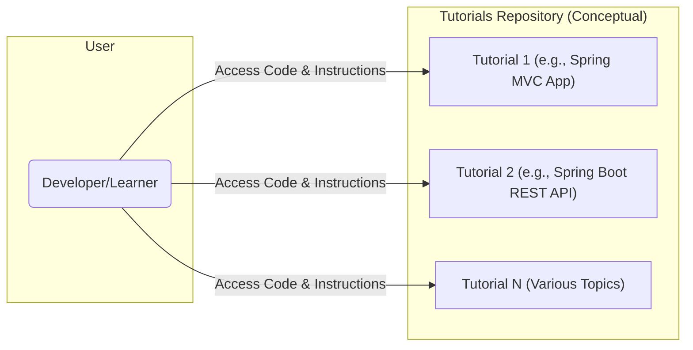
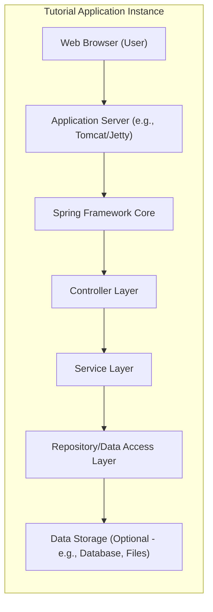
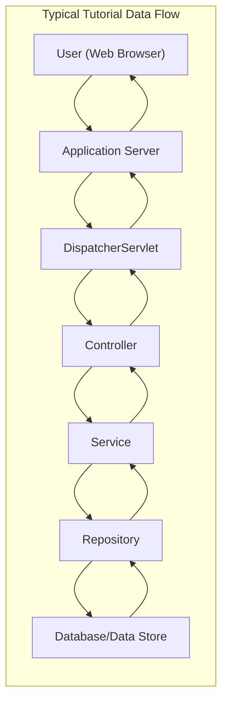

## Project Design Document: Eugenp/Tutorials (Improved)

**1. Introduction**

This document provides an enhanced design overview of the "eugenp/tutorials" project, a GitHub repository containing a collection of Java and Spring-related tutorials. This document is specifically designed to serve as a foundation for subsequent threat modeling activities. Understanding the architectural patterns, common components, and potential deployment contexts of these tutorials is crucial for identifying and mitigating potential security vulnerabilities. The scope of this design document encompasses the common architectural patterns and potential deployment scenarios applicable to the individual tutorials within the repository.

**2. Goals and Objectives**

* **Primary Goal:** Offer a comprehensive and practical resource for learning Java and Spring technologies through working examples.
* **Objectives:**
    * Provide clear, concise, and executable code examples.
    * Demonstrate a wide range of Java and Spring Framework features and best practices (and potentially anti-patterns for educational purposes).
    * Cover diverse topics, catering to learners with varying levels of experience.
    * Ensure the tutorials are easily accessible, understandable, and runnable by developers.
    * Encourage experimentation and learning by doing.

**3. High-Level Architecture**

The "eugenp/tutorials" repository is conceptually a collection of independent, self-contained tutorial applications or modules. While not a single monolithic application, common architectural patterns emerge across many of these tutorials.

**4. Detailed Architecture of a Typical Tutorial Application**

Individual tutorials often follow standard Java and Spring application architectures. The following diagram represents a common architecture found within the repository's tutorials:

**5. Components Commonly Found in Tutorials**

Individual tutorials typically include the following components:

* **Source Code Files:**
    * Java source files (`.java`) implementing application logic, controllers, services, and data access objects.
    * Spring configuration files (e.g., XML-based configurations or annotation-based configurations within Java files).
    * Spring Boot configuration files (`application.properties` or `application.yml`).
    * Potentially static web resources (HTML, CSS, JavaScript files).
* **Build Configuration Files:**
    * Maven `pom.xml` files defining project dependencies and build processes.
    * Gradle `build.gradle` files serving the same purpose as `pom.xml`.
* **Documentation within the Tutorial:**
    * README files or inline comments explaining the tutorial's purpose, setup instructions, and code details.
* **Optional Components (depending on the tutorial's focus):**
    * Database schema definition files (e.g., SQL scripts).
    * Message broker configurations (e.g., for RabbitMQ or Kafka).
    * Security configuration files (e.g., Spring Security configurations).
    * Unit and integration tests.

**6. Data Flow within a Typical Web-Based Tutorial**

For tutorials demonstrating web applications, the data flow generally follows this pattern:

1. **User Initiates Request:** A user interacts with the application via a web browser (e.g., clicking a link, submitting a form).
2. **Request Received by Server:** The application server (e.g., Tomcat, Jetty) receives the HTTP request.
3. **Spring MVC Dispatcher:** The Spring Framework's `DispatcherServlet` intercepts the request.
4. **Request Routing:** The `DispatcherServlet` determines the appropriate controller to handle the request based on configured mappings.
5. **Controller Logic:** The designated controller method processes the request, potentially interacting with services.
6. **Service Layer Processing:** The service layer performs business logic, often orchestrating interactions between different components.
7. **Data Access:** The service layer may interact with the data storage layer using repositories or data access objects.
8. **Data Storage Interaction:** The repository interacts with the underlying data store (e.g., database, file system).
9. **Response Generation:** The application generates a response (e.g., HTML view, JSON data).
10. **Response Delivery:** The response is sent back through the server to the user's web browser.

**7. Deployment Scenarios and Considerations**

While primarily educational, users will typically deploy and run these tutorials locally. Understanding potential deployment scenarios is important for threat modeling:

* **Local Development Environment (IDE):** Running the tutorial directly within an IDE (e.g., IntelliJ IDEA, Eclipse) is the most common scenario. This generally poses a lower security risk as it's isolated to the developer's machine.
* **Local Execution via Build Tools:** Running the application using Maven or Gradle commands (e.g., `mvn spring-boot:run` or `gradle bootRun`). Similar security considerations to IDE execution.
* **Containerization (Docker):** Some tutorials might include Dockerfiles, allowing users to build and run the application in isolated containers. This adds a layer of isolation but introduces potential vulnerabilities in the Docker image itself.
* **Virtual Machines (VMs):** Users might deploy tutorials on local or cloud-based VMs for experimentation. This introduces network security considerations for the VM.
* **Cloud Platforms (e.g., AWS, Azure, GCP):** While less common for direct tutorial usage, users could potentially deploy these applications to cloud platforms. This significantly increases the attack surface and introduces various cloud-specific security concerns.

**8. Technologies Commonly Used**

The tutorials leverage a standard set of Java and Spring technologies:

* **Programming Language:** Java
* **Core Framework:** Spring Framework (including modules like Core, Beans, Context)
* **Web Framework:** Spring MVC or Spring WebFlux
* **Bootstrapping Framework:** Spring Boot
* **Data Persistence:** Spring Data JPA, JDBC
* **Security:** Spring Security (in relevant tutorials)
* **Aspect-Oriented Programming:** Spring AOP
* **Testing Frameworks:** JUnit, Mockito, Spring Test
* **Build Tools:** Maven, Gradle
* **Application Servers:** Embedded Tomcat or Jetty (with Spring Boot), or standalone application servers.
* **Databases (Optional):** H2 (in-memory), MySQL, PostgreSQL, MongoDB, etc.
* **Other Libraries:** Various third-party libraries depending on the tutorial's focus (e.g., Jackson for JSON processing, Lombok for code generation).

**9. Security Considerations for Threat Modeling**

When considering these tutorials for threat modeling, the following aspects are particularly relevant:

* **Dependency Vulnerabilities:**  Outdated or vulnerable libraries declared in `pom.xml` or `build.gradle` files. A user running a tutorial with vulnerable dependencies could expose their system.
* **Input Validation Flaws:** Tutorials demonstrating form handling or API endpoints might lack proper input validation, showcasing vulnerabilities like SQL injection, cross-site scripting (XSS), or command injection.
* **Authentication and Authorization Weaknesses:** Tutorials focusing on security might contain misconfigurations or demonstrate insecure authentication/authorization patterns.
* **Data Exposure:** Tutorials might inadvertently log or display sensitive information (e.g., passwords, API keys) in code or logs.
* **Insecure File Handling:** Tutorials dealing with file uploads or downloads could demonstrate vulnerabilities related to path traversal or arbitrary file upload.
* **Cross-Site Request Forgery (CSRF):** Web-based tutorials might be susceptible to CSRF if proper protections are not implemented (or explicitly shown as a vulnerability).
* **Insecure Deserialization:** Tutorials demonstrating object serialization/deserialization could be vulnerable if not handled carefully.
* **Error Handling and Information Disclosure:**  Verbose error messages in tutorials could reveal sensitive information about the application's internal workings.
* **Code Injection:** Tutorials demonstrating dynamic code execution (e.g., using scripting engines) could be vulnerable to code injection attacks.

**10. How This Document Will Be Used for Threat Modeling**

This design document provides the necessary context and information for conducting a thorough threat modeling exercise. Specifically, it will be used to:

* **Identify Assets:** Determine the valuable components and data within the tutorial applications.
* **Identify Threats:** Brainstorm potential threats based on the architecture, components, data flow, and deployment scenarios outlined in this document.
* **Map Attack Vectors:** Understand how attackers could potentially exploit vulnerabilities to compromise the tutorial applications or the systems running them.
* **Prioritize Risks:** Assess the likelihood and impact of identified threats.
* **Define Security Requirements:**  Determine necessary security controls and mitigations based on the identified risks.

**11. Future Considerations**

* **Regular Security Reviews:** Periodically review the tutorials for potential security vulnerabilities and update them accordingly.
* **Dependency Management Automation:** Implement tools to automatically check for and update vulnerable dependencies.
* **Security Best Practices Guidance:**  Consider adding explicit guidance on secure coding practices within the tutorials themselves.
* **Categorization by Security Relevance:**  Potentially categorize tutorials based on their security implications or whether they demonstrate specific security features.

This improved design document provides a more detailed and focused foundation for threat modeling the "eugenp/tutorials" project. It emphasizes the common architectural patterns and potential security considerations relevant to the individual tutorials within the repository.
