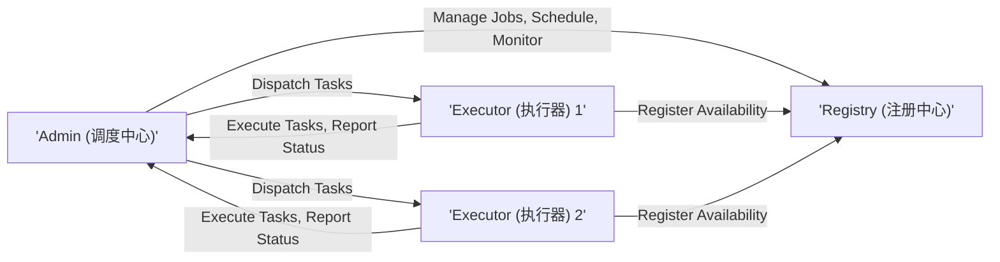
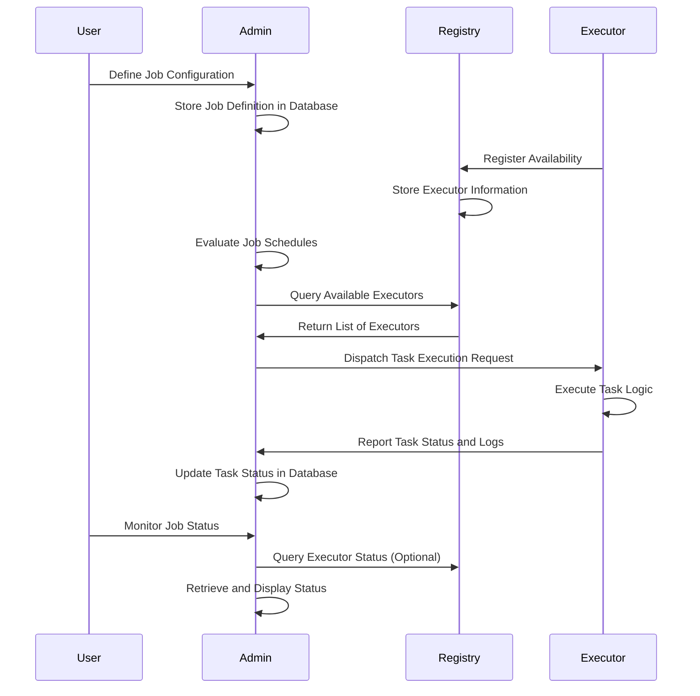
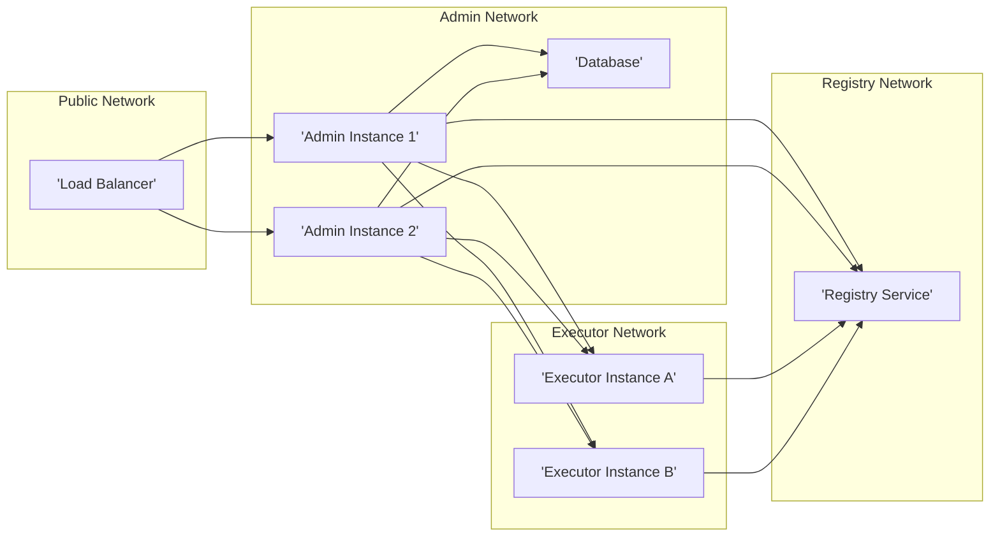

# Project Design Document: XXL-Job Distributed Task Scheduling Platform

**Version:** 1.1
**Date:** October 26, 2023
**Prepared By:** Gemini (AI Language Model)

## 1. Introduction

This document provides a detailed design overview of the XXL-Job distributed task scheduling platform. It aims to clearly articulate the system's architecture, components, data flow, and key considerations for threat modeling. This document will serve as the foundation for subsequent threat modeling activities.

### 1.1. Purpose

The primary purpose of this document is to provide a comprehensive architectural understanding of XXL-Job to facilitate effective threat modeling. It outlines the system's components, their interactions, and the data they handle, enabling security professionals to identify potential vulnerabilities and attack vectors.

### 1.2. Scope

This document covers the core components and functionalities of the XXL-Job platform as described in the provided GitHub repository. It focuses on the logical architecture and data flow, providing sufficient detail for security analysis. Specific implementation details within the code are outside the scope of this document.

### 1.3. Target Audience

This document is intended for:

* Security architects and engineers responsible for threat modeling and security assessments.
* Development teams involved in the maintenance and enhancement of XXL-Job.
* Operations teams responsible for deploying and managing XXL-Job instances.

## 2. System Overview

XXL-Job is a distributed task scheduling platform designed for enterprise-level applications. It provides a centralized management interface for scheduling, executing, and monitoring tasks across a distributed environment.

### 2.1. High-Level Architecture

The system comprises three main components:

* **Admin (调度中心):** The central management console responsible for job definition, scheduling, monitoring, and administration.
* **Executor (执行器):**  The worker nodes that execute the scheduled tasks. Multiple executors can be deployed across different machines or containers.
* **Registry (注册中心):**  A service discovery mechanism that allows the Admin to locate available Executors and Executors to register their availability.

### 2.2. Key Features

* Centralized Management: A web-based interface for managing all aspects of job scheduling.
* Visualized Scheduling: Provides a calendar-based view for scheduling tasks.
* Rich Task Types: Supports various task execution modes (e.g., Java, Shell, Python).
* High Availability: The Admin component can be clustered for redundancy.
* Load Balancing: Distributes tasks across available Executors.
* Fault Tolerance: Handles Executor failures and retries tasks.
* Monitoring and Alerting: Provides real-time monitoring of task execution and supports alerting mechanisms.

## 3. Component Details

This section provides a detailed description of each core component.

### 3.1. Admin (调度中心)

* **Responsibilities:**
    * Job Definition: Allows users to define job configurations, including cron expressions, task handlers (e.g., fully qualified class names, script paths), and task parameters (e.g., JSON strings, command-line arguments).
    * Job Scheduling: Manages the scheduling of jobs based on defined triggers, persisting schedule information and next execution times.
    * Executor Management: Discovers and manages available Executors through the Registry, maintaining a list of active Executors and their metadata.
    * Task Dispatching: Assigns tasks to available Executors based on configured load balancing strategies (e.g., round-robin, consistent hashing).
    * Monitoring: Tracks the status of running and completed tasks, including execution start and end times, execution results, and error messages.
    * Logging: Records system events (e.g., job creation, scheduling decisions) and task execution logs received from Executors.
    * Alerting: Triggers notifications (e.g., email, SMS) based on predefined conditions (e.g., task failures, missed schedules).
    * User Authentication and Authorization: Manages user access and permissions, typically using role-based access control (RBAC).
    * API Endpoints: Provides APIs (often RESTful) for external systems to interact with the scheduler, such as triggering jobs or retrieving job status.

* **Key Technologies:** Typically built using a Java framework (e.g., Spring Boot), a relational database (e.g., MySQL) for persistent storage, a web server (e.g., Tomcat, Jetty), and potentially a message queue for asynchronous communication.

### 3.2. Executor (执行器)

* **Responsibilities:**
    * Task Execution: Receives task execution requests from the Admin, deserializes task parameters, and executes the defined task logic using configured handlers.
    * Status Reporting: Reports the status of task execution (e.g., running, success, failure, progress) and execution logs back to the Admin, often using HTTP or RPC calls.
    * Health Check: Provides a mechanism (e.g., a dedicated API endpoint) for the Admin to check the Executor's health and availability.
    * Resource Management: Manages the resources (e.g., CPU, memory) required for task execution, potentially using mechanisms to limit resource consumption per task.
    * Logging: Records detailed logs related to task execution, including timestamps, input parameters, and output.
    * Registration: Registers its availability (including its address, application name, and potentially resource capacity) with the Registry upon startup and periodically to maintain its presence.

* **Key Technologies:** Can be implemented using various programming languages and frameworks depending on the task requirements (e.g., Java, Python, Go). Typically includes a communication mechanism (e.g., HTTP client, RPC framework) to interact with the Admin and Registry.

### 3.3. Registry (注册中心)

* **Responsibilities:**
    * Service Discovery: Maintains a dynamic list of available Executors and their network addresses, allowing the Admin to discover and select appropriate Executors for task execution.
    * Health Monitoring: Periodically checks the health of registered Executors, often using heartbeat mechanisms, and removes unhealthy Executors from the available list.
    * Notification: Notifies the Admin about changes in Executor availability (e.g., new Executors joining, existing Executors going offline).

* **Key Technologies:** Can be implemented using various service discovery technologies like ZooKeeper, Eureka, Consul, or a custom database-backed solution. The choice of technology impacts factors like consistency, availability, and partition tolerance.

## 4. Data Flow

This section describes the typical flow of data within the XXL-Job system.

* **Job Definition:**
    * User defines a job configuration (cron expression, handler information, parameters) through the Admin's web interface.
    * Admin serializes the job definition and stores it in its database.

* **Executor Registration:**
    * An Executor starts up and sends a registration request (containing its address and metadata) to the Registry.
    * Registry stores the Executor's information, associating it with a unique identifier.

* **Task Scheduling and Dispatch:**
    * The Admin's scheduler component periodically evaluates the defined job schedules.
    * When a job is due to run, the Admin queries the Registry for a list of available and healthy Executors.
    * Admin applies a load balancing algorithm to select an appropriate Executor.
    * Admin serializes the task execution request (including job ID, handler information, and parameters) and sends it to the selected Executor, typically over HTTP or using an RPC mechanism.

* **Task Execution:**
    * The Executor receives the task execution request, deserializes the task details, and invokes the configured task handler.
    * The Executor executes the defined task logic, potentially interacting with external systems or databases.
    * The Executor logs detailed information about the execution process.

* **Status Reporting:**
    * The Executor sends status updates (e.g., "RUNNING," "SUCCESS," "FAILED," along with progress information and execution results) and execution logs back to the Admin, often using asynchronous communication.
    * Admin receives the status update and logs, and updates the task status in its database.

* **Monitoring:**
    * Users can view the real-time status of jobs and Executors through the Admin's web interface.
    * Admin retrieves task and Executor information from its database and the Registry to display in the UI.

## 5. Security Considerations

This section outlines potential security considerations relevant for threat modeling, categorized for clarity.

* **Authentication and Authorization:**
    * **Admin Access:**
        * **Threat:** Unauthorized access to the Admin console could lead to malicious job creation, modification, or deletion, and exposure of sensitive job data.
        * **Considerations:** Implement strong authentication mechanisms (e.g., username/password with strong password policies, multi-factor authentication). Enforce role-based access control (RBAC) to restrict access to specific functionalities based on user roles. Secure the session management to prevent session hijacking.
    * **Executor Authentication:**
        * **Threat:** Rogue Executors could register with the Admin, potentially executing malicious tasks or disrupting legitimate task execution.
        * **Considerations:** Implement mechanisms for the Admin to authenticate Executors, such as shared secrets, TLS client certificates, or API keys. Ensure secure storage and management of these credentials.
    * **API Security:**
        * **Threat:** Unauthorized access to Admin APIs could allow external systems to manipulate jobs or retrieve sensitive information.
        * **Considerations:** Secure API endpoints using authentication (e.g., API keys, OAuth 2.0) and authorization. Implement rate limiting and input validation to prevent abuse.

* **Data Security:**
    * **Data in Transit:**
        * **Threat:** Sensitive data (e.g., job parameters, execution logs) transmitted between components could be intercepted.
        * **Considerations:** Enforce TLS/SSL encryption for all communication channels between the Admin, Executors, and Registry.
    * **Data at Rest:**
        * **Threat:** Sensitive data stored in the Admin's database could be compromised if the database is breached.
        * **Considerations:** Encrypt sensitive data at rest in the database (e.g., job parameters containing credentials). Implement proper access controls and auditing for the database.
    * **Logging Security:**
        * **Threat:** Logs might contain sensitive information and could be targeted for unauthorized access or tampering.
        * **Considerations:** Secure log storage with appropriate access controls. Consider encrypting log data. Implement log integrity checks to detect tampering.

* **Input Validation:**
    * **Job Definition:**
        * **Threat:** Malicious users could inject code or commands into job configurations (e.g., through task parameters or handler definitions), leading to remote code execution on Executors.
        * **Considerations:** Implement strict input validation and sanitization for all job configuration parameters. Use parameterized queries to prevent SQL injection. Avoid directly executing arbitrary code provided in job definitions; instead, use predefined and controlled handlers.
    * **Executor Input:**
        * **Threat:** If Executors directly receive external input, vulnerabilities could be exploited.
        * **Considerations:** Minimize direct external input to Executors. If necessary, implement rigorous input validation and sanitization within the Executor.

* **Network Security:**
    * **Network Segmentation:**
        * **Threat:** If components are on the same network segment, a compromise of one component could lead to lateral movement and compromise of others.
        * **Considerations:** Deploy the Admin, Executors, and Registry in separate network segments with appropriate firewall rules to restrict communication to only necessary ports and protocols.
    * **Firewall Rules:**
        * **Threat:** Misconfigured firewall rules could allow unauthorized access to components.
        * **Considerations:** Implement strict firewall rules allowing only necessary inbound and outbound traffic for each component.

* **Dependency Management:**
    * **Threat:** Vulnerabilities in third-party libraries used by the Admin and Executors could be exploited.
        * **Considerations:** Maintain an inventory of all dependencies. Regularly scan dependencies for known vulnerabilities and update them promptly.

* **Registry Security:**
    * **Threat:** Unauthorized access to the Registry could allow attackers to manipulate Executor information, potentially redirecting tasks to malicious nodes.
        * **Considerations:** Secure access to the Registry using authentication and authorization mechanisms provided by the chosen Registry technology.

* **Task Execution Security:**
    * **Threat:** Malicious tasks could consume excessive resources, interfere with other tasks, or compromise the Executor host.
        * **Considerations:** Implement resource limits for task execution (e.g., CPU, memory). Consider using containerization or sandboxing technologies to isolate task execution environments.

* **Monitoring and Alerting Security:**
    * **Threat:** Unauthorized access to monitoring and alerting systems could expose sensitive operational data or allow attackers to disable alerts.
        * **Considerations:** Secure access to monitoring and alerting dashboards and configuration interfaces.

## 6. Deployment Architecture (Typical)

A typical deployment of XXL-Job involves:

* **Admin Instance(s):** Deployed on one or more servers or containers, potentially behind a load balancer for high availability. Requires access to a dedicated database instance.
* **Executor Instances:** Deployed on multiple servers or containers where the actual tasks will be executed. These need network connectivity to the Admin and Registry. Consider deploying Executors closer to the resources they need to access for task execution.
* **Registry Instance(s):** Deployed on separate infrastructure, potentially clustered for high availability and fault tolerance. The specific deployment depends on the chosen Registry technology (e.g., a ZooKeeper ensemble, a cluster of Eureka servers).
* **Database:** A relational database (e.g., MySQL, PostgreSQL) used by the Admin to store job definitions, execution history, user information, and scheduler state.
* **Network Infrastructure:** A secure network infrastructure allowing communication between all components, with appropriate firewall rules and potentially VPNs or private networks for enhanced security.

## 7. Assumptions and Constraints

* **Network Connectivity:** It is assumed that there is reliable and secure network connectivity between all components, potentially utilizing private networks or VPNs.
* **Security Best Practices:** It is assumed that standard security best practices are followed during deployment, configuration, and operation of the infrastructure and application.
* **GitHub Repository Accuracy:** The design is based on the understanding of the system derived from the provided GitHub repository and general knowledge of distributed task scheduling systems.
* **No Direct External Access to Executors:** It is assumed that Executors are not directly exposed to the public internet and only communicate with the Admin and Registry within the internal network.

## 8. Future Considerations

* **Enhanced Security Features:** Exploring more advanced security features like end-to-end encryption for task data, including parameters and execution results. Implementing features like code signing for task handlers.
* **Integration with Security Tools:** Integrating with security information and event management (SIEM) systems for centralized logging, monitoring, and threat detection. Integrating with vulnerability scanning tools for automated security assessments.
* **Fine-grained Authorization:** Implementing more granular authorization controls for job management and execution, allowing for more precise control over who can manage specific jobs or access specific execution logs.
* **Audit Logging:** Implementing comprehensive audit logging for all security-related events, such as login attempts, job modifications, and permission changes.

This document provides a comprehensive and improved design overview of the XXL-Job platform, providing a solid foundation for effective threat modeling. The detailed descriptions of components, data flow, and security considerations will enable security professionals to identify potential vulnerabilities and develop appropriate mitigation strategies.
