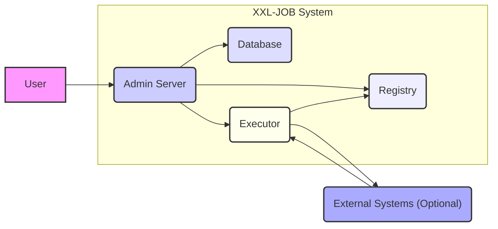
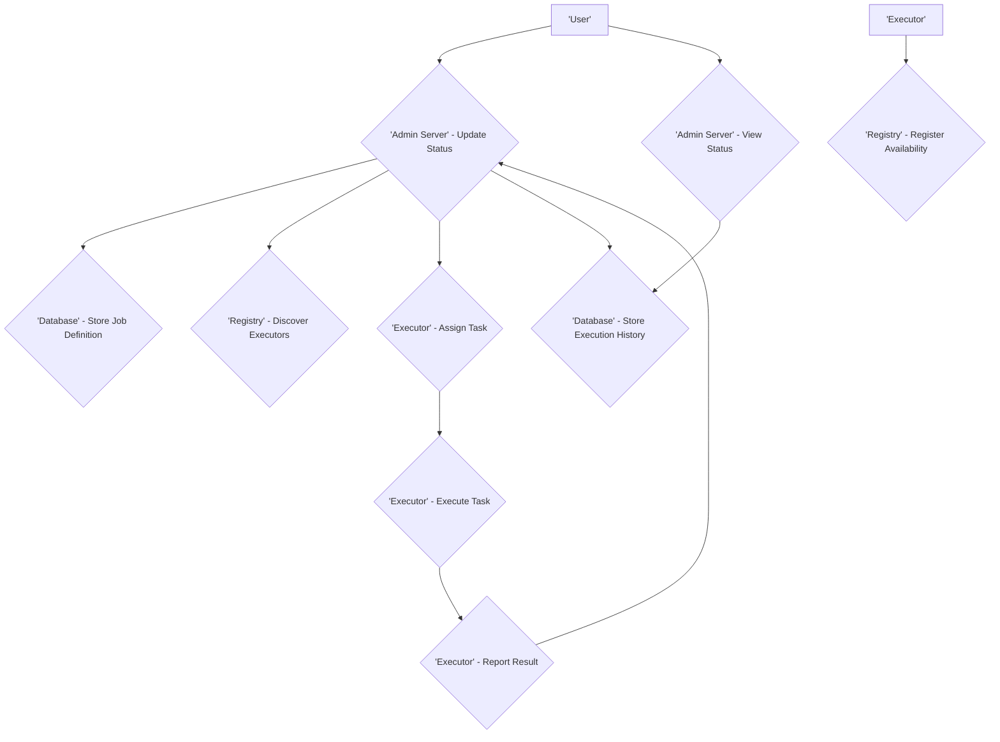

# Project Design Document: XXL-JOB Distributed Task Scheduling Platform

**Version:** 1.1
**Date:** October 26, 2023
**Prepared By:** AI Software Architect

## 1. Introduction

This document provides a detailed architectural design of the XXL-JOB distributed task scheduling platform (as represented by the GitHub repository: https://github.com/xuxueli/xxl-job). This document serves as a foundation for understanding the system's components, interactions, and data flow, which is crucial for subsequent threat modeling activities. The information presented here is based on the publicly available source code and documentation.

### 1.1. Purpose

The primary purpose of this document is to provide a comprehensive architectural overview of XXL-JOB to facilitate effective threat modeling. It outlines the key components, their functionalities, interactions, and the data they handle.

### 1.2. Scope

This document covers the core architectural components of the XXL-JOB platform, including the Admin Server, Executor, and Registry. It describes their roles, responsibilities, and communication patterns. It focuses on the logical architecture and does not delve into specific implementation details beyond what is necessary for understanding the system's behavior.

### 1.3. Target Audience

This document is intended for security engineers, threat modelers, developers, and operations personnel who need to understand the architecture of XXL-JOB for security analysis and operational purposes.

## 2. System Overview

XXL-JOB is a distributed task scheduling platform designed for enterprise-level job management. It consists of a central administration console and distributed executors that execute the scheduled tasks.

### 2.1. Key Components

*   **Admin Server:** The central control panel for managing and monitoring scheduled jobs. It provides a web-based UI for defining jobs, configuring executors, viewing execution logs, and managing the overall system.
*   **Executor:**  The worker nodes responsible for executing the actual tasks. Executors register themselves with the Admin Server and poll for tasks to execute.
*   **Registry (or Registry Center):**  A mechanism for executors to register their availability and for the Admin Server to discover available executors. This is often implemented using a database or a dedicated service like ZooKeeper or Redis.
*   **Database:**  Used by the Admin Server to persist job definitions, execution history, executor information, and other system metadata.

### 2.2. High-Level Architecture

The system follows a client-server architecture with the Admin Server acting as the central server and the Executors as clients.

*   The Admin Server provides a web interface for users to manage jobs.
*   Executors connect to the Admin Server (or the Registry) to register their presence.
*   The Admin Server assigns tasks to available Executors.
*   Executors execute the assigned tasks and report the results back to the Admin Server.

## 3. Component Details

### 3.1. Admin Server

*   **Functionality:**
    *   Provides a web-based UI for job management (creation, modification, deletion, manual triggering).
    *   Manages executor registration and discovery.
    *   Schedules job execution based on configured cron expressions or other triggers.
    *   Monitors job execution status and provides logs.
    *   Handles user authentication and authorization for accessing the UI and managing jobs.
    *   Persists system configuration, job definitions, and execution history in the database.
    *   Provides API endpoints for executors to communicate (e.g., reporting task completion).
*   **Technology Stack (Inferred):**
    *   Java (based on the GitHub repository)
    *   Spring Boot (likely framework)
    *   Thymeleaf (likely for UI templating)
    *   A relational database (e.g., MySQL, PostgreSQL)
    *   Potentially a caching mechanism (e.g., Redis)
*   **Key Interactions:**
    *   Interacts with the Database for persistent storage.
    *   Communicates with Executors to assign tasks and receive execution results.
    *   Interacts with the Registry to discover available Executors.
    *   Provides a web interface for user interaction.
*   **Data Handled:**
    *   User credentials (for authentication).
    *   Job definitions (including cron expressions, parameters, and associated handler information).
    *   Executor registration information (IP address, port, application name).
    *   Job execution history (start time, end time, status, logs).
    *   System configuration settings.

### 3.2. Executor

*   **Functionality:**
    *   Registers itself with the Admin Server (or the Registry) upon startup.
    *   Polls the Admin Server for tasks to execute.
    *   Executes the assigned tasks based on the configured handler.
    *   Reports the execution status and logs back to the Admin Server.
    *   Provides a mechanism for the Admin Server to remotely trigger task execution.
*   **Technology Stack (Inferred):**
    *   Java (based on the GitHub repository)
    *   Potentially Spring Boot or a similar framework.
    *   Networking libraries for communication.
*   **Key Interactions:**
    *   Communicates with the Admin Server to register, poll for tasks, and report results.
    *   May interact with external systems or resources to perform the actual task.
*   **Data Handled:**
    *   Task execution parameters received from the Admin Server.
    *   Execution logs generated during task execution.
    *   Potentially sensitive data processed during task execution (depending on the nature of the job).

### 3.3. Registry (or Registry Center)

*   **Functionality:**
    *   Provides a central repository for Executors to register their availability.
    *   Allows the Admin Server to discover available Executors.
    *   May provide health check mechanisms for registered Executors.
*   **Technology Stack (Examples):**
    *   Database (e.g., MySQL, PostgreSQL)
    *   ZooKeeper
    *   Redis
*   **Key Interactions:**
    *   Executors register their information with the Registry.
    *   The Admin Server queries the Registry to find available Executors.
*   **Data Handled:**
    *   Executor registration information (IP address, port, application name, last heartbeat).

### 3.4. Database

*   **Functionality:**
    *   Persists data for the Admin Server.
*   **Technology Stack (Examples):**
    *   MySQL
    *   PostgreSQL
    *   Other relational databases.
*   **Key Interactions:**
    *   The Admin Server reads and writes data to the database.
*   **Data Handled:**
    *   User credentials.
    *   Job definitions.
    *   Executor registration information.
    *   Job execution history and logs.
    *   System configuration.

## 4. Data Flow

The following outlines the typical data flow within the XXL-JOB system:

1. **Job Definition:** A user creates or updates a job definition through the Admin Server's web UI. This information is stored in the Database.
2. **Executor Registration:** An Executor starts up and registers its availability with the Registry (or directly with the Admin Server, depending on configuration).
3. **Task Scheduling:** The Admin Server's scheduler evaluates job triggers (e.g., cron expressions).
4. **Task Assignment:** When a job is due for execution, the Admin Server selects an available Executor from the Registry (or its internal list).
5. **Task Dispatch:** The Admin Server sends the task details (including handler information and parameters) to the selected Executor.
6. **Task Execution:** The Executor executes the task based on the received information. This may involve interacting with external systems.
7. **Result Reporting:** The Executor reports the execution status (success, failure) and logs back to the Admin Server.
8. **Status Update:** The Admin Server updates the job execution history in the Database with the received status and logs.
9. **Monitoring:** Users can view job execution status and logs through the Admin Server's web UI, which retrieves this information from the Database.

## 5. Security Considerations (Initial)

Based on the architecture, some initial security considerations include:

*   **Authentication and Authorization:** Secure access to the Admin Server's web UI and API endpoints is crucial. Proper authentication mechanisms (e.g., username/password, API keys) and authorization controls are necessary to prevent unauthorized access and modification of jobs.
*   **Communication Security:** Communication between the Admin Server and Executors should be secured to prevent eavesdropping and tampering. This might involve using TLS/SSL for network communication.
*   **Data Security:** Sensitive data stored in the Database (e.g., user credentials, job parameters) needs to be protected through encryption at rest and in transit.
*   **Input Validation:** The Admin Server should validate user inputs to prevent injection attacks (e.g., SQL injection, cross-site scripting).
*   **Executor Security:**  Executors should be properly secured to prevent malicious actors from compromising them and potentially gaining access to other parts of the system or executing arbitrary code.
*   **Registry Security:** If a separate Registry service is used, its security is critical as it's a central point for executor discovery. Unauthorized access could lead to denial of service or redirection of tasks.
*   **Dependency Management:** Ensuring the security of third-party libraries and dependencies used by all components is important to prevent known vulnerabilities from being exploited.

## 6. Assumptions and Constraints

*   This design document is based on the publicly available information in the GitHub repository. Specific implementation details might vary.
*   The focus is on the core architectural components. Additional features or extensions might exist but are not explicitly covered here.
*   The security considerations listed are initial observations and require further detailed analysis during the threat modeling process.
*   The specific technology stack used for each component might vary depending on the deployment environment and configuration.

## 7. Future Considerations

This design document provides a foundation for understanding the XXL-JOB architecture. Future iterations could include:

*   More detailed diagrams illustrating component interactions and data flow.
*   Specific deployment scenarios and their architectural implications.
*   Detailed security controls and best practices for each component.
*   Consideration of scalability and high-availability aspects.

This document serves as a starting point for a deeper understanding of the XXL-JOB platform and will be valuable for conducting thorough threat modeling activities.
