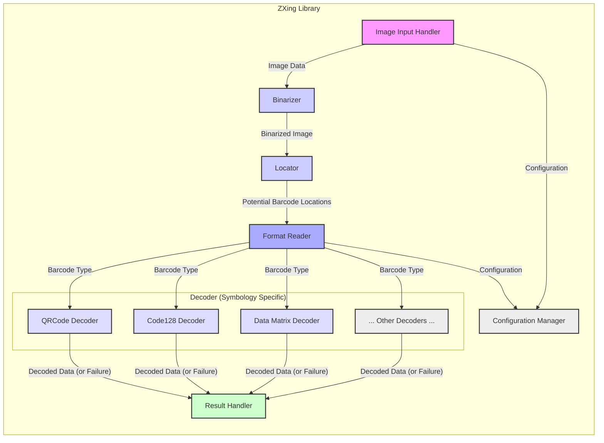
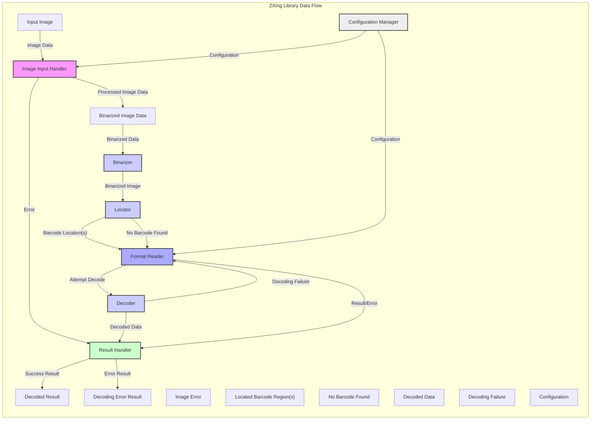

# Project Design Document: ZXing Barcode Scanning Library

**Version:** 1.1
**Date:** October 26, 2023
**Author:** AI Software Architect

## 1. Introduction

This document provides an enhanced architectural design of the ZXing (Zebra Crossing) barcode scanning library, building upon the previous version. This design will serve as a more detailed foundation for future threat modeling activities, enabling security professionals to identify potential vulnerabilities and attack vectors with greater precision. This document continues to focus on the core logical architecture and data flow, abstracting away specific platform implementations where possible, while adding more granularity.

### 1.1. Purpose

The primary purpose of this document is to provide a clear, concise, and more detailed overview of the ZXing architecture and data flow to facilitate effective and granular threat modeling. It aims to provide a comprehensive understanding of the system's components, their interactions, the data they process, and potential error conditions.

### 1.2. Scope

This document covers the core logical architecture of the ZXing library with increased detail, including:

*   Key components involved in barcode decoding, broken down further.
*   The flow of data through the system, including error handling paths.
*   Major interfaces and interactions between components.
*   Consideration of configuration and customization points.

This document still does *not* cover:

*   Specific platform implementations (e.g., Android, iOS, Java SE) in detail, but acknowledges interaction points.
*   Detailed code-level implementation specifics.
*   Specific build processes or deployment strategies.
*   The history of the project or individual contributor details.

### 1.3. Goals

The goals of this enhanced design document are to:

*   Provide a clear and concise overview of the ZXing architecture with greater detail in component responsibilities.
*   Identify key components and their specific responsibilities, including variations based on barcode type.
*   Illustrate the data flow within the library, explicitly showing error conditions.
*   Serve as a more robust basis for identifying potential security threats and vulnerabilities at a finer level of detail.

## 2. Overview

ZXing is a multi-format 1D/2D barcode image processing library implemented in Java, with ports to other languages. Its primary function is to decode barcodes from images. The library takes an image as input and attempts to identify and decode any supported barcode formats present within that image. The output is the decoded data contained within the barcode, or an indication of failure.

## 3. Architectural Design

The ZXing library can be conceptually divided into several key logical components that work together to achieve barcode decoding. This version provides a more granular view of the Decoder component.

### 3.1. Key Components

*   **Image Input Handler:** This component is responsible for receiving and processing the input image. It handles various image formats and prepares the image data for further processing. This may involve format conversion, resizing, and error checking on the input image data.
*   **Binarizer:** The binarizer converts the grayscale image into a black and white bitmap. This step is crucial for simplifying the image and making barcode patterns more distinct. Different binarization algorithms may be employed depending on the image quality and characteristics.
*   **Locator:** This component attempts to locate potential barcode patterns within the binarized image. It uses algorithms specific to different barcode symbologies to identify finder patterns, alignment patterns, and other characteristic features.
*   **Decoder (Symbology Specific):** This is a set of sub-components, each responsible for decoding a specific barcode symbology. Examples include:
    *   **QRCode Decoder:** Decodes QR Code barcodes.
    *   **Code128 Decoder:** Decodes Code 128 barcodes.
    *   **Data Matrix Decoder:** Decodes Data Matrix barcodes.
    *   **(and so on for other supported formats)**
    Each decoder implements the specific decoding logic for its respective symbology.
*   **Format Reader:** This component acts as a high-level orchestrator, trying different barcode formats on the input image until a successful decode occurs or all formats have been attempted. It utilizes the Locator and the appropriate Decoder component for each format.
*   **Result Handler:** Once a barcode is successfully decoded, the Result Handler formats the decoded data and makes it available to the calling application. This may involve character set conversion or other post-processing steps. It also handles cases where decoding fails, providing error information.
*   **Configuration Manager:** This component manages configurable parameters of the decoding process, such as supported barcode formats, hints for decoding, and other options.

### 3.2. Component Diagram

### 3.3. Data Flow

The typical data flow within the ZXing library, including potential error paths, follows these steps:

1. An image containing a potential barcode is provided as input to the **Image Input Handler**.
2. The **Image Input Handler** processes the image, potentially performing operations like resizing or format conversion. If the image is invalid or unsupported, an error is reported to the **Result Handler**.
3. The processed image data is passed to the **Binarizer**.
4. The **Binarizer** converts the grayscale image data into a binary (black and white) bitmap. If binarization fails, an error is potentially reported (though less common at this stage).
5. The **Format Reader** initiates the decoding process, potentially guided by configurations from the **Configuration Manager**. It selects a barcode format to attempt.
6. The **Locator** attempts to find the barcode pattern within the binarized image, specific to the format being tried. If no pattern is found, the **Format Reader** may try another format.
7. If a barcode is located, the appropriate **Decoder** (e.g., QRCode Decoder) interprets the encoded data.
8. If decoding is successful, the decoded data is passed to the **Result Handler**.
9. If decoding fails (due to invalid data, corruption, etc.), the **Result Handler** is notified of the failure. The **Format Reader** may attempt to decode the image using a different barcode format, returning to step 6.
10. The **Result Handler** formats the decoded data (on success) or the error information (on failure) and returns it as the output of the library.

### 3.4. Data Flow Diagram

## 4. Security Considerations (For Threat Modeling)

Building upon the initial considerations, here are more specific areas of security concern for threat modeling:

*   **Image Input Handling:**
    *   **Format String Bugs:** Vulnerabilities in image parsing libraries (e.g., handling EXIF data) could lead to format string bugs and potential code execution.
    *   **Buffer Overflows:** Processing large or malformed image headers could lead to buffer overflows.
    *   **Denial of Service (DoS):**  Processing excessively large or complex images could consume excessive resources, leading to DoS.
*   **Binarization:**
    *   **Algorithm Manipulation:**  Crafted images could exploit weaknesses in specific binarization algorithms to prevent correct decoding or cause unexpected behavior.
*   **Locator:**
    *   **Pattern Confusion:** Attackers might craft images with patterns that mimic barcode finder patterns, causing the locator to identify false positives or consume excessive processing time.
*   **Decoder (Symbology Specific):**
    *   **Buffer Overflows:**  Vulnerabilities in the decoding logic for specific barcode formats (e.g., handling variable-length fields) could lead to buffer overflows.
    *   **Integer Overflows:** Calculations within the decoding algorithms could be susceptible to integer overflows, leading to incorrect decoding or crashes.
    *   **Logic Errors:** Flaws in the decoding logic could allow for the creation of malicious barcodes that, when scanned, produce unexpected or harmful output.
    *   **Injection Vulnerabilities:** If decoded data is used without proper sanitization in downstream applications, it could lead to injection vulnerabilities (e.g., SQL injection if the decoded data is used in a database query).
*   **Result Handling:**
    *   **Lack of Output Sanitization:** If the decoded data is not properly sanitized, it could lead to cross-site scripting (XSS) or other injection vulnerabilities in applications using the library.
*   **Configuration Manager:**
    *   **Insecure Defaults:** Default configurations might enable the processing of potentially vulnerable or less secure barcode formats.
    *   **Configuration Injection:** If configuration parameters can be influenced by external input without proper validation, it could lead to unexpected behavior or vulnerabilities.
*   **Dependencies:**
    *   **Third-Party Vulnerabilities:** The library may rely on other external libraries, which themselves could contain vulnerabilities that could be exploited.

## 5. Assumptions and Constraints

*   The primary input to the library is an image.
*   The library is designed to be embedded within other applications and its execution environment is controlled by the host application.
*   The library supports a variety of 1D and 2D barcode formats, and the level of security for each format might vary.
*   Performance is a consideration in the design of the algorithms, which might lead to trade-offs with security in certain areas.
*   The library aims for platform-agnostic core logic, but platform-specific wrappers introduce platform-dependent assumptions and potential vulnerabilities.
*   The library relies on the integrity of the input image data.

## 6. Future Considerations

*   A detailed threat model should be created based on this design document, analyzing each component and data flow for potential vulnerabilities.
*   Security testing, including fuzzing and static analysis, should be performed on the codebase, particularly within the Decoder components for each symbology.
*   A review of third-party dependencies should be conducted to identify and mitigate potential vulnerabilities.
*   Consideration should be given to implementing security best practices, such as input validation and output sanitization, at each stage of the process.
*   Further analysis of the Configuration Manager and its potential attack surface is warranted.

This enhanced document provides a more detailed understanding of the ZXing library's architecture, offering a stronger foundation for comprehensive threat modeling activities. The increased granularity in component descriptions and the explicit inclusion of error handling paths will aid in identifying a wider range of potential security vulnerabilities.
