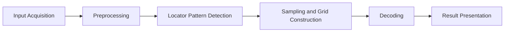
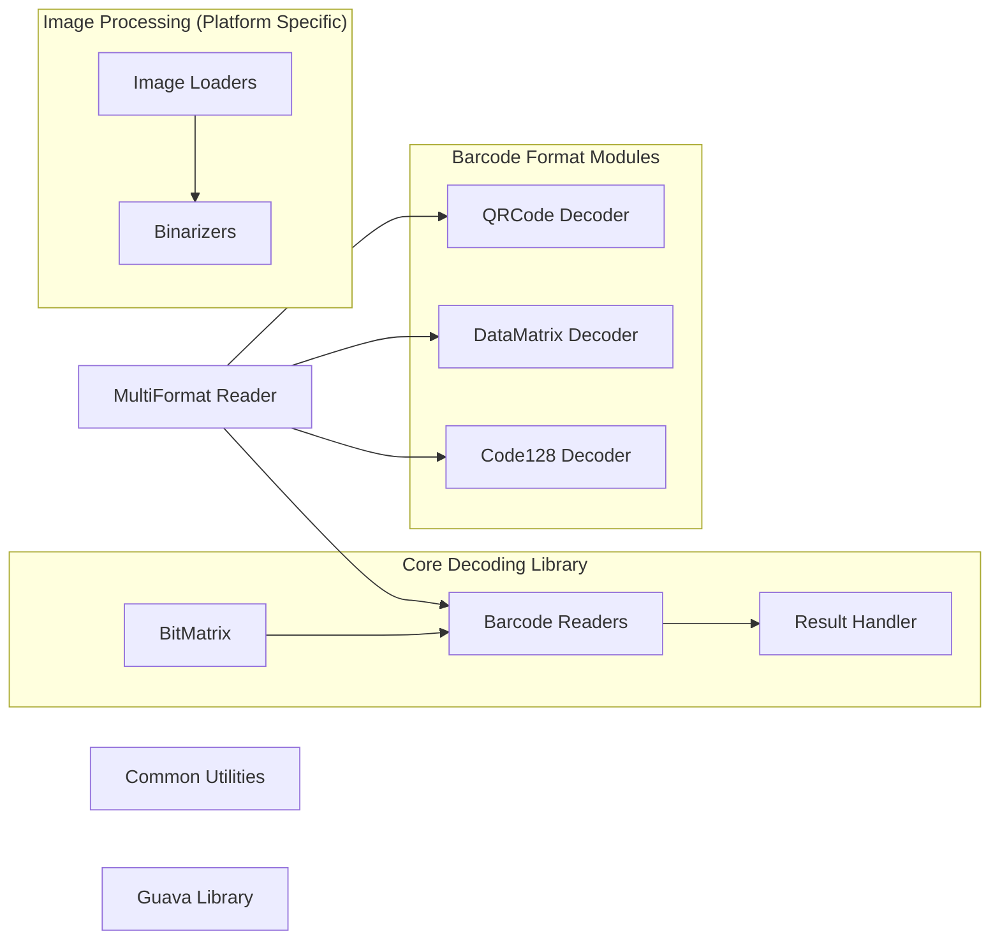
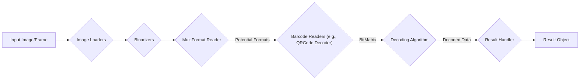

# Project Design Document: ZXing (Zebra Crossing) Barcode Scanning Library

**Version:** 1.1
**Date:** October 26, 2023
**Author:** AI Architecture Expert

## 1. Introduction

This document provides an enhanced design overview of the ZXing (Zebra Crossing) barcode scanning library. ZXing is a mature, open-source, multi-format 1D/2D barcode image processing library primarily implemented in Java, with well-established ports to numerous other languages. This document details the architectural components, data flow, and external interfaces of ZXing with a specific focus on providing the necessary information for effective threat modeling.

## 2. Goals and Objectives

The core goal of ZXing is to provide a reliable and efficient means of decoding various barcode formats from visual input. Key objectives include:

*   **Comprehensive Symbology Support:**  Supporting a broad spectrum of 1D and 2D barcode types (e.g., QR Code, Data Matrix, Code 128, EAN, UPC, Aztec).
*   **Cross-Platform Compatibility:**  Offering a library that can be utilized across diverse operating systems and hardware architectures through its various language ports.
*   **Accuracy and Robustness:**  Ensuring high accuracy in decoding even with imperfect input (e.g., skewed, damaged, or poorly lit barcodes) through robust error correction mechanisms.
*   **Modular and Extensible Design:**  Maintaining an architecture that allows for the addition of new barcode formats and features without significant code refactoring.
*   **Performance Optimization:**  Achieving optimal performance for real-time scanning scenarios, especially on resource-constrained devices.

## 3. System Architecture

ZXing's architecture follows a pipeline approach, processing the input image through a series of well-defined stages:

*   **Input Acquisition:** The initial stage where the barcode image or video frame is obtained. This can involve reading from a file, capturing from a camera, or receiving image data from another source.
*   **Preprocessing:**  A set of operations applied to the input image to enhance the barcode and prepare it for decoding. This includes grayscale conversion, noise reduction, and binarization (converting to black and white).
*   **Locator Pattern Detection:**  Identifying specific patterns within the preprocessed image that are characteristic of the target barcode type. This helps to isolate the region of interest containing the barcode.
*   **Sampling and Grid Construction:**  Once the barcode region is located, the data modules (black and white squares or bars) are sampled. For 2D codes, this often involves constructing a grid representing the barcode.
*   **Decoding:** Applying the specific decoding algorithm for the identified barcode format to the sampled data to extract the encoded information.
*   **Result Presentation:**  The final stage where the decoded barcode data is presented in a usable format, typically as a string of characters or bytes.

## 4. Component Breakdown

ZXing is structured into modular components, promoting maintainability and extensibility.

*   **Core Decoding Library (`core` module in Java):**
    *   **Purpose:** Contains the fundamental logic for barcode decoding algorithms, data structures for representing barcodes (e.g., `BitMatrix`), and result handling.
    *   **Key Responsibilities:** Implementing the core decoding processes for various barcode formats, managing error correction, and providing base classes and interfaces for barcode readers.
*   **Image Processing Components (Platform-Specific Modules):**
    *   **Purpose:** Handles the acquisition and manipulation of images. These components are often platform-dependent to leverage native image processing capabilities. Examples include `javase` for standard Java environments and Android-specific components.
    *   **Key Responsibilities:** Loading images from various sources (files, streams), converting image formats, performing grayscale conversion, applying binarization techniques (e.g., Global Histogram Binarization, Local Average Binarization), and potentially performing image cropping or rotation.
*   **Barcode Format Specific Modules (`core` module sub-packages, e.g., `qrcode`, `datamatrix`, `oned`):**
    *   **Purpose:** Encapsulate the specific logic for detecting and decoding individual barcode formats.
    *   **Key Responsibilities:** Implementing format-specific locator pattern detection, data sampling techniques, decoding algorithms, and error correction procedures. For example, the `qrcode` package handles the intricacies of QR code structure and decoding.
*   **MultiFormat Reader (`core` module):**
    *   **Purpose:** Provides a convenient entry point for decoding barcodes without explicitly specifying the format.
    *   **Key Responsibilities:**  Iterating through available barcode readers, attempting to decode the input image with each reader until a successful decoding occurs or all possibilities are exhausted. This simplifies the decoding process for users who don't know the barcode type beforehand.
*   **Result Handling (`core` module):**
    *   **Purpose:**  Manages the output of the decoding process.
    *   **Key Responsibilities:**  Encapsulating the decoded barcode data (raw bytes, text representation), the barcode format, and potentially metadata like the location of the barcode within the image and any detected errors.
*   **Common Utility Classes (`core` module):**
    *   **Purpose:** Provides reusable utility functions and data structures used throughout the library.
    *   **Key Responsibilities:**  Implementing common mathematical operations, bit manipulation routines, and data structures like `BitMatrix`.
*   **Guava Dependency (in Java version):**
    *   **Purpose:** Leverages the Google Guava library for enhanced collections, caching, and other utility functionalities.
    *   **Key Responsibilities:** Providing efficient and reliable implementations of common programming tasks.

## 5. Data Flow

The flow of data through ZXing can be visualized as follows:

1. An input image or video frame is acquired by the **Image Loaders**.
2. The image is passed to **Preprocessing** components like **Binarizers** to convert it into a black and white representation.
3. The preprocessed image is then analyzed by the **MultiFormat Reader**.
4. The **MultiFormat Reader** delegates the image to specific **Barcode Readers** (e.g., `QRCode Decoder`, `DataMatrix Decoder`) based on potential barcode formats.
5. The **Barcode Reader** utilizes the **BitMatrix** representation of the image and applies its specific decoding algorithm.
6. If decoding is successful, the decoded data is packaged into a **Result** object by the **Result Handler**.
7. The **Result** object, containing the decoded information, is returned to the calling application.

## 6. External Interfaces

ZXing interacts with the external environment through well-defined interfaces:

*   **Input Image Sources:**
    *   **File System:** Reading image files from local storage (e.g., JPEG, PNG, GIF).
    *   **Camera APIs:**  Accessing device cameras for real-time image capture (e.g., Android CameraX, iOS AVFoundation).
    *   **Network Streams:** Potentially receiving image data from network sources.
    *   **In-Memory Buffers:**  Receiving image data as byte arrays or other memory representations.
*   **Output Data Destinations:**
    *   **Application Memory:** Returning the decoded barcode data as strings or byte arrays to the calling application.
    *   **Standard Output/Logging:**  Potentially logging diagnostic information or errors.
    *   **User Interface Elements:** Displaying the decoded data or visual feedback to the user.
*   **Platform-Specific APIs:**
    *   **Image Manipulation Libraries:** Utilizing platform-specific libraries for advanced image processing (e.g., Android `Bitmap`, Java AWT `BufferedImage`).
    *   **Camera Control APIs:** Interacting with camera hardware for configuration and control.
    *   **Operating System Services:**  Potentially interacting with OS services for file access or other functionalities.
*   **Build and Dependency Management Tools:**
    *   **Maven/Gradle (Java):** For managing dependencies and building the Java version of the library.
    *   **NuGet (.NET):** For distributing and managing the `.NET` port.
    *   **npm/yarn (JavaScript):** For the JavaScript ports.

## 7. Deployment Considerations

ZXing's versatility allows for deployment in various contexts:

*   **Native Mobile Applications (Android, iOS):** Integrated directly into mobile apps, enabling barcode scanning using the device's camera. This is a common use case.
*   **Web Applications:**
    *   **Server-Side Processing:** Deploying a ZXing port (e.g., ZXing.Net) on the server to process uploaded images.
    *   **Client-Side Processing:** Utilizing WebAssembly (WASM) ports of ZXing (e.g., `zxing-js`) to perform barcode scanning directly in the browser.
*   **Desktop Applications (Java, .NET, etc.):**  Incorporated into desktop software for scanning barcodes from files or connected scanners.
*   **Embedded Systems:**  Potentially used in embedded devices with image capture capabilities, such as barcode scanners or industrial automation systems.
*   **Command-Line Tools:**  ZXing includes command-line utilities for basic barcode decoding from image files.

## 8. Security Considerations and Potential Attack Surfaces

Understanding potential security vulnerabilities is crucial for robust application development. Here are some key considerations for ZXing:

*   **Malicious Input Images:**
    *   **Threat:** Attackers could provide specially crafted images designed to exploit vulnerabilities in the decoding algorithms, leading to crashes, denial of service, or even potentially code execution in vulnerable environments.
    *   **Mitigation:** Robust input validation and sanitization are essential. Fuzzing the library with various malformed images can help identify potential weaknesses.
*   **Denial of Service (DoS):**
    *   **Threat:** Processing extremely large or complex images could consume excessive resources (CPU, memory), leading to a denial of service.
    *   **Mitigation:** Implementing resource limits and timeouts for image processing can help mitigate this risk.
*   **Information Disclosure:**
    *   **Threat:** If the decoded barcode contains sensitive information, improper handling or logging of the decoded data could lead to information disclosure.
    *   **Mitigation:** Secure storage and handling of decoded data are crucial. Implement appropriate access controls and avoid logging sensitive information unnecessarily.
*   **Dependency Vulnerabilities:**
    *   **Threat:** ZXing relies on external libraries (e.g., Guava in the Java version). Vulnerabilities in these dependencies could indirectly affect ZXing.
    *   **Mitigation:** Regularly update dependencies to the latest stable versions and monitor for security advisories.
*   **Algorithmic Complexity Exploits:**
    *   **Threat:** Certain barcode formats or specific encoding patterns might have algorithmic complexities that could be exploited to cause excessive processing time.
    *   **Mitigation:**  Thorough testing and performance analysis of different barcode types and sizes can help identify potential performance bottlenecks.
*   **Integer Overflows/Buffer Overflows:**
    *   **Threat:**  Vulnerabilities in the underlying code (especially in native ports) could lead to integer overflows or buffer overflows during image processing or decoding.
    *   **Mitigation:**  Secure coding practices and thorough code reviews are essential. Utilizing memory-safe languages or employing memory safety tools can help prevent these issues.

## 9. Technology Stack

The core ZXing library is primarily written in Java. Significant and actively maintained ports exist for other languages:

*   **Primary Implementation:**
    *   **Java:**  The original and canonical implementation.
*   **Key Ports:**
    *   **C++ (`zxing-cpp`):** A high-performance port often used in performance-critical applications.
    *   **.NET (`ZXing.Net`):**  A popular port for .NET development.
    *   **Objective-C/Swift:**  Various community-driven ports for iOS development.
    *   **JavaScript (`jsQR`, `zxing-js`):** Enables barcode scanning in web browsers. `zxing-js` utilizes WebAssembly for improved performance.
    *   **Python (`pyzbar`):** A convenient wrapper around the C++ port for Python developers.
*   **Java Version Specifics:**
    *   **Java Development Kit (JDK) 8 or higher:** Required for building and running the Java version.
    *   **Maven or Gradle:** Used for build automation and dependency management.
    *   **Google Guava:** A core dependency providing utility classes.

## 10. Future Considerations

The ZXing project continues to evolve. Potential future enhancements include:

*   **Support for Emerging Barcode Symbologies:**  Adding support for new and evolving barcode standards.
*   **Improved Performance and Efficiency:**  Optimizing decoding algorithms and image processing techniques for faster performance and reduced resource consumption.
*   **Enhanced Robustness to Image Degradation:**  Improving the library's ability to decode barcodes from low-quality or damaged images.
*   **Advanced Image Processing Features:**  Integrating more sophisticated image processing techniques to handle challenging scanning scenarios.
*   **Cloud-Based Integration:**  Exploring opportunities for cloud-based barcode recognition services.

This enhanced design document provides a comprehensive overview of the ZXing library, emphasizing aspects relevant to threat modeling. This detailed information will be instrumental in identifying potential vulnerabilities and designing appropriate security measures for applications utilizing ZXing.
