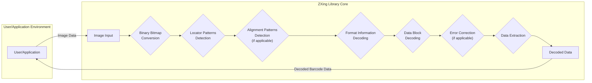

# Project Design Document: ZXing (Zebra Crossing)

**Version:** 1.1
**Date:** October 26, 2023
**Author:** AI Software Architect

## 1. Introduction

This document provides an enhanced design overview of the ZXing (Zebra Crossing) project, an open-source, multi-format 1D/2D barcode image processing library primarily implemented in Java, with ports to other languages. This document aims to provide a clear and detailed understanding of the project's architecture, key components, data flow during both decoding and encoding, and deployment models. This information is essential for conducting effective threat modeling activities.

## 2. Project Overview

ZXing is a widely adopted library for both scanning (decoding) and generating barcodes and QR codes. It boasts comprehensive support for a wide array of 1D and 2D barcode formats. While the core library is written in Java, its versatility is extended through ports to various other languages and platforms, including Android, iOS, C++, and Python, making it a truly cross-platform solution.

**Key Goals:**

* To provide a highly reliable and accurate library for barcode scanning and generation.
* To offer extensive support for a diverse range of barcode formats, catering to various industry needs.
* To ensure cross-platform compatibility through well-maintained ports to different languages and operating systems.
* To foster an active open-source community and maintain a community-driven development approach.

## 3. System Architecture

The fundamental operation of ZXing for decoding can be visualized as a processing pipeline. It accepts an image as input and culminates in the output of decoded barcode data. The architecture is intentionally modular, facilitating the addition of support for new barcode formats and the integration of advanced decoding algorithms. The encoding process, while not explicitly shown in the diagram, follows a reverse logic.

**Key Architectural Components (Decoding):**

* **"Image Input":** This component is responsible for receiving the image data containing the barcode. The source of this image can vary, including camera feeds, static image files, or in-memory image buffers.
* **"Binary Bitmap Conversion":** The input image is transformed into a binary bitmap representation. This process typically involves thresholding techniques to distinguish between the dark and light modules of the barcode.
* **"Locator Patterns Detection":** This crucial step involves identifying distinctive patterns within the bitmap that aid in locating the barcode. Examples include the finder patterns in QR codes or the guard bars in linear barcodes.
* **"Alignment Patterns Detection (if applicable)":** For certain 2D barcode formats like QR codes, this component identifies alignment patterns. These patterns are used to correct for perspective distortions and ensure accurate decoding.
* **"Format Information Decoding":** Information about the specific barcode format, the error correction level being used, and other relevant metadata encoded within the barcode itself is decoded in this stage.
* **"Data Block Decoding":** The core data encoded within the barcode is decoded based on the identified format. This involves interpreting the arrangement of black and white modules according to the rules of the specific barcode symbology.
* **"Error Correction (if applicable)":**  Error correction algorithms are applied to recover data in cases where the barcode is partially damaged or obscured. The availability and type of error correction depend on the barcode format.
* **"Data Extraction":** The final step in the decoding pipeline, where the raw decoded data is extracted from the processed data blocks.
* **"Decoded Data":** The ultimate output of the decoding process, typically a string representing the information encoded within the barcode.

## 4. Component Details

This section provides a more granular description of the key components within the ZXing project, categorized by their primary implementation language.

* **`core` (Java):**
    * **Description:** The foundational Java library containing the core logic for both decoding and encoding a wide variety of barcode formats. It serves as the central engine of the ZXing project.
    * **Key Responsibilities:**
        * Implementing the intricate decoding algorithms for numerous 1D and 2D barcode symbologies.
        * Providing robust image processing and bitmap manipulation capabilities.
        * Offering a platform-agnostic API for barcode processing, ensuring portability.
    * **Key Sub-components:**
        * `com.google.zxing`: The root package, housing core interfaces and fundamental classes used throughout the library.
        * `com.google.zxing.common`: Contains essential utility classes for bitmap handling, mathematical operations, and error correction procedures.
        * `com.google.zxing.oned`: Dedicated classes for processing and decoding various 1D barcode formats.
        * `com.google.zxing.qrcode`: Classes specifically designed for handling the complexities of the QR code format.
        * `com.google.zxing.datamatrix`:  Implements the logic for decoding and encoding Data Matrix barcodes.
        * `com.google.zxing.pdf417`:  Handles the specifics of the PDF417 barcode format.
        * `com.google.zxing.aztec`:  Provides support for the Aztec barcode format.
        * `com.google.zxing.client.j2se`: Includes Java SE specific utilities, such as a command-line interface for basic operations.

* **`android`:**
    * **Description:**  The Android-specific adaptation of the ZXing library, tailored for seamless integration with the Android operating system's features.
    * **Key Responsibilities:**
        * Providing ready-to-use Android `View` components that simplify the integration of barcode scanning functionality into Android applications.
        * Managing camera access and preview functionalities through Android's camera APIs.
        * Leveraging Android's built-in image processing capabilities for efficient barcode processing.
        * Offering convenient Intents for launching dedicated barcode scanning activities within Android applications.

* **`ios`:**
    * **Description:** The iOS-specific port of the ZXing library, designed to leverage Apple's frameworks for camera interaction and image manipulation.
    * **Key Responsibilities:**
        * Providing iOS `UIView` components that enable developers to easily embed barcode scanning into their iOS applications.
        * Handling camera access using the `AVFoundation` framework, ensuring proper integration with the iOS camera system.
        * Utilizing iOS's image processing capabilities for optimal performance on Apple devices.

* **`cpp`:**
    * **Description:** A high-performance C++ port of the ZXing library, offering significant performance advantages and the ability to integrate with native applications where speed is critical.
    * **Key Responsibilities:**
        * Implementing the core decoding and encoding logic in C++ for maximum efficiency.
        * Providing a native C++ API for direct interaction with the library's functionalities.

* **`python`:**
    * **Description:** A Python wrapper around the core Java library, allowing Python developers to leverage ZXing's powerful features within their Python projects.
    * **Key Responsibilities:**
        * Presenting a Pythonic and user-friendly interface to the underlying ZXing library.
        * Managing the complexities of the JNI (Java Native Interface) bridge, enabling seamless communication with the Java core.

* **`javascript`:**
    * **Description:** A JavaScript implementation of ZXing, enabling client-side barcode scanning directly within web browsers, eliminating the need for server-side processing in many scenarios.
    * **Key Responsibilities:**
        * Implementing the decoding logic directly in JavaScript, making it suitable for web environments.
        * Accessing device camera streams through standard browser APIs, respecting user privacy and permissions.
        * Processing image data directly within the browser, reducing latency and server load.

## 5. Data Flow (Decoding and Encoding)

Understanding the flow of data is crucial for identifying potential vulnerabilities. This section details the data flow for both decoding and encoding processes.

**Decoding Data Flow:**

1. **"Image Acquisition":** The process begins when a user or application provides an image containing a barcode to the ZXing library.
2. **"Bitmap Conversion":** The acquired image is then converted into a binary bitmap representation, highlighting the barcode's structure.
3. **"Barcode Localization":** The library employs pattern recognition algorithms to identify potential barcode regions within the bitmap.
4. **"Format Detection":** Once a potential barcode region is located, the library attempts to determine the specific barcode format (e.g., QR code, Code 128).
5. **"Data Decoding":** Based on the identified format, the appropriate decoding algorithm is applied to extract the encoded data from the barcode's patterns.
6. **"Error Correction":** If the barcode is damaged or partially obscured, error correction techniques are used to attempt to recover the original data.
7. **"Result Output":** Finally, the successfully decoded data is returned to the calling application.

**Encoding Data Flow:**

1. **"Data Input":** The user or application provides the data that needs to be encoded into a barcode.
2. **"Encoding":** The library encodes the input data according to the specified barcode format, applying the rules and standards of that particular symbology.
3. **"Bitmap Generation":** A bitmap image representing the encoded barcode is generated. This bitmap visually represents the data in the chosen barcode format.
4. **"Image Output":** The generated barcode image is then returned to the calling application, ready for display or printing.

## 6. Technology Stack

* **Core Library:** Java
* **Android Port:** Java, Android SDK
* **iOS Port:** Objective-C/Swift, iOS SDK
* **C++ Port:** C++, CMake
* **Python Wrapper:** Python, JNI (Java Native Interface)
* **JavaScript Implementation:** JavaScript

## 7. Deployment Model

ZXing's primary deployment model revolves around its integration as a library within other applications.

* **Mobile Applications (Android/iOS):** The Android and iOS ports are directly integrated into mobile applications as Software Development Kits (SDKs) or dependencies managed through build systems.
* **Desktop Applications:** The core Java library or the high-performance C++ port can be seamlessly integrated into desktop applications, providing barcode processing capabilities.
* **Web Applications:** The JavaScript implementation enables client-side barcode scanning directly within web browsers, enhancing user experience and reducing server load.
* **Server-Side Applications:** The core Java library or the Python wrapper can be utilized in server-side applications for tasks such as processing images uploaded by users or generating barcodes dynamically.
* **Command-Line Tools:** The Java core library includes command-line interface (CLI) utilities for performing basic barcode scanning and generation tasks directly from the terminal.

## 8. Security Considerations (Crucial for Threat Modeling)

This section highlights potential security considerations that are paramount for a thorough threat modeling exercise. Understanding these potential vulnerabilities is key to building secure applications that utilize ZXing.

* **Input Validation:**
    * **"Image Input":**  Maliciously crafted images could exploit vulnerabilities in the image decoding or processing logic. This could lead to crashes, unexpected behavior, or even potential remote code execution in vulnerable environments. Thorough input sanitization and validation are crucial.
    * **"Barcode Data (for generation)":** When generating barcodes, the input data should be rigorously validated. Failure to do so could allow for the injection of malicious content if the generated barcode is later scanned and processed by another system that doesn't adequately sanitize the input. This is particularly relevant for scenarios like generating QR codes containing URLs.
* **Denial of Service (DoS):**
    * Processing exceptionally large or highly complex images could consume excessive computational resources, potentially leading to Denial of Service conditions. Rate limiting and resource management are important considerations.
    * Specifically crafted barcode patterns, designed to exploit inefficiencies in decoding algorithms, might lead to significant performance degradation or even application hangs.
* **Code Injection:**
    * If the decoded barcode data is directly used in string manipulation operations or command execution without proper sanitization, it could create code injection vulnerabilities in the consuming application. Developers must always sanitize and validate decoded data before using it in sensitive operations.
* **Dependency Management:**
    * The ZXing project relies on various external dependencies. Vulnerabilities discovered in these dependencies could indirectly impact the security of ZXing. Regularly updating dependencies and performing security audits of the dependency tree are essential security practices.
* **Platform-Specific Security:**
    * **Android/iOS:**  Careful consideration must be given to the permissions required by applications using the Android and iOS ports, particularly those related to camera access and storage. Improper handling of these permissions could lead to privacy violations or other security risks.
    * **Web (JavaScript):**  Access to the device's camera stream through the JavaScript implementation requires explicit user permission. Potential vulnerabilities in the JavaScript implementation itself could expose user data or grant unauthorized access to the camera. Secure coding practices and regular security audits are vital.
* **Side-Channel Attacks:**
    * While less likely in typical use cases, timing attacks or other side-channel attacks could potentially reveal information about the barcode data being processed by observing the execution time or resource consumption.
* **Integer Overflow/Underflow:**
    * Potential vulnerabilities in the image processing or data handling logic could lead to integer overflow or underflow conditions, potentially causing unexpected behavior or security flaws. Secure coding practices and thorough testing are necessary to mitigate this risk.

## 9. Conclusion

This enhanced design document provides a comprehensive and detailed overview of the ZXing project, encompassing its architecture, key components, data flow for both decoding and encoding, technology stack, and deployment models. The highlighted security considerations are crucial for conducting effective threat modeling and building secure applications that leverage the capabilities of the ZXing library. A thorough understanding of these aspects is essential for identifying potential vulnerabilities and implementing appropriate security measures to protect applications and user data.