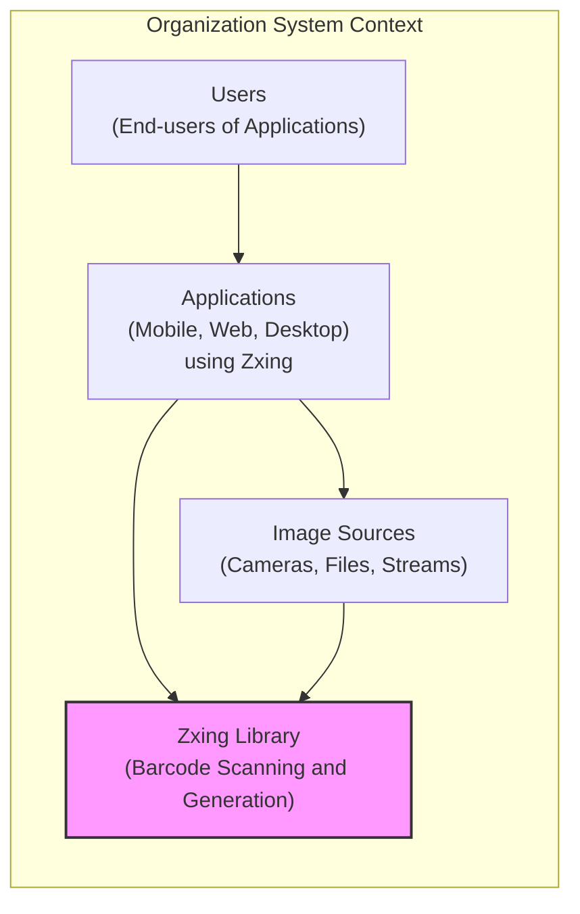
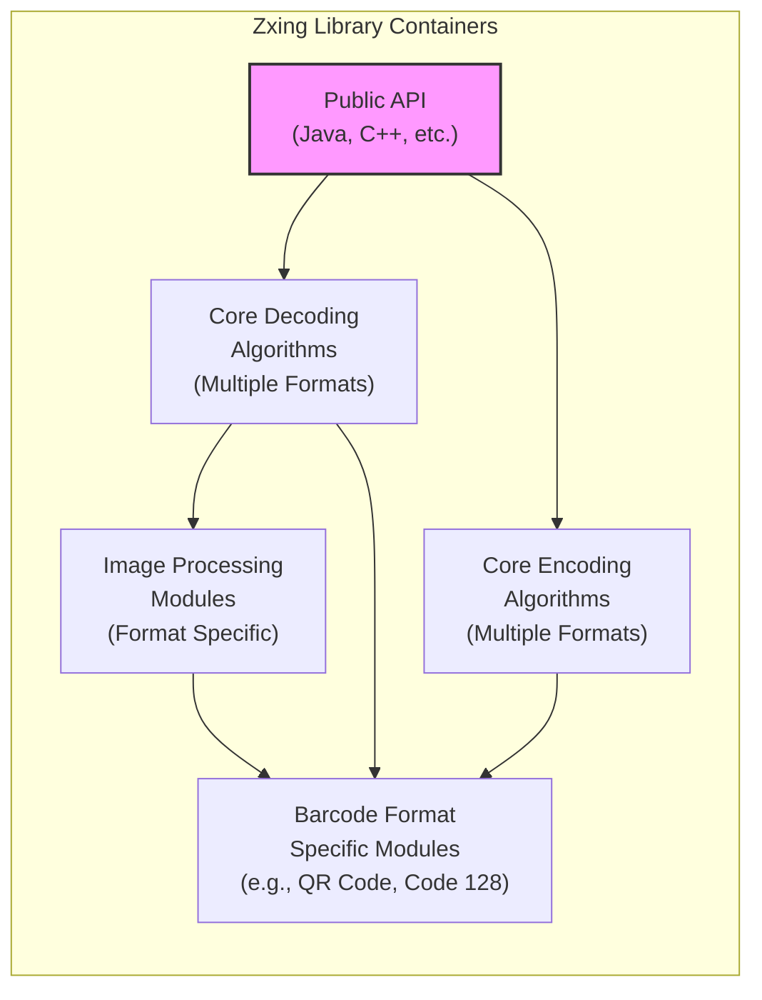
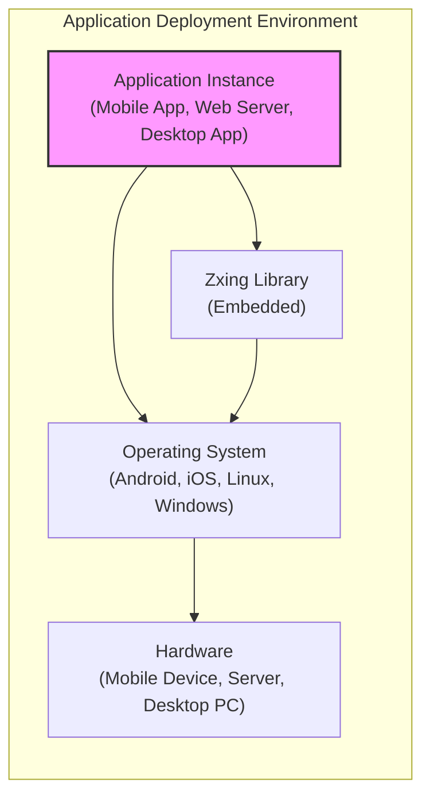
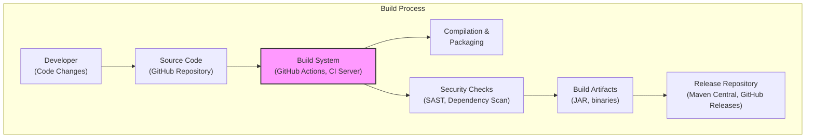

# BUSINESS POSTURE

The zxing (Zebra Crossing) project is a mature, open-source, multi-format barcode image processing library. It is primarily used for scanning and generating barcodes and QR codes in various applications.

- Business priorities and goals:
 - Provide a reliable, high-performance, and accurate barcode scanning and generation library.
 - Support a wide range of 1D and 2D barcode formats.
 - Maintain cross-platform compatibility and broad language support.
 - Foster a strong open-source community and encourage contributions.
 - Ensure the library is easy to integrate and use for developers.

- Most important business risks:
 - Security vulnerabilities in the library could lead to data breaches or application compromise in systems that use zxing for barcode processing.
 - Performance issues or bugs could disrupt critical business processes that rely on barcode scanning, such as inventory management, point-of-sale systems, or access control.
 - Lack of maintenance or community support could lead to stagnation and eventual obsolescence of the library, forcing users to migrate to alternative solutions.
 - Compatibility issues with new platforms or barcode standards could limit the library's applicability and user base.

# SECURITY POSTURE

- Security controls:
 - security control: Code is publicly available on GitHub for community review. (Implemented: GitHub Repository)
 - security control: Project uses standard build tools and dependency management (Maven, Gradle). (Implemented: Build scripts in repository)
 - security control: Regular updates and bug fixes are released by maintainers. (Observed: GitHub commit history and release notes)

- Accepted risks:
 - accepted risk: Reliance on community contributions for security vulnerability identification and patching.
 - accepted risk: Potential for undiscovered vulnerabilities due to the complexity of image processing and barcode formats.
 - accepted risk: Open-source nature means vulnerabilities are publicly known once disclosed.

- Recommended security controls:
 - security control: Implement automated Static Application Security Testing (SAST) in the CI/CD pipeline to identify potential code vulnerabilities.
 - security control: Integrate Dependency Scanning to identify and manage vulnerabilities in third-party libraries used by zxing.
 - security control: Establish a clear process for reporting and handling security vulnerabilities, including a security policy and contact information.
 - security control: Consider adding fuzz testing to proactively discover input validation vulnerabilities.
 - security control: Implement code signing for release artifacts to ensure integrity and prevent tampering.

- Security requirements:
 - Authentication: Not applicable as zxing is a library and does not handle user authentication directly. Applications using zxing are responsible for their own authentication mechanisms.
 - Authorization: Not applicable as zxing is a library and does not handle authorization directly. Applications using zxing are responsible for their own authorization mechanisms.
 - Input validation:
  - security requirement: Robust input validation is crucial to prevent vulnerabilities arising from processing maliciously crafted barcode images.
  - security requirement: The library must handle various image formats and barcode types safely, preventing buffer overflows, format string bugs, or other input-related issues.
  - security requirement: Input validation should be applied to image dimensions, file formats, and barcode data itself.
 - Cryptography:
  - security requirement: zxing should correctly implement any cryptographic algorithms required for certain barcode formats that involve encryption or digital signatures.
  - security requirement: Ensure proper handling of cryptographic keys and avoid hardcoding or insecure storage of keys if cryptography is used.

# DESIGN

## C4 CONTEXT

- Elements of Context Diagram:
 - Element:
  - Name: Users
  - Type: Person
  - Description: End-users who interact with applications that utilize the zxing library for barcode scanning and generation. These users may be customers, employees, or general public depending on the application.
  - Responsibilities: Use applications to scan or generate barcodes for various purposes like product identification, data entry, access control, etc.
  - Security controls: User-level security controls are managed by the applications they use, not directly by zxing.
 - Element:
  - Name: Applications
  - Type: Software System
  - Description: Various software applications (mobile apps, web applications, desktop software) that integrate the zxing library to provide barcode scanning and generation functionality to their users.
  - Responsibilities: Integrate zxing library, provide user interface for barcode scanning/generation, process scanned data, and manage application-level security.
  - Security controls: Application-level security controls such as authentication, authorization, input validation (in application logic), secure data storage, and secure communication.
 - Element:
  - Name: Zxing Library
  - Type: Software System
  - Description: The zxing open-source library itself, providing the core barcode scanning and generation algorithms and functionalities.
  - Responsibilities: Accurately and efficiently decode and encode various barcode formats from image inputs. Provide APIs for applications to use its functionalities.
  - Security controls: Input validation within the library, memory safety, and protection against common software vulnerabilities.
 - Element:
  - Name: Image Sources
  - Type: External System
  - Description: External sources that provide images to be processed by the zxing library. These can be device cameras, image files, network streams, or other image input mechanisms.
  - Responsibilities: Provide image data to applications for barcode processing.
  - Security controls: Security controls related to image sources are external to zxing. Applications need to handle image sources securely (e.g., camera permissions, file access controls).

## C4 CONTAINER

- Elements of Container Diagram:
 - Element:
  - Name: Public API
  - Type: Library Interface
  - Description: The public API exposed by the zxing library in various programming languages (primarily Java and C++, with ports to other languages). This is the entry point for applications to use zxing functionalities.
  - Responsibilities: Provide a well-defined and documented interface for applications to request barcode scanning and generation. Handle input parameters and return results.
  - Security controls: API design should encourage secure usage, input validation at the API level, and clear documentation on security considerations for developers using the API.
 - Element:
  - Name: Core Decoding Algorithms
  - Type: Software Component
  - Description: Contains the core algorithms for decoding various barcode formats. This is the heart of the scanning functionality, responsible for interpreting barcode images and extracting data.
  - Responsibilities: Implement robust and efficient decoding algorithms for supported barcode formats. Handle error correction and data extraction.
  - Security controls: Input validation within decoding algorithms to prevent vulnerabilities from malformed barcode images, memory safety in algorithm implementation, and protection against algorithmic complexity attacks.
 - Element:
  - Name: Core Encoding Algorithms
  - Type: Software Component
  - Description: Contains the core algorithms for encoding data into various barcode formats. This is the heart of the barcode generation functionality.
  - Responsibilities: Implement robust and efficient encoding algorithms for supported barcode formats. Generate valid barcode images from input data.
  - Security controls: Input validation to prevent injection attacks through data encoded in barcodes, and ensure correct and secure encoding of data according to barcode standards.
 - Element:
  - Name: Image Processing Modules
  - Type: Software Component
  - Description: Modules responsible for pre-processing input images to improve barcode detection and decoding. This may include image format handling, noise reduction, and image enhancement.
  - Responsibilities: Handle various image formats, perform image pre-processing to optimize for barcode recognition.
  - Security controls: Input validation for image formats to prevent vulnerabilities related to image parsing, and protection against image processing vulnerabilities (e.g., buffer overflows in image decoders).
 - Element:
  - Name: Barcode Format Specific Modules
  - Type: Software Component
  - Description: Modules that implement the specific logic and rules for each supported barcode format (e.g., QR Code, Code 128, EAN). These modules utilize core decoding/encoding and image processing components.
  - Responsibilities: Implement format-specific decoding and encoding logic according to barcode standards.
  - Security controls: Format-specific input validation and adherence to security considerations within each barcode standard.

## DEPLOYMENT

Zxing is primarily deployed as a library embedded within applications. There isn't a standalone deployment in the traditional sense of a server or service. However, we can consider the deployment context as how applications integrate and use the zxing library.

Deployment Architecture Option: Embedded Library Deployment

- Elements of Deployment Diagram (Embedded Library Deployment):
 - Element:
  - Name: Application Instance
  - Type: Software Deployment Unit
  - Description: A running instance of an application (mobile app, web server, desktop application) that has integrated the zxing library.
  - Responsibilities: Execute application logic, interact with users, utilize zxing library for barcode processing, manage application-level resources and security.
  - Security controls: Application-level security controls, including OS-level security features, application sandboxing (if applicable), and secure configuration management.
 - Element:
  - Name: Zxing Library (Embedded)
  - Type: Software Library
  - Description: The zxing library is linked and runs within the application process. It does not have a separate deployment footprint.
  - Responsibilities: Provide barcode scanning and generation services to the application instance.
  - Security controls: Security controls are primarily those built into the library itself (input validation, memory safety) and are dependent on the application's deployment environment.
 - Element:
  - Name: Operating System
  - Type: Infrastructure Software
  - Description: The operating system (e.g., Android, iOS, Linux, Windows) on which the application and zxing library are running.
  - Responsibilities: Provide system resources, manage processes, enforce security policies, and provide APIs for applications.
  - Security controls: OS-level security features such as access control, process isolation, memory protection, and security updates.
 - Element:
  - Name: Hardware
  - Type: Infrastructure Hardware
  - Description: The physical or virtual hardware (mobile device, server, desktop PC) on which the operating system and application are deployed.
  - Responsibilities: Provide computing resources (CPU, memory, storage, network) for the operating system and applications.
  - Security controls: Hardware-level security features (e.g., secure boot, TPM), physical security of the hardware, and infrastructure security controls in the data center or cloud environment.

## BUILD

- Elements of Build Diagram:
 - Element:
  - Name: Developer
  - Type: Person
  - Description: Software developers who contribute code changes to the zxing project.
  - Responsibilities: Write code, fix bugs, implement new features, and submit code changes via pull requests.
  - Security controls: Developer workstations should be secured, use of secure coding practices, code review process for pull requests.
 - Element:
  - Name: Source Code
  - Type: Code Repository
  - Description: The zxing source code repository hosted on GitHub.
  - Responsibilities: Store and manage the source code, track changes, facilitate collaboration, and serve as the source of truth for the project.
  - Security controls: Access control to the repository, branch protection, audit logging of changes, and vulnerability scanning of the repository itself (GitHub security features).
 - Element:
  - Name: Build System
  - Type: Automation System
  - Description: Automated build system (e.g., GitHub Actions, Jenkins, or similar CI server) that compiles, tests, and packages the zxing library.
  - Responsibilities: Automate the build process, compile code, run tests, package artifacts, and perform security checks.
  - Security controls: Secure configuration of the build system, access control to build pipelines, secure storage of build secrets, and logging of build activities.
 - Element:
  - Name: Compilation & Packaging
  - Type: Build Step
  - Description: Steps in the build process that involve compiling the source code into executable binaries or bytecode and packaging them into distributable formats (e.g., JAR files, native libraries).
  - Responsibilities: Convert source code into runnable artifacts.
  - Security controls: Use of trusted compilers and build tools, secure build environment, and verification of build outputs.
 - Element:
  - Name: Security Checks
  - Type: Build Step
  - Description: Automated security checks integrated into the build pipeline, such as Static Application Security Testing (SAST) and Dependency Scanning.
  - Responsibilities: Identify potential security vulnerabilities in the code and dependencies during the build process.
  - Security controls: Configuration and execution of SAST and dependency scanning tools, reporting and remediation of identified vulnerabilities.
 - Element:
  - Name: Build Artifacts
  - Type: Software Artifacts
  - Description: The compiled and packaged outputs of the build process, such as JAR files, native libraries, and distribution packages.
  - Responsibilities: Represent the distributable versions of the zxing library.
  - Security controls: Code signing of artifacts to ensure integrity and authenticity, secure storage of build artifacts before release.
 - Element:
  - Name: Release Repository
  - Type: Artifact Repository
  - Description: Repository where the released build artifacts are published for users to download and use (e.g., Maven Central for Java artifacts, GitHub Releases for binaries).
  - Responsibilities: Host and distribute released versions of the zxing library.
  - Security controls: Access control to the release repository, integrity checks of released artifacts, and secure distribution channels (HTTPS).

# RISK ASSESSMENT

- What are critical business processes we are trying to protect?
 - For zxing itself, the critical process is maintaining the integrity, availability, and reliability of the library for its users.
 - For applications using zxing, critical business processes depend on the application's purpose. Examples include:
  - Point-of-sale systems relying on barcode scanning for transactions.
  - Inventory management systems using barcodes for tracking goods.
  - Access control systems using QR codes for authentication.
  - Mobile applications using barcode scanning for various functionalities.

- What data we are trying to protect and what is their sensitivity?
 - Data processed by zxing is primarily barcode image data and the decoded data extracted from barcodes.
 - Sensitivity of data depends entirely on the content encoded in the barcodes. Barcodes can contain:
  - Product identifiers (low sensitivity).
  - URLs (low to medium sensitivity).
  - Personal information (medium to high sensitivity, e.g., contact details, access tokens, medical information in some contexts).
  - Payment information (high sensitivity, though less common in barcodes).
 - The zxing library itself does not store or manage this data persistently. Data sensitivity is primarily a concern for applications that use zxing and how they handle the decoded barcode data.

# QUESTIONS & ASSUMPTIONS

- Questions:
 - What are the primary use cases and deployment environments for zxing library users? (To better understand the threat landscape)
 - Are there specific security requirements or compliance standards that users of zxing library need to adhere to? (e.g., HIPAA, PCI DSS)
 - What is the current process for handling security vulnerability reports for zxing? (To assess the maturity of security response)
 - Are there any known past security vulnerabilities in zxing that have been addressed? (To understand historical security posture)

- Assumptions:
 - BUSINESS POSTURE:
  - The primary business goal is to provide a widely used, reliable, and open-source barcode processing library.
  - The project relies on community contributions and open-source principles.
 - SECURITY POSTURE:
  - Security is important but may not be the absolute top priority compared to functionality and performance in all use cases.
  - Security controls are primarily focused on standard open-source development practices and community review.
  - Users of zxing are responsible for implementing application-level security controls.
 - DESIGN:
  - Zxing is primarily used as an embedded library in various applications.
  - The library is designed to be cross-platform and support multiple programming languages.
  - The build process is automated using standard CI/CD practices.