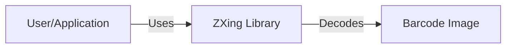
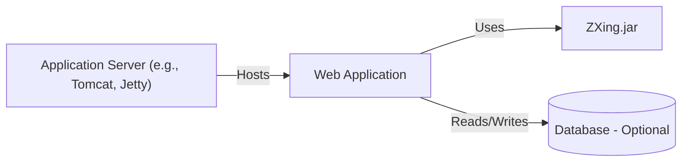
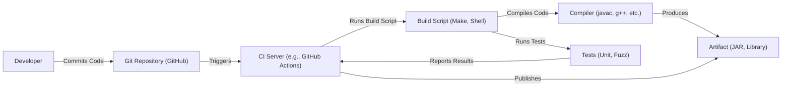

# BUSINESS POSTURE

Business Priorities and Goals:

*   Provide a free, open-source, multi-format 1D/2D barcode image processing library.
*   Maintain broad platform compatibility (Java, C++, C#, Objective-C, etc.).
*   Ensure ease of integration into various applications and systems.
*   Maintain high accuracy and speed of barcode decoding.
*   Foster a community-driven development model.

Most Important Business Risks:

*   Vulnerabilities in the library that could lead to application-level exploits (e.g., denial of service, arbitrary code execution).
*   Inaccurate or unreliable barcode decoding, leading to business process failures.
*   Lack of maintenance and updates, leading to incompatibility with newer barcode formats or platforms.
*   Intellectual property risks (e.g., patent infringement claims).
*   Reputational damage due to security vulnerabilities or poor performance.

# SECURITY POSTURE

Existing Security Controls:

*   security control: Fuzz testing (mentioned in the repository, specifically for C++ code).
*   security control: Use of AddressSanitizer (ASan) and UndefinedBehaviorSanitizer (UBSan) during testing (implied by fuzzing setup).
*   security control: Community code review (inherent to open-source development).
*   security control: Static analysis (likely, but not explicitly stated, common practice for mature projects).

Accepted Risks:

*   accepted risk: Limited formal security audits (due to the open-source nature and likely budget constraints).
*   accepted risk: Reliance on community contributions for security fixes (potential delays in addressing vulnerabilities).
*   accepted risk: Potential for undiscovered vulnerabilities due to the complexity of image processing and barcode formats.

Recommended Security Controls:

*   security control: Integrate static analysis security testing (SAST) tools into the build process for all supported languages (e.g., SonarQube, Coverity, etc.).
*   security control: Establish a clear vulnerability disclosure and response process.
*   security control: Perform regular dependency analysis to identify and update vulnerable libraries.
*   security control: Consider implementing a bug bounty program to incentivize security research.
*   security control: Create and maintain a Software Bill of Materials (SBOM).

Security Requirements:

*   Authentication: Not directly applicable to a barcode processing library.
*   Authorization: Not directly applicable.
*   Input Validation:
    *   Crucial to prevent vulnerabilities.
    *   Must handle malformed or unexpected image data gracefully.
    *   Must validate barcode format-specific constraints.
    *   Must protect against buffer overflows and other memory corruption issues.
*   Cryptography: Not directly applicable, unless the library is used to handle encrypted barcode data (which is not its primary function).
*   Error Handling:
    *   Must handle all errors and exceptions gracefully.
    *   Must not leak sensitive information in error messages.
    *   Must provide clear and informative error messages to aid in debugging.

# DESIGN

## C4 CONTEXT

Element Descriptions:

*   Element 1:
    *   Name: User/Application
    *   Type: User/External System
    *   Description: Any application or user that integrates the ZXing library to decode barcodes.
    *   Responsibilities:
        *   Provide barcode images to the ZXing library.
        *   Handle the decoded barcode data.
    *   Security controls:
        *   Input validation of data received from ZXing.

*   Element 2:
    *   Name: ZXing Library
    *   Type: Software System
    *   Description: The core ZXing library, providing barcode decoding functionality.
    *   Responsibilities:
        *   Decode barcode images.
        *   Support multiple barcode formats.
        *   Provide APIs for various platforms.
    *   Security controls:
        *   Input validation.
        *   Fuzz testing.
        *   Static analysis.
        *   Use of ASan/UBSan.

*   Element 3:
    *   Name: Barcode Image
    *   Type: Data
    *   Description: The input image containing the barcode to be decoded.
    *   Responsibilities: N/A - passive data element.
    *   Security controls: N/A - input to the system.

## C4 CONTAINER

Since ZXing is a library, the container diagram is essentially the same as the context diagram. The library itself is the single "container."

Element Descriptions:

*   Element 1:
    *   Name: User/Application
    *   Type: User/External System
    *   Description: Any application or user that integrates the ZXing library to decode barcodes.
    *   Responsibilities:
        *   Provide barcode images to the ZXing library.
        *   Handle the decoded barcode data.
    *   Security controls:
        *   Input validation of data received from ZXing.

*   Element 2:
    *   Name: ZXing Library
    *   Type: Software System / Container
    *   Description: The core ZXing library, providing barcode decoding functionality. This is the single container.
    *   Responsibilities:
        *   Decode barcode images.
        *   Support multiple barcode formats.
        *   Provide APIs for various platforms.
    *   Security controls:
        *   Input validation.
        *   Fuzz testing.
        *   Static analysis.
        *   Use of ASan/UBSan.

*   Element 3:
    *   Name: Barcode Image
    *   Type: Data
    *   Description: The input image containing the barcode to be decoded.
    *   Responsibilities: N/A - passive data element.
    *   Security controls: N/A - input to the system.

## DEPLOYMENT

ZXing is a library, not a standalone application, so deployment is inherently tied to the applications that use it.  Here are some common deployment scenarios:

1.  **Embedded within a mobile application (Android/iOS):** The library is compiled and linked directly into the application package.
2.  **Included in a server-side application (Java, C++, etc.):** The library is typically included as a dependency (e.g., a JAR file in Java, a compiled library in C++).
3.  **Used in a web application (via WebAssembly, or a server-side component):**  ZXing can be compiled to WebAssembly for client-side use, or used on the server-side as described above.
4.  **Integrated into a desktop application:** Similar to mobile and server-side applications, the library is compiled and linked or included as a dependency.

We'll describe the *server-side Java application* deployment in detail, as it's a common and illustrative scenario.

Element Descriptions:

*   Element 1:
    *   Name: Application Server (e.g., Tomcat, Jetty)
    *   Type: Infrastructure Node
    *   Description: A Java application server that hosts the web application.
    *   Responsibilities:
        *   Provide a runtime environment for the web application.
        *   Handle HTTP requests and responses.
    *   Security controls:
        *   Regular security updates and patching.
        *   Secure configuration (e.g., disabling unnecessary features, using strong passwords).
        *   Network firewalls and intrusion detection/prevention systems.

*   Element 2:
    *   Name: Web Application
    *   Type: Software System / Container
    *   Description: The application that uses the ZXing library.
    *   Responsibilities:
        *   Receive barcode images from users (e.g., via file upload).
        *   Call the ZXing library to decode the images.
        *   Process and display the decoded data.
    *   Security controls:
        *   Input validation (of all user-provided data, including image uploads).
        *   Output encoding (to prevent XSS vulnerabilities).
        *   Authentication and authorization (if applicable).
        *   Secure session management.

*   Element 3:
    *   Name: ZXing.jar
    *   Type: Library / Container
    *   Description: The ZXing library packaged as a JAR file.
    *   Responsibilities:
        *   Decode barcode images.
    *   Security controls:
        *   As described in the C4 Container section.

*   Element 4:
    *   Name: Database (Optional)
    *   Type: Data Store
    *   Description: An optional database used by the web application.
    *   Responsibilities:
        *   Store and retrieve data related to the application's functionality.
    *   Security controls:
        *   Access controls (authentication and authorization).
        *   Data encryption (at rest and in transit).
        *   Regular backups and disaster recovery planning.
        *   SQL injection prevention.

## BUILD

The ZXing project uses a combination of build tools, including Makefiles and shell scripts, and likely some level of continuous integration. A simplified build process is described below:

Security Controls in the Build Process:

*   security control: Code review (via pull requests on GitHub).
*   security control: Automated testing (unit tests and fuzz tests).
*   security control: Use of sanitizers (ASan, UBSan) during testing.
*   security control: *Recommended:* Integration of SAST tools into the CI pipeline.
*   security control: *Recommended:* Dependency analysis during the build process.
*   security control: *Recommended:* Software Bill of Materials (SBOM) generation.

# RISK ASSESSMENT

Critical Business Processes:

*   Barcode decoding: The core functionality of the library. Failure here impacts all applications relying on it.

Data to Protect and Sensitivity:

*   Barcode image data: Generally not sensitive *in itself*, as barcodes are designed to be publicly readable. However, the *content* encoded within the barcode *could* be sensitive, depending on the application. For example, a barcode might contain a URL with a sensitive token, or a serial number that could be used for fraudulent purposes. The library itself doesn't handle the sensitivity of the decoded data; that's the responsibility of the integrating application.
*   Library code: The source code of the library itself is not sensitive (it's open source), but vulnerabilities in the code could be exploited to compromise applications using the library.

# QUESTIONS & ASSUMPTIONS

Questions:

*   Are there any specific compliance requirements (e.g., HIPAA, PCI DSS) that apply to applications using ZXing? This would influence the security requirements of those applications, but not necessarily the library itself.
*   What is the expected threat model for typical applications using ZXing? (e.g., are they likely to be exposed to malicious users, or used in controlled environments?)
*   What level of security assurance is desired for the library? (e.g., is formal verification or penetration testing required?)
*   What are the specific build environments and tools used for each supported platform? (More detail is needed for a comprehensive build process analysis.)
*   Is there a specific process for handling security vulnerabilities reported by external researchers?

Assumptions:

*   BUSINESS POSTURE: The primary goal is to provide a reliable and accurate barcode decoding library, with security being a secondary (but important) consideration.
*   SECURITY POSTURE: The project relies heavily on community contributions and open-source best practices for security. There is no dedicated security team or formal security audit process.
*   DESIGN: The library is designed to be modular and extensible, allowing for support of new barcode formats and platforms. The core decoding logic is likely complex and performance-critical. The deployment model is highly variable, depending on the integrating application. The build process is automated to some extent, but may not include comprehensive security checks.