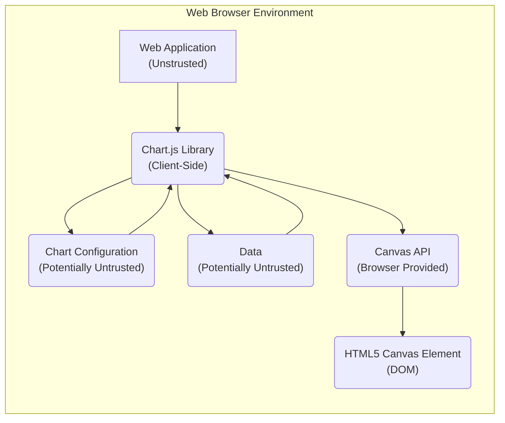
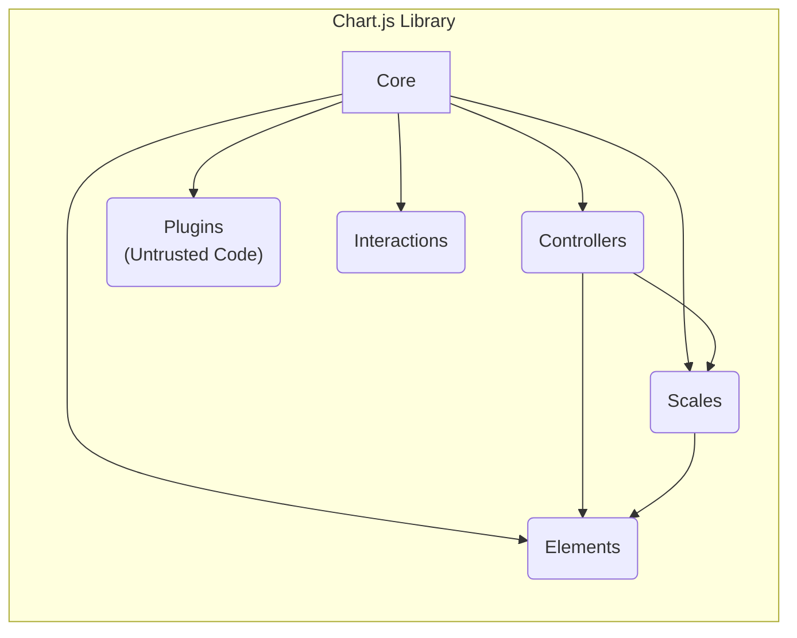

# Project Design Document: Chart.js

**Version:** 1.1
**Date:** October 26, 2023
**Author:** AI Software Architect

## 1. Introduction

This document provides a detailed architectural design of the Chart.js library, a popular open-source JavaScript library for rendering various types of charts. This document serves as a foundation for understanding the system's components, data flow, and potential security considerations, which will be crucial for subsequent threat modeling activities. This revision aims to provide more granular detail relevant to security analysis.

## 2. Goals and Objectives

The primary goals of Chart.js are:

*   Provide a simple and flexible way to create visually appealing charts using HTML5 Canvas.
*   Support a wide range of chart types (e.g., line, bar, pie, scatter).
*   Offer extensive customization options for chart appearance and behavior.
*   Maintain a lightweight and performant library.
*   Be easily integrable into web applications.

## 3. Architectural Overview

Chart.js operates primarily within the client-side web browser environment. It takes data and configuration options as input and renders charts onto an HTML5 `<canvas>` element. The library is structured around a core engine with extensible components for different chart types, scales, and interactions.



*   **Web Application (Untrusted):** The host environment where Chart.js is integrated. This includes the HTML structure, JavaScript code, and any backend services. This is considered an untrusted boundary as it can be controlled by potentially malicious actors.
*   **Chart.js Library (Client-Side):** The core JavaScript library responsible for processing data and configuration and rendering the chart. This operates within the user's browser.
*   **Chart Configuration (Potentially Untrusted):** A JavaScript object defining the chart type, data structure, axes labels, colors, and other visual properties. This configuration can originate from user input or external sources and should be treated as potentially untrusted.
*   **Data (Potentially Untrusted):** The numerical or categorical data used to populate the chart. This data can also originate from untrusted sources.
*   **Canvas API (Browser Provided):** The browser's built-in API for drawing graphics on the `<canvas>` element. This is a trusted component provided by the browser.
*   **HTML5 Canvas Element (DOM):** The HTML element where the chart is rendered within the Document Object Model.

## 4. Component Design

Chart.js is composed of several key components, each with specific responsibilities:

*   **Core:**
    *   Manages the overall chart lifecycle (creation, update, destruction).
    *   Handles configuration parsing and merging, which is a critical point for input validation.
    *   Provides the base `Chart` class and common utility functions.
    *   Registers and manages controllers, scales, and elements.
    *   Potential vulnerability: Improper handling of configuration could lead to unexpected behavior or even script injection if not sanitized.
*   **Controllers:**
    *   Responsible for the logic specific to each chart type (e.g., `LineController`, `BarController`, `PieController`).
    *   Processes data and determines the visual representation of data points.
    *   Interacts with scales and elements to render the chart.
    *   Potential vulnerability: Logic flaws in controllers could lead to incorrect rendering or expose underlying data.
*   **Scales:**
    *   Manage the axes of the chart (e.g., linear, logarithmic, time).
    *   Calculate tick marks, labels, and grid lines based on data.
    *   Handle data scaling and mapping to pixel coordinates.
    *   Potential vulnerability: Incorrect scale calculations could lead to misrepresentation of data. Improper handling of user-provided scale options could also be a risk.
*   **Elements:**
    *   Represent the visual building blocks of the chart (e.g., lines, bars, points, arcs).
    *   Define how individual data points are rendered on the canvas using the Canvas API.
    *   Provide methods for drawing and updating their visual properties.
    *   Potential vulnerability: While elements primarily use the Canvas API, vulnerabilities could arise if custom element implementations are allowed without proper sanitization.
*   **Plugins:**
    *   Provide a mechanism to extend and customize Chart.js functionality.
    *   Can modify chart options, add new chart types, or implement custom interactions.
    *   Executed at various stages of the chart lifecycle, offering significant control.
    *   Significant vulnerability: Plugins, especially third-party ones, represent a major attack surface. They have access to the chart instance and the browser environment, potentially allowing for malicious actions if not carefully vetted.
*   **Interactions:**
    *   Handles user interactions with the chart (e.g., hover, click).
    *   Determines which chart elements are being interacted with based on mouse events.
    *   Triggers events and updates the chart based on interactions, potentially displaying data from the underlying dataset.
    *   Potential vulnerability: Improper handling of interaction events or the data revealed during interactions (e.g., tooltips) could lead to information disclosure or XSS if not properly sanitized.



## 5. Data Flow

The typical data flow within Chart.js involves the following steps, highlighting potential security implications:

1. **Configuration and Data Input (Untrusted Source):** The web application provides chart configuration options and data as JavaScript objects to the Chart.js library. This input should be considered untrusted as it may originate from user input, external APIs, or other potentially malicious sources.
2. **Chart Initialization:** The `Chart` constructor is called, which initializes the core components and registers the specified controller, scales, and elements.
3. **Configuration Parsing and Merging (Sanitization Point):** The core component parses and merges the provided configuration options with default settings. **This is a critical point for input validation and sanitization to prevent XSS or other injection attacks.**
4. **Data Processing (Controller Logic):** The controller processes the input data, potentially transforming or aggregating it as needed for the specific chart type. Errors in controller logic could lead to unexpected behavior.
5. **Scale Calculation:** The scale components calculate the ranges, tick marks, and labels for the chart axes based on the processed data. Malicious data could potentially cause errors or unexpected scale behavior.
6. **Element Creation and Positioning:** The controller creates and positions the visual elements (e.g., bars, lines, points) based on the scaled data values.
7. **Rendering (Canvas API - Trusted):** The element components use the browser's trusted Canvas API to draw themselves onto the `<canvas>` element.
8. **Interaction Handling:** The interactions component listens for user events on the canvas. When an interaction occurs, it determines the affected chart elements and triggers appropriate actions (e.g., displaying tooltips, highlighting elements). **Data displayed during interactions (like tooltips) must be carefully sanitized to prevent XSS.**
9. **Updates:** When the data or configuration changes, the `update()` method is called, which triggers a re-processing of the data, recalculation of scales, and re-rendering of the chart. This cycle repeats, and each iteration presents an opportunity for vulnerabilities if input is not continuously validated.

```mermaid
graph LR
    A["Configuration & Data\n(Untrusted Input)"] --> B("Chart Initialization");
    B --> C("Configuration Parsing & Merging\n(Sanitization Point)");
    C --> D("Data Processing (Controller)");
    D --> E("Scale Calculation");
    E --> F("Element Creation & Positioning");
    F --> G("Rendering (Canvas API)");
    G --> H("Displayed Chart");
    H --> I("User Interaction");
    I --> J("Interaction Handling\n(Tooltip Sanitization)");
    J --> D;  % Interaction may trigger data processing/updates
    style A fill:#fdd,stroke:#333,stroke-width:2px
    style H fill:#ccf,stroke:#333,stroke-width:2px
    style C fill:#ffcc80,stroke:#333,stroke-width:2px
    style J fill:#ffcc80,stroke:#333,stroke-width:2px
```

## 6. Security Considerations (For Threat Modeling)

This section details potential security vulnerabilities and attack vectors:

*   **Cross-Site Scripting (XSS):**
    *   **Attack Vector:** Malicious JavaScript code injected into chart configuration options (e.g., labels, titles, tooltip content) or data values.
    *   **Consequence:** Execution of arbitrary JavaScript code in the user's browser, potentially leading to session hijacking, data theft, or defacement.
    *   **Mitigation:**  Strict input validation and output encoding/escaping of all user-provided data and configuration before rendering.
*   **Data Integrity Issues:**
    *   **Attack Vector:** Tampering with the data source or configuration to display misleading or inaccurate charts.
    *   **Consequence:** Users making incorrect decisions based on flawed visualizations.
    *   **Mitigation:**  Ensure the integrity of the data source and implement mechanisms to detect and prevent data manipulation.
*   **Denial of Service (DoS):**
    *   **Attack Vector:** Providing extremely large or complex datasets or configurations that consume excessive browser resources.
    *   **Consequence:**  Browser slowdown, unresponsiveness, or crashes, preventing legitimate use of the application.
    *   **Mitigation:** Implement limits on data size and complexity, and optimize rendering performance.
*   **Dependency Vulnerabilities:**
    *   **Attack Vector:** Exploiting known vulnerabilities in Chart.js itself or any of its (currently minimal) dependencies if they were to be introduced.
    *   **Consequence:**  Various security breaches depending on the nature of the vulnerability.
    *   **Mitigation:**  Regularly update Chart.js to the latest version and carefully vet any future dependencies.
*   **Plugin Security Risks:**
    *   **Attack Vector:** Malicious code within third-party plugins exploiting the access they have to the chart instance and browser environment.
    *   **Consequence:**  Full compromise of the client-side application, including data theft, XSS, and other malicious activities.
    *   **Mitigation:**  Thoroughly vet and audit any third-party plugins before use. Implement a Content Security Policy (CSP) to restrict the capabilities of plugins.
*   **Information Disclosure:**
    *   **Attack Vector:**  Sensitive information being inadvertently revealed through chart labels, tooltips, or other interactive elements.
    *   **Consequence:**  Exposure of confidential data to unauthorized users.
    *   **Mitigation:**  Carefully review the data being displayed in charts and ensure that sensitive information is not exposed unnecessarily. Sanitize data displayed in tooltips and labels.
*   **Client-Side Resource Exhaustion:**
    *   **Attack Vector:**  Crafting specific chart configurations that cause excessive memory usage or CPU load in the user's browser.
    *   **Consequence:**  Browser instability or crashes.
    *   **Mitigation:** Implement safeguards against overly complex configurations and optimize rendering processes.

## 7. Trust Boundaries

Identifying trust boundaries is crucial for understanding where security controls are most important:

*   **Boundary 1: Web Application (Untrusted) to Chart.js Library (Client-Side):**  Data and configuration passed from the web application to Chart.js must be treated as untrusted and validated.
*   **Boundary 2: Chart.js Library to Canvas API (Trusted):**  The interaction with the browser's Canvas API is generally considered safe, as it's a browser-provided functionality. However, the data passed to the Canvas API for rendering must be sanitized to prevent XSS if it originates from untrusted sources.
*   **Boundary 3: Chart.js Core to Plugins (Potentially Untrusted):** Plugins represent a significant trust boundary. Code within plugins should be treated as potentially malicious and carefully vetted. Security measures like CSP can help mitigate risks associated with plugins.

## 8. Dependencies

Chart.js has minimal external dependencies. It primarily relies on the browser's built-in functionalities, especially the HTML5 Canvas API. It's important to monitor for any future dependencies and assess their security implications.

## 9. Deployment

Chart.js is typically deployed by including the library's JavaScript file in the HTML `<script>` tag of a web page. It can be downloaded from the official website, installed via package managers like npm or yarn, or included via a Content Delivery Network (CDN). When using a CDN, ensure the integrity of the delivered file using Subresource Integrity (SRI).

```html
<script src="https://cdn.jsdelivr.net/npm/chart.js" integrity="sha384-...">