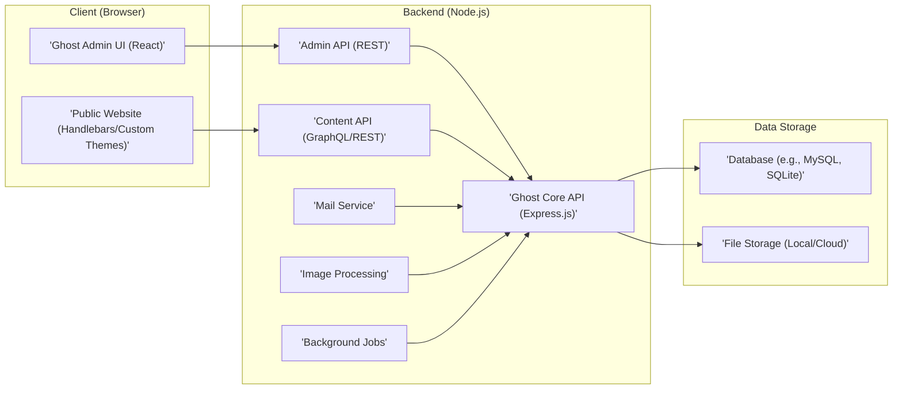

# Project Design Document: Ghost Blogging Platform

**Version:** 1.1
**Date:** October 26, 2023
**Prepared By:** AI Software Architect

## 1. Project Overview

This document provides a detailed architectural design of the Ghost blogging platform, an open-source, headless Node.js CMS focused on professional publishing. This design will serve as the foundation for subsequent threat modeling activities. The information is derived from the public GitHub repository: [https://github.com/TryGhost/Ghost](https://github.com/TryGhost/Ghost) and general knowledge of web application architectures. This revision aims to provide more clarity and detail based on the initial version.

## 2. Goals

*   Clearly define the major components and their interactions within the Ghost platform.
*   Identify key data flows and storage mechanisms.
*   Outline the technology stack employed by Ghost, categorizing the technologies for better understanding.
*   Describe the typical deployment models for Ghost, highlighting key characteristics of each.
*   Provide a robust foundation for identifying potential security vulnerabilities during threat modeling.

## 3. Non-Goals

*   Detailed code-level analysis of specific modules or functions.
*   Performance benchmarking or optimization strategies.
*   Specific instructions for installation or configuration.
*   A comprehensive list of all third-party integrations and their specific architectures.

## 4. Target Audience

*   Security engineers and architects involved in threat modeling.
*   Development team members requiring a high-level understanding of the system architecture.
*   Operations team members responsible for deployment and maintenance.

## 5. Architectural Overview

Ghost follows a modular architecture, primarily based on a Node.js backend with a decoupled frontend. It emphasizes a RESTful API for communication between the frontend and backend, with GraphQL also utilized for the Content API.



## 6. Component Breakdown

This section details the major components of the Ghost platform, providing more specific details on their responsibilities and interactions.

*   **Client (Browser):**
    *   **Ghost Admin UI (React):**
        *   Purpose: Provides the administrative interface for content creators, editors, and administrators to manage all aspects of the Ghost blog.
        *   Responsibilities: User authentication and session management, providing UI elements for content creation and editing, managing user roles and permissions, configuring site settings, and handling theme uploads and modifications.
        *   Interactions: Communicates with the Backend's Admin API using RESTful requests to perform administrative tasks such as creating posts, managing users, and updating settings.
    *   **Public Website (Handlebars/Custom Themes):**
        *   Purpose: Displays the published content to the public, providing the user-facing interface of the blog. Themes control the visual presentation and layout.
        *   Responsibilities: Rendering content fetched from the Content API, handling user interactions like navigating between pages, subscribing to newsletters, and potentially interacting with comment systems. Theme logic determines how content is displayed.
        *   Interactions: Primarily fetches published content via the Content API using GraphQL or REST. May also interact with external services for features like comments or analytics.

*   **Backend (Node.js):**
    *   **Ghost Core API (Express.js):**
        *   Purpose: The central application logic layer, responsible for orchestrating all core functionalities and managing interactions between other backend components. It acts as the foundation for both the Admin and Content APIs.
        *   Responsibilities: Request routing and handling, enforcing business logic and data validation, managing authentication and authorization for both APIs, and coordinating data access and manipulation with the database and file storage.
        *   Interactions: Interacts directly with the Database and File Storage for data persistence. Triggers the Mail Service for sending emails, the Image Processing component for image manipulation, and the Background Jobs component for asynchronous tasks. Serves as the underlying layer for the Admin and Content APIs.
    *   **Content API (GraphQL/REST):**
        *   Purpose: Provides a read-only interface for fetching published content for the public website, external applications, and integrations. Offers both GraphQL and REST endpoints for flexibility.
        *   Responsibilities: Handling requests for published posts, pages, authors, and tags. Applying content access rules and filters. Formatting the response data for consumption by the frontend or other clients.
        *   Interactions: Communicates with the Ghost Core API to retrieve content data from the database.
    *   **Admin API (REST):**
        *   Purpose: Provides an authenticated interface for administrative tasks performed by the Ghost Admin UI and potentially other administrative clients.
        *   Responsibilities: Handling requests for creating, reading, updating, and deleting content (posts, pages, etc.), managing users and their roles, configuring site settings, and managing themes. Enforces authentication and authorization to ensure only authorized users can perform these actions.
        *   Interactions: Communicates with the Ghost Core API to execute administrative actions and persist changes to the database and file storage.
    *   **Mail Service:**
        *   Purpose: Handles the sending of transactional and notification emails for various purposes within the Ghost platform.
        *   Responsibilities: Composing and sending emails for user invitations, password resets, subscription confirmations, and potentially other notifications. Integrates with configured SMTP servers or third-party email providers.
        *   Interactions: Triggered by the Ghost Core API when email sending is required, such as during user registration or password reset requests.
    *   **Image Processing:**
        *   Purpose: Handles the processing and manipulation of uploaded images to optimize them for web delivery and potentially create different sizes or formats.
        *   Responsibilities: Resizing images, optimizing image compression, and potentially converting image formats.
        *   Interactions: Triggered by the Ghost Core API when new images are uploaded through the Admin API.
    *   **Background Jobs:**
        *   Purpose: Executes asynchronous and scheduled tasks that do not need to block user requests, ensuring a smooth user experience.
        *   Responsibilities: Managing and executing tasks such as scheduled post publishing, generating sitemaps, sending bulk emails, and performing data cleanup or maintenance tasks.
        *   Interactions: Scheduled or triggered by the Ghost Core API based on time intervals or specific events.

*   **Data Storage:**
    *   **Database (e.g., MySQL, SQLite):**
        *   Purpose: Stores all persistent data for the Ghost platform, including content (posts, pages, tags, authors), user information, settings, and other application data.
        *   Responsibilities: Data persistence, retrieval, indexing, and ensuring data integrity.
        *   Interactions: Accessed by the Ghost Core API for all data read and write operations.
    *   **File Storage (Local/Cloud):**
        *   Purpose: Stores uploaded files, primarily images, theme files, and potentially other assets.
        *   Responsibilities: Storing and retrieving files. Can be configured to use the local file system or cloud-based storage solutions like Amazon S3 or Google Cloud Storage.
        *   Interactions: Accessed by the Ghost Core API for storing and retrieving files, particularly during content creation and theme management.

## 7. Data Flow Diagrams

This section illustrates the flow of data for key functionalities, providing more descriptive labels for clarity.

*   **User Login (Admin UI):**
    ```mermaid
    graph LR
        A["'Ghost Admin UI'"] --> B["'Admin API'"];
        B -- "'Authentication Request (Username/Password)'" --> C["'Ghost Core API'"];
        C -- "'Verify Credentials against User Data'" --> D["'Database'"];
        D -- "'User Data & Roles'" --> C;
        C -- "'Authentication Token (e.g., JWT)'" --> B;
        B -- "'Store Token in Browser (Session/Local Storage)'" --> A;
    ```
*   **Content Creation:**
    ```mermaid
    graph LR
        A["'Ghost Admin UI'"] --> B["'Admin API'"];
        B -- "'Create Post Request (Title, Content, Metadata)'" --> C["'Ghost Core API'"];
        C -- "'Validate Content & Authorize User'" --> C;
        C -- "'Save Post Data'" --> D["'Database'"];
        D -- "'Confirmation of Save'" --> C;
        C -- "'Trigger Image Processing (if images uploaded)'" --> E["'Image Processing'"];
        E --> C;
        C -- "'Success Response'" --> B;
        B --> A;
    ```
*   **Content Delivery (Public Website):**
    ```mermaid
    graph LR
        A["'Public Website'"] --> B["'Content API'"];
        B -- "'Fetch Post Request (Slug/ID)'" --> C["'Ghost Core API'"];
        C -- "'Retrieve Published Content'" --> D["'Database'"];
        D -- "'Post Data'" --> C;
        C -- "'Content Response (JSON/GraphQL)'" --> B;
        B -- "'Render Content using Theme Templates'" --> A;
    ```

## 8. Technology Stack

This outlines the primary technologies used in the Ghost platform, categorized for better understanding.

*   **Backend Framework & Runtime:**
    *   Node.js (JavaScript runtime environment)
    *   Express.js (Web application framework for Node.js)
*   **Database & ORM:**
    *   MySQL (Recommended for production environments)
    *   SQLite (Default for development and simpler setups)
    *   Knex.js (SQL query builder)
    *   Bookshelf.js (Object-Relational Mapper built on Knex)
*   **Frontend Technologies:**
    *   React (for the Admin UI)
    *   Handlebars.js (Templating engine for public website themes)
    *   JavaScript (Core language for both frontend and backend)
*   **API Technologies:**
    *   REST (Predominantly used for Admin API)
    *   GraphQL (Used for the Content API)
*   **Other Key Technologies:**
    *   Mailgun/SendGrid/SMTP (For email delivery)
    *   Various image processing libraries (likely within the 'Image Processing' component)
    *   Likely uses a job queue or scheduler for 'Background Jobs' (specific technology not explicitly stated but common in Node.js)

## 9. Deployment Model

Ghost offers flexibility in its deployment options, catering to various needs and technical expertise.

*   **Self-Hosted:** Provides maximum control and customization but requires more technical expertise for setup and maintenance.
    *   **On-Premise Servers:** Deploying Ghost on your own physical hardware.
    *   **Virtual Private Servers (VPS):** Utilizing virtualized server environments from providers like DigitalOcean or Linode.
    *   **Cloud Compute Instances:** Deploying on virtual machines offered by cloud providers such as AWS EC2, Google Compute Engine, or Azure Virtual Machines.
*   **Platform-as-a-Service (PaaS):** Simplifies deployment and management by abstracting away infrastructure concerns.
    *   **Ghost(Pro):** The official managed hosting solution for Ghost, providing a streamlined experience.
    *   **Heroku:** A popular PaaS that supports Node.js applications.
    *   **DigitalOcean App Platform:** Another PaaS offering easy deployment for Node.js applications.
*   **Containerized:** Enables consistent deployments across different environments and facilitates scalability.
    *   **Docker:** Packaging Ghost and its dependencies into containers for easy deployment and management.
    *   **Kubernetes:** Orchestrating and scaling containerized Ghost deployments, suitable for larger and more complex setups.

A typical production deployment often involves a reverse proxy server like Nginx or Apache in front of the Node.js application to handle SSL termination, load balancing, and serving static assets.

## 10. Security Considerations (Initial)

This section highlights initial security considerations based on the architecture, categorized for better organization. A more detailed threat model will expand on these areas.

*   **Authentication and Authorization:**
    *   Securely managing user credentials and sessions for both administrators and public users (e.g., for membership features).
    *   Robust role-based access control (RBAC) to restrict access to sensitive administrative functionalities.
    *   Protection against brute-force attacks on login endpoints.
*   **Input Validation and Output Encoding:**
    *   Thorough validation of all user inputs to prevent injection attacks (e.g., SQL injection, cross-site scripting (XSS), command injection).
    *   Proper encoding of output data to prevent XSS vulnerabilities.
*   **Data Protection:**
    *   Ensuring the confidentiality and integrity of sensitive data at rest (database, file storage) and in transit (using HTTPS).
    *   Secure storage of API keys and other sensitive configuration data.
*   **API Security:**
    *   Secure authentication and authorization mechanisms for both the Admin and Content APIs.
    *   Protection against API abuse, such as rate limiting and request validation.
    *   Proper handling of API keys and tokens.
*   **Dependency Management:**
    *   Regularly updating dependencies to patch known security vulnerabilities.
    *   Using tools to scan for and manage dependency vulnerabilities.
*   **Transport Security:**
    *   Enforcing HTTPS for all communication to protect data in transit.
    *   Proper configuration of TLS/SSL certificates.
*   **Content Security Policy (CSP):**
    *   Implementing a strong CSP to mitigate the risk of XSS attacks.
*   **Rate Limiting and DoS Protection:**
    *   Implementing rate limiting on API endpoints to prevent brute-force attacks and denial-of-service attempts.
*   **File Upload Security:**
    *   Validating file types and sizes to prevent malicious uploads.
    *   Sanitizing uploaded files and storing them securely.
*   **Theme Security:**
    *   Potential vulnerabilities within custom themes should be considered, especially if users can upload arbitrary themes.

## 11. Future Considerations

*   Detailed analysis of the internal architecture of specific backend modules (e.g., the member management module, the theme engine).
*   In-depth examination of the security implications of various third-party integrations (e.g., analytics, comment systems, membership platforms).
*   Analysis of the theme rendering process and potential security risks associated with Handlebars templates and custom theme code.
*   Exploration of potential security enhancements, such as implementing more advanced authentication methods (e.g., multi-factor authentication).
