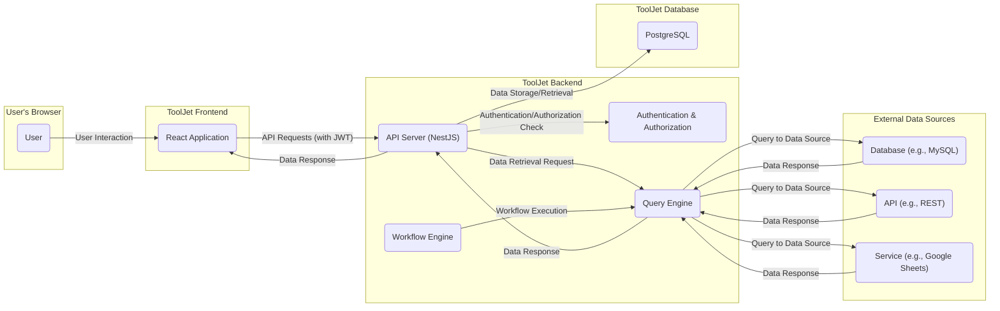
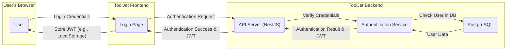
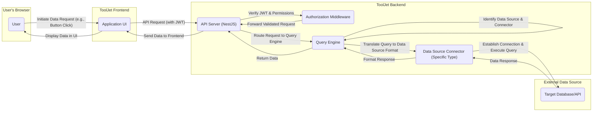

# Project Design Document: ToolJet - Low-Code Platform for Internal Tools

**Version:** 1.1
**Date:** October 26, 2023
**Author:** Gemini (AI Language Model)

## 1. Introduction

This document provides an enhanced architectural design of the ToolJet project, an open-source low-code platform for building and deploying internal tools. This detailed design serves as a critical foundation for understanding the system's intricate components, their interactions, and the flow of data, which is paramount for conducting thorough threat modeling activities.

### 1.1. Purpose

The primary objective of this document is to present a refined and more detailed architectural blueprint of ToolJet. This enhanced detail is specifically intended to facilitate more effective and granular threat modeling, enabling the identification of a wider range of potential security vulnerabilities.

### 1.2. Scope

This document encompasses the core architectural elements of the ToolJet platform, with a particular focus on its frontend, backend, database infrastructure, and crucial integrations. The emphasis remains on the self-hosted deployment model, aligning with the information available in the provided GitHub repository.

### 1.3. Audience

This document is primarily intended for:

* Security engineers and architects tasked with performing threat modeling and security assessments of the ToolJet platform.
* Software developers actively contributing to the development and maintenance of the ToolJet project.
* DevOps engineers responsible for the deployment, configuration, and ongoing maintenance of ToolJet instances.

## 2. System Overview

ToolJet empowers users to rapidly construct internal tools by establishing connections with diverse data sources and APIs. The platform offers a user-friendly, visual drag-and-drop interface for designing intuitive user interfaces and defining complex operational workflows.

### 2.1. Key Features

* **Intuitive Visual Application Builder:** A drag-and-drop interface enabling users to design and assemble user interfaces without extensive coding.
* **Versatile Data Source Integrations:** Pre-built connectors facilitating seamless interaction with a wide array of databases (e.g., PostgreSQL, MySQL, MongoDB), APIs (e.g., REST, GraphQL), and popular services (e.g., Google Sheets, Airtable, Salesforce).
* **Integrated Query Editor:** A dedicated interface allowing users to directly query, manipulate, and transform data retrieved from connected sources.
* **Powerful Workflow Automation:** Capabilities to define and automate intricate tasks and processes, triggered by various events or schedules.
* **Comprehensive User Management and Permissions:** Features for managing user accounts, roles, and granular access levels to applications and data.
* **Flexible Deployment Options:** Support for both self-hosted deployments, providing greater control, and cloud-based deployments for ease of management.

## 3. Architectural Design

The ToolJet architecture is logically organized into distinct components, each with specific responsibilities:

* **Frontend (React Application):**
    * Renders the user interface that users interact with.
    * Manages user interactions and dispatches actions to the backend.
    * Implemented using React.js, leveraging component-based architecture and state management libraries.
    * Handles client-side routing and navigation.
    * Communicates with the backend API via HTTP requests.
* **Backend (Node.js/NestJS Application):**
    * Serves as the central application logic and API gateway for the frontend.
    * Built upon Node.js, utilizing the NestJS framework for a structured and scalable architecture.
    * Enforces user authentication and authorization policies.
    * Manages connections to various data sources through dedicated connectors.
    * Processes and executes data queries received from the frontend.
    * Orchestrates the execution of defined workflows and automations.
    * Provides real-time updates to the frontend via WebSockets.
* **Database (PostgreSQL):**
    * Acts as the primary persistent data store for the ToolJet platform.
    * Stores application metadata, including user accounts, application definitions, data source configurations, and workflow definitions.
    * PostgreSQL is the recommended and officially supported database system.
* **Data Source Connectors:**
    * Independent modules responsible for establishing and managing connections to external data sources.
    * Each connector provides an abstraction layer for interacting with a specific type of data source.
    * Supports a diverse range of databases (e.g., MySQL, MongoDB), APIs (e.g., REST, GraphQL), and SaaS services (e.g., Google Sheets, Airtable).
    * Handles authentication and authorization specific to each data source.
    * Translates generic query requests into the specific query language of the target data source.
* **Real-time Engine (Socket.IO):**
    * Facilitates bidirectional, real-time communication between the frontend and backend.
    * Enables features such as live data updates in applications and collaborative editing functionalities.
    * Provides a mechanism for the backend to push updates to connected clients.
* **Query Engine:**
    * Responsible for interpreting and executing data queries against connected data sources.
    * Receives abstract query requests from the backend.
    * Delegates the actual query execution to the appropriate data source connector.
    * Aggregates and formats the results returned from data sources.
* **Workflow Engine:**
    * Executes the logic defined in user-created workflows and automations.
    * Manages the execution of individual tasks within a workflow.
    * Handles triggers, conditions, and actions defined in the workflow.
    * May interact with the Query Engine to retrieve or manipulate data as part of a workflow.
* **Plugin System:**
    * Provides a mechanism for extending the core functionality of ToolJet.
    * Allows developers to create and integrate custom plugins.
    * Plugins can introduce new data source connectors, custom UI components, or backend logic and functionalities.

## 4. Data Flow Diagrams

### 4.1. High-Level Data Flow

### 4.2. User Authentication Flow

### 4.3. Data Query Flow (Detailed)

## 5. Security Considerations

This section expands upon the initial security considerations, providing a more detailed overview of potential risks and mitigation strategies based on the architectural design.

* **Authentication and Authorization:**
    * **User Credential Security:** Secure hashing and salting of user passwords stored in the PostgreSQL database. Implementation of password complexity requirements and account lockout policies.
    * **JWT (JSON Web Token) Management:** Secure generation, storage (client-side considerations like HttpOnly and Secure flags), and validation of JWTs used for authentication. Protection against JWT manipulation and replay attacks.
    * **Role-Based Access Control (RBAC):** Implementation of fine-grained authorization controls based on user roles and permissions to restrict access to applications, data sources, and specific functionalities.
    * **Multi-Factor Authentication (MFA):** Consideration for implementing MFA to enhance account security.
    * **Protection Against Brute-Force and Credential Stuffing:** Implementation of rate limiting and CAPTCHA mechanisms on login endpoints.
* **Data Source Security:**
    * **Secure Credential Storage:** Secure storage of data source credentials, potentially using encryption or secrets management solutions. Avoid storing credentials directly in code or configuration files.
    * **Secure Communication Protocols:** Enforce the use of secure communication protocols (e.g., TLS/SSL) for all connections to external data sources. Verify SSL certificates to prevent man-in-the-middle attacks.
    * **Data Sanitization and Validation:** Implement robust input validation and sanitization techniques to prevent injection attacks (e.g., SQL injection, NoSQL injection) when querying data sources.
    * **Least Privilege Principle:** Connect to data sources with the minimum necessary privileges required for the intended operations.
* **API Security:**
    * **Protection Against Common Web Application Vulnerabilities:** Implementation of security measures to mitigate OWASP Top 10 vulnerabilities, including Cross-Site Scripting (XSS), Cross-Site Request Forgery (CSRF), and injection attacks.
    * **Input Validation and Sanitization:** Strict validation and sanitization of all user inputs received by the backend API.
    * **Rate Limiting:** Implementation of rate limiting on API endpoints to prevent abuse and denial-of-service attacks.
    * **Secure API Design and Implementation:** Adherence to secure coding practices and security principles during API development.
    * **CORS (Cross-Origin Resource Sharing) Configuration:** Proper configuration of CORS policies to restrict access to the API from unauthorized domains.
* **Frontend Security:**
    * **Protection Against XSS Attacks:** Implementation of Content Security Policy (CSP) and proper escaping of user-generated content to prevent XSS vulnerabilities.
    * **Secure Handling of User Input:** Avoid directly embedding user input into the DOM without proper sanitization.
    * **Prevention of Data Leaks:** Avoid storing sensitive information in the frontend or exposing it unnecessarily.
* **Real-time Communication Security:**
    * **Secure WebSocket Connections (WSS):** Enforce the use of secure WebSocket connections (WSS) for real-time communication.
    * **Authorization for Real-time Updates:** Implement authorization checks to ensure that only authorized users receive real-time updates.
* **Plugin Security:**
    * **Secure Plugin Development Practices:** Provide guidelines and best practices for developing secure plugins.
    * **Plugin Verification and Sandboxing:** Implement mechanisms for verifying the integrity and safety of plugins before installation. Consider sandboxing plugin execution to limit their access to system resources.
* **Deployment Security:**
    * **Secure Configuration of Deployment Environment:** Securely configure the deployment environment, including operating systems, web servers, and containerization platforms.
    * **Regular Security Updates:** Implement a process for regularly updating dependencies, libraries, and the underlying operating system to patch known vulnerabilities.
    * **Network Security Measures:** Implement network security measures such as firewalls and intrusion detection/prevention systems.
* **Data at Rest Security:**
    * **Encryption of Sensitive Data:** Consider encrypting sensitive data stored in the PostgreSQL database at rest.
    * **Secure Backup and Recovery Procedures:** Implement secure backup and recovery procedures to protect against data loss.

## 6. Deployment Architecture

ToolJet is primarily designed for self-hosted deployments, leveraging containerization for ease of deployment and management.

* **Containerization (Docker):** The frontend, backend, and potentially other components are packaged as Docker containers, ensuring consistent environments and simplified deployment.
* **Orchestration (Kubernetes - Optional but Recommended for Production):** Kubernetes can be used to orchestrate the deployment, scaling, and management of ToolJet containers in a production environment, providing features like automated rollouts, rollbacks, and health checks.
* **Database Deployment (PostgreSQL):** PostgreSQL can be deployed as a separate container, as a managed database service (e.g., AWS RDS, Google Cloud SQL), or directly on a virtual machine.
* **Reverse Proxy (Nginx, Traefik):** A reverse proxy is typically deployed in front of the ToolJet application to handle SSL termination, load balancing, routing, and potentially act as a web application firewall (WAF).
* **Environment Variables and Secrets Management:** Configuration parameters, including database credentials and API keys, should be managed securely using environment variables or dedicated secrets management solutions.

## 7. Technologies Used

* **Frontend:**
    * React.js (JavaScript library for building user interfaces)
    * Redux or Zustand (State management libraries)
    * JavaScript or TypeScript (Programming language)
    * HTML5, CSS3 (Markup and styling languages)
    * Various UI component libraries (e.g., Material UI, Ant Design)
* **Backend:**
    * Node.js (JavaScript runtime environment)
    * NestJS (Progressive Node.js framework for building efficient and scalable server-side applications)
    * TypeScript (Superset of JavaScript which primarily provides static typing)
    * Express.js (Underlying web application framework for NestJS)
    * TypeORM or Sequelize (Object-Relational Mapping libraries for database interaction)
* **Database:**
    * PostgreSQL (Relational database management system)
* **Real-time Communication:**
    * Socket.IO (Library for enabling real-time, bidirectional and event-based communication)
* **Containerization:**
    * Docker (Platform for building, shipping, and running applications in containers)
* **Orchestration (Optional):**
    * Kubernetes (Container orchestration platform)
* **Reverse Proxy (Example):**
    * Nginx or Traefik
* **Testing Frameworks:**
    * Jest, Mocha, or Chai (JavaScript testing frameworks)

## 8. Future Considerations

* **Enhanced Scalability and Performance:** Design considerations for handling a significantly larger number of concurrent users, applications, and data sources. Explore techniques like horizontal scaling, caching, and database optimization.
* **High Availability and Fault Tolerance:** Implementing robust redundancy and failover mechanisms across all critical components to ensure continuous availability in case of failures.
* **Comprehensive Monitoring and Logging:** Implementing centralized logging and monitoring solutions to track application performance, identify errors, and detect potential security incidents. Integration with security information and event management (SIEM) systems.
* **Multi-tenancy Support:** Exploring the possibility of supporting multi-tenancy to allow multiple organizations or teams to use a single ToolJet instance while maintaining data isolation and security.
* **Improved Plugin Ecosystem:** Enhancing the plugin system with better documentation, tooling, and security review processes to foster a vibrant and secure plugin ecosystem.
* **Audit Logging:** Implementing detailed audit logging to track user actions and system events for security and compliance purposes.

This enhanced design document provides a more granular and comprehensive understanding of the ToolJet architecture. The detailed descriptions of components, data flows, and security considerations will be invaluable for conducting a thorough and effective threat modeling exercise, ultimately contributing to a more secure and robust platform.