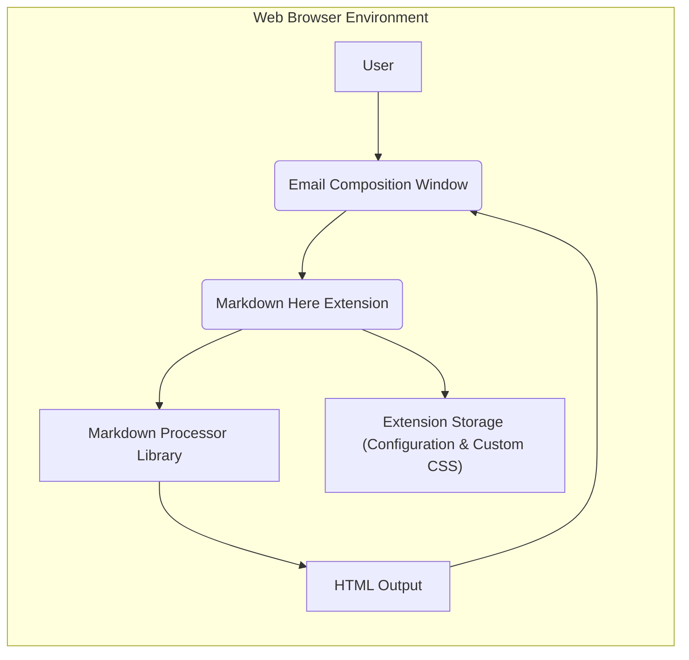
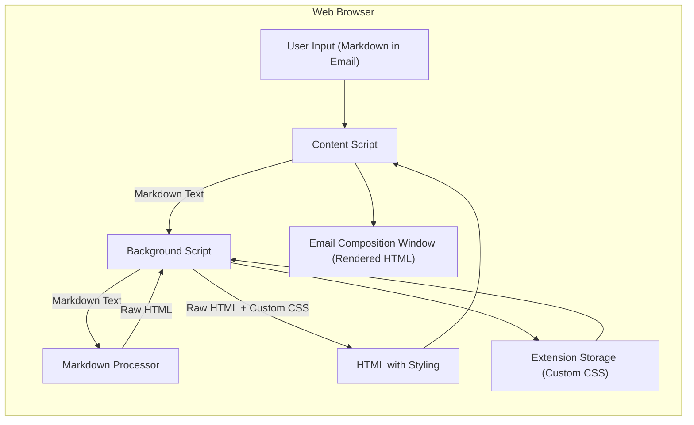

## Project Design Document: Markdown Here Browser Extension

**Version:** 1.1
**Date:** October 26, 2023
**Prepared By:** AI Software Architecture Expert

### 1. Introduction

This document provides an enhanced design specification for the "Markdown Here" browser extension. This extension empowers users to compose emails using Markdown syntax, which is then rendered into rich HTML before the email is sent. This detailed design serves as a critical artifact for understanding the system's architecture and will be the basis for subsequent threat modeling activities.

### 2. Project Overview

The "Markdown Here" extension aims to streamline the email composition process for users who prefer the simplicity and readability of Markdown. By integrating seamlessly with existing webmail and potentially desktop email client interfaces, it allows users to write emails in Markdown and effortlessly convert them to styled HTML for a more visually appealing and formatted message.

### 3. Goals and Objectives

* **Primary Goal:** To provide a user-friendly and efficient method for composing emails using Markdown syntax within a browser environment.
* **Objectives:**
    * Enable users to write email content in Markdown directly within their preferred webmail or compatible desktop email client's composition window.
    * Accurately and consistently render Markdown syntax into valid HTML, adhering to established Markdown specifications and common extensions.
    * Offer users customization options for the visual presentation of the rendered HTML through custom CSS styling.
    * Ensure the extension operates with minimal impact on browser performance and responsiveness.
    * Prioritize user privacy and security throughout the extension's functionality and design.

### 4. Target Audience

* Individuals familiar with and comfortable using Markdown syntax for content creation.
* Users who prefer a plain text approach to writing emails before applying formatting.
* Users of various webmail platforms, including but not limited to Gmail, Yahoo Mail, and Outlook Web. Future iterations may target desktop email clients with extension support.

### 5. High-Level Architecture

The "Markdown Here" extension operates as a browser extension, primarily interacting with the Document Object Model (DOM) of the web page currently being viewed, specifically the email composition interface.

* **User:** The individual composing an email using the browser.
* **Email Composition Window:** The specific area within the webmail or email client interface where the email content is entered. This could be a `<textarea>` element or a rich text editor component.
* **Markdown Here Extension:** The core software component responsible for:
    * Detecting user actions that trigger Markdown rendering.
    * Extracting the Markdown text from the email composition window.
    * Invoking the Markdown processor library.
    * Injecting the resulting HTML back into the email composition window.
* **Markdown Processor Library:** An external JavaScript library used for the core task of parsing Markdown syntax and converting it into semantically correct HTML.
* **HTML Output:** The generated HTML code representing the rendered version of the user's Markdown input.
* **Extension Storage (Configuration & Custom CSS):** Browser-provided storage used by the extension to persist user preferences, including custom CSS rules that define the appearance of the rendered HTML.

### 6. Detailed Component Design

This section provides a more in-depth look at the key components of the "Markdown Here" extension and their specific responsibilities.

* **Content Script:**
    * Operates within the context of the loaded email composition web page.
    * **Responsibility:** Monitors the DOM for the email composition elements and user interactions.
    * **Functionality:**
        * Detects the user's intent to render Markdown, typically through a button click on the extension's icon or a defined keyboard shortcut.
        * Retrieves the Markdown-formatted text content from the active email composition field.
        * Sends the extracted Markdown text to the background script for processing via inter-process communication.
        * Receives the fully rendered HTML from the background script.
        * Carefully replaces the original Markdown text in the email composition window with the received HTML. This process must handle different types of editor elements (e.g., `textarea`, `iframe`-based editors).

* **Background Script:**
    * Manages the lifecycle and global state of the browser extension.
    * **Responsibility:** Orchestrates the core Markdown rendering process and manages extension settings.
    * **Functionality:**
        * Listens for and receives messages containing Markdown text from the content script.
        * Retrieves any user-defined custom CSS from the extension's storage.
        * Invokes the selected Markdown processor library to convert the received Markdown text into raw HTML.
        * Optionally applies the user's custom CSS styles to the generated HTML to customize its appearance. This might involve wrapping the HTML in a container with a specific class or injecting `<style>` tags.
        * Sends the final rendered HTML back to the originating content script.
        * Manages user preferences and configuration, saving and retrieving them from the browser's storage API.

* **Markdown Processor Library:**
    * An external, third-party JavaScript library responsible for the core Markdown-to-HTML conversion.
    * **Responsibility:**  Accurately parse Markdown syntax and generate corresponding HTML.
    * **Examples:** Marked.js, CommonMark.js, Showdown.js. The specific library choice will depend on factors like performance, adherence to standards, and bundle size.
    * **Functionality:**
        * Takes Markdown-formatted text as input.
        * Outputs HTML code representing the structured content.

* **Options Page (User Interface):**
    * An HTML page bundled with the extension, accessible through the browser's extension management interface.
    * **Responsibility:** Provides a user interface for configuring the extension's behavior.
    * **Functionality:**
        * Allows users to input and save custom CSS rules that will be applied to the rendered HTML.
        * Enables users to define or modify keyboard shortcuts for triggering the Markdown rendering process.
        * May include options for whitelisting or blacklisting specific websites where the extension should or should not be active.

* **Extension Storage:**
    * Utilizes the browser's built-in storage API (e.g., `chrome.storage.sync` or `browser.storage.sync`).
    * **Responsibility:** Persistently store user preferences and configuration data.
    * **Data Stored:**
        * Custom CSS styles provided by the user.
        * User-defined keyboard shortcuts.
        * Potentially website-specific settings (whitelist/blacklist).

### 7. Data Flow Diagram

This diagram visually represents the flow of data through the "Markdown Here" extension during the Markdown rendering process.

* **User Input (Markdown in Email):** The user types their email content using Markdown syntax within the email composition window.
* **Content Script:** Detects the user's trigger and extracts the Markdown text from the email editor.
* **Background Script:** Receives the Markdown text from the content script.
* **Markdown Processor:** Converts the Markdown text into its basic HTML representation.
* **Extension Storage (Custom CSS):** If defined, custom CSS rules are retrieved from storage.
* **HTML with Styling:** The background script combines the raw HTML with the custom CSS (if any) to produce the final styled HTML.
* **Email Composition Window (Rendered HTML):** The styled HTML is injected back into the email composition window, replacing the original Markdown.

### 8. Security Considerations (Detailed)

This section expands on the initial security considerations, providing more specific potential threats and mitigation strategies. This will be further elaborated upon during the dedicated threat modeling exercise.

* **Cross-Site Scripting (XSS):**
    * **Threat:** Malicious Markdown input could be crafted to exploit vulnerabilities in the Markdown processor library, leading to the generation of HTML containing malicious scripts.
    * **Mitigation:**
        * Choose a well-vetted and actively maintained Markdown processor library with a strong security track record.
        * Regularly update the Markdown processor library to patch known vulnerabilities.
        * Implement robust input sanitization and output encoding techniques, even after the Markdown processing step, to prevent the execution of unintended scripts within the email context.
        * Consider using a Content Security Policy (CSP) for the extension to restrict the sources from which scripts can be loaded.
* **Data Storage Security:**
    * **Threat:** Sensitive user data, such as custom CSS (which could potentially contain information about the user's preferences or even be manipulated for phishing), could be compromised if the browser's storage is not handled securely.
    * **Mitigation:**
        * Utilize the browser's provided storage APIs securely. While `chrome.storage.sync` offers syncing, `chrome.storage.local` might be more appropriate if the data is not meant to be shared across devices and reduces potential sync-related risks.
        * Avoid storing highly sensitive information within the extension's storage. In this case, custom CSS is relatively low-risk, but this principle should be applied to future features.
* **Content Injection Vulnerabilities:**
    * **Threat:** If the content script does not carefully handle the insertion of the rendered HTML back into the email composition window, it could potentially introduce vulnerabilities or disrupt the functionality of the email client's editor.
    * **Mitigation:**
        * Implement robust and well-tested methods for DOM manipulation.
        * Ensure the extension correctly handles different types of email editor implementations (e.g., `textarea`, `iframe`-based editors).
        * Thoroughly test the extension with various email clients to identify and address potential compatibility issues and injection vulnerabilities.
* **Update Mechanism Security:**
    * **Threat:** A compromised update of the extension could introduce malicious code into the user's browser.
    * **Mitigation:**
        * Rely on the browser's official extension update mechanisms, which include signing and verification processes.
        * If implementing a custom update mechanism (generally not recommended for browser extensions), ensure it is implemented with strong security measures.
* **Permissions and Privacy:**
    * **Threat:** The extension could request excessive permissions, potentially gaining access to user data beyond what is necessary for its functionality.
    * **Mitigation:**
        * Adhere to the principle of least privilege. Request only the minimum necessary browser permissions required for the extension to function correctly.
        * Clearly document the permissions requested and why they are needed in the extension's description.
        * Be transparent about data handling practices.
* **Third-Party Library Vulnerabilities:**
    * **Threat:** Vulnerabilities in the chosen Markdown processor library could be exploited.
    * **Mitigation:**
        * Regularly audit and update the Markdown processor library and any other third-party dependencies.
        * Subscribe to security advisories and vulnerability databases related to the chosen libraries.

### 9. Technologies Used

* **Programming Languages:** JavaScript
* **Browser APIs:**
    * WebExtensions API (Chrome, Firefox, Safari, etc.)
    * Document Object Model (DOM) manipulation APIs
    * Browser Storage API (`chrome.storage` or `browser.storage`)
    * Messaging API (for communication between content scripts and the background script)
* **Markdown Processing Library:**  To be selected based on performance, security, and feature set. Candidates include:
    * Marked.js
    * CommonMark.js
    * Showdown.js
* **HTML:** Used for the options page and potentially for structuring the rendered HTML output (e.g., wrapping in a container `div`).
* **CSS:** For styling the options page and for user-defined custom styles applied to the rendered HTML.

### 10. Deployment Model

The "Markdown Here" extension will be distributed through official browser extension stores:

* Chrome Web Store
* Mozilla Add-ons
* Safari Extensions Gallery (if applicable)
* Potentially other browser-specific extension marketplaces.

Users will install the extension directly from these stores. Consideration could be given to providing manual installation instructions for developers or advanced users, but the primary distribution method will be through the official stores.

### 11. Future Considerations

* **Enhanced Markdown Feature Support:** Expanding support for more advanced Markdown syntax and extensions (e.g., tables, footnotes, task lists).
* **Improved Error Handling and User Feedback:** Providing more informative messages to the user in case of rendering errors or issues.
* **Wider Email Client Integration:**  Extending compatibility to a broader range of webmail platforms and potentially exploring integration with desktop email applications through platform-specific extension mechanisms.
* **Theming and Predefined Styles:** Offering a selection of built-in themes or style presets for the rendered HTML.
* **Live Preview Functionality:** Implementing a feature that provides a real-time preview of the rendered HTML as the user types Markdown.
* **Contextual Rendering Options:**  Allowing users to customize rendering behavior based on the specific email client or context.

This improved design document provides a more detailed and comprehensive understanding of the "Markdown Here" browser extension's architecture, components, and security considerations. It will serve as a valuable resource for the upcoming threat modeling process and future development efforts.
