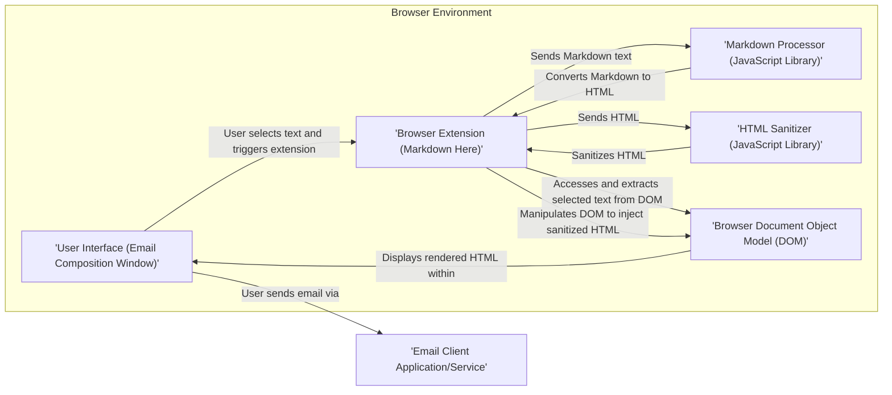

## Project Design Document: Markdown Here

**Project Name:** Markdown Here

**Project Repository:** [https://github.com/adam-p/markdown-here](https://github.com/adam-p/markdown-here)

**Document Version:** 1.1

**Date:** October 26, 2023

**Author:** Gemini (AI Language Model)

### 1. Project Overview

Markdown Here is a browser extension designed to enable users to compose emails in Markdown format and seamlessly render them as HTML within the email composition window before sending. This eliminates the need for users to rely on potentially limited or inconsistent rich text editors provided by various email clients. The extension operates entirely within the user's browser, ensuring local processing and enhancing user privacy.

### 2. Project Goals

*   Enable users to write emails using familiar Markdown syntax.
*   Provide consistent and predictable rendering of Markdown into HTML across diverse email clients and platforms.
*   Improve the readability and visual structure of emails composed using Markdown.
*   Maintain a strong focus on user privacy by performing all Markdown processing and HTML rendering locally within the user's browser.
*   Support a comprehensive set of commonly used Markdown features and syntax elements.

### 3. Non-Goals

*   To function as a comprehensive, standalone Markdown editor with features like real-time previews, advanced syntax highlighting, or dedicated editing panes within the email composition window.
*   To transmit or store user email content or any intermediate processing data on external servers or services.
*   To offer server-side Markdown rendering capabilities or act as a web service.
*   To handle the actual transmission or sending of emails; this remains the responsibility of the underlying email client.

### 4. System Architecture

The Markdown Here extension operates as a client-side application within the user's web browser. Its core functionality is encapsulated within the browser extension, which interacts with the active email composition window.

**Component Descriptions:**

*   **User Interface (Email Composition Window):** This is the standard HTML-based interface provided by the user's email client (e.g., Gmail, Outlook web, Thunderbird). The extension interacts with this interface's Document Object Model (DOM).
*   **Browser Extension (Markdown Here):** This is the central component, responsible for:
    *   Listening for user-initiated actions (e.g., keyboard shortcuts, context menu clicks) to trigger the Markdown conversion.
    *   Interacting with the browser's DOM to access the selected text within the email composition window.
    *   Passing the extracted Markdown text to the Markdown processor.
    *   Receiving the generated HTML from the processor.
    *   Passing the generated HTML to the HTML sanitizer.
    *   Receiving the sanitized HTML.
    *   Manipulating the browser's DOM to inject the sanitized HTML, replacing the original Markdown text.
*   **Markdown Processor (JavaScript Library):** A JavaScript library dedicated to parsing Markdown syntax and converting it into valid HTML. The choice of library impacts the supported Markdown features and performance. Examples include Marked, CommonMark.js, or similar.
*   **HTML Sanitizer (JavaScript Library):** A critical security component. This library processes the generated HTML and removes or neutralizes any potentially malicious or unsafe HTML elements, attributes, or JavaScript code. Examples include DOMPurify.
*   **Browser Document Object Model (DOM):** The structural representation of the email composition window's content. The extension interacts with the DOM to extract the Markdown text and inject the rendered HTML.
*   **Email Client Application/Service:** The user's email application (e.g., desktop client like Thunderbird) or webmail service (e.g., Gmail, Outlook.com). Markdown Here operates within the context of this application but does not directly control its core functionalities like sending emails.

### 5. Data Flow

The process of converting Markdown to HTML within an email involves the following data flow:

1. **User Composes Markdown:** The user types their email content using Markdown syntax within the email client's composition window.
2. **Trigger Extension:** The user selects the Markdown text they wish to convert and activates the Markdown Here extension, typically through a predefined keyboard shortcut or a context menu option.
3. **Extract Markdown Text from DOM:** The browser extension accesses the browser's DOM and extracts the selected Markdown text.
4. **Markdown Processing:** The extracted Markdown text is passed as input to the designated Markdown processing JavaScript library.
5. **Generate HTML:** The Markdown processing library parses the Markdown text and generates the corresponding HTML markup.
6. **HTML Sanitization:** The generated HTML is then passed to the HTML sanitizer library.
7. **Sanitize HTML:** The HTML sanitizer inspects the HTML and removes or escapes any potentially harmful or disallowed elements, attributes, or scripts.
8. **Inject Sanitized HTML into DOM:** The browser extension manipulates the browser's DOM to replace the original selected Markdown text with the sanitized HTML. This renders the formatted email within the composition window.
9. **User Sends Email:** The user reviews the rendered HTML and sends the email using the standard sending functionality of their email client.

```mermaid
graph LR
    A["'User Composes Markdown Text'"] --> B["'Trigger Markdown Here Extension'"];
    B --> C["'Extract Markdown Text from DOM'"];
    C --> D["'Markdown Processor Library'"];
    D --> E["'Generate HTML Output'"];
    E --> F["'HTML Sanitizer Library'"];
    F --> G["'Produce Sanitized HTML'"];
    G --> H["'Inject Sanitized HTML into DOM'"];
    H --> I["'Display Rendered HTML in Email Client'"];
    I --> J["'User Sends Email'"];
```

### 6. Security Considerations

Security is a paramount concern for Markdown Here, given its interaction with email content and the potential for injecting malicious code. Key considerations include:

*   **Cross-Site Scripting (XSS) Prevention:** The most significant threat is the possibility of generating HTML that contains malicious JavaScript. The reliance on a robust and actively maintained HTML sanitizer library is the primary defense against XSS.
    *   **Mitigation:** Employ a well-vetted HTML sanitizer library (e.g., DOMPurify) with a strong track record. Regularly update the sanitizer library to incorporate fixes for newly discovered bypasses and vulnerabilities. Configure the sanitizer with appropriate settings to restrict potentially dangerous HTML elements and attributes.
*   **Content Security Policy (CSP):** Implementing a strict CSP for the browser extension can further mitigate XSS risks by controlling the sources from which the extension can load resources and execute scripts.
    *   **Mitigation:** Define a restrictive CSP that limits the allowed sources for scripts, styles, and other resources.
*   **Browser Extension Permissions:** The extension should request the minimum necessary browser permissions required for its functionality. Excessive permissions can expand the attack surface.
    *   **Mitigation:** Carefully review and justify each requested permission. Limit permissions to only those essential for accessing the active tab's content and potentially local storage for settings. Avoid requesting broad permissions like access to all websites.
*   **Dependency Management and Supply Chain Security:** The security of the extension depends on the security of its external JavaScript library dependencies (Markdown processor and HTML sanitizer).
    *   **Mitigation:**  Maintain a Software Bill of Materials (SBOM) for all dependencies. Regularly audit and update dependencies to patch known vulnerabilities. Use dependency management tools that can identify and alert on security issues. Consider using pinned versions or lock files to ensure consistent dependency versions.
*   **Input Validation (Beyond Sanitization):** While the HTML sanitizer is crucial, performing some basic validation on the input Markdown text before processing could help identify and block certain malicious patterns early on.
    *   **Mitigation:** Implement checks for excessively long input strings or patterns known to cause issues with the Markdown processor.
*   **Secure Update Mechanism:** Ensuring that updates to the extension are authentic and haven't been tampered with is vital.
    *   **Mitigation:** Rely on the browser's official extension stores for distribution and updates, as they provide a level of verification and security.
*   **Data Privacy:** The extension should not collect, store, or transmit any user data, including email content.
    *   **Mitigation:** Design the extension to operate entirely client-side. Clearly state the extension's privacy policy, emphasizing that no user data is collected or transmitted.
*   **Side-Channel Attacks:** While less likely in this context, consider potential vulnerabilities related to timing or resource consumption during the rendering process that could leak information.
    *   **Mitigation:**  Be mindful of performance implications and avoid introducing unnecessary complexity that could create side-channel vulnerabilities.

### 7. Technologies Used

*   **Primary Programming Language:** JavaScript
*   **Browser Extension APIs:** WebExtension APIs (compatible with Chrome, Firefox, Safari, and other Chromium-based browsers)
*   **Markdown Processing Library:**  (Specify the chosen library and its version, e.g., Marked v5.0.0, CommonMark.js v0.30.0)
*   **HTML Sanitization Library:** (Specify the chosen library and its version, e.g., DOMPurify v3.0.5)
*   **Build and Packaging Tools:** (e.g., Webpack, Parcel, or simple scripts for bundling and packaging the extension)

### 8. Deployment

Markdown Here is typically distributed and deployed through the official extension marketplaces provided by web browser vendors:

*   **Chrome Web Store:** For Google Chrome and Chromium-based browsers (e.g., Edge, Brave). This provides a platform for users to discover and install the extension, with a review process that includes some security checks.
*   **Mozilla Add-ons (addons.mozilla.org):** For the Firefox browser. Similar to the Chrome Web Store, this platform offers a distribution channel and a review process.
*   **Safari Extensions Gallery:** For the Safari browser on macOS.

Users install the extension directly from these stores. The browser handles automatic updates to the extension, ensuring users typically have the latest version with potential security fixes. Developers are responsible for submitting updated versions to these stores.

### 9. Future Considerations

*   **Enhanced Markdown Feature Support:** Expanding the range of supported Markdown syntax, potentially including more advanced features or extensions.
*   **User Customization Options:** Providing users with options to customize the rendering styles (e.g., through CSS themes) or potentially choose alternative Markdown processing libraries.
*   **Improved Integration with More Email Clients:** Ensuring compatibility and optimal performance across a broader range of email platforms and webmail services.
*   **Accessibility Enhancements:**  Ensuring the rendered HTML is accessible to users with disabilities, following accessibility best practices.
*   **Performance Optimization:** Continuously improving the performance of the Markdown processing and HTML sanitization steps to minimize any perceived delay.

### 10. Threat Model Inputs

The following aspects of this design document are particularly relevant for conducting a thorough threat model:

*   **System Architecture Diagram:**  Identifies the key components and their interactions, highlighting potential points of attack.
*   **Data Flow Diagram:** Illustrates the movement of data through the system, revealing potential interception or manipulation points.
*   **Security Considerations Section:** Explicitly outlines known security risks and implemented mitigation strategies.
*   **Technologies Used Section:** Lists the specific technologies and libraries employed, which may have known vulnerabilities.
*   **Browser Extension Permissions:** Defines the scope of access the extension has within the browser environment.
*   **Deployment Mechanism:**  Impacts the security of the update process and the initial distribution of the extension.