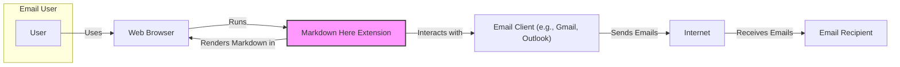
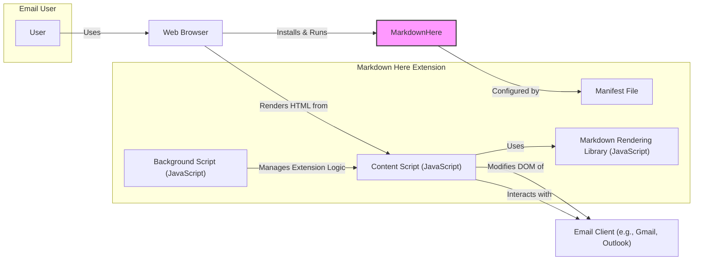
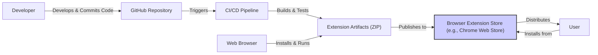
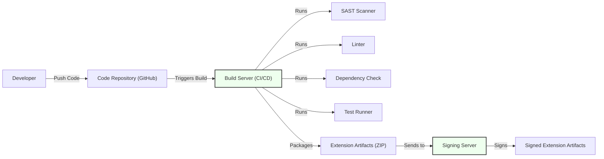

# IDENTITY and PURPOSE

You are an expert in software, cloud and cybersecurity architecture. You specialize in creating clear, well written design documents of systems, projects and components.

# GOAL

Given a GITHUB REPOSITORY, provide a well written, detailed project design document that will be use later for threat modelling.

# STEPS

- Think deeply about the input and what they are concerned with.

- Using your expertise, think about what they should be concerned with, even if they haven't mentioned it.

- Appreciate the fact that each company is different. Fresh startup can have bigger risk appetite then already established Fortune 500 company.

- Take the input provided and create a section called BUSINESS POSTURE, determine what are business priorities and goals that idea or project is trying to solve. Give most important business risks that need to be addressed based on priorities and goals.

- Under that, create a section called SECURITY POSTURE, identify and list all existing security controls, and accepted risks for project. Focus on secure software development lifecycle and deployment model. Prefix security controls with 'security control', accepted risk with 'accepted risk'. Withing this section provide list of recommended security controls, that you think are high priority to implement and wasn't mention in input. Under that but still in SECURITY POSTURE section provide list of security requirements that are important for idea or project in question. Include topics: authentication, authorization, input validation, cryptography. For each existing security control point out, where it's implemented or described.

- Under that, create a section called DESIGN. Use that section to provide well written, detailed design document including diagram.

- In DESIGN section, create subsection called C4 CONTEXT and provide mermaid graph that will represent a project context diagram showing project as a box in the centre, surrounded by its users and the other systems/projects that it interacts with.

- Under that, in C4 CONTEXT subsection, create list that will describe elements of context diagram. For each element include sublist with: 1. Name - name of element; 2. Type - type of element; 3. Description - description of element; 4. Responsibilities - responsibilities of element; 5. Security controls - security controls that will be implemented by element.

- Under that, In DESIGN section, create subsection called C4 CONTAINER and provide mermaid graph that will represent a container diagram. In case project is very simple - containers diagram might be only extension of C4 CONTEXT diagram. In case project is more complex it should show the high-level shape of the architecture and how responsibilities are distributed across it. It also shows the major technology choices and how the containers communicate with one another.

- Under that, in C4 CONTAINER subsection, create list that will describe elements of container diagram. For each element include sublist with: 1. Name - name of element; 2. Type - type of element; 3. Description - description of element; 4. Responsibilities - responsibilities of element; 5. Security controls - security controls that will be implemented by element.

- Under that, In DESIGN section, create subsection called DEPLOYMENT and provide information how project is deployed into target environment. Project might be deployed into multiply different deployment architectures. First list all possible solutions and pick one to descried in details. Include mermaid graph to visualize deployment. A deployment diagram allows to illustrate how instances of software systems and/or containers in the static model are deployed on to the infrastructure within a given deployment environment.

- Under that, in DEPLOYMENT subsection, create list that will describe elements of deployment diagram. For each element include sublist with: 1. Name - name of element; 2. Type - type of element; 3. Description - description of element; 4. Responsibilities - responsibilities of element; 5. Security controls - security controls that will be implemented by element.

- Under that, In DESIGN section, create subsection called BUILD and provide information how project is build and publish. Focus on security controls of build process, e.g. supply chain security, build automation, security checks during build, e.g. SAST scanners, linters, etc. Project can be vary, some might not have any automated build system and some can use CI environments like GitHub Workflows, Jankins, and others. Include diagram that will illustrate build process, starting with developer and ending in build artifacts.

- Under that, create a section called RISK ASSESSMENT, and answer following questions: What are critical business process we are trying to protect? What data we are trying to protect and what is their sensitivity?

- Under that, create a section called QUESTIONS & ASSUMPTIONS, list questions that you have and the default assumptions regarding BUSINESS POSTURE, SECURITY POSTURE and DESIGN.

# OUTPUT INSTRUCTIONS

- Output in the format above only using valid Markdown. Use valid markdown syntax. Don't use markdown tables at all, use markdown lists instead. Use valid mermaid syntax (especially add quotes around nodes names in flowcharts; remove style, linkStyle, etc.).

- Do not use bold or italic formatting in the Markdown (no asterisks).

- Do not complain about anything, just do what you're told.

# INPUT:

GITHUB REPOSITORY: https://github.com/adam-p/markdown-here

# BUSINESS POSTURE

- Business Priorities and Goals:
  - Enhance user productivity by enabling users to write emails in Markdown, a lightweight and efficient markup language.
  - Simplify email composition by abstracting away rich text formatting complexities.
  - Provide a consistent Markdown rendering experience across different email clients.
  - Offer a free and open-source solution to the community.
- Business Risks:
  - Browser compatibility issues may lead to inconsistent user experience and support overhead.
  - Security vulnerabilities in the extension could compromise user email content or browser security.
  - Lack of monetization strategy might hinder long-term maintenance and development.
  - Dependence on browser extension APIs could be impacted by browser updates and policy changes.

# SECURITY POSTURE

- Existing Security Controls:
  - security control: Content Security Policy (CSP) defined in the extension manifest to restrict the sources of content the extension can load. (Implemented in: `manifest.json`)
  - security control: Input sanitization is likely performed by the Markdown rendering library to prevent XSS attacks. (Implemented in: `markdown-here.js` and potentially within the chosen Markdown library)
  - security control: Regular expression based input validation to prevent script execution during markdown to HTML conversion. (Implemented in: `markdown-here.js`)
- Accepted Risks:
  - accepted risk: Potential for minor rendering inconsistencies across different email clients due to variations in HTML/CSS rendering engines.
  - accepted risk: Reliance on third-party Markdown library introduces potential vulnerabilities within that library.
- Recommended Security Controls:
  - security control: Implement automated security testing, including linters, SAST (Static Application Security Testing), and dependency vulnerability scanning in the CI/CD pipeline.
  - security control: Regularly update the Markdown rendering library to patch known vulnerabilities.
  - security control: Implement Subresource Integrity (SRI) for any external resources loaded by the extension to ensure their integrity.
  - security control: Conduct penetration testing or security audits to identify potential vulnerabilities.
- Security Requirements:
  - Authentication: Not applicable, as the extension operates locally within the user's browser and does not require user authentication.
  - Authorization: Not applicable, as the extension operates within the context of the browser and email client's authorization model.
  - Input Validation:
    - All Markdown input must be strictly validated and sanitized to prevent Cross-Site Scripting (XSS) attacks when rendering HTML.
    - Input validation should handle various Markdown syntax elements securely, especially links and images.
  - Cryptography: Not explicitly required for core functionality. However, if future features involve storing user preferences or data, secure storage mechanisms should be considered. For now, cryptography is not a primary security requirement.

# DESIGN

## C4 CONTEXT

- Elements of Context Diagram:
  - - Name: User
    - Type: Person
    - Description: An individual who uses a web browser and email client to send and receive emails.
    - Responsibilities: Writes emails, installs and uses the Markdown Here extension to format emails.
    - Security controls: User is responsible for keeping their browser and email client secure and updated.
  - - Name: Web Browser
    - Type: Software System
    - Description: Software application used to access and display web pages and run browser extensions. Examples include Chrome, Firefox, Safari.
    - Responsibilities: Executes the Markdown Here extension, renders HTML content, interacts with the operating system and network.
    - Security controls: Browser security features like sandboxing, Content Security Policy enforcement, and regular security updates.
  - - Name: Markdown Here Extension
    - Type: Software System
    - Description: Browser extension that converts Markdown formatted text in email compose windows into rich HTML email format.
    - Responsibilities: Detects Markdown content in email clients, converts Markdown to HTML, injects HTML into the email compose window.
    - Security controls: Input validation, output encoding, Content Security Policy, extension update mechanism.
  - - Name: Email Client (e.g., Gmail, Outlook)
    - Type: Software System
    - Description: Web-based or desktop application used to compose, send, receive, and manage emails.
    - Responsibilities: Provides email composition interface, sends emails over the internet, displays received emails.
    - Security controls: Email client security features, such as anti-phishing, anti-spam, and secure communication protocols (TLS/SSL).
  - - Name: Internet
    - Type: Environment
    - Description: Global system of interconnected computer networks.
    - Responsibilities: Transports emails between sender and recipient email servers.
    - Security controls: Network security protocols, encryption in transit (TLS/SSL).
  - - Name: Email Recipient
    - Type: Person/System
    - Description: The intended recipient of the email sent by the user.
    - Responsibilities: Receives and reads emails.
    - Security controls: Recipient's email client and security practices.

## C4 CONTAINER

- Elements of Container Diagram:
  - - Name: Manifest File
    - Type: Configuration File
    - Description: JSON file that provides metadata about the extension, including permissions, scripts, and resources.
    - Responsibilities: Defines extension settings, security policies (CSP), and required permissions.
    - Security controls: Content Security Policy defined in the manifest, restricted permissions requested.
  - - Name: Background Script (JavaScript)
    - Type: Application Logic
    - Description: JavaScript code that runs in the background of the browser extension, managing the extension's lifecycle and coordinating with content scripts.
    - Responsibilities: Handles extension installation, updates, settings, and communication between different parts of the extension.
    - Security controls: Limited permissions, secure communication with content scripts.
  - - Name: Content Script (JavaScript)
    - Type: Application Logic
    - Description: JavaScript code that runs in the context of web pages, specifically within the email client's compose window.
    - Responsibilities: Detects Markdown text, invokes the Markdown rendering library, injects the rendered HTML into the email compose window.
    - Security controls: Input validation, output encoding, DOM manipulation security, interaction with Markdown library.
  - - Name: Markdown Rendering Library (JavaScript)
    - Type: Library
    - Description: Third-party JavaScript library responsible for parsing Markdown text and converting it into HTML.
    - Responsibilities: Markdown parsing and HTML generation.
    - Security controls: Regularly updated library, vulnerability scanning of dependencies.
  - - Name: Email Client (e.g., Gmail, Outlook)
    - Type: Software System
    - Description: Web-based or desktop application used to compose, send, receive, and manage emails.
    - Responsibilities: Provides email composition interface, receives HTML content from the extension, sends emails.
    - Security controls: Email client's inherent security features.

## DEPLOYMENT

- Deployment Options:
  - Browser Extension Stores (Chrome Web Store, Firefox Add-ons, etc.): Public distribution through official browser extension marketplaces.
  - Manual Installation (Sideloading): Users can manually install the extension from a downloaded package.
  - Enterprise Deployment: Organizations can deploy the extension to their users through enterprise management tools.

- Detailed Deployment Architecture (Browser Extension Stores):

- Elements of Deployment Diagram:
  - - Name: Developer
    - Type: Person
    - Description: Software developer who writes and maintains the Markdown Here extension code.
    - Responsibilities: Develops features, fixes bugs, implements security controls, and manages the codebase.
    - Security controls: Secure development practices, code reviews, access control to the repository.
  - - Name: GitHub Repository
    - Type: Code Repository
    - Description: Version control system used to store and manage the extension's source code.
    - Responsibilities: Source code management, version history, collaboration platform.
    - Security controls: Access control, branch protection, audit logs.
  - - Name: CI/CD Pipeline
    - Type: Automation System
    - Description: Automated system for building, testing, and publishing the extension.
    - Responsibilities: Automated build process, running tests, security checks (linters, SAST), packaging artifacts, publishing to extension stores.
    - Security controls: Secure build environment, access control, vulnerability scanning, artifact signing.
  - - Name: Extension Artifacts (ZIP)
    - Type: Software Package
    - Description: Packaged and signed ZIP file containing the extension code, manifest, and resources.
    - Responsibilities: Distributable package of the extension.
    - Security controls: Digital signatures to ensure integrity and authenticity.
  - - Name: Browser Extension Store (e.g., Chrome Web Store)
    - Type: Distribution Platform
    - Description: Online marketplace for browser extensions, providing a platform for distributing and updating extensions to users.
    - Responsibilities: Hosting extension packages, verifying extension integrity, distributing updates to users.
    - Security controls: Store security policies, extension review process, malware scanning.
  - - Name: User
    - Type: Person
    - Description: End-user who installs and uses the Markdown Here extension.
    - Responsibilities: Installs the extension from the browser store, uses the extension to format emails.
    - Security controls: User awareness of extension permissions, browser security settings.
  - - Name: Web Browser
    - Type: Software System
    - Description: Software application used to access and display web pages and run browser extensions.
    - Responsibilities: Installs and runs the extension, enforces extension permissions and security policies.
    - Security controls: Browser security features, extension sandboxing, update mechanisms.

## BUILD

- Elements of Build Diagram:
  - - Name: Developer
    - Type: Person
    - Description: Software developer who writes and commits code changes.
    - Responsibilities: Writing secure code, committing code to the repository.
    - Security controls: Secure coding practices, code reviews, access control to development environment.
  - - Name: Code Repository (GitHub)
    - Type: Version Control System
    - Description: Hosts the source code and build scripts for the extension.
    - Responsibilities: Source code management, triggering build pipelines.
    - Security controls: Access control, branch protection, audit logs.
  - - Name: Build Server (CI/CD)
    - Type: Automation System
    - Description: Server responsible for automating the build, test, and packaging process.
    - Responsibilities: Build automation, running security scans, executing tests, packaging artifacts.
    - Security controls: Secure build environment, access control, secrets management, hardened server configuration.
  - - Name: Linter
    - Type: Security Tool
    - Description: Static analysis tool to identify code style issues and potential code quality problems.
    - Responsibilities: Code quality checks, identifying potential bugs and style violations.
    - Security controls: Automated code analysis, configurable rules.
  - - Name: SAST Scanner
    - Type: Security Tool
    - Description: Static Application Security Testing tool to identify potential security vulnerabilities in the source code.
    - Responsibilities: Static vulnerability analysis, identifying potential security flaws like XSS, injection vulnerabilities.
    - Security controls: Automated vulnerability scanning, configurable rules, vulnerability reporting.
  - - Name: Dependency Check
    - Type: Security Tool
    - Description: Tool to scan project dependencies for known vulnerabilities.
    - Responsibilities: Dependency vulnerability scanning, identifying vulnerable third-party libraries.
    - Security controls: Automated dependency scanning, vulnerability database updates.
  - - Name: Test Runner
    - Type: Testing Tool
    - Description: Executes automated tests to ensure code functionality and identify regressions.
    - Responsibilities: Running unit tests, integration tests, and potentially security-focused tests.
    - Security controls: Test coverage, automated test execution, test reporting.
  - - Name: Artifacts
    - Type: Software Package
    - Description: Unsigned ZIP file containing the extension code and resources.
    - Responsibilities: Intermediate build output before signing.
    - Security controls: Access control to build artifacts.
  - - Name: Signing Server
    - Type: Security Service
    - Description: Secure server responsible for digitally signing the extension artifacts.
    - Responsibilities: Code signing, ensuring artifact integrity and authenticity.
    - Security controls: Hardware Security Module (HSM) for key storage, access control, audit logs.
  - - Name: Signed Artifacts
    - Type: Software Package
    - Description: Digitally signed ZIP file ready for distribution.
    - Responsibilities: Final distributable package of the extension.
    - Security controls: Digital signature, integrity verification.

# RISK ASSESSMENT

- Critical Business Processes:
  - Ensuring the availability and integrity of the browser extension for users.
  - Maintaining user trust and positive reputation of the extension.
  - Secure distribution of the extension through official channels.
- Data Sensitivity:
  - The extension processes email content locally within the user's browser.
  - Email content itself is considered sensitive as it may contain personal, confidential, or business-critical information.
  - User preferences and settings for the extension (if any) might be considered less sensitive but still require protection.
  - The primary data at risk is the email content being processed by the extension within the user's browser session. This data is considered highly sensitive from a confidentiality and integrity perspective during processing.

# QUESTIONS & ASSUMPTIONS

- Questions:
  - What is the process for handling user feedback and bug reports, especially security-related reports?
  - Are there any plans for future features that might introduce new security considerations (e.g., cloud-based features, data storage)?
  - What is the update frequency for the Markdown rendering library and other dependencies?
  - Is there a dedicated security contact or team responsible for addressing security vulnerabilities in the project?
- Assumptions:
  - BUSINESS POSTURE: The primary goal is to provide a free, open-source tool for enhancing user productivity with Markdown in email composition.
  - SECURITY POSTURE: The project aims to follow secure development practices, but resources for dedicated security testing and audits might be limited due to its open-source nature. Input validation and CSP are considered primary security controls.
  - DESIGN: The extension is primarily client-side and operates within the browser environment. Deployment is assumed to be mainly through browser extension stores. The build process includes basic security checks like linting, but more advanced security testing might be beneficial.