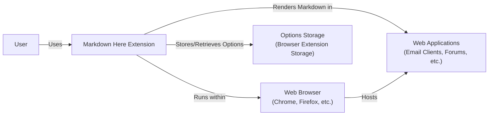
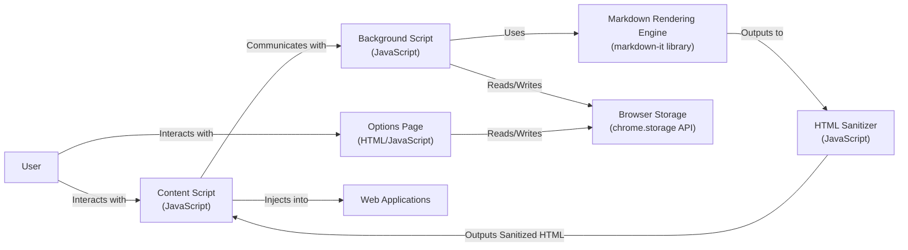
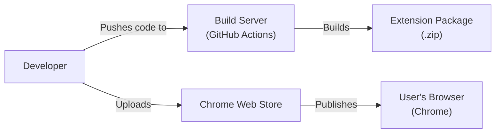
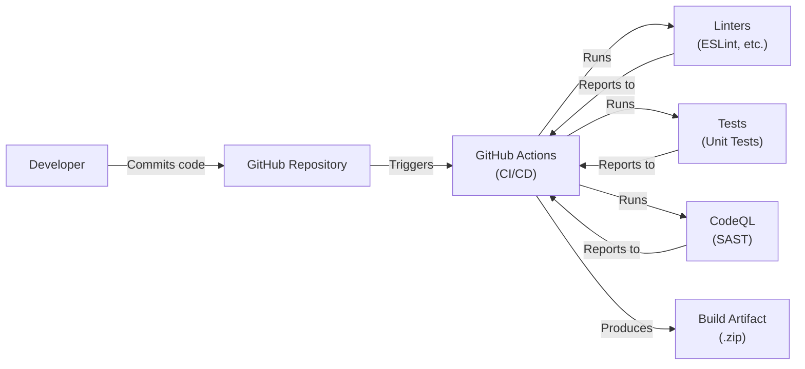

Okay, let's create a design document for the `markdown-here` project.

# BUSINESS POSTURE

Business Priorities and Goals:

*   Provide a simple and user-friendly way for users to write and preview Markdown.
*   Enhance the writing experience in various web applications (email clients, forums, etc.) by enabling Markdown rendering.
*   Offer a cross-platform solution, supporting major web browsers.
*   Minimize the extension's footprint and maintain high performance.
*   Ensure user privacy and data security.

Most Important Business Risks:

*   Malicious code injection through Markdown rendering, potentially leading to XSS attacks.
*   Compromise of user data due to vulnerabilities in the extension.
*   Compatibility issues with different websites and web applications.
*   Negative user reviews due to bugs or performance problems.
*   Violation of browser extension store policies, leading to removal.

# SECURITY POSTURE

Existing Security Controls:

*   security control: Content Security Policy (CSP) to restrict the extension's capabilities and prevent XSS. (Defined in `manifest.json` and enforced by the browser).
*   security control: Input sanitization to prevent malicious HTML from being rendered. (Implemented in `src/common/markdown-here.js` and `src/common/html-sanitizer.js`).
*   security control: Regular expression-based checks to further validate and sanitize Markdown input. (Implemented in `src/common/markdown-here.js`).
*   security control: Use of browser extension APIs for safe storage and retrieval of options. (Implemented using `chrome.storage` API).
*   security control: Code reviews and testing to identify and fix potential vulnerabilities. (Part of the development process).

Accepted Risks:

*   accepted risk: Potential for zero-day vulnerabilities in the underlying Markdown rendering library (markdown-it).
*   accepted risk: Limited ability to control the security context of the websites where the extension is used.
*   accepted risk: User error, such as disabling security features or using untrusted Markdown sources.

Recommended Security Controls:

*   security control: Implement a mechanism to automatically update the extension to the latest version, ensuring users have the most recent security patches.
*   security control: Conduct regular security audits and penetration testing to identify and address potential vulnerabilities.
*   security control: Provide clear and concise security documentation for users, explaining the extension's security features and limitations.

Security Requirements:

*   Authentication:
    *   The extension itself does not require user authentication. However, it interacts with websites that may have their own authentication mechanisms. The extension should not interfere with these mechanisms.
*   Authorization:
    *   The extension operates within the permissions granted by the user during installation. These permissions should be minimized to the necessary scope (e.g., access to active tab content, storage).
    *   The extension should not attempt to elevate privileges or access resources beyond its granted permissions.
*   Input Validation:
    *   All Markdown input should be treated as untrusted.
    *   Input should be sanitized to remove potentially harmful HTML tags and attributes.
    *   Regular expressions should be used to further validate and sanitize the input.
    *   The sanitization process should be robust and handle edge cases effectively.
*   Cryptography:
    *   The extension does not directly handle sensitive data requiring encryption.
    *   If storing any sensitive data in the future, use the browser's built-in cryptographic APIs (e.g., `crypto.subtle`) for secure storage.

# DESIGN

## C4 CONTEXT

Element Descriptions:

*   Element:
    *   Name: User
    *   Type: Person
    *   Description: A person who uses the Markdown Here extension to write and preview Markdown.
    *   Responsibilities: Provides Markdown input, interacts with the extension's UI, and views the rendered output.
    *   Security controls: N/A (External to the system)

*   Element:
    *   Name: Markdown Here Extension
    *   Type: Software System
    *   Description: The browser extension that converts Markdown text to rendered HTML.
    *   Responsibilities: Parses Markdown input, sanitizes HTML, renders HTML, manages options, interacts with the browser.
    *   Security controls: Content Security Policy (CSP), input sanitization, regular expression checks, secure storage API usage.

*   Element:
    *   Name: Web Applications
    *   Type: Software System
    *   Description: Websites and web applications where the extension is used (e.g., email clients, forums).
    *   Responsibilities: Host the text input fields where Markdown is written and display the rendered HTML.
    *   Security controls: Dependent on the specific web application (external to the extension).

*   Element:
    *   Name: Web Browser
    *   Type: Software System
    *   Description: The web browser (Chrome, Firefox, etc.) that hosts the extension and web applications.
    *   Responsibilities: Provides the runtime environment for the extension, enforces CSP, manages extension permissions.
    *   Security controls: Browser's built-in security features, sandboxing, extension permission model.

*   Element:
    *   Name: Options Storage
    *   Type: Data Store
    *   Description: The browser's extension storage used to store the extension's options.
    *   Responsibilities: Persistently stores user preferences and settings.
    *   Security controls: Browser's extension storage security mechanisms.

## C4 CONTAINER

Element Descriptions:

*   Element:
    *   Name: User
    *   Type: Person
    *   Description: A person who uses the Markdown Here extension.
    *   Responsibilities: Provides Markdown input, interacts with the extension.
    *   Security controls: N/A (External to the system)

*   Element:
    *   Name: Content Script
    *   Type: JavaScript Code
    *   Description: The script that runs in the context of web pages.
    *   Responsibilities: Detects Markdown input fields, injects the rendered HTML, communicates with the background script.
    *   Security controls: Limited access to browser APIs, subject to CSP.

*   Element:
    *   Name: Background Script
    *   Type: JavaScript Code
    *   Description: The script that runs in the background and manages the extension's logic.
    *   Responsibilities: Handles Markdown rendering, manages options, communicates with the content script.
    *   Security controls: Access to a wider range of browser APIs, subject to CSP.

*   Element:
    *   Name: Options Page
    *   Type: HTML/JavaScript
    *   Description: The page where users can configure the extension's settings.
    *   Responsibilities: Provides a UI for managing options, stores options in browser storage.
    *   Security controls: Standard web security practices, input validation.

*   Element:
    *   Name: Markdown Rendering Engine
    *   Type: Library (markdown-it)
    *   Description: The library used to convert Markdown to HTML.
    *   Responsibilities: Parses Markdown syntax and generates HTML.
    *   Security controls: Relies on the security of the `markdown-it` library.

*   Element:
    *   Name: HTML Sanitizer
    *   Type: JavaScript Code
    *   Description: The code that sanitizes the generated HTML to prevent XSS attacks.
    *   Responsibilities: Removes potentially harmful HTML tags and attributes.
    *   Security controls: Implemented using regular expressions and whitelisting.

*   Element:
    *   Name: Browser Storage
    *   Type: Data Store (chrome.storage API)
    *   Description: The browser's extension storage used to store options.
    *   Responsibilities: Persistently stores user preferences.
    *   Security controls: Browser's extension storage security mechanisms.

*   Element:
    *   Name: Web Applications
    *   Type: Software System
    *   Description: Websites and web applications where the extension is used.
    *   Responsibilities: Host the text input fields where Markdown is written.
    *   Security controls: Dependent on the specific web application.

## DEPLOYMENT

Possible Deployment Solutions:

1.  Chrome Web Store: The primary distribution channel for Chrome extensions.
2.  Firefox Add-ons: The primary distribution channel for Firefox extensions.
3.  Manual Installation: Users can download the extension files and install them manually (developer mode).

Chosen Deployment Solution (Chrome Web Store):

Element Descriptions:

*   Element:
    *   Name: Developer
    *   Type: Person
    *   Description: The developer of the Markdown Here extension.
    *   Responsibilities: Writes code, builds the extension package, uploads it to the Chrome Web Store.
    *   Security controls: Secure coding practices, code reviews.

*   Element:
    *   Name: Build Server
    *   Type: Software System (GitHub Actions)
    *   Description: The automated build system used to create the extension package.
    *   Responsibilities: Runs build scripts, creates the .zip file.
    *   Security controls: GitHub Actions security features, secure configuration.

*   Element:
    *   Name: Extension Package
    *   Type: File (.zip)
    *   Description: The packaged extension files ready for distribution.
    *   Responsibilities: Contains all the necessary files for the extension to run.
    *   Security controls: Code signing (if applicable).

*   Element:
    *   Name: Chrome Web Store
    *   Type: Software System
    *   Description: Google's online store for Chrome extensions.
    *   Responsibilities: Hosts the extension, provides automatic updates, performs security checks.
    *   Security controls: Chrome Web Store security policies and review process.

*   Element:
    *   Name: User's Browser
    *   Type: Software System (Chrome)
    *   Description: The user's Chrome browser.
    *   Responsibilities: Downloads and installs the extension from the Chrome Web Store.
    *   Security controls: Browser's built-in security features, extension sandboxing.

## BUILD

Build Process Description:

1.  Developer commits code to the GitHub repository.
2.  GitHub Actions is triggered by the commit.
3.  GitHub Actions runs linters (e.g., ESLint) to check for code style and potential errors.
4.  GitHub Actions runs unit tests to verify the functionality of the code.
5.  GitHub Actions runs CodeQL for static application security testing (SAST).
6.  Linters, tests, and CodeQL report their results back to GitHub Actions.
7.  If all checks pass, GitHub Actions builds the extension package (a .zip file).
8.  The build artifact (.zip file) is produced and can be deployed.

Security Controls:

*   security control: Linters (ESLint, etc.): Enforce code style and identify potential errors.
*   security control: Unit Tests: Verify the functionality of individual components.
*   security control: CodeQL (SAST): Performs static analysis to identify security vulnerabilities.
*   security control: GitHub Actions: Automates the build process and ensures consistency.
*   security control: Dependency Management: Regularly review and update dependencies to address known vulnerabilities.

# RISK ASSESSMENT

Critical Business Processes:

*   Rendering Markdown correctly and safely.
*   Providing a seamless user experience.
*   Maintaining user privacy and data security.
*   Complying with browser extension store policies.

Data to Protect and Sensitivity:

*   User's Markdown input: Sensitivity varies depending on the content. Could contain personal information, sensitive business data, or nothing sensitive at all.
*   Extension options/settings: Low sensitivity. Contains user preferences for the extension.
*   No other user data is stored or transmitted by the extension.

# QUESTIONS & ASSUMPTIONS

Questions:

*   Are there any specific compliance requirements (e.g., GDPR, CCPA) that need to be considered?  While the extension itself doesn't store PII, the *content* rendered *could* contain PII, depending on what the user types.
*   What is the expected user base and usage patterns? This helps estimate the potential impact of security incidents.
*   What is the process for handling security vulnerabilities reported by external researchers?
*   Is there a mechanism for collecting user feedback and bug reports?

Assumptions:

*   BUSINESS POSTURE: The primary goal is to provide a useful and secure Markdown rendering tool. User trust and safety are paramount.
*   SECURITY POSTURE: The development team follows secure coding practices and conducts regular code reviews. The extension is designed to minimize its attack surface.
*   DESIGN: The extension relies on the `markdown-it` library for Markdown rendering and a custom HTML sanitizer for security. The browser's built-in security features provide a strong foundation for the extension's security. The use of GitHub Actions is assumed for CI/CD.