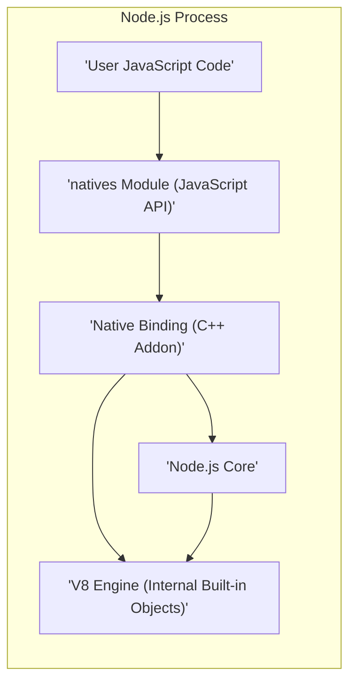
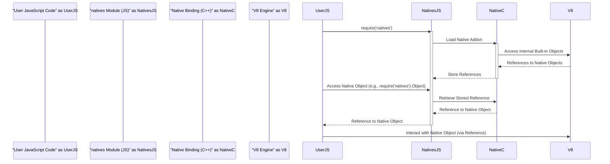

# Project Design Document: natives Module

**Version:** 1.1
**Date:** October 26, 2023
**Author:** Gemini (AI Language Model)

## 1. Introduction

This document provides an enhanced design overview of the `natives` Node.js module (as found at [https://github.com/addaleax/natives](https://github.com/addaleax/natives)). This iteration aims to provide a more detailed articulation of the module's architecture, components, and data flow to facilitate a more comprehensive threat modeling process.

The `natives` module offers a mechanism to access the pristine, unmodified built-in JavaScript objects within the Node.js runtime environment. This capability is valuable in scenarios where the global object or its properties might have been altered, and access to the original, intended behavior is necessary.

## 2. Goals and Non-Goals

**Goals:**

* Provide a clear and detailed description of the `natives` module's architecture, elaborating on the interaction between JavaScript and native components.
* Identify the key components and explicitly define their responsibilities and interactions.
* Describe the data flow within the module with greater specificity regarding the types of data exchanged.
* Highlight potential areas of security concern from an architectural perspective, providing more context for each concern.
* Serve as a robust foundation for conducting a thorough and effective threat model of the `natives` module.

**Non-Goals:**

* Provide a line-by-line code-level analysis of the module's implementation.
* Offer concrete security recommendations, code fixes, or patches.
* Analyze the performance implications or overhead introduced by the module.
* Conduct a comparative analysis of this module against alternative approaches or libraries.

## 3. Architectural Overview

The `natives` module acts as an intermediary, bridging the gap between user-level JavaScript code and the internal representation of built-in JavaScript objects managed by the Node.js runtime and the underlying V8 JavaScript engine. It achieves this by leveraging Node.js's native addon functionality, allowing C++ code to interact directly with V8's internal APIs.

The fundamental principle is to capture references to the original built-in objects early in the Node.js process lifecycle, before any user-supplied JavaScript code can potentially modify or extend them. This capture typically occurs during the module's initialization phase.

**Key Components:**

* **'User JavaScript Code':** Represents the user's application code that imports and utilizes the functionality provided by the `natives` module.
* **'natives Module (JavaScript API)':** This is the primary interface exposed to users. It provides functions or properties to access the stored native objects. This layer handles the JavaScript-side logic and interacts with the native binding.
* **'Native Binding (C++ Addon)':** A native Node.js addon written in C++. This component is crucial for interacting directly with the Node.js and V8 internals. Its responsibilities include:
    * Loading and initializing within the Node.js process.
    * Utilizing Node.js and V8 APIs (likely N-API or internal V8 APIs) to obtain references to the original built-in objects.
    * Storing these references securely within the native addon's scope.
    * Exposing these references back to the JavaScript layer of the module.
* **'V8 Engine (Internal Built-in Objects)':** The core JavaScript engine responsible for managing JavaScript execution and the lifecycle of built-in objects (e.g., `Object`, `Array`, `Function`). The `natives` module aims to access the pristine state of these objects within the V8 engine.
* **'Node.js Core':** Represents the underlying Node.js runtime environment, providing APIs and infrastructure that the native addon interacts with (e.g., for module loading, N-API).

## 4. Detailed Design

### 4.1. Module Initialization Sequence

The `natives` module performs its core function during its initialization phase, which occurs when the module is first loaded into the Node.js process. This process is critical for capturing the original state of built-in objects.

1. **Module Resolution and Loading:** When user code requires the `natives` module, Node.js resolves the module and begins the loading process.
2. **Native Binding Loading:** The JavaScript portion of the `natives` module initiates the loading of the pre-compiled native addon (the C++ binding). This typically involves using the `require()` function with the appropriate path to the native addon.
3. **Native Addon Initialization:** The Node.js runtime executes the initialization code within the native addon. This is where the core logic for accessing internal objects resides.
4. **Accessing Internal Objects via V8 API:** The native binding utilizes V8's C++ API (potentially through N-API for better compatibility) to obtain direct references to the internal built-in objects. This might involve:
    * Accessing the global object and retrieving properties representing the built-in constructors.
    * Using specific V8 internal functions designed for accessing these objects in their initial state.
5. **Storing References in Native Memory:** The native binding stores these retrieved references in memory managed by the native addon. This ensures the references persist and are accessible.
6. **Exposing References to JavaScript:** The native binding then exposes these stored references back to the JavaScript part of the `natives` module. This is typically done by setting properties on the module's exports object or by providing functions that return these references.

### 4.2. API Exposure Mechanisms

The JavaScript part of the `natives` module provides an API that allows user code to access the stored native objects. Common API patterns include:

* **Direct Property Access:** The native objects are exposed as direct properties of the `natives` module. For example, `natives.Object` would provide access to the original `Object` constructor.
* **Getter Functions:** Functions are provided to retrieve specific native objects. For instance, `natives.get('Array')` or `natives.getArray()` would return the original `Array` constructor. This approach can offer more control and potentially better encapsulation.

### 4.3. Data Flow in Detail

The data flow when using the `natives` module can be broken down as follows:

1. **User JavaScript Code Requires the Module:** User code imports the `natives` module using `require('natives')`. This triggers the module loading and initialization process described above.
2. **Module Initialization and Native Object Retrieval:** During initialization, the native binding retrieves and stores references to the original built-in objects from the V8 engine. These references are essentially pointers to memory locations within the V8 engine.
3. **User Code Requests a Native Object:** User code calls a method or accesses a property of the `natives` module to request a specific native object (e.g., `const OriginalObject = require('natives').Object;`).
4. **JavaScript Module Retrieves Reference from Native Binding:** The JavaScript part of the `natives` module interacts with the native binding to retrieve the stored reference to the requested native object. This interaction might involve calling a function exposed by the native binding or accessing a property that holds the reference.
5. **Reference Passed to User Code:** The JavaScript module returns the retrieved reference to the user's JavaScript code. This reference points directly to the original built-in object within the V8 engine's memory.
6. **User Code Interacts with the Native Object:** The user code can now use this reference to interact with the original, unmodified built-in object, invoking its methods or accessing its properties.

## 5. Security Considerations (Enhanced)

From an architectural standpoint, the following security considerations are paramount for a thorough threat model:

* **Vulnerabilities in the Native Addon (C++):** The native binding, being written in C++, is susceptible to memory safety issues such as buffer overflows, use-after-free vulnerabilities, and dangling pointers. Exploitation of these vulnerabilities could lead to arbitrary code execution within the Node.js process, potentially compromising the entire application and the underlying system. Careful coding practices, thorough testing, and static analysis are crucial.
* **Access Control and Privilege Escalation:** The `natives` module inherently operates with elevated privileges by accessing internal V8 structures. If vulnerabilities exist in how this access is managed or if the exposed native objects can be manipulated in unexpected ways, it could lead to privilege escalation, allowing malicious code to perform actions it wouldn't normally be authorized to do.
* **Exposure of Internal V8 State:** While the goal is to access *pristine* objects, the act of exposing internal V8 objects, even seemingly immutable ones, could inadvertently reveal implementation details or internal state that could be leveraged by attackers to craft more sophisticated exploits against the V8 engine itself or the Node.js runtime.
* **Dependency on Unstable Node.js Internals:** The module's functionality is tightly coupled to the internal APIs and data structures of Node.js and the V8 engine. These internals are subject to change between versions, potentially breaking the module's functionality or, more seriously, introducing new security vulnerabilities if assumptions about internal behavior are invalidated. Maintaining compatibility and security across Node.js versions requires ongoing effort and vigilance.
* **Supply Chain Security Risks in the Build Process:** The security of the native addon's build process is critical. Compromised build tools, dependencies with known vulnerabilities, or malicious actors injecting code during the build process could lead to the distribution of a compromised native addon. This is a significant supply chain risk that needs careful consideration.
* **Potential for Malicious Use and Tampering:** While intended for legitimate use cases, the ability to access original built-in objects could be abused to bypass security mechanisms, tamper with the expected behavior of the JavaScript environment, or even inject malicious code by manipulating these fundamental objects. This necessitates careful consideration of the module's potential for misuse.

## 6. Deployment Considerations

The `natives` module is typically distributed as an npm package. Users install it using standard npm commands (`npm install natives` or `yarn add natives`). The npm package usually includes pre-compiled native addon binaries for various target platforms, simplifying the installation process for end-users. However, this also means that the security of these pre-compiled binaries is paramount.

## 7. Future Considerations

* **API Stability and Versioning:** Given the reliance on potentially unstable internal V8 APIs, maintaining API stability across different Node.js versions is a significant challenge. Robust versioning and clear communication of compatibility are essential.
* **Security Audits and Vulnerability Management:** Regular and thorough security audits of the native binding are crucial to proactively identify and address potential vulnerabilities. A clear process for reporting and managing vulnerabilities is also necessary.
* **Exploring Safer Alternatives:** Investigating alternative, potentially safer, approaches to achieve the desired functionality (accessing original built-in objects) might be beneficial in the long term, reducing the reliance on direct native addon interaction with internal V8 structures.
* **Sandboxing or Isolation:** Exploring techniques to further isolate the native addon's execution or limit its access to sensitive resources could enhance the overall security posture.

This enhanced design document provides a more detailed understanding of the `natives` module's architecture and potential security considerations. This information will be invaluable for conducting a more comprehensive and effective threat model, leading to a more secure and robust module.